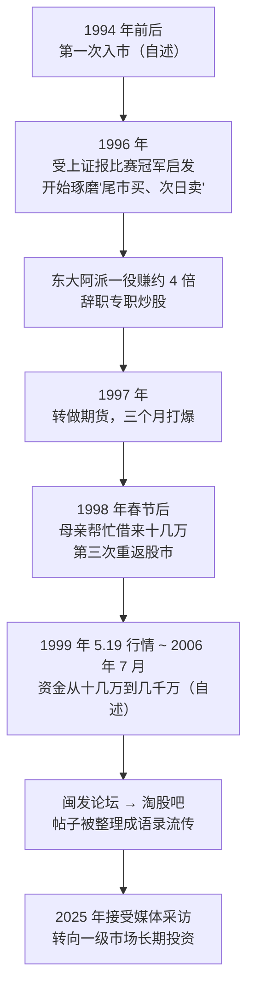

# Asking ①：人物与经历——两次爆仓后的超短传奇

::: summary 一页读懂
1. **他是谁**：Asking，闽发论坛、淘股吧早期最有名的超短线高手之一，圈内称"A 神"；2025 年媒体报道称其本名邱宝裕。
2. **起点很低**：自述 94 年第一次入市，97 年做期货"三个月打爆"，98 年春节后靠母亲帮忙借来的十几万第三次重返股市。
3. **爆发期**：自述从 1999 年"5.19"行情到 2006 年 7 月，资金"从 10 几万到几千万"。
4. **方法**：只做最强的股票，追涨与"守株待兔"两种手法 + 半仓试错的仓位纪律（见本系列第 2、3 篇）。
5. **后来**：2025 年接受采访时表示已把主要精力转向一级市场的长期投资。
:::

::: note 阅读说明与免责声明
本文根据公开的论坛帖子转载、媒体报道整理，用自己的话复述，只在必要处引用简短原话并在文末列出处。论坛时代的人物故事多为**本人自述或网友转述**，无法逐一核实，文中凡标注 **传闻 / 待考** 的内容请谨慎看待。本文仅作交易史与思想学习，**不构成任何投资建议**；短线交易风险极高，前辈的成绩不可复制。
:::

## 1. 一个怎样的人

在 A 股短线圈子里，Asking 是"前辈中的前辈"。2000 年代初他在闽发论坛连续发帖讲超短，后来的淘股吧把他的帖子反复整理转载。==炒股养家、职业炒手这些后来名气更大的游资，都在语录里把他当作学习对象==：

- 炒股养家说过："技巧性的东西，asking 和炒手基本都说了，我能反复强调的就是信念二字"，又评价"asking，他的选股思路却是大众情人"（意思是他只选市场最关注、人人都想要的那只）。
- 职业炒手回忆："当年asking到成都反复跟我强调两个字，跟随。"

::: tip 为什么值得读
Asking 留下的不是复杂的指标公式，而是一套**极简但极难执行**的纪律：只做最强的、先用半仓试、对了才加、错了就走、弱市不动。他的经历本身也是一个关于"爆仓—反思—重来"的故事。
:::

## 2. 时间线：从三次入市到"几千万"

*图：根据 Asking 论坛自述帖转载与 2025 年媒体报道整理，早期年份以自述为准。*

### 2.1 起步：被一场比赛点燃

据他自己在论坛的回忆，最早要从 94 年说起。真正让他找到超短方向的，是 1996 年上海证券报组织的一次炒股比赛——冠军陶永根的打法是==尾市买入、第二天卖出==。这种"买了就要马上赚钱"的思路，后来成了 Asking 一生的底色。

他在东大阿派这只股票上赚到约 4 倍，于是辞去工作，做了职业炒手。

::: warn 第一次大跌跟头
1997 年他转战期货，自述"三个月打爆"。这已经是他第二次把钱亏光——期货的杠杆把一个人的判断失误放大到无法承受。
:::

### 2.2 母亲借来的十几万

爆仓之后的处境，他写得很直白：

> 当年的10几万还都是借的，一分半利息，我妈帮我借的……租了一15平米民房……一份5毛钱的都市报都舍不得买

> 97年期货打暴以后……我妈很支持我……凑了10来万。于是98春节后，我又回来了。其实这是我第三次重返股市了，最早要从94年说起

一分半的月息（约年化 18%）意味着他==必须赚钱，而且不能再亏大钱==。这段经历很可能塑造了他后来近乎苛刻的仓位纪律：先半仓试错，只有赚了才加。

### 2.3 爆发：十几万到几千万

在 2006 年 7 月的一篇帖子里，他回顾了从 1999 年"5.19"行情开始的这段路：

> 5.19到现在2006.7.23，资金从10几万到几千万，成交量从两三百万到7，8个亿

::: tip 怎么理解这组数字
资金增长了数百倍，而成交量的增长比资金还快——这说明他是**高频换手**的超短打法，靠的是一次次小而快的胜利不断复利，而不是押中一两只大牛股。
:::

## 3. 2025 年：从超短到一级市场

2025 年 10 月，《每日经济新闻》发表了对他的采访（报道称其本名**邱宝裕**，圈内称"A 神"，1993 年开始投资——与他自述的"94 年"略有出入，属记忆或口径差异）。采访里有几个值得记住的点：

- 他对超短线的评价：一个是"确定性很高"，第二是"能赚一些快钱"；但靠超短线赚大钱很难。
- 他坦言超短做久了，形成习惯，中长线反而"拿不住"。
- 现在主要投一级市场的早期项目（报道提到大健康方向），心态变成"放个5年、10年甚至15年才有回报"。
- 他也提醒，那个年代的超短致富经历属于极少数，不可复制。

::: core 一条贯穿始终的线
超短时代他追求"买了马上赚钱"，后来却转向十几年才有回报的投资——看似矛盾，其实都是在找自己**确定性最高**的地方下注。
:::

## 4. 传闻与待考

论坛时代信息难以核实，下面这些说法流传很广，但**没有找到可靠的一手证据**，本文只作记录：

| 说法 | 来源 | 可信度 |
|---|---|---|
| 本名邱宝裕 | 2025 年每日经济新闻等报道 | 较高（媒体采访） |
| 常用兴业证券福州某营业部席位 | 东方财富股吧转载文章 | **传闻 / 待考** |
| 曾是某只股票第二波行情的主要推手 | 同上 | **传闻 / 待考** |
| 94 年第一次入市即亏光 | 网络长文转述 | **待考**（自述只说"最早要从94年说起"） |
| 具体身家数字 | 各类转载 | **待考**，本文不采用 |

::: warn 关于"语录合集"
网上流传的"Asking 语录"合集里，常常混入职业炒手、炒股养家等人的话（比如"弱市不做""眼到手到心到"两边的合集里都有）。本系列尽量引用能找到上下文的原帖转载，拿不准的会单独标注。
:::

## 5. 自测与行动

自测 1：Asking 是第几次重返股市时开始真正成功的？那笔本金从哪里来？

第三次（98 年春节后）。本金是母亲帮忙借来、凑来的十几万，还要付一分半的利息。

自测 2：资金增长几百倍、成交量增长更多，说明了他的什么打法特点？

高换手、高频率的超短线——靠大量短平快的交易复利增长，而不是长期持有某只股票。

自测 3：为什么说他的仓位纪律可能与早年经历有关？

两次亏光、借钱付高息再来，使"不能再亏大钱"成为生存条件，于是有了"半仓试错，赚了才加，亏了不加"的规则（见第 3 篇）。

读人物故事时的三点提醒：

- [ ] 分清**自述、转述和媒体报道**，不把传闻当事实
- [ ] 记住他成功之前的两次爆仓，而不是只记"几千万"
- [ ] 把注意力放在可学习的纪律上，而不是去模仿个人经历

## 来源

- Asking 闽发论坛自述帖转载（作者署名 Asking，股窜网 2017 年整理）：https://www.gucuan8.com/lbymj/5286.html
- 每日经济新闻，2025-10-24 对 Asking（邱宝裕）的采访报道：https://www.nbd.com.cn/articles/2025-10-24/4104648.html ；相关报道 2025-10-23：https://www.nbd.com.cn/articles/2025-10-23/4102947.html
- 东方财富股吧·库迪研究院 2018-02-22 介绍文章（席位等说法来源，待考）：https://guba.eastmoney.com/news,gssz,746795238.html
- 职业炒手回忆"跟随"一语（淘县名人堂转载）：https://www.jiemiaobi.com/archives/23641
- 炒股养家评价 Asking：《情绪周期炒股养家心法语录精编》PDF（本地资料）
- 网络长文转述的早年经历（仅作参考，待考）：https://www.toutiao.com/article/7383249918339465779/
