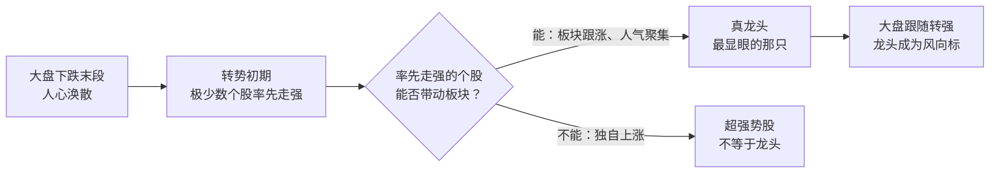
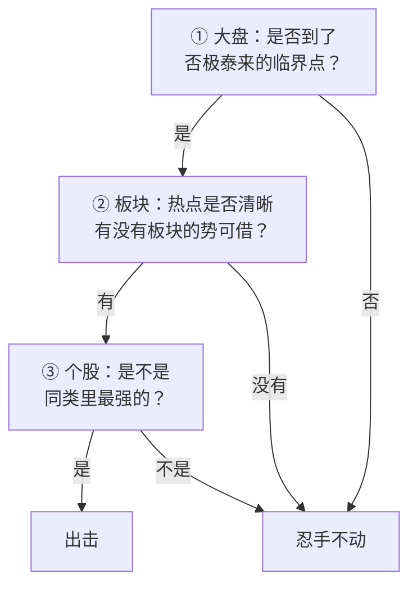

# Asking ②：龙头战法——龙头只在转势初期出现

::: summary 一页读懂
1. **龙头看时机，不看盘子**：先于大盘连续上涨、并能带动关联个股上涨的，才是龙头。
2. **龙头出现在转势初期**：它是"大盘在转势初期最显眼的那只"，涨停是堂堂正正的大阳线。
3. **超强势股 ≠ 龙头**：涨得猛不等于有带动性；Asking 明确区分两者。
4. **出击要看大局**：大盘否极泰来的临界点 + 板块的势 + 个股强于同类，关键在"大局观"。
5. **量是唯一标准**：做短线判断行情好坏，只看成交量。
:::

::: note 阅读说明与免责声明
本文整理 Asking 在论坛上关于"龙头"的论述，原话均为简短引用并在文末注明出处；"解读"部分是整理者的通俗说明，不是原话。文中提到的个股代码只是复述历史帖子里的例子，**不构成任何投资建议**。
:::

## 1. 什么才是龙头

很多人把"涨得最多"当成龙头。Asking 的定义更苛刻，核心是==时机和带动性==：

> 龙头不在盘子大小。而在启动的时机。只要先于大盘连续上涨并能带动关联个股上涨，就是龙头。

这句话里有三个条件：

| 条件 | 含义 | 反例 |
|---|---|---|
| **先于大盘** | 大盘还没转好，它已经开始涨 | 跟着大盘一起涨的普通强势股 |
| **连续上涨** | 不是一两天的脉冲，而是持续走强 | 冲高回落的一日游 |
| **带动关联个股** | 它涨，同板块跟着涨，形成[[板块效应]] | 独来独往的"妖股" |

另一份流传的语录合集把龙头描述得更形象：

> 龙头的涨停从来都是大阳线而不是小气的涨停开盘式，因为它有足够的心胸让所有跟它的人赚钱。龙头就是大盘在转势初期最显眼的那只

::: tip 解读："心胸"是什么意思
"涨停开盘式"（一开盘就封死）别人买不进，只能看着；从低位一路拉成大阳线涨停，盘中给了所有人上车的机会，跟进的人都赚钱，才会有更多人愿意追随——这就是人气，也是龙头能"带动"别人的原因。
:::

## 2. 龙头只在转势初期出现

*图：按 Asking 的定义整理的"龙头识别"思路。*

Asking 提到，他的追涨大多发生在大盘已经大涨的时候，那时==只挑最强的那只上==；而真正的龙头更早——在大盘刚刚转向的时候就已经站出来了。所以他反复说要"睁大眼睛，等待最强的那只股票出现"。

### 2.1 龙头与超强势股

谈到当年论坛上另一位以强势股著称的高手荣展时，Asking 的说法很直接：

> 荣展做的只是超强势股，并非真正的龙头，我和职业炒手兄所找的才是龙头。

::: core 区分的意义
**超强势股**看的是"它自己涨了多少"；**龙头**看的是"它在整个市场里扮演什么角色"。前者可以随时出现，后者只在市场转折时出现，而且带着板块和大盘一起走。
:::

### 2.2 人气：热点中的焦点

> 做人气股、领涨股时资金最安全，效率最高。人气股不竟是热点，还是热点中的焦点。

（"不竟"为原帖用字，意为"不仅"。）

炒股养家说 Asking 的选股思路是"大众情人"，说的就是这一点：他要的是全市场目光都聚集的那只[[人气股]]，而不是自己独家发现的冷门股。

## 3. 什么时候出击

在一篇讲操作要点的帖子里，Asking 把出击条件归纳为几层：

1. 把握大盘==否极泰来的临界点==；
2. 认清热点，借板块的势；
3. 个股要强于同类；
4. 而"其成功的关键在于对大盘的理解，是大局观的问题"。

::: tip 解读：自上而下
这和职业炒手"先看大盘，再看板块，再选个股"几乎一致（见职业炒手系列第 3 篇）。两人交流甚多，思路同源。
:::

### 3.1 有量就能来钱

> 有量就能来钱，操短对行情好坏只有一个标准---量。

对超短来说，市场有没有钱进来，比指数涨跌更重要：成交量充沛，说明有资金在搏杀，短线就有机会；缩量的市场，再好的形态也没人接力。

### 3.2 盘后选股比盘中重要

> 盘后静态选股远比盘中动态选股要重要

盘中情绪起伏，容易冲动；盘后冷静地把可能成为龙头的品种找好，第二天只需要等确认。Asking 还提醒，==牛市的思路不应做超跌，而应做抗跌==——大盘调整时抗跌的股票，往往是资金在护着的未来强者。

### 3.3 勇气比技术重要

> 龙头需要技术吗，不需要，要的是临阵时的果敢和勇气。

> 这个市场本来就是反应快的赚反应慢的人钱

::: warn 别误读"勇气"
这里的勇气，前提是前面三步都确认过（大盘、板块、个股）。条件不满足时的"勇敢"只是赌博——Asking 同样说过"弱市不做"（见第 3 篇）。
:::

## 4. 一个历史例子

据东方财富股吧的转载文章，Asking 曾在 2004 年 9 月的帖子里以 600645、000503 两只股票为例讲解龙头战法。具体帖子原文未能找到，**细节待考**，这里只说明他的理论曾结合当时的实际行情讲解。

## 5. 自测与行动

自测 1：一只股票连续涨停，但同板块其他股票没怎么动，它是龙头吗？

按 Asking 的定义，不一定。它缺少"带动关联个股上涨"这一条，更像"超强势股"。

自测 2：为什么说龙头只在转势初期出现？

龙头的价值在于"先于大盘"——大盘还没转好时率先走强、带动板块。等大盘已经大涨，率先走强的那个位置已经被占了。

自测 3：Asking 判断短线行情好坏的唯一标准是什么？

成交量（"有量就能来钱"）。

复盘时可以对照的龙头检查清单：

- [ ] 它是否**先于大盘**开始走强？
- [ ] 同板块是否有个股**跟随上涨**？
- [ ] 它的涨停是**换手充分的大阳线**，还是别人买不进的一字板？
- [ ] 市场成交量是否在放大？
- [ ] 这是盘后冷静选出的，还是盘中被涨幅吸引的？

## 来源

- Asking 闽发论坛帖子转载（股窜网 2017 年整理，作者署名 Asking）："龙头不在盘子大小……"、出击要点、"有量就能来钱"、"盘后静态选股……"、"牛市的思路……"：https://www.gucuan8.com/lbymj/5286.html
- 东方财富股吧·库迪研究院 2018-02-22（"荣展做的只是超强势股……""龙头需要技术吗……""做人气股、领涨股……""睁大眼睛……"及 2004 年例子）：https://guba.eastmoney.com/news,gssz,746795238.html
- 豆丁网《淘股吧 asking 语录》（"龙头的涨停从来都是大阳线……"）：https://www.docin.com/p-2334377627.html
- 炒股养家"大众情人"评价：《情绪周期炒股养家心法语录精编》PDF（本地资料）
