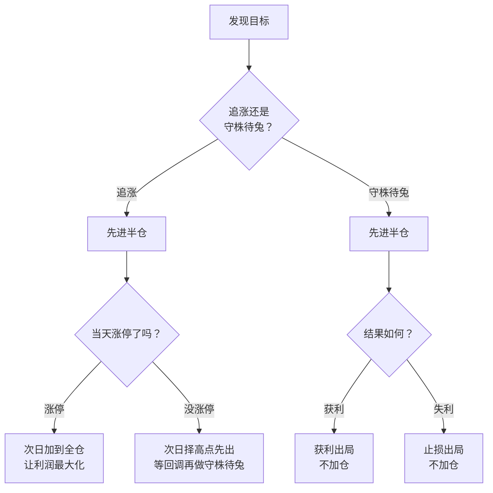
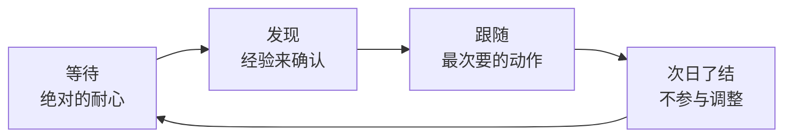

# Asking ③：追涨与守株待兔——半仓试错的仓位纪律

::: summary 一页读懂
1. **一句话体系**：只做超强势股的追涨和守株待兔，仓位管理必不可少。
2. **追涨做热点**：最好是第一次放量上穿 5 日线、涨停的品种。
3. **低吸做龙头**："守株待兔"——等有两个以上大阳线涨停的强势股回到均线附近再买。
4. **半仓试错**：先进半仓，只有这半仓迅速盈利，才动用另一半；失败就止损，绝不加仓。
5. **节奏**：弱市忍手不动，强市踩准节奏；涨停板操作 90% 以上第二天就结束。
:::

::: note 阅读说明与免责声明
本文按主题整理 Asking 关于买卖与仓位的论坛原话（简短引用，出处见文末）和整理者的解读。这些规则产生于 2000 年代的市场环境（当时的涨跌停、交易制度与今天不同），只作理解前辈思路之用，**不构成任何投资建议**，也不建议照搬。
:::

## 1. 一句话的体系

Asking 把自己所有的短线技术压缩成一句话：

> 所有的短线技术归结为一句操作观念：只做超强势股的追涨和守株待兔(仓位管理必不可少，否则会做电梯)

"做电梯"是股民俗语：赚了没走，又跌回原点甚至亏损。这句话里有三个部件——**品种**（超强势股）、**手法**（追涨 / 守株待兔）、**仓位**——缺一不可。

他对短线的定义也很干脆：

> 只要是不参与任何级别调整，买了就为了马上挣钱，这种方法都是短线

## 2. 两种手法：追涨与守株待兔

> 追涨===市场热点(最好是第一次放量上穿5天线、涨停品种)低吸===龙头品种(均线附近买)

| | 追涨 | 守株待兔（低吸） |
|---|---|---|
| **对象** | 市场热点 | 已确认的龙头 / 超强势股 |
| **买点** | 第一次放量上穿 5 日线、涨停 | 回落到均线附近 |
| **前提** | 大盘已大涨、热点清晰 | 该股此前有两个以上大阳线涨停 |
| **思维** | 快：反应快的赚反应慢的钱 | 静：等待、理性 |
| **风险** | 追在高点、次日不及预期 | 弱市里被破位，几天跌掉 10%–20% |

### 2.1 追涨：只挑最强的

> 我的追涨操作为什么都出现在大盘已大涨的情况下…就挑最强的股票上…最强的股票通常还能横几天，可以果断退出。

::: tip 解读：最强 = 退路最好
挑最强的，不只是为了赚得多，更是为了**亏的时候好走**——最强的股票即使冲不上去，往往也会横几天，给你从容离场的时间；弱的股票一转弱就是直线下跌。
:::

### 2.2 守株待兔：等兔子撞上来

流传的语录里，他对守株待兔的品种要求是"任何有两个大阳线以上涨停的"强势股，等它回调到均线附近再买。他自己也承认：

> 低吸有更多的理性思考，所以成功率低吸要高得多

::: warn 守株待兔的死穴
同一份语录也提醒，熊市里守株待兔常常被破位，几天就是 10%–20% 的跌幅。所以低吸同样要服从"弱市不做"和止损纪律。
:::

## 3. 仓位：半仓试错，赢了才加

这是 Asking 最常被引用的一段规则（东方财富股吧转载）：

> 确认是追涨时，先进半仓，当天涨停，次日继续加仓到全仓，让其利润最大化。当天不能涨停，次日择高点先出等回调做守株待兔。做守株待兔时，也是先半仓，获利后出局不加仓。失利后止损不加仓。

> 任何时候，只有半仓操作的股票迅速赢利的情况下，才能动用另半仓资金。

把它画成流程图：

*图：根据转载原文整理的仓位流程。*

::: core 规则的精髓
==只有对的时候才加仓，错的时候绝不加仓。==大多数散户恰好相反：亏了补仓摊成本，赚了赶紧跑。Asking 的规则让**市场的反馈**决定仓位，而不是自己的愿望。
:::

## 4. 节奏：弱市忍手，强市踩点

> 操作的要点只有两条。弱市忍手不动，强市踩准节奏。

他在帖子里还把"弱市不做"称为短线炒手必须遵循的第一原则（职业炒手也说过几乎相同的话，两人语录常被互相收录，原始出处待考）。

至于持有多久：

> 涨停板操作…90%以上的操作都必须第二天结束

> 等待，需要绝对的耐心，发现，需要经验来确认，跟随则是最次要的买入动作了。

::: tip 解读：买入只是最后一步
在他的排序里，"买"是最不重要的——功夫都在买之前的等待与确认。真正难的是没有机会时一直等，而不是有机会时下手。
:::

## 5. 自测与行动

自测 1：追涨买入半仓后当天没涨停，Asking 的规则是什么？

次日择高点先出，等回调后再按守株待兔处理（同样先半仓）。

自测 2：守株待兔获利后要不要加仓？

不加。获利后出局不加仓，失利后止损也不加仓。只有追涨半仓当天涨停的情况才加到全仓。

自测 3：为什么追涨要挑最强的？

最强的股票即使冲高失败，通常还能横几天，可以从容退出；"最强"既是进攻的理由，也是防守的退路。

自测 4：守株待兔在什么环境下最危险？

熊市 / 弱市。强势股回调后可能直接破位，几天跌 10%–20%。

复盘自查清单（用来检查自己的交易是否"像"这套纪律，而不是交易信号）：

- [ ] 这笔交易是在**强市**里做的吗？
- [ ] 买的是**最强的**那只，还是"补涨"的便宜货？
- [ ] 第一笔是否只用了**半仓**？
- [ ] 加仓是因为**已经盈利**，还是因为被套想摊成本？
- [ ] 不及预期时，是否**第二天就走**了？

## 来源

- 东方财富股吧·库迪研究院 2018-02-22（仓位规则原文、"任何时候，只有半仓……"、"我的追涨操作……"、"等待，需要绝对的耐心……"、短线定义）：https://guba.eastmoney.com/news,gssz,746795238.html
- Asking 闽发论坛帖子转载（股窜网 2017 年，作者署名 Asking）："追涨===市场热点……"、"低吸有更多的理性思考……"、"操作的要点只有两条……"、"弱市不做"、"涨停板操作……"：https://www.gucuan8.com/lbymj/5286.html
- 豆丁网《淘股吧 asking 语录》（"所有的短线技术归结为一句操作观念……"、守株待兔品种与风险）：https://www.docin.com/p-2334377627.html
