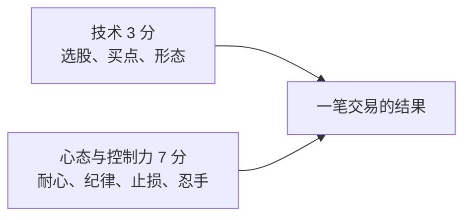

# Asking ④：心态与语录精选——三分技术，七分心态

::: summary 一页读懂
1. **三分技术，七分心态**："十分里边，心态，控制力占7分，技术占3分。"
2. **不预测，只跟随**："我只跟市场走，不预测，不操纵。"——职业炒手记得他反复强调的两个字就是"跟随"。
3. **资金规模决定风格**："小钱要博，大钱要稳"。
4. **超短的两面**：确定性高、赚快钱；但难赚大钱，做久了中长线"拿不住"。
5. **金句要读出处**：本文分为"有出处"和"流传但待考"两类。
:::

::: note 阅读说明与免责声明
本文按主题整理 Asking 的心态类原话与常见语录。所有引用都给出了能找到的出处；**只出现在网友合集里、找不到上下文的句子，单列在"流传语录（待考）"里**。本文仅供学习交易思想，**不构成任何投资建议**。
:::

## 1. 七分心态

> 我只跟市场走，不预测，不操纵。十分里边，心态，控制力占7分，技术占3分。

> 炒股吧，最重要的是心态，控制力。

::: core 什么是"控制力"
不是控制市场，而是**控制自己**：弱市里管住手、亏损时按规则走、赚钱时不得意忘形。Asking 的仓位规则（见第 3 篇）本质上就是把"控制力"写成了可执行的条款。
:::

## 2. 跟随，而不是预测

职业炒手在一篇帖子里回忆：

> 当年asking到成都反复跟我强调两个字，跟随。

他接着解释：

> 跟随的含义是尽量做到客观跟随，放弃主观预测。

::: tip 解读：跟随的三层意思
1. **跟大盘**：大盘弱就不做，强了再出手；
2. **跟热点**：做市场选中的，不做自己臆想的；
3. **跟反馈**：半仓赚了才加，亏了就走——让市场告诉你对错。
:::

## 3. 资金与风格

> 小钱要博，大钱要稳

> 要想爽，做超短

2025 年接受采访时，他对超短的看法更冷静：一个是"确定性很高"，第二是"能赚一些快钱"；但靠超短线赚大钱很难，而且做久了，中长线就拿不住了。后来他转向一级市场，心态变成"放个5年、10年甚至15年才有回报"。

::: warn 别把"爽"当目标
"要想爽，做超短"是论坛语境下的一句感慨。他本人早年两次亏光，赚钱靠的是严格的仓位纪律而不是爽快的交易体验。
:::

## 4. 金句卡（有出处）

::: quote 关于龙头
"龙头不在盘子大小。而在启动的时机。只要先于大盘连续上涨并能带动关联个股上涨，就是龙头。"
:::

::: quote 关于勇气
"龙头需要技术吗，不需要，要的是临阵时的果敢和勇气。"
:::

::: quote 关于仓位
"任何时候，只有半仓操作的股票迅速赢利的情况下，才能动用另半仓资金。"
:::

::: quote 关于节奏
"操作的要点只有两条。弱市忍手不动，强市踩准节奏。"
:::

::: quote 关于量
"有量就能来钱，操短对行情好坏只有一个标准---量。"
:::

::: quote 关于等待
"等待，需要绝对的耐心，发现，需要经验来确认，跟随则是最次要的买入动作了。"
:::

::: quote 关于市场
"这个市场本来就是反应快的赚反应慢的人钱"
:::

## 5. 流传语录（待考）

下面几句在淘股吧网友合集里常被署名 Asking，但没找到原帖上下文，有的还同时出现在别人的语录里，**请当作"流传说法"看待**：

| 语录 | 备注 |
|---|---|
| "只干龙头股，不干杂毛" | 网友合集，原始出处待考 |
| "龙头是走出来的，不是猜出来的" | 网友合集，原始出处待考 |
| "做龙头股，要眼到、手到、心到" | 也见于职业炒手语录，更可能出自职业炒手 |
| "炒股一定要炒龙头股，有板块效应的最好" | 网友合集，原始出处待考 |
| "永远牢记纪律：耐心+顺势而为+知行合一" | 网友合集，原始出处待考 |

## 6. 前辈眼中的 Asking

- 炒股养家："技巧性的东西，asking 和炒手基本都说了，我能反复强调的就是信念二字。"
- 炒股养家："asking，他的选股思路却是大众情人。"
- 职业炒手："当年asking到成都反复跟我强调两个字，跟随。"

::: tip 三个人的接力
Asking 讲**技巧与纪律**，职业炒手讲**空仓与主流**，炒股养家讲**情绪与信念**。读完本系列，可以接着读职业炒手系列和炒股养家系列，看同一套思想如何被一代代人发展。
:::

## 7. 自测与行动

自测 1：Asking 认为心态和技术各占几分？

心态、控制力占 7 分，技术占 3 分。

自测 2：职业炒手记得 Asking 反复强调的两个字是什么？含义是？

"跟随"——尽量客观地跟随市场，放弃主观预测。

自测 3：为什么本文把"龙头是走出来的，不是猜出来的"放在待考里？

它只出现在网友整理的合集中，找不到 Asking 原帖的上下文，不能确定是他本人说的。

心态自查（每周复盘时勾选）：

- [ ] 这周有没有在弱市里"手痒"交易？
- [ ] 有没有因为"预测"而不是"跟随"做的决定？
- [ ] 亏损的交易是否按规则离场，而不是扛单？
- [ ] 读语录时，是否核对过出处？

## 来源

- Asking 闽发论坛帖子转载（股窜网 2017 年，作者署名 Asking）："我只跟市场走……"、"炒股吧，最重要的是心态，控制力"、"小钱要博，大钱要稳"、"要想爽，做超短"、"有量就能来钱……"、"操作的要点只有两条……"、"龙头不在盘子大小……"、"这个市场本来就是……"：https://www.gucuan8.com/lbymj/5286.html
- 东方财富股吧·库迪研究院 2018-02-22（"龙头需要技术吗……"、"任何时候……"、"等待，需要绝对的耐心……"）：https://guba.eastmoney.com/news,gssz,746795238.html
- 每日经济新闻 2025-10-24 采访：https://www.nbd.com.cn/articles/2025-10-24/4104648.html
- 职业炒手回忆"跟随"（淘县名人堂转载）：https://www.jiemiaobi.com/archives/23641
- 淘股吧网友合集（流传语录来源，可信度较低）：https://m.tgb.cn/a/2tl1u4BGkdT 、https://m.tgb.cn/a/1ykxVUQ5sZL
- 炒股养家评价：《情绪周期炒股养家心法语录精编》PDF（本地资料）
