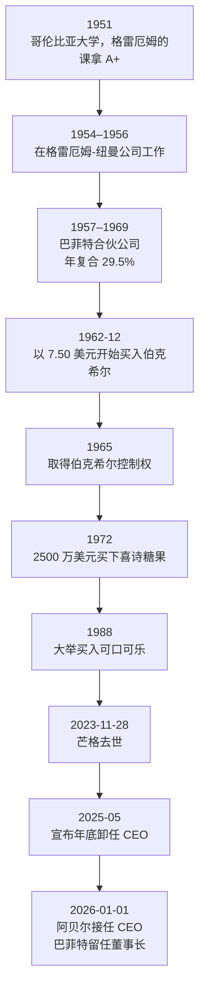

# 巴菲特 ①：人物与历程——从"烟蒂"到伯克希尔的六十年

::: summary 一页读懂
1. **一张成绩单**：伯克希尔每股市值 1965–2024 年复合年增长 19.9%，同期标普 500（含股息）为 10.4%。累计涨幅 5,502,284%，标普为 39,054%（2024 年致股东信）。
2. **师承格雷厄姆**：1951 年在哥伦比亚大学上格雷厄姆的课，拿了 A+。1954–1956 年在格雷厄姆的公司工作，学到"用 40 美分买 1 美元"。
3. **合伙基金时期**：1957–1969 年经营巴菲特合伙公司，年复合收益 29.5%，同期道指 7.4%。
4. **伯克希尔本身是个"烟蒂"**：1962 年起买入这家衰落的纺织厂，1965 年取得控制权。他后来称之为"monumentally stupid"（极其愚蠢）的决定。
5. **芒格改变了他**：从"便宜就买"转向"以合理价格买好公司"。
6. **交棒**：2025 年 5 月宣布卸任，2026-01-01 起由格雷格·阿贝尔任 CEO，巴菲特留任董事长。
:::

::: note 阅读说明与免责声明
本系列优先使用**一手资料**：伯克希尔官网的历年致股东信、《股东手册》（Owner's Manual），以及巴菲特 1984 年在哥伦比亚大学的演讲稿《格雷厄姆-多德村的超级投资者》。中文是本文的译文，关键句附英文原文，方便核对。流传很广、但在这些一手资料里找不到的"巴菲特语录"，统一放在 [⑤](/reading/buffett-5-cases.html#7-流传但查不到出处的话) 并标"待考"。美股的历史经验不能直接套用到 A 股。本文不构成任何投资建议。

本系列共 5 篇：① 人物与历程 · [② 护城河与好生意](/reading/buffett-2-moat.html) · [③ 安全边际与市场先生](/reading/buffett-3-value.html) · [④ 能力圈与资本配置](/reading/buffett-4-competence.html) · [⑤ 经典案例与语录](/reading/buffett-5-cases.html)。
:::

## 1. 一张成绩单

2024 年致股东信第一页的表格，是理解巴菲特的起点：

| 区间 | 伯克希尔每股市值 | 标普 500（含股息） |
|---|---|---|
| 1965–2024 年复合年增长 | **19.9%** | 10.4% |
| 1964–2024 年累计涨幅 | **5,502,284%** | 39,054% |

::: tip 解读：复利的量级
两边每年只差 9.5 个百分点，60 年后的差距却是一百多倍。这说明两件事：==长期复利才是巴菲特成绩的主体==；而且这份成绩是"持续不犯大错"累积出来的，不是某一两年的暴利。这和短线高手"一年几倍"的故事，是完全不同的时间尺度。
:::

## 2. 时间线

*图：据哥伦比亚商学院演讲稿、1988/2007/2014/2023 年致股东信及 2025-11 感恩节信整理。*

## 3. 格雷厄姆：用 40 美分买 1 美元

1984 年演讲里，巴菲特回忆了自己怎样进入格雷厄姆的公司：上完课后，他提出不要工资去打工，格雷厄姆却拒绝了，理由是他"overvalued"（被高估了）。巴菲特说，格雷厄姆"took this value stuff very seriously"（对价值这件事非常认真）。

格雷厄姆的学生们后来各走各路，但用的是同一个思想：

> 他们寻找企业的价值和这家企业的一小部分在市场上的价格之间的差距。
>
> *they search for discrepancies between the value of a business and the price of small pieces of that business in the market.*（1984，哥伦比亚演讲）

演讲里还有一个生动的说法：用 40 美分买 1 美元钞票这个想法，人们要么"立刻就懂"，要么"永远不懂"，像打疫苗一样。巴菲特说，他从没见过谁是花十年慢慢转变过来的。

## 4. 烟蒂：伯克希尔本身就是一个教训

2014 年的信里，巴菲特讲了伯克希尔的来历：

- 1962 年 12 月，他的合伙公司开始买入伯克希尔，当时股价 7.50 美元，远低于每股营运资本 10.25 美元和账面价值 20.20 美元；
- 他把这比作"捡起一个被丢掉、还剩一口的烟蒂"：烟头又丑又湿，但那一口是免费的；
- 本来计划把股票卖回给公司赚一笔就走。管理层的报价比口头约定少了八分之一美元，他一气之下没有卖，反而买下了控制权。

他对这个决定的评价是：

> 那是一个极其愚蠢的决定。
>
> *That was a monumentally stupid decision.*（2014 年致股东信）

因为伯克希尔当时是"深陷糟糕行业的北方纺织厂"，行业正在"向南"走，既是比喻也是字面意思。

::: warn 烟蒂的问题
1989 年的信里，巴菲特总结了"烟蒂法"的毛病：除非你是清算人，否则这种买法是愚蠢的。原因有二：一是便宜的价格往往没那么便宜，困难的生意里"厨房里永远不止一只蟑螂"；二是低回报会很快吃掉你买入时的价差（详见 [②](/reading/buffett-2-moat.html#4-好公司合理价胜过一般公司便宜价)）。
:::

## 5. 芒格：从烟蒂到好生意

2023 年的信是写给芒格的悼词，标题叫"Charlie Munger – The Architect of Berkshire Hathaway"（伯克希尔的设计师）。巴菲特写道，1965 年芒格就告诉他，买下伯克希尔控制权是个"dumb decision"（蠢决定）。但既然已经买了，芒格会告诉他怎么纠正。

芒格给的方向，就是 1989 年那句名言：

> 以合理的价格买一家好公司，远胜过以好价格买一家一般的公司。
>
> *It's far better to buy a wonderful company at a fair price than a fair company at a wonderful price.*（1989 年致股东信）

巴菲特紧接着写道："Charlie understood this early; I was a slow learner."（芒格很早就懂了，我学得慢。）

芒格本人的经历、演讲与思维方法见 [芒格系列](/reading/munger-1-life.html)，2023 年信里 1965 年那段对话的完整原文见 [芒格 ① 1965 年的那句话](/reading/munger-1-life.html#4-1965-年的那句话好生意胜过便宜货)。

## 6. 交棒

- 2025 年 5 月的股东大会上，巴菲特宣布年底卸任 CEO。
- 2025 年 11 月的感恩节信里，他说自己将不再撰写年报、不再在股东大会上长篇讲话，"As the British would say, I'm 'going quiet.' Sort of."（用英国人的话说，我要"安静下来"了。算是吧。）他评价阿贝尔"是一位出色的管理者、不知疲倦的工作者、诚实的沟通者"。
- 2026-01-01 起阿贝尔任 CEO，巴菲特留任董事长。2026 年 2 月，阿贝尔发表了他的第一封致股东信。

## 7. 自测与行动

自测 1：1965–2024 年伯克希尔和标普 500 的复合年增长分别是多少？

19.9% 对 10.4%（2024 年致股东信）。

自测 2：巴菲特为什么说买下伯克希尔"monumentally stupid"？

伯克希尔是衰落行业里的纺织厂。他原本只想捡"烟蒂"的最后一口利润，却因为对管理层压价不满而买下了整家公司，把大量资本困在了糟糕的生意里。

自测 3：芒格带来的最大转变是什么？

从"便宜就买"的烟蒂法，转向"以合理价格买好公司"。

读巴菲特时的提醒：

- [ ] 优先读**致股东信原文**，不读二手"语录"
- [ ] 注意他自己承认的错误，和成功案例一样重要
- [ ] 记住时间尺度：这是 60 年的复利，不是一两年的爆发

## 来源

- Berkshire Hathaway 2024 Shareholder Letter（业绩表）：https://www.berkshirehathaway.com/letters/2024ltr.pdf
- Warren Buffett, *The Superinvestors of Graham-and-Doddsville*（1984，哥伦比亚商学院；A+、Graham-Newman、合伙公司业绩表、"40 美分买 1 美元"）：https://business.columbia.edu/insights/chazen-global-insights/superinvestors-graham-and-doddsville
- 2014 Shareholder Letter（伯克希尔的来历、"monumentally stupid"、烟蒂比喻）：https://www.berkshirehathaway.com/letters/2014ltr.pdf
- 1989 Shareholder Letter（烟蒂法、"wonderful company at a fair price"）：https://www.berkshirehathaway.com/letters/1989.html
- 2023 Shareholder Letter（芒格悼词）：https://www.berkshirehathaway.com/letters/2023ltr.pdf
- 2007 Shareholder Letter（喜诗糖果收购）：https://www.berkshirehathaway.com/letters/2007ltr.pdf
- 1988 Shareholder Letter（可口可乐）：https://www.berkshirehathaway.com/letters/1988.html
- 巴菲特 2025-11-10 感恩节信（"going quiet"、评价阿贝尔）：https://www.berkshirehathaway.com/news/nov1025.pdf
- CNBC 2026-01-01《Warren Buffett retires as Berkshire Hathaway CEO》：https://www.cnbc.com/2026/01/01/warren-buffett-retires-as-berkshire-hathaway-ceo.html
- Berkshire Hathaway 2025 Shareholder Letter（阿贝尔首封信）：https://www.berkshirehathaway.com/letters/2025ltr.pdf
