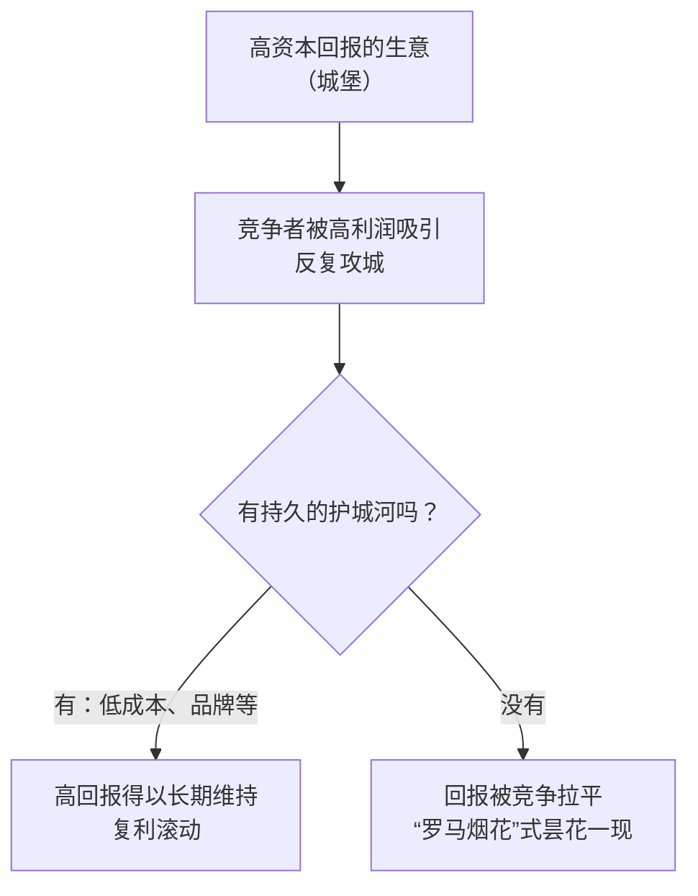
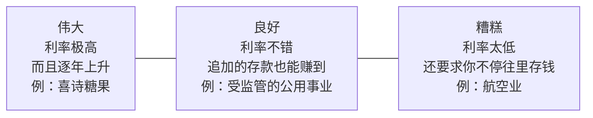

# 巴菲特 ②：护城河与好生意——城堡、喜诗糖果与三种"储蓄账户"

::: summary 一页读懂
1. **护城河**：真正伟大的企业，必须有一条持久的"护城河"，保护它的高资本回报。常见的护城河是低成本优势和强大的品牌。
2. **"持久"是关键**：变化太快的行业被排除在外，因为"一条需要不断重建的护城河，最终就不是护城河"。
3. **喜诗糖果**：1972 年 2500 万美元买下，到 2007 年只追加了 3200 万美元资本，却累计赚了 13.5 亿美元税前利润。
4. **三种生意**：伟大（几乎不用再投钱）、良好（多投钱多赚钱）、糟糕（越投越亏，比如航空）。
5. **好公司合理价 > 一般公司便宜价**：时间是好生意的朋友、平庸生意的敌人。
6. **跨一尺高的栏**：他和芒格没学会解决难题，只学会了避开难题。
:::

::: note 阅读说明与免责声明
本篇依据伯克希尔 1989、1996、2007 年致股东信，中文为本文译文，关键句附原文。数字均来自信件原文。本文不构成任何投资建议。

本系列共 5 篇：[① 人物与历程](/reading/buffett-1-life.html) · ② 护城河与好生意 · [③ 安全边际与市场先生](/reading/buffett-3-value.html) · [④ 能力圈与资本配置](/reading/buffett-4-competence.html) · [⑤ 经典案例与语录](/reading/buffett-5-cases.html)。
:::

## 1. 护城河与城堡

2007 年的信里，巴菲特给"伟大的企业"下了定义：

> 一家真正伟大的企业，必须有一条持久的"护城河"，保护它出色的投入资本回报率。
>
> *A truly great business must have an enduring "moat" that protects excellent returns on invested capital.*（2007 年致股东信）

他接着解释了为什么需要护城河：资本主义的动态机制保证了，竞争对手会反复攻击任何一座高回报的"城堡"。所以必须有坚固的屏障，比如：

| 护城河类型 | 信中的例子 |
|---|---|
| 低成本生产者 | GEICO、Costco |
| 强大的全球品牌 | 可口可乐、吉列、美国运通 |

他在 1996 年谈 GEICO 时也用了同一个比喻：规模经济让 GEICO 能够维持、甚至拓宽"环绕我们经济城堡的护城河"。

*图：按 2007 年致股东信整理。*

### 1.1 "持久"二字最难

同一封信里，巴菲特说商业史上充满了"罗马烟花"（Roman Candles），也就是护城河最终被证明是幻觉、很快就被越过的公司。因此他用"持久"这个标准，排除了处在快速、持续变化中的行业：

> 一条需要不断重建的护城河，最终就不是护城河。
>
> *A moat that must be continuously rebuilt will eventually be no moat at all.*（2007 年致股东信）

::: tip 解读：和短线的"热点"正好相反
短线选手追的是**变化**：新题材、新热点，"喜新厌旧永远是短线不变的真理"（钙片，见 [钙片 ②](/reading/gaipian-2-heli.html#6-只买龙头不买龙头的亲戚)）。巴菲特要的却是**不变**：几十年后还卖得动的糖果和可乐。两种方法都能赚钱，但赚的是完全不同的钱：一个赚情绪波动的钱，一个赚企业复利的钱。==先想清楚自己在赚哪种钱，再决定用哪套方法。==
:::

## 2. 喜诗糖果：梦想中的生意

巴菲特称喜诗糖果（See's Candies）是"梦想生意的原型"。2007 年信里的数字：

| 项目 | 1972 年买入时 | 2007 年 |
|---|---|---|
| 收购价 | 2500 万美元 | — |
| 销售额 | 3000 万美元 | 3.83 亿美元 |
| 税前利润 | 不到 500 万美元 | 8200 万美元 |
| 经营所需资本 | 800 万美元 | 4000 万美元 |

- 买入时，税前资本回报率就达到 60%。原因之一是糖果用现金销售，没有应收账款；二是生产和配送周期短，库存很少。
- 1972 年以来，喜诗只需要追加 3200 万美元资本，同期累计税前利润 13.5 亿美元。除了那 3200 万，其余全部交给了伯克希尔，用来买别的好生意。

::: core 核心心法
==好生意的标志不只是利润高，而是"赚钱不怎么需要再投钱"。==喜诗赚来的钱几乎都能拿出来，再投到别处继续复利。巴菲特说这正是伯克希尔扩张的方式：喜诗"孕育了多条新的现金流"。
:::

## 3. 三种"储蓄账户"

同一封信把生意分成三类，最后用储蓄账户打比方：

*图：按 2007 年致股东信整理。*

谈到"糟糕"那一类，他的玩笑很有名：航空业自莱特兄弟以来就没有过持久的竞争优势，如果当年有个有远见的资本家在场，"就该把奥维尔打下来"，这对他的后代是莫大的恩惠。他还坦白，自己 1989 年买过美国航空的优先股，后来运气好才在 1998 年高价卖掉。

## 4. 好公司合理价，胜过一般公司便宜价

1989 年的信是巴菲特写的"前 25 年犯过的错"，其中最核心的一条就是告别烟蒂法。他举了算术例子：如果用 800 万美元买一家能卖 1000 万美元的公司，你必须很快卖掉或清算才能赚到价差。否则十年后还是只卖 1000 万，而这十年里它每年只赚几个百分点，投资就会令人失望。由此得出：

> 时间是好生意的朋友，平庸生意的敌人。
>
> *Time is the friend of the wonderful business, the enemy of the mediocre.*（1989 年致股东信）

以及那句名言："It's far better to buy a wonderful company at a fair price than a fair company at a wonderful price."（见 [①](/reading/buffett-1-life.html#5-芒格从烟蒂到好生意)）

他还说，这个道理看起来显而易见，但他自己"had to learn it several times over"（学了好几次才学会）。例如买下伯克希尔不久后收购的一家巴尔的摩百货公司。

## 5. 跨一尺高的栏

1989 年还有一条教训，标题就叫"Easy does it"（悠着点）：

> 我们没有学会如何解决困难的商业问题，我们学会的是避开它们。
>
> *Charlie and I have not learned how to solve difficult business problems. What we have learned is to avoid them.*（1989 年致股东信）

他的比喻是：成功是因为专注于找那些"能一步跨过去的一尺高的栏"，而不是练成了跳过七尺高栏的本事。

::: tip 解读：对短线同样适用
职业炒手说"弱市不做"，钙片说"超跌股抄底不是我的强项，所以从来不抄底"（见 [钙片 ③](/reading/gaipian-3-discipline.html#3-制度先写下不碰什么)）。不同门派殊途同归：==长期赢家的优势，往往来自避开难题，而不是攻克难题。==
:::

## 6. 自测与行动

自测 1：巴菲特举了哪两类护城河？各有什么例子？

低成本生产者（GEICO、Costco）和强大的全球品牌（可口可乐、吉列、美国运通）。

自测 2：为什么喜诗糖果是"梦想中的生意"？

增长很慢，但资本回报极高，几乎不需要追加资本。1972–2007 年只追加了 3200 万美元，却累计赚了 13.5 亿美元税前利润，绝大部分可以拿去投资别的生意。

自测 3：三种"储蓄账户"分别是什么？

伟大：利率极高且逐年上升；良好：利率不错，追加的存款也能赚到；糟糕：利率太低，还要你不停往里存钱。

自测 4："Time is the friend of the wonderful business, the enemy of the mediocre." 怎么理解？

好生意持续高回报，时间越长复利越大；平庸生意回报低，时间越长，买入时的那点价差越会被低回报吃掉。

分析一家公司时可以问：

- [ ] 它的**护城河**是什么？低成本、品牌，还是别的？能持续十年吗？
- [ ] 它所在的行业变化快吗？护城河需要"不断重建"吗？
- [ ] 赚的钱能拿出来，还是必须不断再投进去？（三种储蓄账户里属于哪一种？）
- [ ] 我买它是因为**好**，还是只因为**便宜**？
- [ ] 这是一尺高的栏，还是七尺高的栏？

## 来源

- Berkshire Hathaway 2007 Shareholder Letter（护城河、罗马烟花、喜诗糖果数字、三种储蓄账户、航空业）：https://www.berkshirehathaway.com/letters/2007ltr.pdf
- 1996 Shareholder Letter（GEICO 与"经济城堡的护城河"）：https://www.berkshirehathaway.com/letters/1996.html
- 1989 Shareholder Letter（烟蒂法、时间是好生意的朋友、Easy does it）：https://www.berkshirehathaway.com/letters/1989.html
