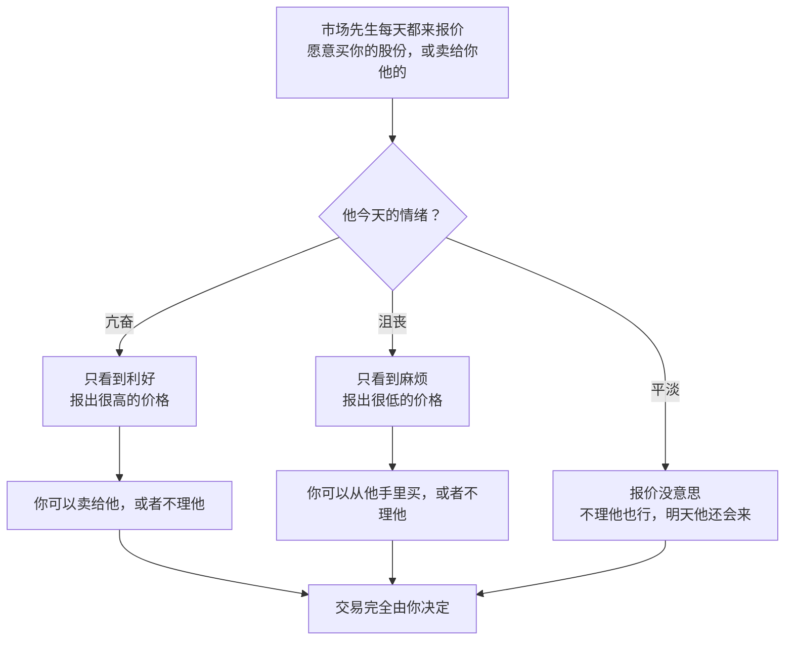

# 巴菲特 ③：安全边际与市场先生——价格是你付出的，价值是你得到的

::: summary 一页读懂
1. **内在价值**：一家企业在剩余寿命里能拿出来的现金，折现后的价值。它是一个**估计**，不是精确数字。
2. **安全边际**：算出来的价值只比价格高一点，就不买。就像造一座能承重 3 万磅的桥，却只让 1 万磅的卡车通过。
3. **风险与回报反着来**：用 40 美分买 1 美元，比用 60 美分买风险更小，回报却更高。股价跌得越多，[[贝塔]]越高，看起来"风险越大"，巴菲特说这是"爱丽丝梦游仙境"。
4. **市场先生**：每天来给你报价的合伙人，情绪极不稳定。他是来服务你的，不是来指导你的。
5. **别人贪婪时恐惧**："be fearful when others are greedy and to be greedy only when others are fearful."
6. **对照短线**：情绪周期派研究市场先生的情绪并顺势而为，价值派利用他的情绪逆向而行。
:::

::: note 阅读说明与免责声明
本篇依据伯克希尔《股东手册》、1986/1987/1992/2008 年致股东信和 1984 年哥伦比亚演讲。中文为本文译文，关键句附原文。估值是主观估计，示例数字是本文假设的。本文不构成任何投资建议。

本系列共 5 篇：[① 人物与历程](/reading/buffett-1-life.html) · [② 护城河与好生意](/reading/buffett-2-moat.html) · ③ 安全边际与市场先生 · [④ 能力圈与资本配置](/reading/buffett-4-competence.html) · [⑤ 经典案例与语录](/reading/buffett-5-cases.html)。
:::

## 1. 内在价值：一个估计

伯克希尔《股东手册》给内在价值下的定义很短：

> 内在价值可以简单地定义为：一家企业在其剩余寿命中能够取出的现金的折现值。
>
> *Intrinsic value can be defined simply: It is the discounted value of the cash that can be taken out of a business during its remaining life.*（Owner's Manual）

手册接着提醒了三点：

- 内在价值是**估计**，不是精确数字；
- 利率变化，或者对未来现金流的预测调整了，这个估计也必须跟着变；
- 同样一组事实，两个人（哪怕是巴菲特和芒格）算出来的数字几乎必然不同。

1992 年的信还拆掉了"价值股"和"成长股"的对立：

> 在我们看来，这两种方法是连体的：成长永远是计算价值时的一个组成部分。
>
> *In our opinion, the two approaches are joined at the hip: Growth is always a component in the calculation of value.*（1992 年致股东信）

他甚至说"价值投资"这个词本身就是多余的：如果不是为了寻找至少值回所付价格的价值，"投资"还能是什么？

## 2. 安全边际：能承重三万磅的桥

1992 年的信把安全边际称为"投资成功的基石"：

> 如果我们算出一只股票的价值只比价格高一点点，我们就没有兴趣买。
>
> *If we calculate the value of a common stock to be only slightly higher than its price, we're not interested in buying.*（1992 年致股东信）

1984 年演讲里有一个更形象的说法：你不会试图用 8000 万美元去买一家值 8300 万美元的公司，要给自己留出巨大的余量：

> 造桥时，你坚持它能承重 3 万磅，但只让 1 万磅的卡车通过。投资也是同样的道理。
>
> *When you build a bridge, you insist it can carry 30,000 pounds, but you only drive 10,000 pound trucks across it. And that same principle works in investing.*（1984，哥伦比亚演讲）

::: core 示例：把安全边际变成数字（数字为本文假设）
假设你估计一家公司的内在价值在每股 80–120 元之间，取中间值 100 元。

| 买入价 | 相对中间值的折扣 | 估值偏乐观（真实价值只有 80）时 | 怎么做 |
|---|---|---|---|
| 95 元 | 5% | 买贵了 15 元 | 不买：余量太小 |
| 70 元 | 30% | 仍有 10 元余量 | 可以考虑 |
| 50 元 | 50% | 仍有 30 元余量 | 有吸引力，但要检查是不是"便宜的烂生意" |

安全边际保护的是**你估错的时候**。估值越不确定，要求的折扣就应该越大。
:::

## 3. 风险与回报：价值投资里反着来

演讲里，巴菲特用左轮手枪举例：有人给 100 万美元让你开一枪（6 个弹仓里有 1 发子弹），给 500 万让你开两枪。在这种游戏里，风险和回报是正相关的。但价值投资正好相反：

> 用 60 美分买一张 1 美元钞票，比用 40 美分买风险更大，但后者的预期回报更高。
>
> *If you buy a dollar bill for 60 cents, it's riskier than if you buy a dollar bill for 40 cents, but the expectation of reward is greater in the latter case.*（1984，哥伦比亚演讲）

他用《华盛顿邮报》举例：1973 年它的市值只有 8000 万美元，而资产随便卖给十家买家中的任何一家，都不少于 4 亿美元。如果股价继续跌到市值 4000 万，它的贝塔会更高，在"用贝塔衡量风险"的人眼里就**更危险**了。巴菲特说这"truly Alice in Wonderland"（真是爱丽丝梦游仙境）：他始终想不通，为什么花 4000 万买 4 亿的资产，会比花 8000 万买更危险。

## 4. 市场先生

1987 年的信里，巴菲特复述了格雷厄姆的寓言：

> 想象市场报价来自一位非常随和的伙伴，名叫市场先生，他是你在一家私人企业里的合伙人。
>
> *imagine market quotations as coming from a remarkably accommodating fellow named Mr. Market who is your partner in a private business.*（1987 年致股东信）

*图：按 1987 年致股东信整理。*

寓言的结尾是一个警告，也是全文的重点：

> 市场先生是来服务你的，不是来指导你的。
>
> *Mr. Market is there to serve you, not to guide you.*（1987 年致股东信）

有用的是他的钱包，不是他的智慧。如果他哪天表现得特别愚蠢，你可以不理他，也可以利用他。但如果你受了他的影响，那就是灾难。

## 5. 别人贪婪时恐惧

1986 年的信里，巴菲特说他们从不预测"恐惧"和"贪婪"这两种传染病什么时候来、什么时候走，目标要朴素得多：

> 我们只是试着在别人贪婪时恐惧，只在别人恐惧时贪婪。
>
> *we simply attempt to be fearful when others are greedy and to be greedy only when others are fearful.*（1986 年致股东信）

写那封信时，华尔街"little fear is visible"（几乎看不到恐惧），到处是亢奋。一年后就是 1987 年 10 月的股灾。

2008 年金融危机中，他在信里引用了格雷厄姆的另一句话：

> 价格是你付出的，价值是你得到的。
>
> *Price is what you pay; value is what you get.*（2008 年致股东信，引格雷厄姆）

他还补了一句："Whether we're talking about socks or stocks, I like buying quality merchandise when it is marked down."（不管是袜子还是股票，我都喜欢在优质商品打折时买。）

## 6. 对照：情绪周期派怎么看市场先生

炒股养家的情绪周期理论，研究的其实也是市场先生的情绪：赚钱效应与亏钱效应轮回、情绪的冰点与高潮（见 [养家 ②](/reading/yangjia-2-emotion.html#第-4-章-情绪周期赚钱效应与亏钱效应的轮回)）。两派都承认市场是情绪化的，差别在怎么用：

| | 情绪周期派（养家等） | 价值派（巴菲特） |
|---|---|---|
| 关注对象 | 市场参与者的情绪本身 | 企业的内在价值；情绪只决定价格 |
| 怎么用情绪 | 顺着情绪：冰点后试错、发酵时加仓、高潮时兑现 | 逆着情绪：别人恐惧时买，别人贪婪时谨慎 |
| 持有时间 | 几天到几周 | 几年到"永远" |
| 依赖什么 | 对群体心理和节奏的判断 | 对企业价值的估计和安全边际 |
| 最大风险 | 节奏判断错、追在高潮 | 估值错误、"便宜的烂生意" |

::: tip 解读：不要混用
两套方法都把市场先生当作"对手盘"，但一个跟他跳舞，一个等他犯错。最危险的是混用：==用短线的理由买入，被套后又用"长期价值"安慰自己持有。==动手之前，先写下自己用的是哪一套方法，卖出标准也照这套方法来定。
:::

## 7. 自测与行动

自测 1：《股东手册》怎样定义内在价值？

一家企业在剩余寿命中能够取出的现金的折现值。这是一个会随利率和预测变化的估计，不是精确数字。

自测 2：为什么说价值投资里"风险与回报反着来"？

同样一张 1 美元，40 美分买进比 60 美分买进的风险更小、预期回报更高。价格越低于价值，余量越大，回报越高。

自测 3：市场先生寓言最重要的那句警告是什么？

"Mr. Market is there to serve you, not to guide you."（市场先生是来服务你的，不是来指导你的。）

自测 4：情绪周期派和价值派利用市场情绪的方式有什么不同？

情绪周期派顺着情绪做节奏；价值派逆着情绪，在恐惧时按低于价值的价格买入，在贪婪时保持谨慎。

估值与下单清单：

- [ ] 写下对内在价值的**区间估计**，而不是一个点
- [ ] 买入价相对估值下限还有余量吗？（安全边际）
- [ ] 今天市场先生是亢奋还是沮丧？我是在利用他，还是被他带着走？
- [ ] 写下这笔交易属于"短线情绪"还是"长期价值"，卖出标准一并写好

## 来源

- Berkshire Hathaway Owner's Manual（内在价值定义）：https://www.berkshirehathaway.com/owners.html
- 1992 Shareholder Letter（价值与成长"joined at the hip"、安全边际是基石）：https://www.berkshirehathaway.com/letters/1992.html
- Warren Buffett, *The Superinvestors of Graham-and-Doddsville*（1984，桥梁比喻、40 美分 vs 60 美分、《华盛顿邮报》与贝塔）：https://business.columbia.edu/insights/chazen-global-insights/superinvestors-graham-and-doddsville
- 1987 Shareholder Letter（市场先生）：https://www.berkshirehathaway.com/letters/1987.html
- 1986 Shareholder Letter（fearful/greedy）：https://www.berkshirehathaway.com/letters/1986.html
- 2008 Shareholder Letter（"Price is what you pay; value is what you get."）：https://www.berkshirehathaway.com/letters/2008ltr.pdf
