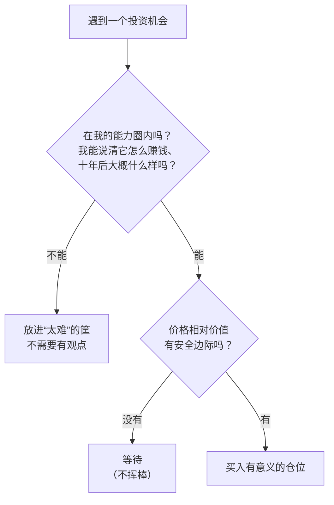

# 巴菲特 ④：能力圈、集中与资本配置——知道边界，少犯大错

::: summary 一页读懂
1. **能力圈**：不必懂每家公司，只要能评估自己能力圈内的公司。"圈的大小不重要，知道边界在哪里却至关重要。"
2. **集中还是分散**：不懂企业的人，定期买[[指数基金]]就能胜过大多数专业人士；能看懂企业的人，集中在 5–10 家就够了，分散只会拉低回报。
3. **十年与十分钟**：不愿意持有十年的股票，十分钟都别持有。最喜欢的持有期是"永远"。
4. **不作为也是智慧**：他们"打呼噜时赚的钱比忙碌时多"。
5. **规模是业绩的锚**：资金越大，超额收益越难。
6. **纠错要快**：最大的罪过是拖延纠正错误，也就是芒格说的"吮手指"。
:::

::: note 阅读说明与免责声明
本篇依据伯克希尔 1988、1989、1992、1993、1996、2024 年致股东信、2025 年阿贝尔致股东信、《股东手册》和 1984 年哥伦比亚演讲。中文为本文译文，关键句附原文。巴菲特所说的"集中"，建立在对企业的深入理解之上，并不是鼓励普通投资者满仓押注少数股票。本文不构成任何投资建议。

本系列共 5 篇：[① 人物与历程](/reading/buffett-1-life.html) · [② 护城河与好生意](/reading/buffett-2-moat.html) · [③ 安全边际与市场先生](/reading/buffett-3-value.html) · ④ 能力圈与资本配置 · [⑤ 经典案例与语录](/reading/buffett-5-cases.html)。
:::

## 1. 能力圈：知道边界比圈子大更重要

1996 年的信里，巴菲特说投资者需要的，是正确评估"选定的"企业的能力：

> 你只需要能够评估你能力圈之内的公司。圈子的大小并不重要，但知道它的边界在哪里，却至关重要。
>
> *You only have to be able to evaluate companies within your circle of competence. The size of that circle is not very important; knowing its boundaries, however, is vital.*（1996 年致股东信）

1992 年的信说得更直白：

> 对大多数人来说，投资中最重要的不是知道多少，而是能多现实地界定自己不知道什么。
>
> *What counts for most people in investing is not how much they know, but rather how realistically they define what they don't know.*（1992 年致股东信）

同一段还有一句：只要避免大错，投资者只需要做对很少几件事。

*图：本文按 1992/1996 年致股东信整理。"太难"的筐是对他思路的概括，不是信中原话。*

::: tip 对照：钙片的"禁区表"
钙片在论坛长帖里写："要想活得久就要有自己不可以去涉足的地方"，然后列出权证、小盘股首日、超跌抄底（见 [钙片 ③](/reading/gaipian-3-discipline.html#3-制度先写下不碰什么)）。这其实就是短线版的能力圈：==先划出不碰的范围，再在圈内反复做熟悉的事。==
:::

## 2. 集中还是分散

1993 年的信里，巴菲特把投资者分成两类：

| 你是哪类投资者 | 巴菲特的建议 |
|---|---|
| "know-nothing"：不了解具体企业的经济特性，但想长期持有美国产业 | 持有大量股票、分批买入。定期投资指数基金，"实际上能跑赢大多数投资专业人士"；当"笨钱"承认自己的局限时，它就不再笨了 |
| "know-something"：能看懂企业经济特性，能找到 5–10 家价格合理、有长期竞争优势的公司 | 传统的分散"毫无意义"，只会拉低回报、增加风险。与其投第 20 喜欢的生意，不如加仓最看好的那几家 |

他对"风险"的定义也和学术界不同。他用的是字典定义："the possibility of loss or injury"（损失或伤害的可能性），而不是股价波动率。他认为，如果集中持股能让投资者更深入地思考一家企业、买入前对它更有把握，集中反而可能**降低**风险。

同一封信还说，一辈子要做几百个聪明决定太难了，所以他们的策略只要求"聪明很少的几次"：

> 事实上，我们现在一年有一个好主意就满足了。
>
> *Indeed, we'll now settle for one good idea a year.*（1993 年致股东信）

## 3. 持有十年，否则十分钟也别持有

1996 年的信给投资者设定了目标：以合理的价格，买入一家**容易理解**、五年、十年、二十年后盈利几乎肯定会大幅增长的企业的部分股权。满足标准的公司很少，所以遇到了就要买"有意义的数量"。然后是那句名言：

> 如果你不愿意持有一只股票十年，那就连十分钟都不要想着持有它。
>
> *If you aren't willing to own a stock for ten years, don't even think about owning it for ten minutes.*（1996 年致股东信）

1988 年的信讲买入可口可乐时说：

> 当我们拥有优秀管理层经营的优秀企业的部分股权时，我们最喜欢的持有期是永远。
>
> *when we own portions of outstanding businesses with outstanding managements, our favorite holding period is forever.*（1988 年致股东信）

他还引用彼得·林奇的比喻，批评那些好公司一涨就卖、坏公司死拿不放的人："cutting the flowers and watering the weeds"（剪掉鲜花，浇灌杂草）。

## 4. 不作为也是智慧

1996 年的持仓几乎没变，巴菲特写道：

> 我们打呼噜时赚的钱，仍然比忙碌时赚的多。不作为在我们看来是明智的行为。
>
> *We continue to make more money when snoring than when active. Inactivity strikes us as intelligent behavior.*（1996 年致股东信）

他的理由是：没有哪个企业主会因为美联储可能小幅调整利率，或者某个华尔街评论员改变了看法，就慌忙卖掉一家高利润的子公司。那为什么要这样对待自己在优秀企业里的少数股权？

阿贝尔在 2025 年致股东信里，用巴菲特常讲的泰德·威廉斯来概括这种纪律：这位传奇击球手把好球区分成 77 格，只对其中"甜蜜区"的球挥棒。阿贝尔的总结是：确定想要的球，等它来，然后果断挥棒。

::: core 核心心法
==不挥棒不会被罚出局，挥错棒才会。==这和职业炒手"弱市不做"讲的是同一种耐心（见 [职业炒手 ②](/reading/zhiye-2-core.html#1-第一原则弱市不做)）。区别只在等的对象：短线等市场阶段，巴菲特等价格进入安全边际。
:::

## 5. 规模是业绩的锚

1984 年演讲里，巴菲特谈到红杉基金的比尔·鲁安时说：

> 规模是业绩的锚，这一点毫无疑问。
>
> *Size is the anchor of performance. There is no question about it.*（1984，哥伦比亚演讲）

这不是说资金大了就不能跑赢平均，而是优势会缩小。他开玩笑说，如果你管的钱多到等于整个经济的股票总市值，就别指望跑赢平均了。伯克希尔《股东手册》也写道：每股价值的增速未来一定会放缓，"a greatly enlarged capital base will see to that"（大大膨胀的资本基础注定如此）。

::: tip 对照：游资的规模困境
章盟主的轨迹是 A 股游资版的例子：资金到了几十亿，能做的股票变少，进出时对价格的冲击变大，判断错了代价也更大（见 [章盟主 ②](/reading/zhang-2-style.html#4-挫折清单)）。
:::

## 6. 犯错与纠错

巴菲特的信以坦承错误著称。2024 年的信专门写了一节"Mistakes – Yes, We Make Them at Berkshire"（错误：是的，伯克希尔也会犯）：

> 最大的罪过，是拖延纠正错误，也就是芒格所说的"吮手指"。
>
> *The cardinal sin is delaying the correction of mistakes or what Charlie Munger called "thumb-sucking."*（2024 年致股东信）

芒格告诉他，问题不会因为你希望它消失就消失，必须采取行动，哪怕再不舒服。巴菲特还特意统计：2019–2023 年，他在信里用了 16 次"mistake"或"error"。

1989 年的信里，他把自己最意外的发现称为"institutional imperative"（机构惯性）。例如：组织会像牛顿第一定律那样抗拒改变方向；就像工作会膨胀到填满所有时间，项目和收购也会冒出来吸干所有可用资金；同行在做什么，就会被盲目模仿。

## 7. 资本配置与浮存金

伯克希尔的扩张靠两条腿：

- **好生意产生的现金**：喜诗糖果这样的企业几乎不需要再投资，利润可以拿去买别的好生意（见 [②](/reading/buffett-2-moat.html#2-喜诗糖果梦想中的生意)）；
- **保险[[浮存金]]**：2024 年的信解释，财产险是"先收保费、后赔付"的模式，这让伯克希尔能投资大笔资金（"float"），同时通常还能有一点承保利润。

此外，他们"吃自己做的饭"：《股东手册》写道，芒格家族 90% 以上、巴菲特夫妇 99% 以上的净资产都在伯克希尔股票上。

## 8. 自测与行动

自测 1：能力圈最重要的是什么？

不是圈子大小，而是知道边界在哪里，并且只在圈内做决定。

自测 2：巴菲特给"know-nothing"投资者的建议是什么？

持有大量股票、分批买入，例如定期投资指数基金，这样就能跑赢大多数专业人士。

自测 3：他怎样定义风险？为什么认为集中未必更危险？

风险是"损失或伤害的可能性"，而不是波动率。集中持股如果让人对企业想得更深、更有把握，反而可能降低风险。

自测 4：什么是"thumb-sucking"？

芒格的说法，指拖延纠正错误。巴菲特称之为"最大的罪过"。

给自己的能力圈体检：

- [ ] 列出我真正能说清"怎么赚钱、十年后怎样"的行业或公司（可以很少）
- [ ] 判断自己目前是"know-nothing"还是"know-something"，据此选择指数化还是集中
- [ ] 每笔持仓自问：愿意持有十年吗？不愿意的话，买入理由是什么？
- [ ] 一个季度里，统计有多少交易是"不做也可以"的
- [ ] 发现错误后，规定自己在多长时间内处理，不"吮手指"

## 来源

- 1996 Shareholder Letter（能力圈、十年与十分钟、打呼噜与不作为）：https://www.berkshirehathaway.com/letters/1996.html
- 1992 Shareholder Letter（界定自己不知道什么）：https://www.berkshirehathaway.com/letters/1992.html
- 1993 Shareholder Letter（集中与分散、know-nothing 与指数基金、风险定义、一年一个好主意）：https://www.berkshirehathaway.com/letters/1993.html
- 1988 Shareholder Letter（持有期是永远、剪花浇草）：https://www.berkshirehathaway.com/letters/1988.html
- 1989 Shareholder Letter（机构惯性）：https://www.berkshirehathaway.com/letters/1989.html
- Warren Buffett, *The Superinvestors of Graham-and-Doddsville*（"Size is the anchor of performance"）：https://business.columbia.edu/insights/chazen-global-insights/superinvestors-graham-and-doddsville
- 2024 Shareholder Letter（错误与"thumb-sucking"、浮存金）：https://www.berkshirehathaway.com/letters/2024ltr.pdf
- 2025 Shareholder Letter（阿贝尔：泰德·威廉斯与"甜蜜区"）：https://www.berkshirehathaway.com/letters/2025ltr.pdf
- Berkshire Hathaway Owner's Manual（规模的限制、"eat our own cooking"）：https://www.berkshirehathaway.com/owners.html
