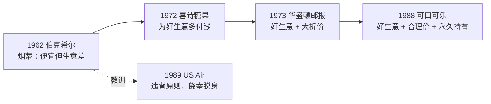

# 巴菲特 ⑤：经典案例与语录——伯克希尔、喜诗、华盛顿邮报、GEICO、可口可乐

::: summary 一页读懂
1. **伯克希尔纺织厂**：为了一个"烟蒂"赌气，买下了一门糟糕的生意，挣扎 20 年后关厂。巴菲特自己说那是"极其愚蠢的决定"。
2. **喜诗糖果**：2500 万美元买下，几乎不需要再投钱，累计税前赚了 13.5 亿美元。
3. **华盛顿邮报**：1973 年以约 8000 万美元的市值买入，而它的资产值 4 亿美元以上。这是安全边际的教科书例子。
4. **GEICO**：1951 年被它"可持续的成本优势"吸引，1996 年花 23 亿美元买下剩余 49%。
5. **可口可乐**：观察了 52 年才买，1988 年重仓。
6. **US Air**：违背自己的原则投了航空，靠运气才全身而退。
7. 最后附上**中英对照语录卡**，以及一份"流传很广但查不到出处"的清单。
:::

::: note 阅读说明与免责声明
本篇的案例和语录都标注了年份和出处，以伯克希尔致股东信和 1984 年哥伦比亚演讲为准。中文为本文译文。凡在一手资料里查不到的说法，都放在第 7 节并标注"待考"。历史案例不代表未来，美股经验也不能直接照搬到 A 股。本文不构成任何投资建议。

本系列共 5 篇：[① 人物与历程](/reading/buffett-1-life.html) · [② 护城河与好生意](/reading/buffett-2-moat.html) · [③ 安全边际与市场先生](/reading/buffett-3-value.html) · [④ 能力圈与资本配置](/reading/buffett-4-competence.html) · ⑤ 经典案例与语录。
:::

## 1. 伯克希尔纺织厂：被一个"烟蒂"套住

据 2014 年致股东信：

- **1962 年 12 月**，合伙基金 BPL 以 7.50 美元买入伯克希尔。当时每股营运资本 10.25 美元，账面价值 20.20 美元，"就像捡起一个还能吸一口的烟蒂"。
- **1964 年 5 月**，管理层斯坦顿口头答应以 11.50 美元回购 BPL 的股票，正式要约却写成 11.375 美元，少了 1/8 美元。巴菲特一怒之下没有接受要约，反而大举买入，**1965 年**取得控制权。

> 那是一个极其愚蠢的决定。
>
> *That was a monumentally stupid decision.*（2014 年致股东信）

结果他把 BPL 超过 25% 的资本投进了"一门糟糕的、我知之甚少的生意"，成了"追上汽车的狗"。此后 18 年他始终没能扭转纺织业务，1985 年终于关厂。1989 年的信把这件事列为头号错误：明知生意前景不佳，还是因为价格看起来便宜而买了。

::: warn 教训
==便宜不是买入的理由，糟糕的生意会一点点吃掉便宜。=="时间是好生意的朋友，平庸生意的敌人。"（*Time is the friend of the wonderful business, the enemy of the mediocre.*，1989 年致股东信）
:::

## 2. 喜诗糖果：几乎不用再投钱的好生意

详见 [② 护城河与好生意](/reading/buffett-2-moat.html#2-喜诗糖果梦想中的生意)。据 2007 年致股东信，几个关键数字是：

| 项目 | 1972 年买入时 | 2007 年 |
|---|---|---|
| 收购价 | 2500 万美元 | — |
| 销售额 | 3000 万美元 | 3.83 亿美元 |
| 税前利润 | 不到 500 万美元 | 8200 万美元 |
| 所需资本 | 800 万美元 | 4000 万美元 |

这期间累计再投入只有 3200 万美元，累计税前利润却有 13.5 亿美元，扣税后的钱都拿去买别的好生意了。

## 3. 华盛顿邮报：4 毛钱买 1 块钱

1984 年的哥伦比亚演讲里，巴菲特举的例子是：1973 年，华盛顿邮报公司在市场上的总价值约 8000 万美元，而当时随便找一位分析师，对它资产的估值都会在 4 亿美元以上。买它不需要什么复杂模型，安全边际已经大到显而易见。

*图：本文整理的案例时间线，展示从"便宜"到"好生意"的转变。年份依据致股东信。*

## 4. GEICO：成本优势就是护城河

1996 年致股东信写道：

> GEICO 可持续的成本优势，正是 1951 年吸引我的地方，那时整家公司只值 700 万美元。这也是为什么我认为伯克希尔去年应该花 23 亿美元，买下我们还没拥有的那 49%。
>
> *GEICO's sustainable cost advantage is what attracted me to the company way back in 1951, when the entire business was valued at $7 million. It is also why I felt Berkshire should pay $2.3 billion last year for the 49% of the company that we didn't then own.*（1996 年致股东信）

同一段还说，规模经济"应该能让我们维持甚至拓宽经济城堡周围的护城河"。

## 5. 可口可乐与 US Air：一次正面，一次反面

**可口可乐**：1989 年的信自嘲"反应速度惊人"。他 1935 或 1936 年第一次喝可口可乐，1936 年就从家里的杂货店按 25 美分 6 瓶进货，再以每瓶 5 美分在街坊转卖。他看了它 52 年，却一股都没买，钱都投到了有轨电车、风车制造、无烟煤和纺织公司上。直到 1988 年夏天，"我的大脑才终于和眼睛建立了联系"。1988 年的信写道，买入可口可乐后"我们预计会长期持有"，并说出了"最喜欢的持有期是永远"。

**US Air**：2007 年的信承认，1989 年买入 US Air 优先股是"可耻"地参与了航空业的愚蠢。墨迹未干，公司就陷入困境，优先股股息停发。好在 1998 年航空业又一次"错误的乐观"中，他们得以高价卖出。此后十年，这家公司破产了两次。

::: tip 对照：同一个人，两种结果
可口可乐符合能力圈、护城河、合理价和长期持有这几条；US Air 是航空业，资本无底洞、没有护城河。==赚大钱和亏钱（险些亏钱）的分界线，就是自己写下的原则。==这和钙片"制度先写下不碰什么"（[钙片 ③](/reading/gaipian-3-discipline.html#3-制度先写下不碰什么)）是一个道理。
:::

## 6. 语录卡（中英对照）

每一条都能在下面列出的原文中找到：

| 中文 | 英文原文 | 出处 |
|---|---|---|
| 别人贪婪时我们恐惧，别人恐惧时我们才贪婪 | *we simply attempt to be fearful when others are greedy and to be greedy only when others are fearful.* | 1986 年致股东信 |
| 市场先生是来为你服务的，不是来指导你的 | *Mr. Market is there to serve you, not to guide you.* | 1987 年致股东信 |
| 我们最喜欢的持有期是永远 | *our favorite holding period is forever.* | 1988 年致股东信 |
| 时间是好生意的朋友，平庸生意的敌人 | *Time is the friend of the wonderful business, the enemy of the mediocre.* | 1989 年致股东信 |
| 我们没学会解决困难的商业问题，学会的是避开它们 | *Charlie and I have not learned how to solve difficult business problems. What we have learned is to avoid them.* | 1989 年致股东信 |
| 圈子的大小不重要，知道边界却至关重要 | *The size of that circle is not very important; knowing its boundaries, however, is vital.* | 1996 年致股东信 |
| 不愿持有十年，就连十分钟也别持有 | *If you aren't willing to own a stock for ten years, don't even think about owning it for ten minutes.* | 1996 年致股东信 |
| 只有退潮时，才知道谁在裸泳 | *you only find out who is swimming naked when the tide goes out.* | 2001 年致股东信 |
| 宁可拥有希望钻石的一部分，也不要拥有一整颗水钻 | *It's better to have a part interest in the Hope Diamond than to own all of a rhinestone.* | 2007 年致股东信 |
| 价格是你付出的，价值是你得到的（格雷厄姆的教诲） | *Price is what you pay; value is what you get.* | 2008 年致股东信 |
| 警惕赢得掌声的投资行为，伟大的举动通常只换来哈欠 | *Beware the investment activity that produces applause; the great moves are usually greeted by yawns.* | 2008 年致股东信 |
| 规模是业绩的锚 | *Size is the anchor of performance.* | 1984 年哥伦比亚演讲 |
| 最大的罪过是拖延纠正错误 | *The cardinal sin is delaying the correction of mistakes…* | 2024 年致股东信 |

## 7. 流传但查不到出处的话

::: warn 待考清单
以下说法流传很广，但**不在**本文核查过的致股东信（1986–2024 年部分年份）和哥伦比亚演讲里。可能出自采访、讲座或传记转述，原始出处**待考**，引用时请注明"据传"：

- **"规则一：永远不要亏钱；规则二：永远不要忘记规则一。"**（Rule No.1: Never lose money…）常见于二手书和媒体转述，未在信中找到。注意：它和"风险是损失的可能性"的思路一致，但不代表巴菲特从不亏钱，他在信里坦承过很多亏损。
- **"20 个孔的打孔卡"**（一生只能做 20 次投资决定）：常见于讲座和书籍转述，未在信中找到。信里最接近的表述是 1993 年的"一年一个好主意就满足了"。
- **"人生就像滚雪球，重要的是找到很湿的雪和很长的坡"**：中文网络流传很广，常和传记《滚雪球》联系在一起，原话和出处待考。
- 各种"巴菲特说 A 股……""巴菲特教你炒短线"之类的中文网文：基本无法溯源，建议直接忽略。
:::

## 8. 自测与行动

自测 1：伯克希尔纺织厂错在哪里？

因为价格便宜（还有赌气）买下了一门明知前景不佳的生意，之后 20 年都没能扭转。教训是：时间是平庸生意的敌人。

自测 2：华盛顿邮报案例体现了哪个原则？

安全边际：以约 8000 万美元买入资产价值 4 亿美元以上的公司，相当于用 4 毛钱买 1 块钱的东西。

自测 3："Rule No.1: Never lose money"可以说是"致股东信原话"吗？

不可以。本文核查的信件里没有这句话，出处待考。引用时应注明"据传"。

整理案例时的检查清单：

- [ ] 每个案例都写清年份、价格和出处，不用"据说他赚了 N 倍"这类说法
- [ ] 每个成功案例都配一个反面案例（可口可乐配 US Air）
- [ ] 引用语录前，先在致股东信原文里搜一遍英文关键词
- [ ] 查不到出处的话，标注"待考"或"据传"
- [ ] 想一想：这个美股案例放到 A 股，哪些条件不同（制度、行业、估值环境）

## 来源

- 2014 Shareholder Letter（伯克希尔纺织厂、1/8 美元、"monumentally stupid"）：https://www.berkshirehathaway.com/letters/2014ltr.pdf
- 1989 Shareholder Letter（头号错误、可口可乐 52 年、时间是好生意的朋友）：https://www.berkshirehathaway.com/letters/1989.html
- 2007 Shareholder Letter（喜诗糖果数据、US Air、希望钻石）：https://www.berkshirehathaway.com/letters/2007ltr.pdf
- Warren Buffett, *The Superinvestors of Graham-and-Doddsville*（华盛顿邮报 8000 万 vs 4 亿、规模是业绩的锚）：https://business.columbia.edu/insights/chazen-global-insights/superinvestors-graham-and-doddsville
- 1996 Shareholder Letter（GEICO 成本优势、1951 年 700 万美元、23 亿美元买 49%）：https://www.berkshirehathaway.com/letters/1996.html
- 1988 Shareholder Letter（可口可乐、持有期是永远）：https://www.berkshirehathaway.com/letters/1988.html
- 1986 Shareholder Letter（恐惧与贪婪）：https://www.berkshirehathaway.com/letters/1986.html
- 1987 Shareholder Letter（市场先生）：https://www.berkshirehathaway.com/letters/1987.html
- 2001 Shareholder Letter（裸泳）：https://www.berkshirehathaway.com/2001ar/2001letter.html
- 2008 Shareholder Letter（价格与价值、掌声与哈欠）：https://www.berkshirehathaway.com/letters/2008ltr.pdf
- 2024 Shareholder Letter（拖延纠错）：https://www.berkshirehathaway.com/letters/2024ltr.pdf
