# 炒股养家心法：从总体到实战的系统教程

::: summary 一页读懂：7 条核心心法
1. **看人不看图**：交易是群体博弈，读懂场内外资金的心理，比读懂 K 线重要。（第 3 章）
2. **情绪是唯一的规律**：赚钱效应吸引资金，亏钱效应赶走资金，循环往复。（第 4 章）
3. **判断为末，应变为本**：看的是长线，做的是短线，如果判断错了，应变就是了。（第 5 章，p.12）
4. **阶段决定打法**：强势追涨龙头；弱势初期做回调反抽，中期做超跌，末期做新主流强势股；没热点就休息。（第 6 章）
5. **只问未来，不问成本**：只有买入和卖出；拿不准时问“假如我空仓会怎么做”。（第 8 章）
6. **重仓要苛刻**：满仓要胜率 90%+、上涨 30～50%、下跌 3～5%。（第 9 章）
7. **心态要淡定**：做对的事，输赢交给概率；稳定的复利才是职业炒股的根本。（第 10 章，p.15、21）

*以上条目摘自第 13 章“五句话记住养家”与原文金句，按阅读顺序排列。*
:::

::: note 阅读说明
**它是什么**：本教程把《70 后游资翘楚炒股养家心法语录》（悟道心法编辑，“游资语录精编 30 篇系列”之一，共 28 页）这份零散语录，重新整理成一套**从总体到实战、一步步往下走**的学习路线。

**怎么读**：第 1 章先看全景图，第 2～5 章讲“道”（底层逻辑），第 6～9 章讲“术”（分阶段打法、选股、卖出、仓位），第 10 章讲“心”（心态与信念），第 11～12 章是实战演练和避坑，最后是总结和金句卡。

**标注约定**：
- 「原文」或 `p.X`：出自 PDF 第 X 页，尽量保留原话。
- 💡 **讲解**：教程作者为方便理解补充的通俗解释、类比或例子，**不是**原文内容。
- ⚠️ **坑**：原文点名的常见错误。

⚠️ **风险提示**：本教程只是对一份公开语录的学习整理，**不构成任何投资建议**。原文里的胜率、收益等数字都是养家本人的口述，没有经过核实；短线交易风险很高，请独立判断。
:::

## 第 0 章 一句话读懂这份资料

**一句话**：养家的“心法”就是==**琢磨市场情绪，据此比较风险和收益，再拿这个比较结果指导操作**==。

原话（p.2）：
> 本人理论体系的核心思想是基于对市场情绪的揣摩，进而判断风险和收益的比较，并指导实际操作，故暂名曰心法。

拆开就是一条三步的链：

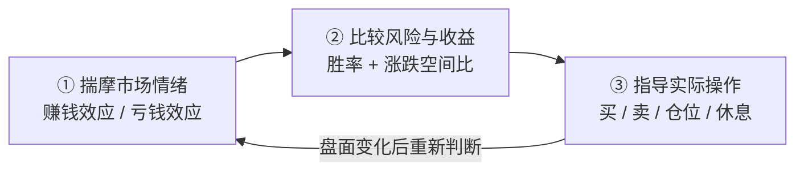

💡 **讲解**：大部分人炒股是“看图说话”，盯着 K 线、指标；养家是“看人说话”，盯着**市场上其他人此刻在想什么**。图形只是人心留下的脚印，他要读的是人心本身。

---

## 第 1 章 全景图：一张图看懂养家心法

先把整套体系摆出来，后面每一章展开其中一支。

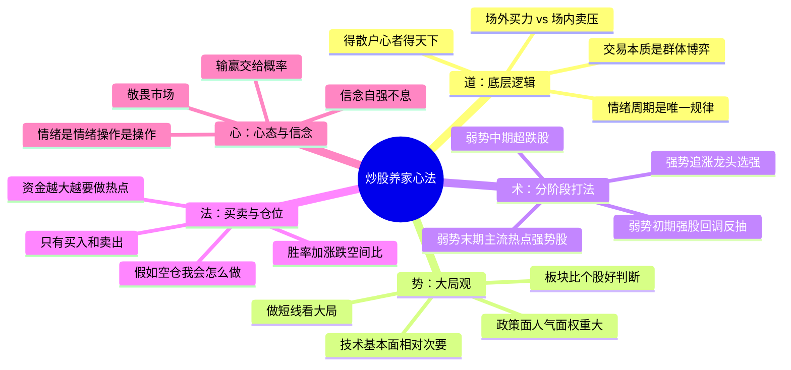

用“盖房子”来类比这五层（💡 讲解）：

| 层次 | 好比 | 回答的问题 | 对应章节 |
|---|---|---|---|
| 道（底层逻辑） | 地基 | 股价为什么涨跌？ | 第 3、4 章 |
| 势（大局观） | 选址 | 现在该进攻还是防守？ | 第 5 章 |
| 术（分阶段打法） | 户型 | 这个阶段该用什么招？ | 第 6、7 章 |
| 法（买卖与仓位） | 施工规范 | 怎么买、怎么卖、下多重？ | 第 8、9 章 |
| 心（心态信念） | 住的人 | 怎么不被自己的情绪坑？ | 第 10 章 |

原文里有一组浓缩口诀（p.2），可以当作整套体系的“目录”：

::: quote 浓缩口诀（p.2）
> 高手买入龙头，超级高手卖出龙头。
> 别人贪婪时我更贪婪，别人恐慌时我更恐慌。
> 敢于大盘低位空仓，敢于大盘高位满仓；心中无顶底，操作自随心。
> 永不止损，永不止盈。只有进场，出局。
> 得散户心者得天下；人气所向，牛股所在。
> 买入机会，卖出风险，只做对的交易，胜负交给概率，多一份淡定，少一分胜负心。
> 博弈，就是在动态的变化过程中，时刻寻求最优化的策略。
:::

> 💡 **讲解：“别人贪婪时我更贪婪”** 和巴菲特那句“别人贪婪时我恐惧”方向正好相反。按养家的逻辑（p.12）：人贪婪是因为赚了钱，赚钱效应弥漫的市场**机会多于风险**，所以该更积极；人恐慌是因为亏了钱，亏钱效应弥漫的市场**风险多于机会**，所以该更谨慎。他是**顺着**群体情绪走、并且比群体走得更坚决，不是对着干。不过他也说过“不刻意反向操作”（p.22），而且会在亏钱效应走到极致、恐慌盘宣泄完之后低吸超跌股（见第 6 章）。所以这句口诀讲的是**顺着情绪定仓位**，跟他在情绪拐点上的具体打法要结合起来看。

---

## 第 2 章 人物与心路：从 90 万亏到 40 万，再到 600 万

### 2.1 人物速写（p.1）

- 70 后，上海人，90 年代末入市。
- 2008 年开始职业炒股，起初从 90 多万亏到最低不到 40 万；同时要扛房贷、车子油钱、孩子奶粉钱。
- 后来“逐渐悟道”：2010 年 5 月资金到 200 万，9 月 300 万，11 月 400 万，2011 年 1 月 600 万，“资金曲线平滑上升”。
- 他在淘股吧（原文写作“淘县”）留下的多是“道”层面的讨论，很少谈具体技术。

*图 2-1：根据原文给出的几个资金节点画的示意图。“90 多万”“不到 40 万”取近似值，时间轴不等距。*

### 2.2 方法论的五次进化（p.3–4）

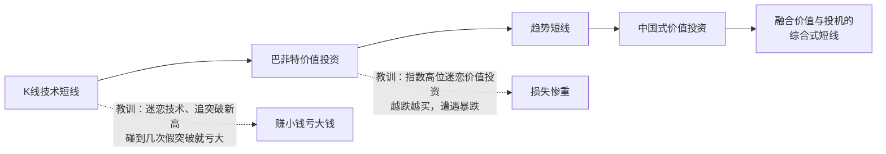

他踩过的两个大坑（p.3）：
1. **价值投资阶段**：在指数高位迷恋价值投资，越跌越买，结果遭遇暴跌，损失惨重。
2. **短线初级阶段**：迷恋技术，常买突破新高的股，“赚么赚点小钱，碰到几个假突破就亏大了”。

他学过的人（p.3、7）：唐能通、童牧野（在营业部见过面）、巴菲特、彼得·林奇、闽发论坛和淘股吧的好手，尤其是 **asking** 和 **职业炒手**，后两位是他的精神榜样。

### 2.3 他最想强调的两个字：信念

> 技巧性的东西，asking 和炒手基本都说了，我能反复强调的就是信念二字。（p.3）
> 亏钱不是做短线的错，刚开始学，水平不够，交点学费也是应该的，最可怕的是失去了信念。（p.21）

💡 **讲解**：这一章看着像人物传记，其实是在打预防针：**连他也亏过一半本金，而且这段亏损并不是靠技巧熬过来的，靠的是信念，再加上持续优化策略**。后面学到的任何方法，新手照做都可能先亏一阵，要有这个心理准备。

---

## 第 3 章 第一性原理：交易的本质是群体博弈

### 3.1 核心公式（p.4、12）

::: core 核心公式
> 交易的本质是群体博弈，追根溯源的话，就是随时衡量，**场外的潜在买入者的钱的数量和买入倾向**，与**场内筹码的数量和卖出倾向**，==当前者大于后者就买入，当后者大于前者就卖出==。
:::

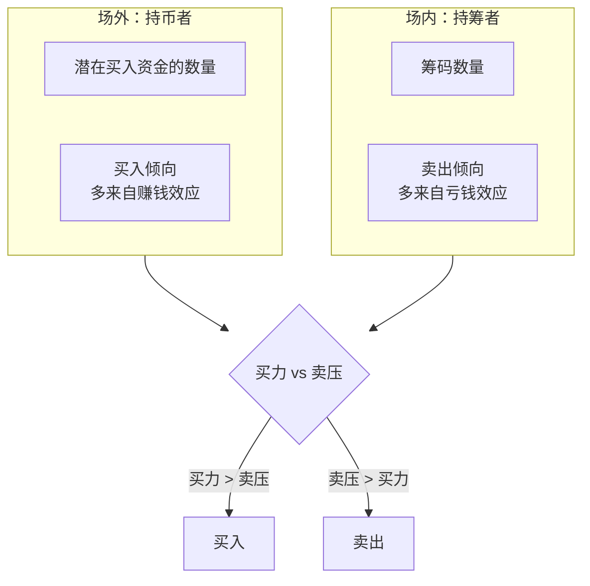

💡 **讲解（类比）**：把一只股票想成一辆公交车。场内的人是**车上的乘客**（筹码），场外的人是**站台上等车的人**（资金）。车上的人想下车，站台的人想上车，股价就是车票价格。站台上人多、想上车的心切，车上的人又不想下，票价就涨；反过来就跌。养家每天做的事，就是**估算站台上和车厢里的人数和心态**。

### 3.2 推理链：倾向从哪来？

| 力量 | 主要来源 | 原文 |
|---|---|---|
| 买入倾向 | 赚钱效应 | “买入倾向的推理，大多来自赚钱效应” |
| 卖出倾向 | 亏钱效应 | “卖出倾向的推理，大多来自亏钱效应” |
| 最终决策 | 再结合大盘、主流热点 | “操作是瞬间的，判断是动态的” |

### 3.3 弱势里的逆转时刻（p.12）

> 若行情偏弱，则相对有利于场外。有钱的在场外等更低的价格，有股的在场内等反抽，而一旦**场内人作出一致性止损**时，则是短期逆转机会。

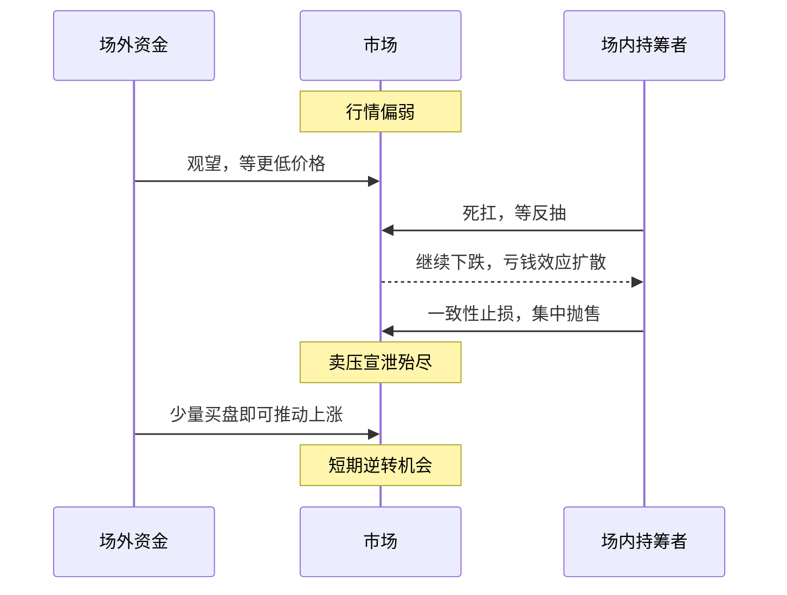

### 3.4 颠覆性观点：主力是散户（p.1、22）

> 得散户心者得天下；人气所向，牛股所在。
> 好的股票，主力是散户，而所谓庄家反而是跟风的。
> 很多人认为跟着大户买有赢面，那么大户又是跟着谁买呢？asking，他的选股思路却是大众情人。（p.21）

💡 **讲解**：“大众情人”的意思是**大多数短线资金都愿意去买的股票**。真正推动连板的是成千上万个散户的合力，大资金反而是顺着这股合力走。所以养家说：

> 我做跟随者，不做发动者。绝不是引导市场，而是跟随的更紧一点。（p.15）

### 3.5 为什么技术图形“相对次要”（p.5–6）

> 纯技术有其局限性，同一张 k 线图，在不同时期不同背景下，其背后所参与的投资者的心理状态也大不相同。同样的技术形态，后期的走势却可能完全不同。

> ⚠️ **坑**：追求“技术量化”。养家说自己“曾经让我大量的时间钻这个牛角尖”，并反问：“炒股若是这样可行的话，那些基金经理们应该比炒手们更有优势了。”（p.4）

---

## 第 4 章 情绪周期：赚钱效应与亏钱效应的轮回

### 4.1 规律只有一条

::: core 唯一的规律
> 如果说股市有什么规律的话，==这种情绪转变的过程就是规律==，而且可以预期的一千年内，这种规律亦不会有大的改变。（p.5）
:::

情绪转变的过程（p.4–5）：**酝酿 → 开展 → 逐步蔓延**，场内筹码的情绪从“下跌空间有限”转向“失望离场”；与此同时场外资金在慢慢积累；**情绪逆转那一刻**，资金又蜂拥而入，周而复始。

### 4.2 两个自我强化的循环（p.8、13–14）

养家把市场参与者分成两类：**喜欢追涨的人**和**喜欢抄底的人**。两类人都会因为赚钱而强化行为，因为亏钱而“自我惩罚”。

```mermaid
flowchart TB
    subgraph UP["追涨者循环"]
        U1["追涨赚钱"] --> U2["自信增加<br/>快速投入下一个品种"]
        U2 --> U3["影响周围人群<br/>甚至埋怨仓位太少"]
        U3 --> U4["热点有持续性<br/>行情推向高潮"]
        U4 --> U5["赚钱效应告一段落"]
        U5 --> U6["追涨接连失手<br/>资金大幅回落"]
        U6 --> U7["自我惩罚、反思<br/>减少操作"]
        U7 --> U8["强势股没有后继者<br/>补跌"]
    end
    subgraph DOWN["抄底者循环"]
        D1["抄底赚钱"] --> D2["继续抄底<br/>大盘难以大跌"]
        D2 --> D3["抄底开始亏钱"]
        D3 --> D4["自我惩罚<br/>减少抄底"]
        D4 --> D5["稍有卖压便无抵抗式下跌<br/>崩溃前兆"]
        D5 --> D6["直到卖出者无以为继"]
    end
```

> 这两种心理变化过程，不断循环往复，踏准了节奏，就能分辨出机会的大小，进而决定进出的仓位。（p.8）

### 4.3 情绪周期示意图

*图 4-1：情绪周期和各阶段打法的概念示意（教程绘制，不是真实行情）。具体打法见第 6 章。*

### 4.4 用情绪判断大势：几个可观察信号

| 信号 | 含义 | 原文 |
|---|---|---|
| 股神遍地 | 人气最旺 | “股神遍地的时候就是人气最旺的时候”（p.11） |
| 超跌品种稳住了 | 强势股机会大些 | p.8 |
| 超跌品种继续创新低 | 强势股补跌在即 | p.8 |
| 抄底的人开始减少，稍有卖压就无抵抗下跌 | 崩溃前兆 | p.14 |
| 连续上涨一段后的集体涨停 | 要特别小心 | p.18 |
| 连续下挫一段后的集体大幅下挫 | 左侧交易好时机 | p.18 |
| 市场整体交易量 | 好手仓位与之正相关 | “机会多时多操作，机会少时少操作”（p.25） |

> ==有赚钱效应的情况下，做热点为主。有恐慌效应的情况下，做超跌为主。==根据市场的赚钱效应和恐慌效应来判断大势。（p.8）

### 4.5 高一层的境界：用市场的情绪，而不是克服自己的情绪

> 市场很多人讨论的是如何克服贪婪和恐慌，虽然不错，但是着眼点仅在自身，难免局限。高手进出，买卖的一刻力求淡定，借助市场的贪婪和恐慌反过来指导决策，着眼点在整个市场，境界自然高了一层。（p.5）

> 茫然本身也是市场情绪的一部分，想办法跳出自身情绪，在更高的高度俯看市场情绪。（p.21）

💡 **讲解**：好比冲浪。新手老想着“别怕浪”，这是在克服自己；老手看的是“浪从哪来、多大、什么时候碎”，这是在借用海。你自己感到茫然，往往说明很多人也茫然，这本身就是一个情绪读数。

---

## 第 5 章 大局观：做的是短线，看的是更大的局

### 5.1 大局观是什么

> 大局观，这是道的范畴，尽量培养自己站在更高的高度看整个市场。单个个股走势本身有不确定性……把整个板块一起看就更容易理解，**政策面、技术面、基本面、资金面、人气面……等集合于一身时形成的共振**。（p.24）

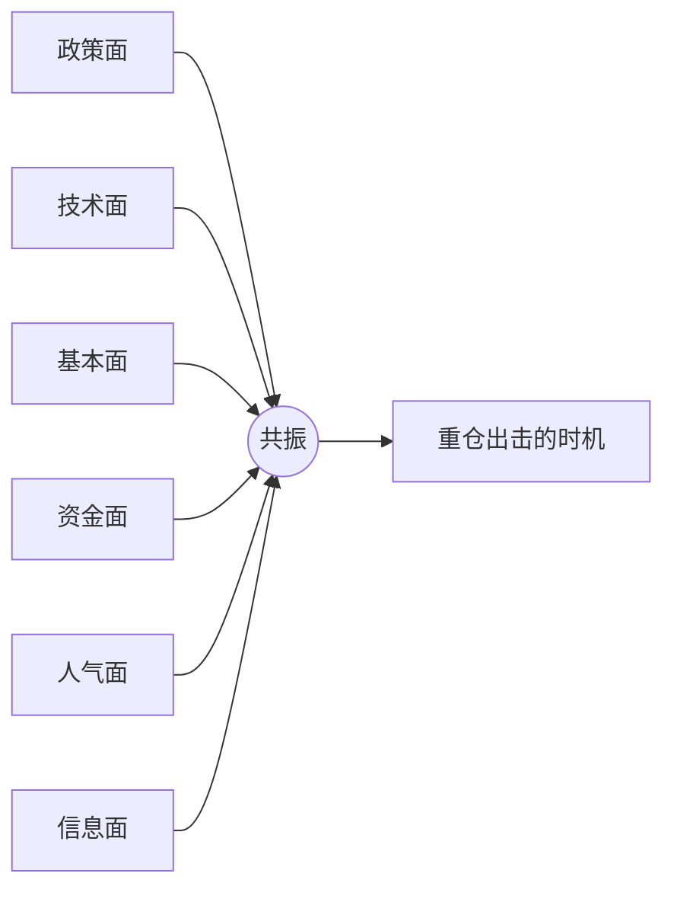

> 当政策、资金、技术、信息等各方面都较好的时候便是重仓出击博取利润的时机，如此往复不断复利。（p.24）

### 5.2 各因素权重（p.11）

| 因素 | 权重 | 原文要点 |
|---|---|---|
| 政策面 | **大** | 相对独立，市场会围绕政策反复炒作，“这是中国股市的特色” |
| 人气面 | **大** | 是一个循环过程，跟赚钱效应有关 |
| 技术面 | 相对次要 | “技术图形相对次要，对于市场情绪的把握才是重点” |
| 基本面 | 相对次要 | 到了一定阶段，“什么技术啊，基本面的都不重要” |
| 信息公告 | 考量因素之一 | “如果你对市场理解的不够深刻，光钻研这些也是徒劳”（p.24） |
| 成交回报 | 辅助 | 是股市资讯的一部分，“有助于心理分析”（p.12） |
| 外围股市 | 偶尔可用 | 外围很差有时会影响开盘，部分情况下可以“利用外围做反向操作”（p.26） |

### 5.3 从个股到板块再到大盘

> 通常一轮较大级别的反弹，其中会有一个龙头板块，而这个龙头板块的龙头个股往往有超预期的上涨。这个板块要求对大盘有号召力，而这个龙头也要求对这个板块有号召力。（p.11）

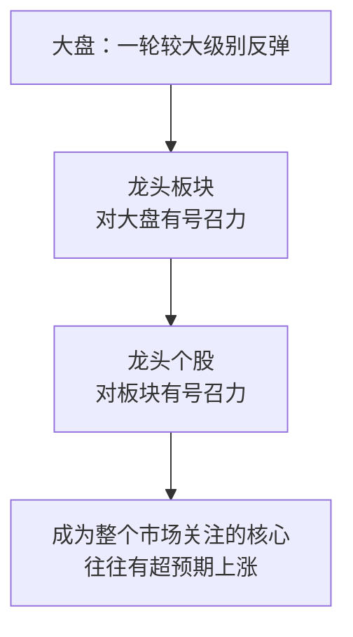

### 5.4 大盘与个股的四种组合（p.11）

| | 有强热点（高强度板块） | 没有热点 |
|---|---|---|
| **看好大盘** | 积极进攻 | 大盘涨势中相对风险小，找强势品种操作 |
| **不看好大盘** | 注重风险，但“如果有强热点，则仍可参与操作” | **“就多休息吧”** |

> 看天气，如果觉得要下雨了，就早点回家，不要贪玩，天气好了再出来，说简单点就是这样。（p.7）

### 5.5 判断为末，应变为本

> 看的是长线，做的是短线，如果判断错了，应变就是了……==判断为末，应变为本==。（p.12）
> 对于阶段的判断本身也是一个动态的过程，可能会错，但是好的策略，就是在判断错误的时候仍然可以占有一定的应变优势。（p.11）
> 在操作的那一刻，很多高手对于大盘的判断也是不确定的，是良好的操作策略使然。（p.14）

💡 **讲解**：养家没说自己能预测大盘，他说的是：**设计一种无论对错都留有退路的打法**。理想状态是（p.21–22）“如果大盘上涨，我的股票大涨，如果大盘下跌，我的股票不跌或者小跌，如此反复，积小胜为大胜。”

---

## 第 6 章 分阶段打法：强势、弱势初期/中期/末期

这是整份语录里**最能直接上手**的一部分。

### 6.1 总口诀

::: core 分阶段总口诀
> **强势市场追涨龙头，弱势市场低吸回调，格局转换预先埋伏可能炒作的热点。**（p.9）
> **弱势初段低吸止损，弱势中段低吸崩溃，弱势末段追涨强势。**（p.16）
:::

### 6.2 阶段判断与打法流程

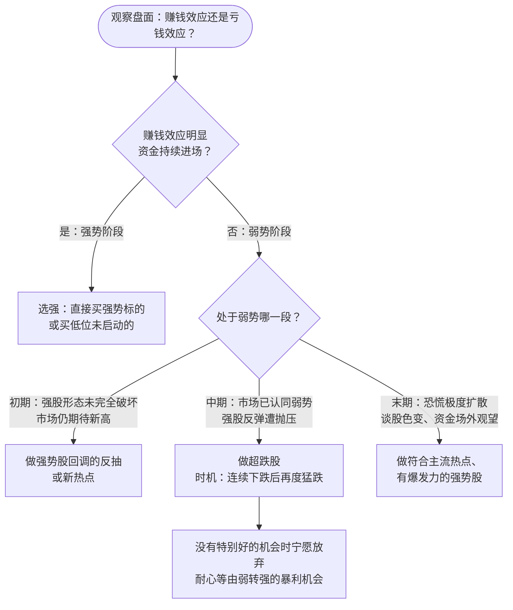

### 6.3 分阶段对照表

| 阶段 | 市场特征（原文） | 买股逻辑 | 选什么 | 出处 |
|---|---|---|---|---|
| **强势** | 赚钱效应下资金不断进入 | 强的标的被后来资金选中的概率大 | 最强的龙头，或低位未启动的 | p.5、9 |
| **弱势初期** | 强股形态未完全破坏，市场仍期待新高 | 强势股之前有号召力和人气，回调较大 | 强势股回调反抽、新热点 | p.9–10 |
| **弱势中期** | 市场认同弱势；超跌股伴随崩溃盘，抛压稍缓 | 少量买盘就能推动超跌股反弹 | 跌得最惨的股 | p.10 |
| **弱势末期** | 恐慌极度扩散、谈股色变，大量资金场外观望 | 会出来一个有持续性的热点领导上涨 | 主流热点里有爆发力的强势股 | p.10 |

### 6.4 弱势里的买点：宁愿慢三分

> 下跌期的操作，绝大多数买入是**等大阴线后，第二天再探底的时候**。难点在于对时机的把握，过早介入容易吃套，所以原则上==**宁愿慢三分**==。（p.10）

**超跌出击时刻（p.8）**：两个条件同时满足。

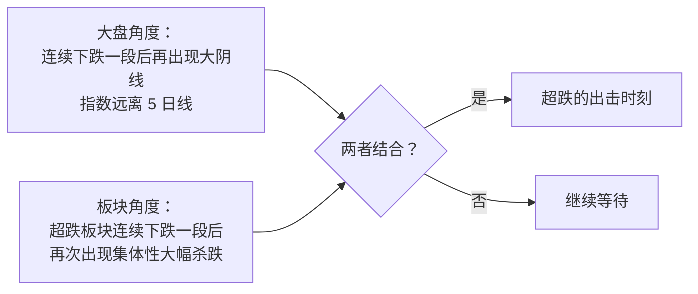

### 6.5 资金级别不同，打法也不同（p.7）

> 小资金阶段，下跌初期仍可以积极进攻，随着资金的增大，犯错的成本也随之加大，在确认下跌后，倾向于防守。市场弱势时自然机会就少，市场强势时，60% 以上赢面的机会较多。

> 💡 **讲解：为什么“下跌末期追强势”反而对？** 直觉上大跌之后该买最便宜的。但养家看的是**资金的情绪**：观望已久的游资“心中那份被隐藏多日的激情又会被重新点燃”（p.10），新一轮行情的领涨热点会吸走最多资金，所以“好的策略就是把筹码放在最有爆发力的个股上”。

---

## 第 7 章 选股与买点：热点、龙头、切题、打板、超跌

### 7.1 选股范围只有两类（p.21）

> 选股而言，要么是**当前的热门**，要么是**预判会成为热门**的品种。

> 符合主流热点的新故事是赚大钱的机会。==**热点来自题材，持续性来自赚钱效应。**==（p.16）

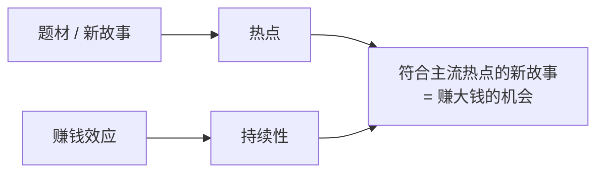

### 7.2 两种介入方式（p.16、26）

| 方式 | 做法 | 适用 |
|---|---|---|
| 提前预判埋伏 | 格局转换时，预先埋伏可能炒作的热点；可选低价或超跌的 | 有预判能力时 |
| 盘中追击 | 热点确认后追最强的 | 热点明确时 |

> 随机应变为主。各种因素形成共振的那一刻，就相对选择重仓出击。（p.26）

### 7.3 “切题”原则

> 如果是追龙头，那么追最强的，如果是潜伏，那么可以选择低价的或者超跌的，但是一定要切题，既然有确定是 xxx 概念的，为什么还要选应该、可能是 xxx 概念的呢。要在拉升的那一刻，==**市场一眼就知道它是什么概念**==，这样才能吸引跟风的。（p.9）

💡 **讲解**：好比开餐厅，招牌上写“川菜”，大家一看就进来；写“可能有点辣的融合菜”，路人就犹豫了。短线资金只有几秒钟做决定，**题材辨识度就是吸引跟风盘的能力**。

### 7.4 买龙头还是买跟风？（p.18）

| 选择 | 养家的理由 |
|---|---|
| 买龙头 | 不是因为胆子大，而是根据**板块整体动能**，龙头应有相应溢价，而股价**尚未反映溢价**时介入 |
| 买跟风 | 不是因为胆子小，而是龙头赚钱效应十足，部分跟风品种尚处低位，随时可能被龙头激发 |

> 我们这个市场，有大量的短线客，做短线的想的都是要做龙头，只要被市场确定为龙头，卖给谁就不再是问题。要买的人很多，筹码有限，所以就造成连续涨停的结果。（p.16）

但养家同时提醒（p.27）：
> 所谓的龙头理论实际并不科学……在我看来没有永远的龙头，虽然买龙头是一种方法，但是**想办法卖出龙头才是更高的境界**。

### 7.5 打板（板上买票，p.20）

- 板上买票“基本占了本人操作的一半”。
- 纯 K 线技术的打板，统计胜率约 45%，简单追龙头模式胜率也差不多，“大致于澳门赌场”（p.27）。所以**打板看的是市场环境和热点，不是图形**。
- **3～5 板原则**：“==重仓买入的一刹那要有后市还有 3 到 5 个涨停空间的判断==。一只股票如果你没有后市 3-5 涨停空间的判断，那么一个板也不要重仓买入。”
- 指标：“除了成交量，基本什么指标都不看。成交量，主要是看成交量的变化。”成交量再结合价格变化，“揣摩场内和场外人心的变化”。

### 7.6 其他买点要点

| 场景 | 要点 | 出处 |
|---|---|---|
| 尾盘买股 | 买预期热点第二天能持续的品种，前提是判断热点的持续性 | p.11 |
| 突破买入 | “还处在见招拆招的阶段”，应追求“未出招已应招”，想想能不能更早下手 | p.4 |
| 不知道为什么涨的股 | 找原因，找不到就不管，“赚自己看得懂的钱就够了” | p.11 |
| 只有技术形态好、没有逻辑支撑 | “就算买，也只能轻仓，放弃也不可惜” | p.16 |
| 次新股 | 弹性大，历来是大盘反弹阶段大幅炒作的对象；一旦转入风险区，相对风险成倍增加，属于高风险高收益 | p.26 |
| 个股行为的强势票 | 不确定性较大；板块性行为大体有规律，可以耐心总结 | p.17 |
| 买前自问 | “往上敢不敢看 30% 的空间，往下敢不敢越跌越买”，都是肯定才买 | p.23 |

> 💡 **注意**：“往下敢不敢越跌越买”是买前用来检验信心的问题，不是让你真的去越跌越买。养家第 2 章那次“越跌越买”的价值投资损失惨重，第 8 章还会讲到他反对亏钱后“赌徒式加码”。

---

## 第 8 章 卖出与持仓：没有“止损”，只有买入和卖出

### 8.1 永不止损，永不止盈

> 在我的操作模式里面，从来没有“止损”这两个字。（p.23）
> 股票操作只有买入和卖出，没有止损和割肉。（p.16）
> 如果你还有补仓或者止损的想法，就说明你的心里还有**成本这个障碍**，好的操作，应该是最简单的，只有买入或者卖出。（p.17）

> ⚠️ **别误会**：这**不是**“亏了也死扛”。恰恰相反：
> > 止损，不看好了就卖出，管它是不是止损。因为简单，所以果断，最忌自己都不看好了，只是因为套了几个点，还在犹豫。（p.19）
>
> 意思是：==**卖出的依据只看对未来的判断，不看买入成本**==。所以“止损”“止盈”这两个以成本为参照的词就用不上了。

### 8.2 核心工具：“假如我现在空仓”测试（p.19、27）

::: core 持仓犹豫时只问一句
==忘记成本，问自己：如果我现在空仓，会怎么做？==
:::

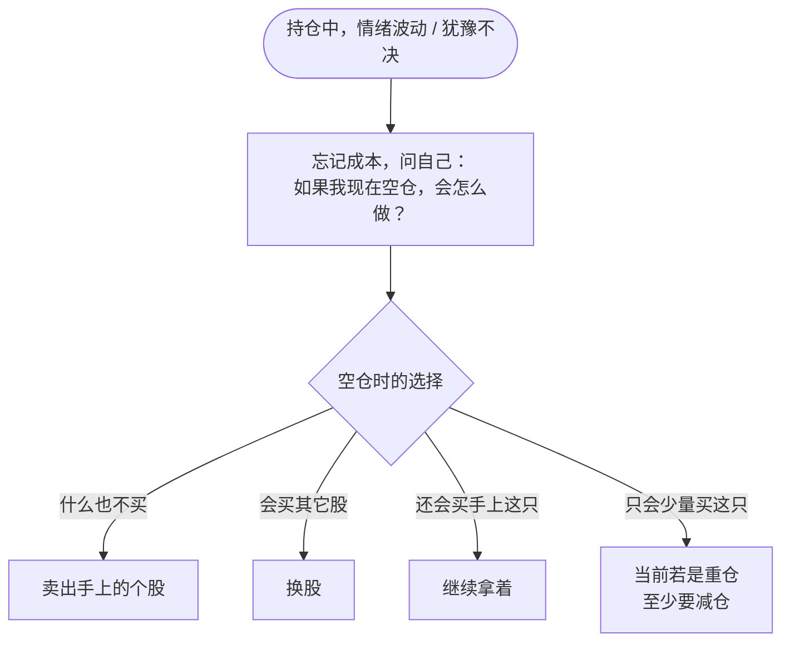

这是全书最具操作性的工具之一，原文还补了一个**量化要求**（p.27）：“如果空仓也只是考虑少量买自己手上的股的话，那么至少现在是重仓的话也要减仓。”

### 8.3 其他卖出与持仓原则

| 原则 | 原文 | 出处 |
|---|---|---|
| 高点买入遇大跌不要“拿中线” | 那是心理障碍，“不愿意认输……虚荣心在作怪，操作上应该用理性来应对” | p.11 |
| 不为解套错过机会 | 卖出后重新审视市场捕捉新机会，“不必为了所谓的解套而错失其它的机会” | p.16 |
| 失手就卖 | “重仓出击，务求完胜，一旦失手，卖出重来” | p.18 |
| 被套也不慌 | “如果市场一定要连续下跌让我亏一笔钱也无妨，等反抽卖出就是了” | p.15 |
| 做 T 不刻意 | 机会大时买、风险大时卖，恰好发生在同一天同一只股上才叫做 T，“不要刻意为了做 T 而做” | p.22 |
| 看到不良信号 | 个人偏保守，“发现盘面不良信号倾向于退出观望” | p.17 |

---

## 第 9 章 仓位与赢面：胜率 × 涨跌空间比

### 9.1 赢面 = 胜率 + 涨跌空间比（p.26）

::: core 满仓的两个条件
> 赢面包括胜率和涨跌空间比。譬如满仓出击时，对我来说必须满足以下两个条件才会做这样的决策，一方面是==**胜率要求 90% 以上**==，另一方面是……==**上涨的空间至少要看到 30%-50% 以上，而下跌的空间应该在 3%-5% 以内**==。
:::

*图 9-1：左边是胜率对比（约 45% 来自原文对纯技术打板的统计说法），右边是满仓时要求的涨跌空间。数字都出自原文。*

> 💡 **讲解（教程演算，非原文）**：按期望值粗算，假设胜率 90%、赢时 +30%、输时 -5%，单次期望约为 0.9×30% − 0.1×5% = **+26.5%**。再看胜率 45% 的打板，如果赢亏幅度相同，期望就是负的。这就是养家把纯技术打板比作赌场的原因。

### 9.2 根据胜率决定下注轻重

> 根据胜率的百分比，决定下注仓位的轻重。（p.17）
> 经历 n 次失手后，大致知道出击的成功率。（p.18）
> 做短线，盈亏比很重要，权衡风险和收益，做出相应的决策。（p.16）
> 仓位，让自己觉得舒服就可以。（p.16、17）

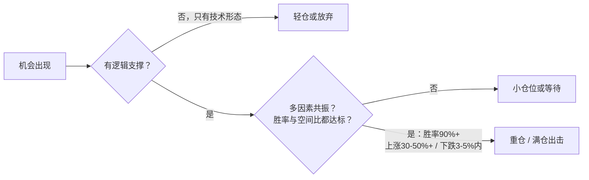

### 9.3 重仓节奏（p.7、16）

> 重仓出击相对少些，平均一年 10 几次左右，其中 4-5 次 10% 以上的获利包括 1-2 次 20% 以上，亏损 10% 控制在 1 次或杜绝。……反应在收益率曲线上，就是平时稳攀升为主，偶尔跳跃式上扬，极少大幅回落。

> 一年把握 4-5 次重仓必杀，再加上平时小机会累计，翻番自然不是问题。（p.16）

*图 9-2：养家自述的重仓节奏。原文注明“没有具体统计过，感觉大致如此”。*

### 9.4 资金规模与打法（p.18、22）

| 资金级别 | 打法 |
|---|---|
| 百万以下 | 操作方式多种多样，“高接低挡不亦乐乎”，一买一卖鼠标点一下 |
| 百万级 | 放弃一些左侧交易模式，选有**板块热点保护**的品种为主 |
| 千万级 | 冲击成本大增，学会**分仓**，放弃一些个股性机会，**操作热点为主** |

> 资金大了必然增加冲击成本……本来可能亏 2-3 个点结束的操作，要变成 5-6 个点的损失，更有较长的卖出时间，从而影响其它品种的操作，小资金相对灵活的多，来去自如。（p.22）

### 9.5 控制回撤 = 回避系统性崩溃

> 控制回撤，最重要的就是回避系统性崩溃风险，事实上绝大部分崩溃都有前兆，从赚钱和亏钱效应的演变过程可以进行推断，不过为此可能也会放弃很多机会。（p.7、25）
> 短线好手几乎不会出现季度性亏损，盈利从杜绝亏损开始。（p.9）
> 衡量一个职业选手最重要的指标就是盈利的稳定性。（p.20）==稳定的复利才是职业炒股的根本。==（p.21）

### 9.6 为什么不碰股指期货（p.16、20）

股指期货容错率低：股票炒手的优势是判断热点，大盘判断错了也未必亏钱；股指期货判断错了就是亏钱，加上杠杆会影响心态，心态又反过来影响操作。养家还提到，asking、炒手、just999 等实盘高手在股指期货上也不乏亏损，说明“即便无法判断日内高低点，亦可把股市作提款机”。

---

## 第 10 章 心态与信念：情绪是情绪，操作是操作

### 10.1 三条心法

::: core 三条心法
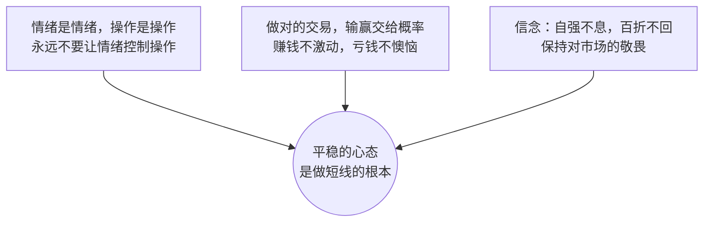
:::

### 10.2 原文要点

- **概率观**：“只要系统没有问题，赚钱不值得激动，因为那是概率，亏钱也不必懊恼，因为那是概率。”（p.16）“股票操作是科学，做对的操作就可以了，输赢交给概率。”（p.15）
- ⚠️ **最大忌讳**：“==在买卖受损时赌徒式加码，亏钱了就急于翻本，乱操作一气，容易错上加错，后果严重==。”（p.19）
- **知易行难**：“当时机不成熟或者市场对自己不利时，理性地面对风险，当机会来临时，全力拼取。这句话理解不难，做到却不易，很多人往往因为亏钱就想着急于扳回，一再对抗风险，机会来临时却又麻木于自己深套中的个股。”（p.6，原文多次重复）
- **判断不一致时**：“当市场的发展和自己的判断不一致时，要重新审视，越是关键时刻，越要冷静处理。”（p.6）
- **心态从哪来**：“股票做好了，能实现稳定盈利，心态自然也就不是问题了。”（p.22）
- **先过心理关**：“先克服心理障碍，之后多操作，多思考，概率会告诉你以后应该怎么做，如果不能克服心理障碍，再多的失败也不能转化为经验。”（p.17）
- **简单化**：“操作应简单化，想的太多临盘难免犹豫”；“有些人早上起床要闹铃，有些人不需要，因为已经成为习惯。”（p.20）
- **放下错过**：“重要的不在于错过了什么，在于当下应该把握什么。”（p.21）
- **敬畏**：“过去的稳定增长也好，只代表过去，还是让未来的来检验吧，时刻保持对市场的敬畏之心。”（p.25）
- **自知**：“我是风险极度厌恶型。”（p.14）“擅于做短线的人，应该清楚自身的特点，寻找出适合自己的方法。”（p.6）

### 10.3 短线需要的综合素质（p.6、23）

| 素质 | 说明 |
|---|---|
| 冷静理智的心理 | 情绪不干扰操作 |
| 良好的大局观 | 看更大的局 |
| 完善的交易系统 | “要有一套适合自己的有效系统，然后坚决执行”（p.14） |
| 具体操作方法 / 信念 | p.6 写的是“具体操作方法”，p.23 写的是“信念” |

> 事实上，如果不考虑情绪，而只是纯技术的话，我现在的水准不支持可以在股市上获得稳定盈利。（p.23）

---

## 第 11 章 实战演练：每日流程、情景题与检查清单

> 本章是教程作者把原文原则**编排成可执行的流程和练习**，每一步都标了原文依据。情景题是虚构的练习场景，不是原文案例。

### 11.1 每日决策流程

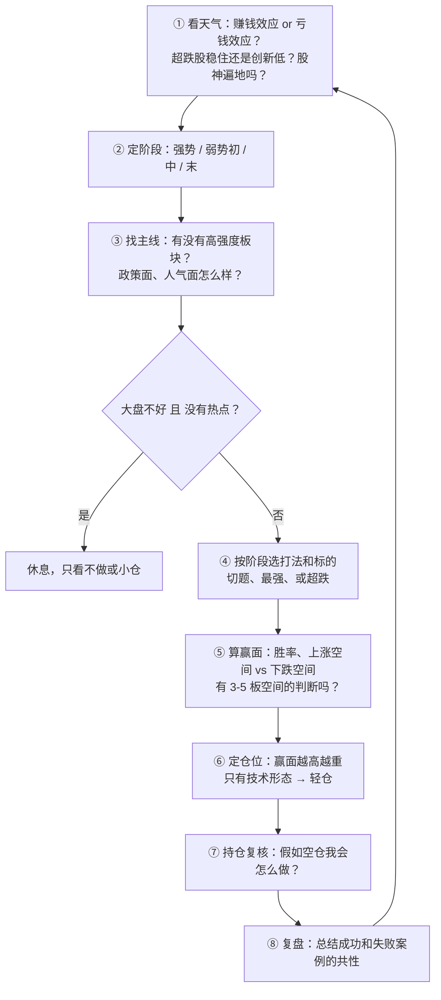

依据：①④ p.7–8、11；② p.9–10；③ p.11、24；⑤ p.20、26；⑥ p.16–17；⑦ p.19、27；⑧ p.4、21。

### 11.2 原文里的“预判—试错—确认—加仓”节奏（p.20）

> 理念的东西，简单说就是把握市场热点，实际操作中，预判、试错、确认、加仓等。赚该你赚的那部分就可以了，不必过于拘泥。万事俱备的时候，东风一吹，才是行动的时刻。

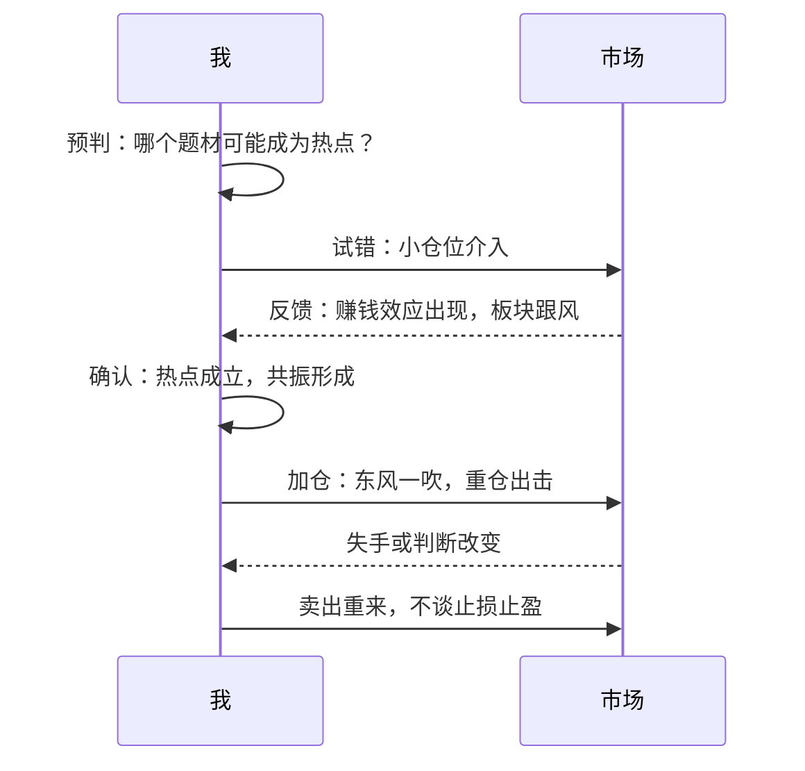

### 11.3 情景练习（先自己想，再看参考思路）

**情景 1**：你持有一只股，买在高位，已经套了 8%。今天板块继续走弱，你心里想“再等等，回本就走”。

参考思路

- 用“假如空仓”测试：如果现在空仓，你会买这只吗？不会，那就卖出（p.27）。
- “最忌自己都不看好了，只是因为套了几个点，还在犹豫。”（p.19）
- “不必为了所谓的解套而错失其它的机会。”（p.16）
- 高点买入遇大跌就“拿中线不动”，是虚荣心在作怪（p.11）。

**情景 2**：大盘连跌两周，今天又是一根大阴线，指数远离 5 日线；你关注的一个超跌板块今天集体大幅杀跌。

参考思路

- 大盘和板块两个超跌条件同时满足，是“超跌的出击时刻”（p.8）。
- 买点通常是“等大阴线后，第二天再探底的时候”，“宁愿慢三分”（p.10）。
- 如果市场已认同弱势（中期），选“跌得最惨的股”；没有特别好的机会时宁愿放弃（p.10）。

**情景 3**：市场热闹，身边人都在晒收益，一个新题材今天有三只股涨停。A 是正宗概念股，已经两板；B 号称“可能沾边”，还没怎么涨。

参考思路

- 强势阶段选强：强的标的被后来资金选中的概率大（p.5、9）。
- 切题：“既然有确定是 xxx 概念的，为什么还要选应该、可能是 xxx 概念的呢？”（p.9）A 优于 B。
- 重仓前问自己：有没有后市 3～5 个涨停空间的判断？没有就一个板也不重仓（p.20）。
- 同时注意：“股神遍地的时候就是人气最旺的时候”（p.11）；连续上涨一段后的集体涨停要特别小心（p.18）。

**情景 4**：大盘不好，也看不到任何持续性热点。你手痒，想做点什么。

参考思路

- “如果既不看好大盘，又没有热点，就多休息吧。”（p.11）
- “要下雨了，就早点回家。”（p.7）
- 老手不做光看也能感受市场变化；新手可以小仓试，“多亏些或许能增长点经验”（p.17）。

**情景 5**：你连续三笔亏损，想下一笔加倍仓位把钱赢回来。

参考思路

- 这正是原文说的“最大的忌讳”：赌徒式加码、急于翻本（p.19、25）。
- 仓位应该看下一个机会的胜率和空间比，跟之前亏了多少无关（p.17、26）。
- 亏损经验要用来优化策略（p.21）。

### 11.4 交易前检查清单（可打印）

**大势**
- [ ] 当前是赚钱效应还是亏钱效应占主导？
- [ ] 超跌品种是稳住了，还是继续创新低？
- [ ] 处在强势 / 弱势初 / 中 / 末哪个阶段？我的打法对得上吗？

**标的**
- [ ] 它是当前热门，或者是我有理由预判会成为热门的吗？
- [ ] 题材是否“切题”，市场能不能一眼认出它是什么概念？
- [ ] 它是板块里最强的（追龙头），还是低位有补涨潜力的（跟风或潜伏）？
- [ ] 我知道它为什么涨吗？不知道就放弃。

**赢面与仓位**
- [ ] 有逻辑支撑，还是只有技术形态？（只有形态 → 轻仓）
- [ ] 往上敢看 30% 吗？重仓的话，有 3～5 个板空间的判断吗？
- [ ] 胜率和涨跌空间比够不够当前这个仓位？

**持仓复核**
- [ ] 如果现在空仓，我还会买它吗？买多少？
- [ ] 我是不是在因为成本或解套犹豫？
- [ ] 我是不是因为前面亏了想加码翻本？

### 11.5 复盘模板

| 日期 | 阶段判断 | 主线热点 | 操作 | 依据（赚钱/亏钱效应、共振） | 结果 | 成功或失败共性 | 能否更早下手？ |
|---|---|---|---|---|---|---|---|
| | | | | | | | |

依据：“多思考和总结自己成功例子的共性和失败例子的共性，成功的例子里面再思考能不能更早一点下手，未必要等突破以后。”（p.4）

---

## 第 12 章 十大误区避坑指南

| # | 误区 | 养家的说法 | 出处 |
|---|---|---|---|
| 1 | 指数高位迷恋价值投资，越跌越买 | 结果遭遇暴跌，损失惨重 | p.3 |
| 2 | 迷恋技术、追突破新高 | 赚点小钱，碰到几个假突破就亏大了 | p.3 |
| 3 | 追求技术量化 | 钻牛角尖；真可行的话，基金经理比炒手更有优势 | p.4 |
| 4 | 只盯着克服自己的贪婪恐慌 | 着眼点仅在自身；应借市场的情绪指导决策 | p.5 |
| 5 | 被套后拿成中线 | 不愿认输、虚荣心作怪 | p.11 |
| 6 | 心里还有成本、补仓、止损 | 好的操作只有买入或卖出 | p.17 |
| 7 | 亏钱急于翻本、赌徒式加码 | 最大忌讳，错上加错 | p.19 |
| 8 | 迷信龙头理论、纯技术打板 | 胜率约 45%，大致相当于赌场；没有永远的龙头 | p.27 |
| 9 | 觉得跟着大户买就有赢面 | 大户又跟谁买？要选“大众情人” | p.21 |
| 10 | 抄实盘、看高手操作 | 不知道操作那一刻的想法；“功夫未到时，你即使看了全部实盘，也不能了解” | p.19 |

一个真实对照（p.27）：
> 我有个朋友也做短线，追龙头为主，刚开始大家都是几十万，行情好的时候，他主动和我比收益率，经常超过我，行情不好的时候就听不到他的声音，现在他还是几十万。

💡 **讲解**：这个故事说明的就是第 9 章那句话：衡量职业选手最重要的是**盈利的稳定性**，不是行情好时的峰值收益。

---

## 第 13 章 总结与金句速查卡

### 13.1 一张图复盘全书

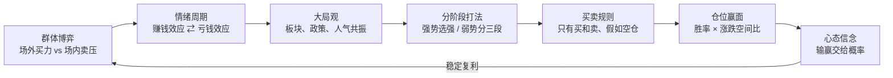

### 13.2 五句话记住养家

1. **看人不看图**：交易是群体博弈，读懂场内外资金的心理，比读懂 K 线重要。
2. **情绪是唯一的规律**：赚钱效应吸引资金，亏钱效应赶走资金，循环往复。
3. **阶段决定打法**：强势追涨龙头；弱势初期做回调反抽，中期做超跌，末期做新主流强势股；没热点就休息。
4. **只问未来，不问成本**：只有买入和卖出；拿不准时问“假如我空仓会怎么做”。
5. **重仓要苛刻，心态要淡定**：满仓要胜率 90%+、上涨 30～50%、下跌 3～5%；做对的事，输赢交给概率。

### 13.3 金句速查卡

| 主题 | 金句 | 页码 |
|---|---|---|
| 心法定义 | 基于对市场情绪的揣摩，进而判断风险和收益的比较，并指导实际操作 | p.2 |
| 龙头 | 高手买入龙头，超级高手卖出龙头 | p.2 |
| 人气 | 得散户心者得天下；人气所向，牛股所在 | p.2 |
| 博弈 | 博弈，就是在动态的变化过程中，时刻寻求最优化的策略 | p.2 |
| 规律 | 情绪转变的过程就是规律，一千年内亦不会有大的改变 | p.5 |
| 主动 | 掌握市场之心，胜利接踵而至；心被市场掌握，失败连绵不绝 | p.5 |
| 天气 | 觉得要下雨了，就早点回家，天气好了再出来 | p.7 |
| 应变 | 判断为末，应变为本 | p.12 |
| 跟随 | 我做跟随者，不做发动者 | p.15 |
| 热点 | 热点来自题材，持续性来自赚钱效应 | p.16 |
| 价值观 | 价值投资=短线投机，区别只在于操作的时间区间和对价值的认知 | p.19 |
| 超短 | 波段不确定性很大，超短才是相对确定的 | p.21 |
| 复利 | 稳定的复利才是职业炒股的根本 | p.21 |
| 心法 | 天下武功唯快不破，天下股市唯心法不破 | p.22 |
| 模式 | 追涨也好，低吸也好，问题不在模式，而在何种阶段应用，以及火候 | p.22 |
| 职业门槛 | 股市收入能超过开销；收益至少跑赢最优秀的公募基金和大多数私募；志向远大，操作稳健 | p.26 |

### 13.4 学习路线建议（💡 教程建议）

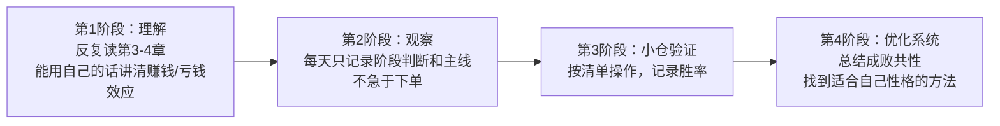

::: warn 原文编辑者的忠告（p.28）
一定要建立与自己性格、天赋相匹配的交易系统；==在无法稳定盈利的情况下，不要投入过多资金==。
:::

---

## 附录 原文结构与页码索引

| 页码 | 主要内容 |
|---|---|
| p.1 | 人物介绍：经历、资金曲线、“上士闻道”引语 |
| p.2 | 心法定义与核心口诀；职业初期困境 |
| p.3–4 | 方法演变、信念；群体博弈本质；突破买入的局限 |
| p.4–6 | 情绪转变规律；强势选强、弱势低吸；技术局限；短线综合素质 |
| p.7 | 资金级别与策略；重仓频率；控制回撤；看天气 |
| p.8 | 超跌度的把握；赚钱效应的展开 |
| p.9–11 | 分阶段打法（强势、弱势初中末）；龙头板块；尾盘；政策面与人气面 |
| p.12–14 | 群体博弈再述；追涨者与抄底者的心理循环；风险收益衡量 |
| p.14–17 | 系统与执行；跟随者；买入卖出；盈亏比；股指期货；补仓与止损；仓位 |
| p.18–20 | 资金规模；龙头与跟风；价值投资=短线投机；忘记成本；打板与 3–5 板空间 |
| p.21–23 | 大众情人；选股范围；稳定复利；冲击成本；主力是散户；买前自问 |
| p.24–26 | 大局观与共振；阶段与节奏；职业门槛；次新股；满仓条件 |
| p.27 | 假如空仓法；打板胜率 45%；龙头理论不科学；朋友的故事 |
| p.28 | 编辑者忠告；30 篇系列目录截图（推广内容） |

**说明**：
- 原文是论坛语录汇编，不少段落重复出现（比如“买入倾向的推理”“当时机不成熟……全力拼取”），本教程已合并去重。
- p.28 的图片是同系列 30 篇语录的文件列表截图，附带付费领取的推广信息（加微信、30 元），跟心法本身无关，所以本教程没有收录，也不做推荐。
- 原文有个别错别字或口语化表达（如“淘县”应为淘股吧，“宣泄怠尽”应为“殆尽”，“如何我现在是空仓”应为“如果”，“大致于澳门赌场”应为“大致等于”，“建立立即退出”应为“建议立即退出”，“已经成为惯”应为“习惯”），引用时保留原意，个别地方顺手改正了。
