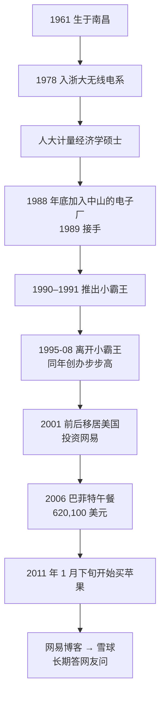

# 段永平 ①：人物与足迹——小霸王、步步高、网易与 fastisslow

::: summary 一页读懂
1. **身份**：段永平，1961 年生于江西南昌，浙江大学无线电系 1978 级，中国人民大学计量经济学硕士。先做企业（小霸王、步步高），2001 年前后移居美国后以投资为主。
2. **做企业**：他自己在雪球上说，1988 年底加入中山一家亏损的电子厂，1989 年三月前后接手，1990–1991 年推出“小霸王”，1995 年 8 月离开，同年在东莞创办步步高。
3. **投资网易**：他说当年投网易“几个月赚了二十几倍，而且我是全仓的”，并强调这种事“不会”再来一次，“因为你碰上了”。
4. **巴菲特午餐**：2006 年他用 eBay 账号“fastisslow”拍下与巴菲特共进午餐的机会，成交价 620,100 美元，款项捐给慈善机构。
5. **雪球“大道无形我有型”**：他在网易博客（2018 年关闭）和雪球上长期回答网友问题，是本系列最主要的一手来源。
:::

::: note 阅读说明与免责声明
本系列优先引用段永平本人在雪球（账号“大道无形我有型”）和网易博客上的文字，以及公开访谈。雪球原帖经第三方索引站“阿段笔记”（learnduan.com）按日期和链接检索；雪球站点本身对本文的抓取有访问限制，原帖未能逐条直接打开核对。网易博客已于 2018 年关闭，引用时只注日期。各类《段永平投资问答录》等汇编本里的话，如未找到原帖，一律标为待考。本文不构成任何投资建议。

本系列共 3 篇：① 人物与足迹 · [② 本分、平常心与不为清单](/reading/duan-2-benfen.html) · [③ 看生意](/reading/duan-3-business.html)。相关系列：[巴菲特系列](/reading/buffett-1-life.html) · [芒格系列](/reading/munger-1-life.html)。
:::

## 1. 一张简历

| 项目 | 内容 |
|---|---|
| 出生 | 1961 年 3 月 10 日，江西南昌（维基百科） |
| 学历 | 1978 年入浙江大学无线电系；后读中国人民大学计量经济学硕士 |
| 小霸王 | 本人说法：1988 年底加入，1989 年三月前后接手亏损的工厂，1990–1991 年开始推小霸王，1995 年 8 月离开 |
| 步步高 | 1995 年在广东东莞与陈明永、沈炜等人创办（维基百科） |
| 移居美国 | 2001 年前后，此后以投资为主 |
| 手机 | 后来的 OPPO、vivo 由步步高体系的团队创办，他是投资人，不管具体事务（维基百科） |
| 雪球 | 账号“大道无形我有型”，长期回答网友提问 |

关于自己，他在 2021 年的一条雪球回复里说：“大道确实是个普通人”，高考虽然算是小考区状元，但进浙大时班里 35 个人排第 18，读人大研究生时排 25 个人里的第 25。他总结自己有用的东西是“理性，想长远，stop doing list”（雪球 2021-06-28）。

::: warn 一处常见错误
不少资料（包括中文维基百科）写小霸王“1987 年由段永平创立”。他本人在雪球上纠正过：“始创”1987 年的是日华电子厂，“我是 1988 年底加入，1989 年大概三月接手这个烂摊子……大概 1990-1991 年才开始推的小霸王。1995 年 8 月离开。”（雪球 2024-02-14）==本文以本人说法为准。==
:::

## 2. 时间线

*图：按段永平雪球回复、路透社 2006 年报道和维基百科整理。*

## 3. 做企业：小霸王和步步高

他对小霸王时期的评价很直接：“我在的时候小霸王其实很厉害的，95 年的时候利润应该比联想或者海尔高，而且没债务。”（雪球 2024-11-14）

离开小霸王后创办的步步高，后来成了他讲“本分”和“stop doing list”最常用的例子。有网友请他举一个不做的事情，他说：

> “我们stop doing list上很多事情都是有例子的。记得有次和台湾做代工的一个大佬吃饭聊天，他也问到为什么你们这么厉害，我说因为我们有个‘stop doing list’……比如我们不做代工。他马上问：为什么？我说，如果我们做代工的话很难和你们竞争哈。”（雪球 2019-06-17）

步步高体系的经营方法，他在网易博客里总结过一句：“我们的秘诀其实就是：本分+平常心”（网易博客 2016-10-12）。这两个词是 [② 本分与平常心](/reading/duan-2-benfen.html) 的主题。

## 4. 投资网易：全仓与运气

段永平最出名的一笔投资是 2001 年前后的网易，当时网易股价很低。他自己的说法有两处：

- “当年买网易的时，第一年涨了 20 多倍”（雪球 2019-10-01）
- “我当年投网易也是几个月赚了二十几倍，而且我是全仓的，人家说你真厉害，你再来一次！我说这个不会，因为你碰上了。”（浙大交流，2025-01-05，腾讯财经实录）

::: core 解读：本人怎样看这笔成功
==他把网易的超额回报归为“碰上了”，而不是可复制的方法。==同一场交流里他说，自己更愿意一年赚 10%、20%，也不去做“一个 500% 回报，但可能亏光光的事情”。这和 [芒格 ① 合伙基金两年大回撤](/reading/munger-1-life.html#3-合伙基金198-和两年大回撤) 一样，提醒读者别只看结果、忽略过程中的风险。卖出网易，他后来也认为是一个错误（雪球 2018-10-05 对斯坦福交流的补充说明）。
:::

## 5. fastisslow：2006 年的巴菲特午餐

据路透社 2006 年 6 月 23 日的报道（NBC News 转载），45 岁、住在加州 Palo Alto 的投资人段永平，以 620,100 美元赢得与巴菲特共进午餐的 eBay 慈善拍卖，账号是“fastisslow”（快就是慢）。善款给旧金山帮助穷人和无家可归者的 Glide 基金会，由他家庭的 Enlight Foundation 支付。报道引用他的话：

> “I learned a lot from Warren Buffett and his philosophy… I wanted to find a chance to say thanks to him.”
> （我从巴菲特和他的理念中学到了很多……我想找个机会向他道谢。）

中文维基百科把金额写成“60.01 万美元”，与路透社报道不符，本文按报道写 620,100 美元。另据台湾《旺报》2017 年的报道，他带了黄峥同去（维基百科转引）。

后来他与巴菲特还有交流。他在浙大说，2018 年和巴菲特聊过一次苹果，告诉对方：“我觉得苹果的生意模式，当然我这里主要讲 iPhone，是比可口可乐要好的。”（浙大交流，2025-01-05）

::: tip fastisslow 的意思
“快就是慢”和他常说的“想长远”是一个意思：==追求短期快速，长期反而慢。==这与 [巴菲特 ① 复利](/reading/buffett-1-life.html) 的思路一致。
:::

## 6. 答问的方式：短、直接、常反问

读段永平原帖，会发现几个特点：

| 特点 | 例子 |
|---|---|
| 回答很短 | 有人问平常心要不要修炼，他答：“平常心就是理性。理性面对自己也不容易的。”（雪球 2019-10-13） |
| 常反问 | 有人问坚持本分是否就是做正确的事，他答：“那你觉得呢？”（雪球 2025） |
| 不懂就说不懂 | 有人问药企，他答：“我不了解药企，买过一些默克但下不了重手，也拿不住。”（雪球 2020） |
| 会纠正被传歪的话 | 把“最好的代价”纠正为“最小的代价”（雪球 2019-04-02） |

::: quote 关于汇编本
2025 年 5 月，《穷查理宝典》出版人施宏俊在雪球上回复段永平时提到，相关的问答录汇编，段永平本人并不为其背书（雪球 2025-05-11）。==汇编本里的话可能经过编辑改写，引用时最好回到原帖。==
:::

## 7. 自测与行动

自测 1：小霸王是段永平 1987 年创立的吗？

不是。按他本人的说法，1987 年“始创”的是日华电子厂；他 1988 年底加入，1989 年三月前后接手，1990–1991 年才开始推小霸王，1995 年 8 月离开。

自测 2：2006 年巴菲特午餐的成交价是多少？他用的 eBay 账号是什么？

620,100 美元（路透社），账号“fastisslow”。中文维基百科的“60.01 万”与报道不符。

自测 3：他怎样评价投资网易“几个月赚二十几倍”？

“我说这个不会，因为你碰上了。”他不认为这是可以复制的方法。

行动清单：

- [ ] 读一条段永平雪球原帖，对照汇编本里的同一句话，看有没有改动
- [ ] 回顾自己最赚钱的一笔交易：有多少是方法，有多少是“碰上了”？
- [ ] 想一想“fastisslow”放在自己的交易频率上意味着什么

## 来源

- 段永平雪球主页（账号“大道无形我有型”）：https://xueqiu.com/u/1247347556 。本文引用的原帖链接均为 https://xueqiu.com/1247347556/<帖子编号> 格式：小霸王 278658692、312694017；不做代工 128290956；网易 133577771；斯坦福交流补充说明 114557605；学历与排名 187548546；施宏俊回复 334664354
- 阿段笔记（第三方索引，按主题收录段永平雪球与博客原文；本文只用其中的原话，不采用该站的评论）：https://learnduan.com/
- 段永平浙大交流实录（2025-01-05），腾讯财经：https://news.qq.com/rain/a/20250105A075B100 （注：实录中“我是 2001 年投的苹果”应为转录错误，他在同场和雪球上都说是 2011 年买苹果）
- Reuters / NBC News, “Lunch with Buffett goes for $620,100”（2006-06-23）：https://www.nbcnews.com/id/wbna13504189
- 维基百科“段永平”（出生、学历、步步高、OPPO / vivo；小霸王创立年份与金额两处有误，见正文）：https://zh.wikipedia.org/wiki/段永平
