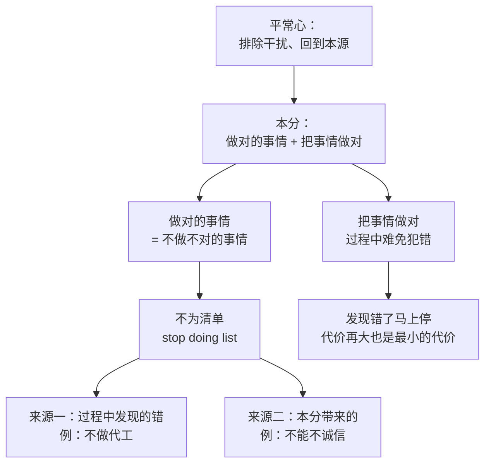

# 段永平 ②：本分、平常心与不为清单

::: summary 一页读懂
1. **本分**：他的定义是“做对的事情+把事情做对”，“明知错的事情还去做就是不本分”。2026 年他又说得更短：本分就是做该做的事，“不该做的事情不要做”。
2. **平常心**：“在任何时候，尤其是在有诱惑的时候，能够排除所有外界的干扰，回到事物的本质（原点）”。更短的版本是：“平常心就是理性。”
3. **不为清单（stop doing list）**：“所谓要做对的事情实际上是通过不做不对的事情来实现的”。清单要短，条目要少。
4. **投资里的不为清单**：“不懂不碰，不用margin”，再加上他自己不做空。
5. **发现错了马上停**：“不管多大的代价都会是最小的代价”。他还专门纠正过，原话是“最小的代价”，不是“最好的代价”。
:::

::: note 阅读说明与免责声明
本篇引文均注明出处：雪球帖子注日期和帖子编号（经第三方索引“阿段笔记”检索，雪球原站未能逐条直接核对），网易博客注日期（博客已关闭）。流传的“段永平语录”汇编里找不到原帖的说法，本文不引用或标为待考。本文不构成任何投资建议。

本系列共 3 篇：[① 人物与足迹](/reading/duan-1-life.html) · ② 本分、平常心与不为清单 · [③ 看生意](/reading/duan-3-business.html)。
:::

## 1. 本分：做对的事情，把事情做对

段永平在网易博客里给“本分”下过一个他本人反复使用的定义：

> “本分，我个人的理解就是‘做对的事情+把事情做对’。明知错的事情还去做就是不本分。本分是个检视自己的非常好的工具。……总是拿‘本分’当‘照妖镜’去照别人是不妥的。”（网易博客 2012-03-29）

更早的一篇博客里，他用“欠债还钱”举例：“‘本分’，大概就是该干嘛干嘛，该是谁是谁的意思……比如说，欠债还钱（包括利息）就是本分”（网易博客 2010-03-24）。

十几年后，他的说法更短了：

> “本分简单讲就是做该做的事情，进一步说其实就是不该做的事情不要做。其实这说的也是stop list。理性思考其实也是这个意思，想长远也是。”（雪球 2026-07-19，400963984）

还有一条很直接的回答。有人问为什么总是被不守信用的人欺骗，他说：“被人骗多是因为贪心，或者叫不本分。”（雪球 2019-06-17，128291415）

::: core 解读：本分是对自己的约束
==本分是拿来照自己的，不是拿来要求别人的。==他另一条回复说：“本分是用来约束自己的。处罚按规矩来。”（雪球 2019-06-27）放在交易里，就是先检查自己有没有做“明知错的事”：满仓追高、借钱炒股、听消息买看不懂的票。
:::

## 2. 平常心：回到事物的本源

> “平常心其实就是在任何时候，尤其是在有诱惑的时候，能够排除所有外界的干扰，回到事物的本质（原点），辨别事情的是非与对错，知道什么是对的事情。”（雪球 2019-09-12，132715804）

他还给过几个更短的说法：

| 说法 | 出处 |
|---|---|
| “平常心就是理性。理性面对自己也不容易的。” | 雪球 2019-10-13，133966357 |
| “平常心就是排除外界干扰，回到事物本源。” | 雪球 2020-11-29，164451204 |
| “本分就是要做对的事情和要把事情做对。平常心就是回到事物本源的心态，也就是要努力认清什么是对的事情，认清事物的本质。” | 雪球 2019-09-23，133182073 |
| “要想拿得住一只涨了很多的股票必须要有很好的平常心（芒格叫理性）” | 雪球 2011-09-27，20404793 |

他也承认自己做不到时时如此：“我之所以提出平常心的原因就是因为我也会失去平常心，所以大家都差不多，需要时刻提醒一下自己哈。”（雪球 2019-09-12，132730985）有人问他当年怎样处理愤怒，他答：“愤怒一下，然后平常心回归本源，该干嘛干嘛，不要因为愤怒做出任何决定。”（雪球 2018-10-11，114891439）

::: tip 平常心难，就少去需要它的地方
2023 年有人问怎样做到平常心，他用高尔夫举例：周日最后一洞最后一推决定胜负时，保持平常心非常难。然后说：“话说回来，你为什么把自己逼到那个份上，投资要容易很多啊……就像老巴说的打棒球一样，你不是非要挥杆的。”（雪球 2023-04-07，246758528）==不把自己逼进必须做决定的位置，比在压力下硬撑容易得多。==芒格把同一种品质叫理性，见 [芒格 ④ 理性与杠杆](/reading/munger-4-invert.html#6-理性与杠杆)。
:::

## 3. 不为清单：不对的事情不做

“stop doing list”是段永平最常提的词，中文常译作“不为清单”。他的解释是：

> “所谓要做对的事情实际上是通过不做不对的事情来实现的，这就是为什么要有stop doing list，意思就是‘不做不对的事情’或者是立刻停止做那些不对的事情。也许每个人或公司都应该要积累自己的stop doing list。如果能尽量不做不对的事情，同时又努力地把事情做对，长时间（10年20年）后的区别是巨大的。”（雪球 2019-04-02，124316452）

清单从哪里来？他说：“不做的事情有些事在过程中发现的，比如给人加工，有些是本分带来的，比如不能不诚信。不做的事情让我们减少犯错的机会，日积月累效果很好。”（雪球 2019-09-26，133413569）

清单要多长？“要列入这个清单的东西一定要尽量少，不然可能会束缚大家的手脚。”（雪球 2019-08-06，130751869）

*图：按段永平 2012、2019、2020 年的博客与雪球回复整理。*

::: quote 和芒格的“反过来想”是一回事
芒格说想帮印度，要先问什么在伤害印度、怎样避免它（见 [芒格 ④ 反过来想](/reading/munger-4-invert.html#1-反过来想从怎样成功到怎样避免失败)）。==段永平的不为清单，就是把“怎样避免失败”的答案写下来并坚持执行。==
:::

## 4. 投资里的不为清单：不懂不碰、不用 margin、不做空

有人请他分享自己投资上的不为清单，他答：

> “我的投资中的stop doing list很简单，就是不懂不碰。主要集中在两个方面：商业模式和企业文化。”（雪球 2020-10-10，160635792）

第二天他补充了另一条：

> “投资的难其实就是因为其简单。买股票就是买公司，所以不懂不碰。……比如茅台，过去30年里不管你在酒前酒后，左侧右侧买，10年后看都是好投资，但用margin买的还是有可能要裸奔的。所以，不懂不碰，不用margin就是stop doing list。”（雪球 2020-10-11，160679524）

| 条目 | 他的原话 | 出处 |
|---|---|---|
| 不懂不碰 | “不懂不碰”，集中在商业模式和企业文化两方面 | 雪球 2020-10-10 |
| 不用 margin（融资杠杆） | “如果你懂投资，你不需要用杠杆，因为你早晚会变富的。如果你不懂投资，你更不应该用杠杆” | 雪球 2020-12-06，165040887 |
| 不做空 | “我不做空，不想跟自己过不去。做空一家公司需要了解的东西远比做多要难得多的多，而且一旦错了就可能是灾难性的。” | 雪球 2020-10-28，161843171 |
| 不用要用的钱 | “你不能说你用你自己需要的钱去赌一个你不需要的钱” | 浙大交流 2025-01-05 |

关于杠杆的风险，他讲得很具体：“只要你一直在用margin，你一定会碰到这一天的，很可能会让你一夜回到解放前。苹果历史上大掉40%的事情发生过10次以上了。”（雪球 2020-12-07，165067430）

::: warn 本文的理解：A 股短线同样适用
不为清单不是价值投资独有的。游资体系里的“弱市不做”“只做看得懂的模式”，本质也是不为清单，见 [职业炒手 · 弱市不做](/reading/zhiye-2-core.html#1-第一原则弱市不做)。杠杆的风险在任何风格里都一样，==满仓融资遇上一次大跌，足以抹掉多年的积累==，见 [退学炒股 ② 仓位](/reading/tuixue-2-mode.html#3-仓位从全仓到回撤线)。
:::

## 5. 有所不为：2011 年浙大毕业典礼的三句话

2011 年 6 月，他在浙江大学毕业典礼上讲了两三分钟。事后他在博客里把要点整理为：

1. **胸无大志**：“大概就是踏踏实实的态度……胸无大志的‘大’就是好‘大’喜功的‘大’。”
2. **有所不为**：“大概就是‘作对的事情和把事情做对’的另一种说法。做对的事情的意思就是错的事情不要做”。
3. **做一个正直的人**：“这是最简单但也可能最难的一点。……正直的人可以一生坦然。”

（网易博客 2011-07-25；2019-09-05 他在雪球上再次确认了这三点的说法，帖子 132344022）

## 6. 发现错了马上停

> “少犯错不是通过什么都不敢做实现的，那叫裹足不前。少犯错是通过坚持做对的事情来实现。而所谓坚持做对的事情是通过发现是错的事情就马上停止，不管多大的代价都会是最小的代价。”（雪球 2020-10-14，160934208）

网上流传的版本常写成“不管多大的代价都是最好的代价”。他专门指出原话是“最小的代价”，“被改了一个字后总觉得不太对”（雪球 2019-04-02，124326292）。

他也区分了两种错误：“可以不做错的事情，但很难避免在做对的事情的过程中犯错误。”（雪球 2022-01-11，208653688）

::: core 解读：止损的另一种说法
==“最小的代价”是一个比较：今天停下的损失，一定小于明天继续错下去的损失。==这和短线里“整体性止损”的逻辑相通，见 [盖棉 ③ 整体性止损](/reading/gaipian-3-discipline.html#2-整体性止损)。区别在于，段永平说的“错”指的是事情本身错了（看错了生意、做了不该做的事），不是价格的短期涨跌。
:::

## 7. 自测与行动

自测 1：段永平怎样定义“本分”？

“做对的事情+把事情做对”；“明知错的事情还去做就是不本分”。2026 年的简版：做该做的事，不该做的事情不要做。

自测 2：他的投资不为清单有哪几条？

不懂不碰（商业模式、企业文化两方面），不用 margin。他本人另外不做空，并强调不要用自己需要的钱去赌。

自测 3：“不管多大的代价都是____的代价”，原话是哪个词？

“最小的代价”。他专门纠正过“最好的代价”这个流传版本。

自测 4：怎样在投资里少用到平常心？

不把自己逼到必须做决定的位置。“就像老巴说的打棒球一样，你不是非要挥杆的。”

行动清单：

- [ ] 写下自己的交易不为清单，不超过 5 条
- [ ] 检查账户：有没有融资、有没有用到短期要用的钱
- [ ] 找出一笔“明知是错还在拿着”的持仓，写下继续拿着的真实理由

## 来源

- 段永平雪球（账号“大道无形我有型”），原帖格式 https://xueqiu.com/1247347556/<帖子编号>，本文引用的编号见正文括号
- 段永平网易博客（2010-03-24、2011-07-25、2012-03-29、2016-10-12 各篇），博客已于 2018 年关闭，原文经阿段笔记收录
- 阿段笔记·本分 / 平常心 / 不为清单 / 不用 margin / 做空 主题页（第三方索引，只采用其中的段永平原话）：https://learnduan.com/
- 段永平浙大交流实录（2025-01-05），腾讯财经：https://news.qq.com/rain/a/20250105A075B100
