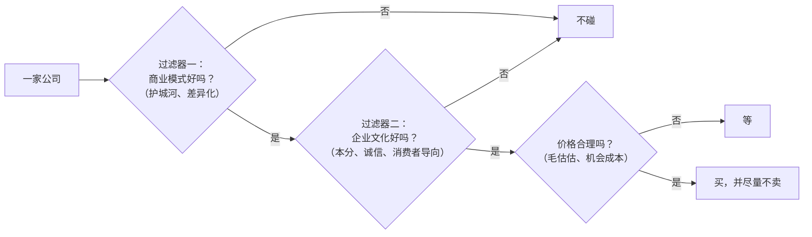

# 段永平 ③：看生意——买股票就是买公司、商业模式与企业文化

::: summary 一页读懂
1. **一句话**：“买股票就是买公司，买公司就是买公司的未来现金流折现，句号！”他后来说这其实“属于定义”。
2. **毛估估**：“如果要用到计算器才能算出来的便宜就不够便宜了。”未来现金流折现“不是个计算公式，他只是个思维方式”。
3. **两道过滤器**：看公司主要看商业模式和企业文化，“是两个过滤器，是串联的”，再加上合理价格。
4. **苹果案例**：2011 年 1 月下旬开始买，当时市值约 3000 亿美元、净现金约 1000 亿、年利润不到 200 亿；他猜 5 年左右利润能到 500 亿。他说得出这个结论“对我来说至少 20 年功夫”。
5. **卖出**：“无论什么时候卖都不要和买的成本联系起来”，唯一不该用的卖出理由是“我已经赚钱了”。
:::

::: note 阅读说明与免责声明
引文出处同前两篇：雪球帖子注日期与编号（经阿段笔记索引检索），网易博客注日期。文中涉及的个股（苹果、茅台、网易、万科等）只是段永平本人讲述的案例，不代表本文推荐。他的金额单位多为美元或人民币，按原话保留。本文不构成任何投资建议。

本系列共 3 篇：[① 人物与足迹](/reading/duan-1-life.html) · [② 本分、平常心与不为清单](/reading/duan-2-benfen.html) · ③ 看生意。
:::

## 1. 买股票就是买公司

> “我理解的投资归纳起来就是：买股票就是买公司，买公司就是买公司的未来现金流折现，句号！这就是我说的所谓的信仰的意思，或者说我是从骨子里相信，不会因为任何影响而动摇。”（网易博客 2012-06-24）

他把这句话和“本分”连起来讲：“投资里做对的事情就是买股票就是买公司，就是买公司的生意，就是买公司未来的净现金流折现”（雪球 2018-10-08，114619399）。在他看来，“所谓学老巴实际上就是一件事：买股票就是买公司（做对的事情）”（雪球 2012-05-03，21770073）。

后来的说法越来越短：

| 说法 | 出处 |
|---|---|
| “买股票就是买公司其实属于定义，因为股票就是公司的一部分。” | 雪球 2024-01-24，276103558 |
| “投资中的‘常识’就是‘公司其实只有一个买家，那就是公司自己’。” | 雪球 2026-06-24，396370629 |
| “你要买的是好公司，没用Margin，那你的公司大掉时你应该是高兴的。” | 雪球 2024-03-31，284265038 |

最后一条的背景是：他说自己买苹果后，苹果“从最高点掉下来超过40%的好像就有好几次”，但只要公司赚钱，公司自己会继续回购，所以下跌时他“也是高兴的”。这和巴菲特讲的 [市场先生](/reading/buffett-3-value.html#4-市场先生) 是同一个意思。

## 2. 未来现金流折现：一种思维方式，不是公式

段永平谈估值，最常用的词是“毛估估”：

> “我认为估值就是个毛估估的东西，如果要用到计算器才能算出来的便宜就不够便宜了。……一般而言，赚到几十倍甚至更多的股票绝不是靠估值估出来的，不然没道理投资人一开始不全盘压上（当时我要知道网易会涨160倍，我还不把他全买下来？）。”（网易博客 2010-04-25）

他举过万科的例子：“我买万科时万科市值才100多个亿，我认为这无论如何也不止，所以就随便给了个500亿。”接着引用巴菲特“300 斤的胖子”的比喻：不用秤也知道他很胖。同一篇里他说：

> “未来现金流折现不是个计算公式，他只是个思维方式。没见过谁真能算出来一家公司未来是有现金流折现的。芒格说过，他从来没见过巴菲特算这个东西。”（网易博客 2013-09-03）

一句流传很广的话被传歪过，他专门纠正：“‘宁要模糊的精确，也不要精确的模糊。’这句话不知道怎么传成这样了，意思完全不对！应该是‘宁要模糊的正确，也不要精确的错误。’”（雪球 2022-03-23，215021511）

::: core 解读：估值管下限，定性管收益
同一篇 2010 年的博客里还有一句：“大致的估值主要用于判断下行的空间，定性的分析才是真正利润的来源”。==毛估估回答“会不会亏很多”，看懂生意回答“能赚多少”。==
:::

## 3. 两道过滤器：商业模式与企业文化

> “我的投资中的stop doing list很简单，就是不懂不碰。主要集中在两个方面：商业模式和企业文化。”（雪球 2020-10-10，160635792）

> “商业模式和企业文化是两个过滤器，是串联的。”（雪球 2026-05-02，387073463）

有人问他怎样理解价值投资，他只回了一句：“商业模式，企业文化，合理价格。”（雪球 2019-03-18，123165936）

*图：按段永平 2019、2020、2026 年雪球回复整理。“串联”的意思是两道过滤器都要通过。*

什么是好的商业模式？他的几句话：

- “那你觉得花多少钱可以复制茅台，苹果？要能复制早就有人复制了啊！moat越宽，复制越难，这就是商业模式的意义。”（雪球 2026-08-11，404477432）
- “好赛道是不会进入低毛利的，低毛利的都是商业模式比较差的，产品差异化很小的产品。”（浙大交流 2025-01-05）

做企业时，他的策略叫“敢为天下后”，前提是能“后中争先”：“毛估估觉得大概有点像‘集中优势兵力打歼灭战’的意思，就是在某个时段某个局部市场你的整体力量能比对手强大三倍以上”（雪球 2019-10-20，134297843）。有人把跟风做不好的事说成“敢为天下后”，他纠正：“这不是‘敢为天下后’，是‘甘为天下后’。”（雪球 2023-03-29，245774023）

::: tip 和巴菲特、芒格的对应
商业模式这道过滤器，就是巴菲特说的 [护城河与好生意](/reading/buffett-2-moat.html#4-好公司合理价胜过一般公司便宜价)；“不懂不碰”就是 [能力圈](/reading/buffett-4-competence.html#1-能力圈知道边界比圈子大更重要)。芒格 1994 年说的“竞争会吃掉利润”（见 [芒格 ②](/reading/munger-2-worldly.html#2-多学科模型80-到-90-个就够)），正好解释了为什么“低毛利的都是商业模式比较差的”。
:::

## 4. 苹果：一个“懂了”的样本

段永平说自己“是2011年1月下旬开始买苹果的”（雪球 2018-10-15，115035708）。被问到什么叫“懂”，他用苹果举例：

> “我在2011年买苹果的时候，苹果大概3000亿市值……手里有1000亿净现金，那时候利润大概不到200亿。以我对苹果的理解，我认为苹果未来5年左右赢利大概率会涨很多，所以我就猜个500亿（去年595亿）。”（雪球 2019-05-20，126928217）

他接着说，得到这个结论非常不容易，“对我来说至少20年功夫吧。能得到这个结论，就叫懂了。不懂则千万千万别碰”。

| 时间 | 他做了什么 / 怎么说 | 出处 |
|---|---|---|
| 2011 年 6 月 | 把苹果的投资上限设在 30%，因为对乔布斯离开后的影响“没有绝对把握” | 网易博客 2011-06-29 |
| 之后 | “后来越投越多，远远超过当初设想的30%了。” | 雪球 2020-10-15，161022110 |
| 2018 年 | 告诉巴菲特：“苹果的生意模式，当然我这里主要讲 iPhone，是比可口可乐要好的” | 浙大交流 2025-01-05 |
| 回顾 | “我的苹果80%以上都是不出大屏的那三年买的” | 雪球 2025-11-13，361313935 |

2011 年那篇博客的结论是：“我感觉中的安全边际指的不仅仅是价格。”他把安全边际理解为“自己对要投资的生意的了解度”，了解越深，仓位可以越大。（注：阿段笔记收录的另一版本把末句写作“不仅仅是价值”，两个版本有一字之差，本文按前者引用，待考。）

::: quote 机会成本：买不买苹果，取决于你还有什么别的选择
2019 年他说：如果你认为苹果未来 20 年以上年利润只多不少，“而你又没别的办法赚到6%以上的年利润，那你就可以买苹果了”；但如果“你有大把机会长期赚到10%以上的年利润，你就应该把钱投到那里去”。==“这也是为什么说投资投什么其实是基于机会成本的。”==（雪球 2019-04-07，124633974）
:::

## 5. 什么时候卖：和成本无关

> “无论什么时候卖都不要和买的成本联系起来。该卖的理由可能有很多，唯一不该用的理由就是‘我已经赚钱了’。”（网易博客 2010-03-27）

> “其实，卖股票和成本无关，买股票和其到过多少价也无关。最重要其实也是唯一重要的是公司本身。”（网易博客 2012-04-26）

茅台也是一样。有人说他是“低价重仓”，他答：“虽然我们100出头就买了不少茅台，但我们1500-1800也还买了茅台啊”（雪球 2022-12-03，236926949）。

他坦言卖出是自己的短板：“卖出我不擅长，所以总是想尽量找到那些不需要卖的公司。”（雪球 2025-11-13）他讲过的卖出错误包括：Netflix 在 8–9 美元时买了很多，20 美元左右就卖了；卖掉网易“应该也算是个错误”（雪球 2018-10-05，114557605）。

::: warn 本文的理解：A 股短线的成本观念正好相反
短线交易非常看重成本和止损线。段永平说的“与成本无关”，前提是==买的是自己看懂的好公司、没有杠杆、用的是闲钱==。缺了任何一条，“不看成本”就会变成“不肯止损”。两种体系各有前提，不能混用，短线的止损纪律见 [盖棉 ③ 整体性止损](/reading/gaipian-3-discipline.html#2-整体性止损)。
:::

## 6. 投资还是投机

段永平对“投机”的判断很简单：

- “当你需要问是不是投机的时候，那就是投机，当然也可以叫投资在机会上。”（雪球 2022-01-04，207932254）
- “投资本是件愉快的事情，只要有恐惧就表示你做错了什么。”（雪球 2025-03-09，326550207）
- “切记‘投资’用的是闲钱，千万不要把短期内需要用的钱拿到赌场或者‘股场’赌一把去赚点快钱啥的。”（雪球 2024-08-08，300403629）
- 买错了烂公司，“安慰自己的办法大概就是不停地对自己说：以后再也不赌了，再也不赌了，再也不赌了。于是从此可以打败90%以上的‘投资人’了。”（雪球 2024-03-31，284265038）

期权方面，他会在苹果上卖看跌期权（put）、卖行权价很高的看涨期权（call），但强调：“我不觉得有个所谓的卖option的策略或办法。所有的交易都是在理解公司生意以及着眼于长远上。千万不要碰不了解的公司的option，不然买卖都是危险的。”（雪球 2022-08-10，227657539）

## 7. 自测与行动

自测 1：段永平怎样理解“未来现金流折现”？

“不是个计算公式，他只是个思维方式。”估值是毛估估的，“如果要用到计算器才能算出来的便宜就不够便宜了”。

自测 2：“宁要模糊的____，也不要精确的____”，正确的原话是什么？

“宁要模糊的正确，也不要精确的错误。”流传的“模糊的精确 / 精确的模糊”是传歪的版本。

自测 3：两道“串联”的过滤器是什么？

商业模式和企业文化，两道都通过才考虑价格。

自测 4：他说唯一不该用的卖出理由是什么？

“我已经赚钱了。”卖出和买入成本无关，只和公司本身有关。

行动清单：

- [ ] 挑一家自己持有的公司，用一句话写出它的商业模式为什么难以复制
- [ ] 不用计算器，毛估估它 5 年后的利润和合理市值
- [ ] 写下你的机会成本：不买这只股票，钱放在哪里、每年能赚多少

## 来源

- 段永平雪球（账号“大道无形我有型”），原帖格式 https://xueqiu.com/1247347556/<帖子编号>，编号见正文括号
- 段永平网易博客（2010-03-27、2010-04-25、2011-06-29、2012-04-26、2012-06-24、2013-09-03 各篇），博客已于 2018 年关闭，原文经阿段笔记收录
- 阿段笔记·买股票就是买公司 / 毛估估 / 生意模式 / 投资苹果 / 什么时候卖 / 投机与赌博 主题页（第三方索引，只采用其中的段永平原话）：https://learnduan.com/
- 段永平浙大交流实录（2025-01-05），腾讯财经：https://news.qq.com/rain/a/20250105A075B100
