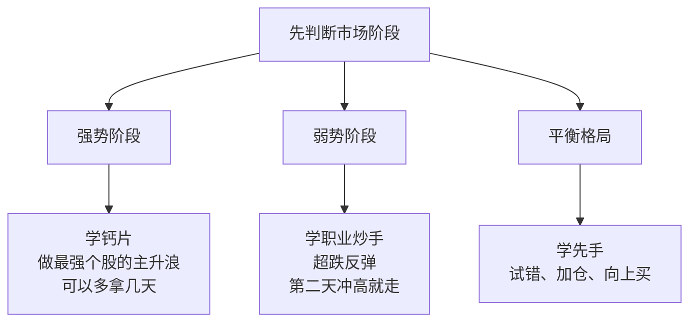
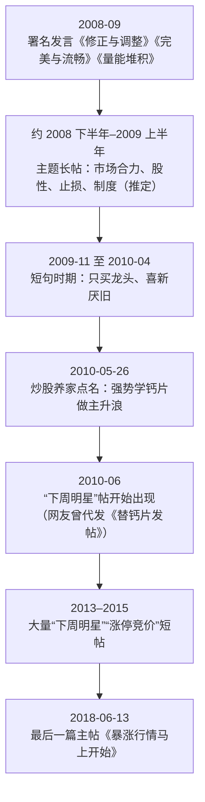

# 钙片 ①：人物与足迹——养家口中"做主升浪"的那位前辈

::: summary 一页读懂
1. **他是谁**：淘股吧 ID "钙片"，网友称"钙总""钙片兄"，2008 年前后就活跃的早期短线选手。个人主页显示 12 篇精华、吧龄约 18 年。本名、年龄、所在城市、资金规模都**没有可靠的公开资料**。
2. **被养家点名**：炒股养家 2010 年说，强势阶段就学"钙片兄"做最强个股的主升浪，"可以多拿几天"。
3. **一篇长帖**：大约从 2008 年下半年开始写的主题长帖，谈市场合力、股性、止损、制度和执行，是本系列 ②③ 篇的主要素材。作者归属有比较充分的旁证，但仍属**推定**（见第 3 节）。
4. **短句时期**：2009–2010 年留下"只买龙头，不买龙头的亲戚""喜新厌旧永远是短线不变的真理"等短句，后来被网友收进"淘股吧高手经典语录"。
5. **八个感叹号**：后期的帖子大多只写"代码 + ！！"，标题都用八个感叹号结尾，他自己解释过这个习惯。
:::

::: note 阅读说明与免责声明
钙片**没有接受过媒体采访，也没有公开的实盘记录**。本系列的材料只有四类：两份网友汇编（新浪博客 2009、2011）、闽发论坛老帖的转载（2021），以及他在淘股吧个人页上能查到的帖子和回帖。早年长帖的原帖链接没有找到。本文用自己的话复述，只引用简短的原话。凡标"待考"的内容请谨慎看待。文中出现的股票代码只是历史记录，不是推荐。本文不构成任何投资建议。

本系列共 3 篇：① 人物与足迹 · [② 市场合力与股性](/reading/gaipian-2-heli.html) · [③ 制度、止损与活着](/reading/gaipian-3-discipline.html)。
:::

## 1. 钙片是谁

在淘股吧早期的高手名单里，"钙片"这个名字出现得不多，但分量不轻。最有名的一次，是被炒股养家当成"强势阶段"的学习对象点了名（见第 2 节）。

关于他本人，能查到的和查不到的分别是：

| 项目 | 能查到的 | 可靠度 |
|---|---|---|
| 论坛 ID | 淘股吧"钙片"，个人主页 tgb.cn/blog/7227 | 一手 |
| 称呼 | 回帖里网友称"钙总""钙片兄""钙片大神" | 一手 |
| 活跃时间 | 汇编中最早的署名发言是 2008-09；个人页最后一篇主帖发于 2018-06-13 | 一手 + 汇编 |
| 精华与吧龄 | 个人页显示 12 篇精华、吧龄 18.1 年（2026-10 查看） | 一手 |
| 本名、年龄、城市 | 未找到可靠资料 | — |
| 性别 | 回帖里有人叫"钙片姐姐"，也有人叫"钙总""钙片兄"，多是网友玩笑，无法据此判断 | 待考 |
| 资金规模、收益 | 未找到公开的实盘赛记录或媒体报道 | 待考 |

::: warn 网上的"钙片"不止一个意思
搜索时会遇到两种干扰：一是保健品"钙片"；二是有些自媒体或 AI 摘要把钙片和别的游资混为一谈（比如说他是某某的化名）。本文没有找到这类说法的出处，**一律不采信**。
:::

## 2. 养家为什么点他的名

2010 年 5 月，炒股养家在自己的 200 万问答帖里回答"持仓多久"时，按市场阶段给出了三位学习对象：

> 如是强势阶段，就学习钙片兄的做最nb个股的主升浪，可以多拿几天

（炒股养家，2010-05-26，转引自"板上飞鸿"2011 年汇编；完整语境见 [⑦ 原帖现场](/reading/yangjia-7-thread.html#4-按阶段换方法集百家之所长)。）

*图：按炒股养家 2010 年的回答整理。职业炒手的打法见 [职业炒手系列](/reading/zhiye-2-core.html)。*

::: tip 解读：钙片的"标签"
在 2010 年前后的淘股吧，钙片的标签是==强势市场里拿住最强的股票==。这和他自己的说法对得上。他在长帖里写过：

> 其实买进一个牛股不难，难的是你一直持有她的上升期

他还明确说自己"从来不抄底"（见 [③](/reading/gaipian-3-discipline.html)）。所以养家把超跌反弹的打法归给职业炒手，而不是钙片，分工很清楚。
:::

## 3. 那篇长帖：怎么判断是他写的

本系列 ②③ 篇的大部分内容来自一篇很长的老帖，现在能看到两个版本：

- 新浪博客"钱在谁的口袋"2009-05-28 整理的《市场合力》，**没有署作者名**；
- 闽发论坛网站 2021 年以"闽发老帖"为名转载的版本，内容更完整，同样没有署名。

把它归给钙片，依据是三条旁证：

1. **逐字吻合**：长帖里的《修正与调整》《完美与流畅》《量能堆积》三段，与"板上飞鸿"2011 年汇编中**署名钙片**、时间为 2008-09-06 和 2008-09-08 的发言几乎一字不差。
2. **自己提到名字**：转载版里，作者开玩笑说有人登了整版报纸"请顶钙片的帖子"。
3. **风格一致**：作者说自己的帖子"一般就是一个股票代码两个！！正好8个字符"。这和钙片后来的帖子完全一致：正文只有"代码 + ！！"，标题用八个感叹号。

::: warn 两处要剔除或存疑
- 长帖中间夹着一段署名"朽贯 2008-07-27"的引文（"职业操盘手的思维不是针对散户的思维……"），**那段不是钙片写的**，本系列不把它当作钙片的观点。
- 帖子里提到小沈阳等，说明部分内容可能写于 2009 年初以后，所以长帖的写作时间写作"约 2008 下半年至 2009 上半年"（**推断，待考**）。
- 结论：整篇长帖出自钙片是"高度可能"，但原帖没有找到，本系列标为**推定**。
:::

## 4. 时间线

*图：根据汇编与淘股吧个人页整理。2010-06 那条依据的是网友 oturan 2010-06-04 发的《替钙片发帖，下周明星！！！！！！！！6.6》。*

## 5. 后期风格：代码 + 八个感叹号

2013 年以后，钙片很少写长文，帖子几乎只有一行。长帖里有一句话可以当注脚：

> 我不想编出什么买进的理由，讲故事的事情留个别人

从后期的帖子和回帖里，还能看到他几个一贯的习惯：

- **涨停排队，不纠结价格**：2014-04-11 发《涨停竞价》，当天撤单卖出。有网友嘲笑，他回复说下一个交易日如果涨停还会去排队，"不纠结价格只关注趋势"。
- **自嘲买在最高价**：2014-02 开帖《记录那些买过的最高价》，在回帖里自嘲"最高价有我，求鄙视"，另一次写"整体性止盈了，，，对错为知"。
- **风险来了先撤**：2014-03-28 发《风紧》，正文只有一句"系统风险，扯呼！"，回帖里的理由是"无热点，无版块，瞎拉一通"。
- **消息股愿赌服输**：2014-03 有一只消息股没涨，他回复"赌就是赌，愿赌服输"。

::: warn 前辈也会看错
2018-06-13 他发帖《暴涨行情马上开始》，判断跌破 3034 点就是"各大周期共振点"，喊"闭眼扫货"。实际上 2018 年下半年大盘继续下跌，上证综指年底收在 2500 点下方，那个帖子下面后来全是批评。
这件事值得记住：**任何名人的单次判断都可能错**。他自己 2008 年提出的"整体性止损"（见 [③](/reading/gaipian-3-discipline.html)），正是为这种时候准备的。
:::

## 6. 自测与行动

自测 1：炒股养家说强势阶段学钙片什么？

学他做最强个股的主升浪，"可以多拿几天"。弱势阶段学职业炒手做超跌反弹，平衡格局学先手试错加仓。

自测 2：为什么说那篇长帖"推定"出自钙片？

长帖本身没有署名。但其中三段和署名钙片的 2008-09 发言逐字一致，帖内提到"请顶钙片的帖子"，"代码 + 两个感叹号"的发帖习惯也和他一致。原帖没有找到，所以只能叫推定。

自测 3：长帖里哪一段不是钙片写的？

署名"朽贯 2008-07-27"的那段"职业操盘手的思维不是针对散户的思维……"，是帖子中间夹的引文。

读人物材料时的提醒：

- [ ] 分清**署名发言、未署名汇编、网友转述**三种来源
- [ ] 不采信没有出处的身份说法（本名、化名、资金规模）
- [ ] 把注意力放在"强势拿住最强股"的方法上，而不是某次喊多喊空

## 来源

- 淘股吧·钙片个人主页（精华数、吧龄、2013–2018 年主帖列表）：https://www.tgb.cn/blog/7227 ；手机版：https://m.tgb.cn/blog/7227
- 新浪博客·板上飞鸿《淘股吧高手经典语录!（2）》2011-02-12（钙片 2008–2010 年署名发言；炒股养家 2010-05-26"学习钙片兄"）：https://blog.sina.com.cn/s/blog_4e1c4a5d0100ox7f.html
- 新浪博客·钱在谁的口袋《[整理]市场合力》2009-05-28（长帖未署名整理版）：https://blog.sina.com.cn/s/blog_483f36780100dk2e.html
- 闽发论坛网站《市场合力消灭狂人最好的场所》2021-11-16（"闽发老帖"转载，含"请顶钙片的帖子""正好8个字符"、朽贯引文）：https://www.xiarj.com/24033.html
- 淘股吧·oturan《替钙片发帖，下周明星！！！！！！！！6.6》2010-06-04：https://m.tgb.cn/a/1ykvdOaLvAN
- 淘股吧·钙片《涨停竞价》2014-04-11：https://m.tgb.cn/a/1ykyzwwtkgC ；《记录那些买过的最高价》2014-02-12：https://m.tgb.cn/a/1ykynaB2oxc ；《风紧》2014-03-28：https://m.tgb.cn/a/1ykywALw5iI ；《买定离手》2014-02-24：https://m.tgb.cn/a/1ykypHK059Z ；《暴涨行情马上开始》2018-06-13：https://m.tgb.cn/a/1ykDtuiHrVY
- 界面新闻 2019-07-30（报道引用养家"学习钙片兄"一段）：https://www.jiemian.com/article/3199143.html
