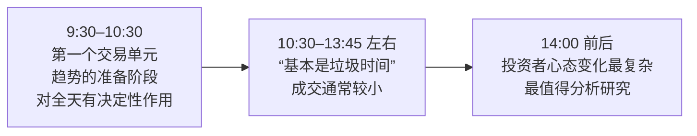
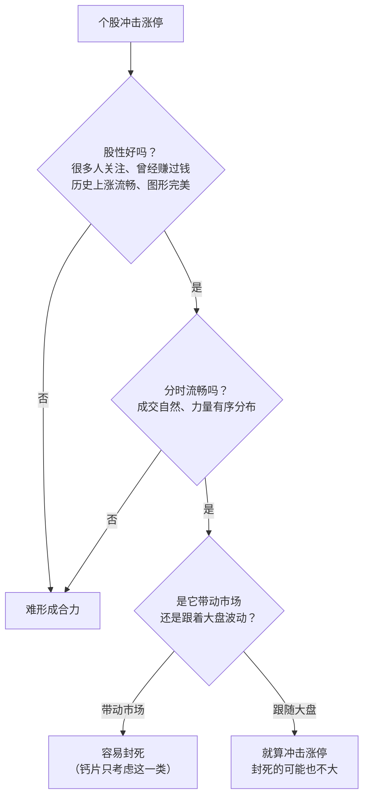

# 钙片 ②：市场合力与股性——只买龙头，不买龙头的亲戚

::: summary 一页读懂
1. **合力就是主流趋势**：不需要知道对手盘是谁，但要知道自己是不是在主流趋势里。
2. **股票有性格**：让很多人赚过大钱、上涨曾经很流畅的股票，更容易形成合力。连名字都会加分或减分。
3. **完美与流畅**：他只考虑分时走得流畅完美的股票。只会被动跟随大盘波动的股票，冲击涨停也很难封死。
4. **量能看换手**：第一个涨停的换手，很大程度上决定了一只股票后面的路。1000 点和 6000 点时的分析不能一样。
5. **只买龙头**："只买龙头，不买龙头的亲戚"。热点不会轻易转变；没有热点的普涨，宁可不买。
6. **市场不相信真相**：离公司真相越近，越可能和股价背离。短线要研究的是市场反应。
:::

::: note 阅读说明与免责声明
本篇主要依据钙片约 2008–2009 年的主题长帖（作者归属为推定，理由见 [① 第 3 节](/reading/gaipian-1-life.html#3-那篇长帖怎么判断是他写的)），以及"板上飞鸿"2011 年汇编里带日期的署名短句。原话只做简短引用，其余是本文的复述和解读（标"解读"的部分是本文观点，不是钙片原话）。长帖里署名"朽贯"的引文不计入钙片观点。2008 年的盘面经验未必适用于今天的交易制度。本文不构成任何投资建议。

本系列共 3 篇：[① 人物与足迹](/reading/gaipian-1-life.html) · ② 市场合力与股性 · [③ 制度、止损与活着](/reading/gaipian-3-discipline.html)。
:::

## 1. 市场合力：先问自己在不在主流里

钙片的出发点很朴素：交易者都是人，水平、资金成本、看问题的角度、性格各不相同，于是有了分歧，也就有了交易。合力是什么？他的定义是：

> 所谓合力我理解的就是主流的趋势

紧接着是他说"用了很久才想明白"的一点：

> 你不需要知道和你交易的对手盘是谁，可你应该知道你现在是不是在主流趋势里面

::: core 核心心法
==先确认自己在主流趋势里，再谈选股和买点。==这和炒股养家"交易的本质是群体博弈"（见 [养家 ②](/reading/yangjia-2-emotion.html#第-3-章-第一性原理交易的本质是群体博弈)）、职业炒手"先大盘、再板块、再个股"（见 [职业炒手 ③](/reading/zhiye-3-mode.html#2-自上而下的三层筛选)）是同一个方向。
:::

### 1.1 市场里都是些什么人

他把对手盘大致分成几类，各自的"思维定式"不同：

| 参与者 | 钙片的看法（复述） | 他研究不研究 |
|---|---|---|
| 职业投资者 | 市场一轮轮淘汰后剩下的"精品"，他们的思维很大程度上决定短期趋势；很多技术阻力位，其实是他们的卖单在起作用 | 重点研究 |
| 基金 | 思维定式最难分析，因为获利模式和短线选手不一样 | 难以研究 |
| 上班炒股族 | 买卖单多是事先挂好的中长期决定，对短线趋势影响不大 | 基本不研究 |
| 会员炒股族 | 看股评的时间比看股票还长，整数关附近的挂单多是他们的 | 了解即可 |

他还提到，有些[[席位]]很会利用合力：在短期趋势形成的那一刻，用资金制造一个大家都习惯的走势，做"压死骆驼的最后一根稻草"。

### 1.2 尊重你的对手盘

转载版长帖里有一个小故事：他坐电梯时听到几个人大骂一家停牌很久的公司，复牌明明是涨停开盘，他们还是不高兴，说涨三天就卖。他当时觉得这些人傻，后来想通了：

> 请尊重你的对手盘，不要嘲笑对手！

每个人的时间成本、持仓成本、心理预期都不同，所以才有分歧，你才成交得了。

## 2. 盘中的三个时段

他对一天走势的观察（2008 年前后的经验）：

*图：按长帖复述。*

::: tip 解读：当框架用，不当规律用
这是十几年前的盘面观察。之后 A 股引入了收盘集合竞价，量化交易也大幅增加，各时段的特征都可能变了。可以借用的是"把一天切成几段，分别看谁在交易"的思路，具体时间点要用今天的数据重新验证（**待考**）。
:::

## 3. 股性：股票也有性格

> 股票和人一样是有自己的性格的

他问读者：说到科技股，你会想到谁？环保股、钢铁股、地产股、农业股呢？==你第一时间想到的那只，就是有性格的股票==。它们有过辉煌的历史，有人在上面赚过大钱、"用过感情"。

由此推出他对[[龙头]]的理解：合力总是选择阻力最小的方向，也就是股性活跃、号召力强、过去有过惊人表现的股票。一想到某个板块要涨，大家第一时间想到它，它就容易形成合力、冲击涨停，成为领涨的人气龙头。Asking 从另一个角度讲"什么才是龙头"，可以对照着读（见 [Asking ②](/reading/asking-2-longtou.html#1-什么才是龙头)）。

股性的几个细节：

- **名字很重要**：转载版里他举过一例，某只股票没能形成合力冲击涨停，"名字就扣了很多分数"。
- **有的股票基本可以不看**：有些股票一异动，跟风盘无数；有些很少有人关注，只是自由成交，形成不了合力。
- **新股接生婆**：他自称喜欢"接生"新股，但不碰小盘股上市第一天（见 [③ 制度](/reading/gaipian-3-discipline.html#3-制度先写下不碰什么)）。

## 4. 完美与流畅：为什么有的涨停封得住

2008-09-06 他发了一段《完美与流畅》，回答"为什么有的股票涨停能封住，有的不行"：

*图：按 2008-09-06 署名发言整理。*

他的结论带着一点审美意味：

> 我一般只考虑，分时图走的流畅完美的，多从美的角度去欣赏！

::: tip 解读：把"美"翻译成可观察的东西
"流畅"不是玄学，可以拆成几项去看：分时成交是否连续、没有突兀的大单砸盘拉升；上涨是否领先于大盘和板块，而不是跟在后面；回落时是否有承接。复盘时把封住的和没封住的涨停各截几张图对比，慢慢就能形成自己的标准。
:::

## 5. 量能：从换手看预期

2008-09-08 的《量能堆积》说：

- 很多股票启动时的量能有规律，==第一个涨停的换手很大程度上决定了它未来的路==；
- 换手是大好还是小好没有定论，就像有人是"四小时股东"、有人是中线思维，预期不同，看法就不同；
- 所以要多从换手的角度分析，而且

> 1000点和6000点的分析决定不可以一样

他的落脚点是："变化，适应市场，调整自己的思维角度！多研究概率和心里！"（原文"心里"即"心理"。）职业炒手讲打板时也强调"要换手"，可以对照（见 [职业炒手 ③](/reading/zhiye-3-mode.html#4-打板选最早要换手)）。

## 6. 只买龙头，不买龙头的亲戚

2009–2010 年他在回帖里留下几句被反复转载的短句（日期为汇编所记的发帖时间）：

| 日期 | 原话（简短引用） |
|---|---|
| 2009-11-19 | "执着和固执很难区别，喜新厌旧永远是短线不变的真理！" |
| 2010-02-22 | "只买龙头，不买龙头的亲戚！" |
| 2010-03-26 | "热点不会轻易转变，龙头不是随便就换" |

::: tip 解读："热点不轻易变"和"喜新厌旧"矛盾吗
不矛盾，两句说的是不同对象。已经确认的主线有惯性，不要因为一两天震荡就怀疑它、去追别的；而一旦热点真的退潮，旧品种就不要恋战，资金永远在找新的故事。难点在于分辨"震荡"和"退潮"，这正是养家情绪周期要解决的问题（见 [养家 ②](/reading/yangjia-2-emotion.html#第-4-章-情绪周期赚钱效应与亏钱效应的轮回)）。
:::

### 6.1 没有热点就不买

2009-12-24 他记下了一次"没入场"：

> 感觉还是普涨，没有热点，这样是我最害怕的行情

他说那种行情里"乱买的都比我买的股涨的好"，所以选择不买。==看不懂、没有主线的行情，不做也是一种选择==。职业炒手的"弱市不做"、Asking 的"弱市忍手"也是这个意思（见 [职业炒手 ②](/reading/zhiye-2-core.html#1-第一原则弱市不做)、[Asking ③](/reading/asking-3-trading.html#4-节奏弱市忍手强市踩点)）。

### 6.2 追涨不是追高

> 要追的是上涨的趋势，不是价格

他喜欢涨停排队（即[[打板]]时在涨停价排队买入），但也提醒：这个难度较高，没有追涨经验的不建议学，"这个学费很贵"。2014 年有人嘲笑他排板，他的回答还是一样：下个交易日涨停他照样排队。

## 7. 市场不相信真相

长帖里有一段标题是《距离真相越近，就越背离市场》。他的观察是：你越了解的公司，股价和你的预期可能背离越大；你认为是垃圾的公司股价节节高，你认为优秀的企业却一路下跌。他给的解释是一个"数学问题"：了解真相的人很少，被市场认同的程度也就很小。

> 市场永远是对的，市场不相信真相！市场只相信概率

2010 年的两句短句是同一个意思的浓缩：

- 2010-04-14："股票就是玩预期，炒的就是想象！"
- 2010-04-12："只相信资金的选择，不相信价值投资！"

::: quote 对照：养家怎么看"价值"
同一份汇编里收了炒股养家 2011-01-30 的一段话，立场正好不同：他认为"价值投资是唯一不变的真理"，只不过"价值是人心定的，而人心是会变化的"。
两人其实都在说"人心"：钙片说市场只认资金和预期，养家把这种认同也算作价值。读的时候不必选边站，重要的是都落到"研究市场参与者的心理"上。
:::

## 8. 自测与行动

自测 1：钙片怎么定义"市场合力"？

"所谓合力我理解的就是主流的趋势"。关键不是知道对手盘是谁，而是知道自己是不是在主流趋势里。

自测 2：按《完美与流畅》，哪类股票冲击涨停也难封死？

分时成交不流畅、力量分布无序，上涨只是跟随大盘波动、而不是自己影响市场的股票。

自测 3："只买龙头，不买龙头的亲戚"里的"亲戚"指什么？

同一题材里跟着龙头涨的跟风股、补涨股。钙片只做板块里最强、最有代表性的那一只。

自测 4：2009-12-24 他为什么没有入场？

普涨、没有热点，是他"最害怕的行情"：前期强势股走弱，乱买的反而涨得好，所以他选择不买。

明天复盘时可以试试：

- [ ] 写下今天的**主流趋势**是什么，自己的持仓在不在里面
- [ ] 找出每个热点板块里"一想到就会想到"的那只股，看它是不是今天的龙头
- [ ] 各截 3 张封住和没封住的涨停分时图，对比"流畅"的差别
- [ ] 记录龙头第一个涨停的换手，观察它和后续走势的关系
- [ ] 如果今天是普涨、没有主线，记录自己是否忍住了没买

## 来源

- 新浪博客·钱在谁的口袋《[整理]市场合力》2009-05-28（长帖整理版：合力、参与者分类、盘中时段、股性、完美与流畅、量能、距离真相、追涨不是追高）：https://blog.sina.com.cn/s/blog_483f36780100dk2e.html
- 闽发论坛网站《市场合力消灭狂人最好的场所》2021-11-16（长帖转载版：尊重对手盘、名字扣分、新股接生婆）：https://www.xiarj.com/24033.html
- 新浪博客·板上飞鸿《淘股吧高手经典语录!（2）》2011-02-12（钙片 2008-09-06/08 署名段落及 2009–2010 年短句；炒股养家 2011-01-30 论价值）：https://blog.sina.com.cn/s/blog_4e1c4a5d0100ox7f.html
- 淘股吧·钙片《涨停竞价》2014-04-11（"不纠结价格只关注趋势"）：https://m.tgb.cn/a/1ykyzwwtkgC
