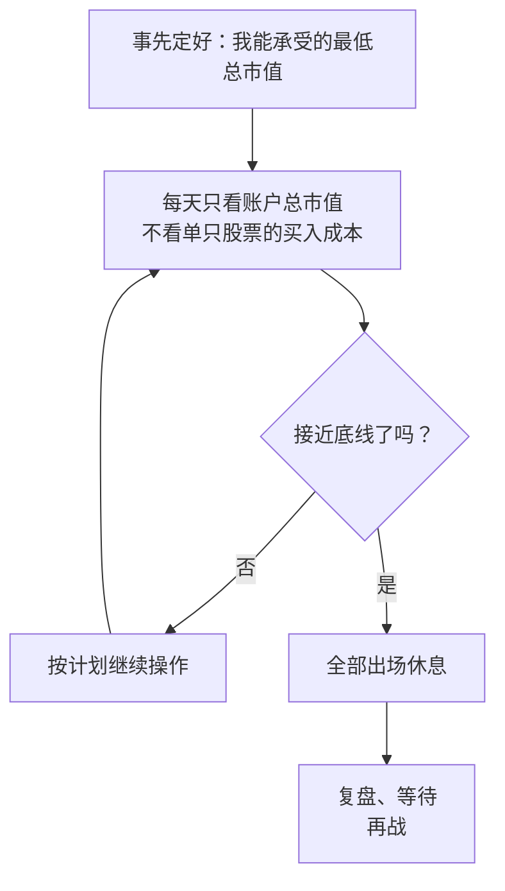

# 钙片 ③：制度、止损与活着——整体性止损、现金为王与语录卡

::: summary 一页读懂
1. **止损是看预期**：不设 3%、5%、7% 这样的固定比例，而是"和自己的想法不一样就出局"，也就是走势和预期背离时离场。
2. **整体性止损**：持有一个组合时，不看单只股票的成本，只看总市值。接近自己能承受的底线，就全部出场休息。
3. **制度先划禁区**：权证不碰，小盘股上市首日不碰，超跌股不抄底。2009 年的版本还加了不买 ST、不做信息股。
4. **计划就是买入条件**：执行要坚决，买在最高价、卖在最低价"只是一个概率问题"。
5. **现金为王**：机会是等出来的，不是创造出来的；"守株待兔最牛"。
6. **活着**：职业投机最重要的是活着，暴跌只是投机生涯里的小插曲。
:::

::: note 阅读说明与免责声明
本篇依据钙片约 2008–2009 年的主题长帖（作者归属为推定，见 [① 第 3 节](/reading/gaipian-1-life.html#3-那篇长帖怎么判断是他写的)）、"板上飞鸿"2011 年汇编中带日期的署名短句，以及他 2014 年的回帖。原话只做简短引用。示例数字是本文假设的，不是钙片给的。他从来没有公开自己的具体买入条件，本文也**不替他补写**。本文不构成任何投资建议。

本系列共 3 篇：[① 人物与足迹](/reading/gaipian-1-life.html) · [② 市场合力与股性](/reading/gaipian-2-heli.html) · ③ 制度、止损与活着。
:::

## 1. "止损设多少"：先回答七个问题

长帖里他说，止损是一个"我不喜欢的话题"，但问的人太多，只好统一回答。在讲方法之前，他先说了另一件事。常有人拿着股票来问"帮我分析一下怎么样"，他一般会反问一串问题：

- [ ] 你买入的理由是什么？
- [ ] 什么时间买入的？
- [ ] 为什么持有到现在？
- [ ] 现在还有什么理由支持你继续持有？
- [ ] 你的时间成本极限是多少？
- [ ] 你原来的心理预期是多少？现在是多少？
- [ ] 你能承受的价位极限是多少？

*（以上按长帖原文的问题整理，可以直接拿来检查自己的持仓。）*

对方往往答不上来，说是别人让买的。他的回答是：那你应该去问让你买的人。不是不友善，而是：

> 自己的金钱应该有自己负责

### 1.1 他的止损方法

> 只做自己可以看懂的行情，和自己的想法不一样就出局

他特别强调，这里比较的是**走势和自己的预期**。两者完全背离的时候最危险，没有理由继续持有。

关于杀跌，他另有一句："杀的是向下的空间，不是什么止损"。他说自己经常卖在当天最低价，但从不后悔。

::: tip 对照：养家的"没有止损"
炒股养家 2010 年说过，自己的操作"不考虑"止损止盈，"买入机会，卖出风险"（见 [养家 ④ 第 8 章](/reading/yangjia-4-trade.html#第-8-章-卖出与持仓没有止损只有买入和卖出)）。两人的意思相通：==卖出的理由是预期被证伪或风险出现，而不是亏到某个百分比==。这比固定比例止损难，因为你得先有清楚的预期。
:::

## 2. 整体性止损

同时持有几只股票时，他的方法"很简单也很机械"：

*图：按长帖《再谈止损》整理。*

他说的好处有两个：一是能把握大的趋势，二是"避免了选择时候的错误"，不会因为纠结哪只该卖、哪只该留而拖延。

::: core 示例（数字为本文假设）
假设账户 100 万，你给自己定的底线是 88 万。

| 情况 | 单只股票 | 总市值 | 按整体性止损怎么做 |
|---|---|---|---|
| A | 一只 −9%，两只 +3% | 约 99 万 | 离底线远，按计划继续 |
| B | 三只都 −4% 左右 | 约 96 万 | 提高警惕，不新开仓 |
| C | 系统性下跌，三只 −10% 以上 | 约 88 万 | **全部出场**，休息后再战 |

关键是底线要**事先**定好、写下来，到了就执行，不要临场再商量。钙片没有说底线该设多少，这一点因人而异。
:::

反过来也一样。2014 年有一次他写"整体性止盈了，，，对错为知"（原文如此），说明这个思路也被他用在获利了结上。

## 3. 制度：先写下不碰什么

> 要想活得久就要有自己不可以去涉足的地方！

长帖里的"制度"和 2009-12-13 那组短句，可以合成一张禁区表：

| 禁区 | 长帖（约 2008–2009） | 2009-12-13 短句 |
|---|---|---|
| 权证 | "太成隐"（成瘾），他的定力不适合 | 不参与权证 |
| 小盘股上市首日 | 喜欢接生新股，但小盘股第一天"不是我可以预知的"，放弃 | 不参与小盘股首日接生 |
| 超跌股抄底 | 不熟悉、不是强项，"所以我从来不抄底" | — |
| ST 股 | — | 不买 ST |
| 信息股（消息股） | — | 不做信息股 |

他还加了一条生活化的规矩：不开心的时候不要操作。

::: tip 解读：禁区因人而异
"从来不抄底"并不是说抄底是错的。职业炒手正是以超跌反弹见长，炒股养家也说弱势阶段要学炒手（见 [① 第 2 节](/reading/gaipian-1-life.html#2-养家为什么点他的名)）。钙片的意思是：==不熟悉、不擅长的领域，就写进禁区==。每个人都应该有自己的禁区表，而不是照抄别人的。
:::

## 4. 计划与执行

*图：长帖原话"制度，计划，执行，重复"。*

- **计划**：他说的计划"不是资金管理，而是买入的条件"。机会满足条件时，要像机器一样第一时间进场。他的具体条件"因人而异"，怕误导大家，所以没说。
- **执行**：要坚决，"哪怕你买到了最高的价格，卖到了最跌的价格，这只是一个概率问题"。只要规则、计划和执行都没问题，剩下的就是简单复制。
- **投机之前问自己**：这是我熟悉的领域吗？是我的强项吗？我能预期它的未来吗？有多大概率取胜？

### 4.1 控制自己

交易的那一瞬间，贪婪和恐惧包围着你。他的办法是按计划行事，抛掉对钱的渴望和情绪：

> 做一个交易机器

但他也很坦白。说到盘中的诱惑，他写的是："控制控制，再控制，也不一定控制住！"。==承认自己控制不住，正是要靠制度和计划来兜底的原因==。

## 5. 修正与调整：5 分钟一个新观点？

2008-09-06 他写了《修正与调整》：职业短线选手每天都要修正自己的看法，"说夸张点5分钟一个新观点一点都不过分"。要考虑的东西太多：大小趋势、大小方向、板块强弱切换、外围变化、盘面流畅度……而且就算判断准了拐点，方向和拐点的大小又是新问题。

那么，是该频繁修正，还是坚持主见？长帖里他给的答案是：

> 用大的趋势去看待问题，用小趋势去操作股票

坚持和固执的界限他也说不清，只说"有时候坚持是固执，有时候坚持是耐心"。一年后的短句换了个说法："执着和固执很难区别"。

### 5.1 持仓：难的是拿住

买进一只牛股不难，难的是一直拿住它的上升期。他列的判断维度是：换手、成本、周期、大盘位置、板块跟随度、跟风人气度。确认是牛股之后，再根据市场变化不断调整心理预期。这正是养家说的"强势阶段学钙片多拿几天"背后的功夫。

### 5.2 危机处理

他说，处理危机是每个职业投机者必须具备的能力：危机出现时，是学鸵鸟把头埋进沙子，还是面对它？==应对方案要在危机之前想好==，前面的整体性止损就是一种。

## 6. 现金为王与守株待兔

长帖里有一段《现金为王》，开头说这是"用了很多钱买回来的一句话"：

- 发现好股不难，难的是你手里有现金，能第一时间进场；
- 如果你总是卖一只买一只，满仓轮动，"那你离成功还有距离"；
- 机会是等出来的，不是创造出来的。

他还反思过自己每天强迫自己做热点、累得不行，结论只有一句：

> 守株待兔最牛！

Asking 的"守株待兔"手法可以对照着读（见 [Asking ③](/reading/asking-3-trading.html#2-两种手法追涨与守株待兔)）。

2009-12-13 他又写了一组"用很多钱买回来的话"：

> 买进机遇，卖出风险！耐心是美德！休息也是一种战术！

同一组里还有"忍无可忍，在忍一个分时ｋ线！"和"相信你的眼睛，别相信你的思想！"。

::: warn 谁先说的"买入机会，卖出风险"？
炒股养家 2010 年的问答里也有"买入机会，卖出风险"，后来成了养家心法的招牌句。钙片这组话写于 2009-12-13，而且他说是"用很多钱买回来的话"，可能也是从别处学来的。这句话**最早出自谁，待考**，本文不作判断。
:::

## 7. 活着

> 职业投机，最重要的是什么？ 活着！

长帖里关于暴跌的一段：暴跌每个投机者都应该经历很多次。第一次经历，说明你成长了；经历几次还悟不出道理，就不要做职业投机了。只要不退出市场，就不必在意一时得失。

他还用一句话描述市场的轮回：

> 涨一定涨到你害怕，跌一定跌到你麻木！

### 7.1 投机的四个阶段

长帖里有一段他自己说是"喝多乱写"的帖子，用一个比较粗俗的比喻划分投机境界。这里只取层次，用自己的话复述：

| 阶段 | 特征（复述） |
|---|---|
| 初级 | 靠别人介绍股票，盲从，泡在论坛和群里听别人的观点 |
| 中级 | 开始自己找机会，但买进就大吹特吹、卖出就疯狂看空，踩坑概率仍然很大 |
| 高级 | "市场跟随型"：胆大心细，遇到认为好的机会就勇敢出击，不成功也懂得全身而退，再找下一个 |
| 顶级 | 他没想好名字，只开了个玩笑，没有展开 |

::: tip 解读
真正可以对照自查的是"高级"这一档：==敢于出击，错了能全身而退==。这和整体性止损、禁区表、"做一个交易机器"是一回事，都是为了让自己"活着"。
:::

## 8. 语录卡（有出处）

| 时间 | 原话（简短引用） | 出处 |
|---|---|---|
| 2008-09-06 | "说夸张点5分钟一个新观点一点都不过分" | A |
| 2008-09-06 | "我一般只考虑，分时图走的流畅完美的" | A |
| 2008-09-08 | "1000点和6000点的分析决定不可以一样" | A |
| 约 2008–09 | "你应该知道你现在是不是在主流趋势里面" | B |
| 约 2008–09 | "追涨不是追高" | B |
| 约 2008–09 | "市场永远是对的，市场不相信真相！" | B |
| 约 2008–09 | "职业投机，最重要的是什么？ 活着！" | B |
| 约 2008–09 | "守株待兔最牛！" | B |
| 2009-11-19 | "喜新厌旧永远是短线不变的真理！" | A |
| 2009-12-13 | "休息也是一种战术！" | A |
| 2009-12-13 | "相信你的眼睛，别相信你的思想！" | A |
| 2010-02-22 | "只买龙头，不买龙头的亲戚！" | A |
| 2010-03-26 | "热点不会轻易转变，龙头不是随便就换" | A |
| 2010-04-12 | "只相信资金的选择，不相信价值投资！" | A |
| 2010-04-14 | "股票就是玩预期，炒的就是想象！" | A |
| 2014-03-28 | "系统风险，扯呼！" | C |
| 2014-04-11 | "不纠结价格只关注趋势！" | C |

*A = "板上飞鸿"2011 年汇编中的署名发言；B = 主题长帖（推定出自钙片）；C = 淘股吧钙片本人主帖或回帖。*

## 9. 自测与行动

自测 1：钙片的止损标准是什么？

不是固定百分比，而是"和自己的想法不一样就出局"，也就是走势和预期背离时离场。

自测 2：整体性止损看的是什么？好处是什么？

看账户总市值，不看单只股票的成本。接近事先定好的底线就全部出场休息。好处是能把握大的趋势，避免纠结卖哪只的选择错误。

自测 3：他的制度里列了哪些禁区？

权证、小盘股上市首日、超跌股抄底；2009 年的短句里还有不买 ST、不做信息股。另外，不开心时不操作。

自测 4：为什么本文不写钙片的"买入条件"？

他在长帖里明确说条件因人而异，怕误导大家，所以没有公开。本文不替他补写。

给自己建一套"钙片式"制度：

- [ ] 写下账户的**总市值底线**，到了就全部出场
- [ ] 写下自己的**禁区表**（至少 3 条，不熟悉的就不做）
- [ ] 用一句话写清自己的**买入条件**，不满足就不买
- [ ] 每笔持仓都能回答第 1 节的七个问题
- [ ] 保留一部分现金，不做"卖一只买一只"的满仓轮动
- [ ] 不开心、状态差的时候不操作

## 来源

- 新浪博客·钱在谁的口袋《[整理]市场合力》2009-05-28（长帖：止损、整体性止损、制度、计划、执行、控制自己、现金为王、暴跌、持仓、变化、投机境界）：https://blog.sina.com.cn/s/blog_483f36780100dk2e.html
- 闽发论坛网站《市场合力消灭狂人最好的场所》2021-11-16（长帖转载版，文字更完整）：https://www.xiarj.com/24033.html
- 新浪博客·板上飞鸿《淘股吧高手经典语录!（2）》2011-02-12（钙片 2008-09-06/08《修正与调整》《危机处理》等，2009-11-19、2009-12-13 及 2010 年短句）：https://blog.sina.com.cn/s/blog_4e1c4a5d0100ox7f.html
- 淘股吧·钙片《记录那些买过的最高价》2014-02-12（"整体性止盈"）：https://m.tgb.cn/a/1ykynaB2oxc ；《风紧》2014-03-28：https://m.tgb.cn/a/1ykywALw5iI ；《涨停竞价》2014-04-11：https://m.tgb.cn/a/1ykyzwwtkgC
- 淘股吧·木刀《经典帖子回顾》（炒股养家问答"买入机会，卖出风险，何必用止损止盈来束缚自己"）：https://m.tgb.cn/a/1ykwdNwmiDe
