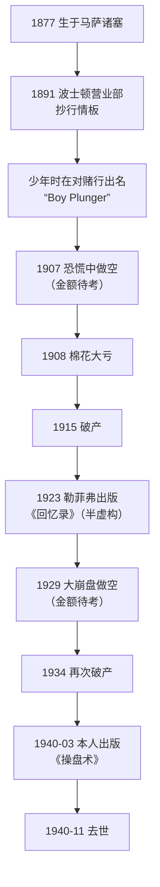

# 利弗莫尔 ①：人物与两本书——少年投机客、破产与《股票大作手回忆录》的真假

::: summary 一页读懂
1. **人物**：杰西·利弗莫尔（Jesse L. Livermore，1877–1940），美国投机客。14 岁在波士顿的券商营业部抄行情板，少年时在“对赌行”（bucket shop）赢钱出名，被称为“Boy Plunger”（少年豪赌客）。
2. **大起大落**：1907 年恐慌和 1929 年大崩盘中做空获得巨利，但也多次破产（1915 年、1934 年等），1940 年 11 月在纽约自杀。具体金额多来自传记和媒体，本文标为待考。
3. **两本书要分清**：《股票大作手回忆录》（*Reminiscences of a Stock Operator*，1923）的作者是记者埃德温·勒菲弗（Edwin Lefèvre），主人公叫“Larry Livingston”，是以利弗莫尔为原型的半虚构作品；《股票大作手操盘术》（*How to Trade in Stocks*，1940）才是利弗莫尔本人署名的著作。
4. **本系列的引用原则**：讲利弗莫尔本人的方法，只引 1940 年的书；引《回忆录》时一律注明“勒菲弗笔下的 Livingston”。
5. **“反转关键点 / 持续关键点”** 这组常见术语，在 1940 年原书里查不到，多见于后人（如 Richard Smitten）的解读。
:::

::: note 阅读说明与免责声明
1940 年原书的英文引文出自其初版影印本（Duell, Sloan & Pearce 出版，版权页印“COPYRIGHT, 1940, BY JESSE L. LIVERMORE”）。该书在美国是否已进入公有领域，网上说法不一，本文未能确认，标为待考，因此只做短篇幅引用。《回忆录》1923 年版已在古腾堡计划公开。生平数字主要参考维基百科及其引用的《纽约时报》《福布斯》等报道，传记里的金额本文统一标为待考。本文不构成任何投资建议。

本系列共 3 篇：① 人物与两本书 · [② 关键价位与领头羊](/reading/livermore-2-pivotal.html) · [③ 资金管理、危险信号与人性](/reading/livermore-3-money.html)。
:::

## 1. 一张简历

| 项目 | 内容 | 出处 / 可靠度 |
|---|---|---|
| 出生 | 1877 年 7 月 26 日，马萨诸塞州 Shrewsbury，家境贫寒 | 维基百科 |
| 入行 | 1891 年 14 岁，在 Paine Webber 波士顿营业部做抄行情板的“board boy”，周薪 5 美元 | 维基百科 |
| 第一笔 | 15 岁前后在对赌行用 5 美元押伯灵顿铁路股票获利 | 维基百科；《回忆录》有同样情节 |
| 绰号 | “Boy Plunger”，被多家对赌行拒之门外 | 1940 年原书序言、维基百科 |
| 1907 年 | 恐慌中做空，据报道一天赚约 100 万美元 | 维基百科转引 Business Insider，待考 |
| 1908 年 | 听信棉花商 Teddy Price 的建议做多棉花，大亏 | 维基百科 |
| 1915 年 | 申请破产 | 《纽约时报》1915-02-18 |
| 1929 年 | 大崩盘中做空，据称获利约 1 亿美元 | 维基百科转引 Business Insider，传记数字，待考 |
| 1934 年 | 再次破产，据报道资产 8.4 万美元、负债 250 万美元 | 维基百科转引《福布斯》，待考 |
| 1940 年 3 月 | 出版 *How to Trade in Stocks*，销量不佳 | 维基百科 |
| 1940 年 11 月 28 日 | 在纽约 Sherry-Netherland 酒店自杀 | 《纽约时报》2001 年书评 |

## 2. 时间线

*图：按维基百科及其引用的报道整理；标“待考”的金额只见于传记或二手报道。*

## 3. 两本书：谁写的，写的是谁

这是读利弗莫尔最容易混淆的地方。

| | 《股票大作手回忆录》 | 《股票大作手操盘术》 |
|---|---|---|
| 英文书名 | *Reminiscences of a Stock Operator* | *How to Trade in Stocks* |
| 出版 | 1923 年 | 1940 年，Duell, Sloan & Pearce |
| 作者 | 埃德温·勒菲弗（记者、作家） | 杰西·利弗莫尔本人 |
| 主人公 | 第一人称的“Larry Livingston” | 作者本人 |
| 性质 | 以利弗莫尔为原型的半虚构传记，书中没有出现利弗莫尔的真名 | 本人讲述方法和记录表格 |
| 版权 | 古腾堡计划已公开 | 美国版权状态待考 |

《回忆录》写得生动，很多“利弗莫尔名言”其实出自这本书，比如：

> “It never was my thinking that made the big money for me. It always was my sitting.”
> （让我赚大钱的从来不是我的想法，而是我的坐功。）——勒菲弗笔下的 Livingston

> “The speculator’s deadly enemies are: Ignorance, greed, fear and hope.”
> （投机者的死敌是：无知、贪婪、恐惧和希望。）——勒菲弗笔下的 Livingston

::: warn 引用时注明出处
这些话可以读，也很有道理，但==严格说它们是勒菲弗写的台词，不是利弗莫尔的著作原文==。外界普遍认为书中故事以利弗莫尔的经历为蓝本，但细节经过文学加工，哪些是真实对话无法逐一核实。本系列凡引《回忆录》，都写“勒菲弗笔下的 Livingston”。
:::

## 4. 1940 年的书：本人怎样介绍自己

1940 年原书的序言由 Edward Jerome Dies 撰写，他称利弗莫尔是“the greatest speculator and market analyst since the turn of the century”（本世纪以来最伟大的投机家和市场分析家），并说他第一次出名是 15 岁时把赚来的 1000 美元放到母亲膝上。

正文第一章开头，利弗莫尔自己写道：

> “The game of speculation is the most uniformly fascinating game in the world. But it is not a game for the stupid, the mentally lazy, the man of inferior emotional balance, nor for the get-rich-quick adventurer. They will die poor.”
> （投机是世界上最始终如一地吸引人的游戏。但它不适合愚蠢的人、懒于思考的人、情绪不稳定的人，也不适合想一夜暴富的冒险者。这些人最终会穷死。）

全书九章：投机的挑战、股票何时“表现正确”、跟随领头羊、落袋为安、关键点、百万美元的失误、三百万美元的利润、利弗莫尔市场要诀、解释规则。后两章附有他手写的六栏记录表，用黑、红墨水和铅笔区分趋势。

::: core 解读：书里最反复出现的三件事
==等待（只在关键点出手）、记录（自己的价格表格）、认错（第一笔亏了就不加仓）。==这三点分别在 [② 关键价位](/reading/livermore-2-pivotal.html) 和 [③ 资金管理](/reading/livermore-3-money.html) 里展开。
:::

## 5. 一面镜子：天才与悲剧

利弗莫尔常被当成“最伟大的交易员”，也常被当成反面教材。维基百科引用费雪（Kenneth Fisher）的评价：有人认为他是史上最伟大的交易员，也有人认为他的经历提醒人们，用杠杆追求巨额收益，不如追求较小但更稳定的回报。

他在 1940 年的书里也反复写自己的错误：一次是棉花上不等时机就重仓，一次是在铜和汽车股见顶后误以为可以“sell everything”（全部做空），结果赔掉了大部分盈利（详见 ②、③）。

::: quote 本文的理解：连续成功之后的大亏
少年成名、几次暴富、几次破产，这条曲线在 A 股游资故事里也不陌生。==方法再好，杠杆和过度自信也能让人一次归零。==可以和 [退学炒股 ③ 连续成功之后的大亏](/reading/tuixue-3-xiaoming.html#4-连续成功之后的大亏) 对照着读。
:::

## 6. 自测与行动

自测 1：《股票大作手回忆录》的作者是谁？主人公叫什么？

作者是埃德温·勒菲弗（Edwin Lefèvre），1923 年出版；主人公叫 Larry Livingston，以利弗莫尔为原型，属于半虚构作品。

自测 2：利弗莫尔本人署名的书是哪一本？

1940 年出版的 *How to Trade in Stocks*（中文常译《股票大作手操盘术》）。

自测 3：“It never was my thinking that made the big money for me. It always was my sitting.” 出自哪本书？

出自《回忆录》，是勒菲弗笔下 Livingston 的话，不是 1940 年原书里的话。

自测 4：“反转关键点 / 持续关键点”出自 1940 年原书吗？

原书里查不到这组术语。原书只说“Pivotal Point”（关键点），这组细分多见于后人（如 Richard Smitten）的解读。

行动清单：

- [ ] 检查自己收藏的“利弗莫尔语录”，标出哪些其实出自《回忆录》
- [ ] 读一遍 1940 年原书的第一章，写下他说的“不适合投机的四种人”里自己占几条
- [ ] 写下自己账户能承受的最大亏损比例，作为后两篇的准备

## 来源

- Jesse L. Livermore, *How to Trade in Stocks*（Duell, Sloan & Pearce, 1940，初版影印 PDF）：https://www.trendfollowing.com/pdfs/Jesse_Livermore-How_To_Trade_In_Stocks_%281940_original%29-EN.pdf
- Edwin Lefèvre, *Reminiscences of a Stock Operator*（1923），Project Gutenberg #60979：https://www.gutenberg.org/ebooks/60979
- 维基百科 Jesse Livermore（生平；1907、1929、1934 年金额转引 Business Insider、《福布斯》及 Richard Smitten 的传记，待考）：https://en.wikipedia.org/wiki/Jesse_Livermore
- The New York Times, “Cotton ‘King’ A Bankrupt”（1915-02-18）：https://www.nytimes.com/1915/02/18/archives/cotton-king-a-bankrupt-jesse-l-livermore-loses-millions-he-made-in.html
- The New York Times, “Off the Shelf; A Speculator’s Life Is Still Elusive”（2001-09-09）：https://www.nytimes.com/2001/09/09/business/off-the-shelf-a-speculator-s-life-is-still-elusive.html
