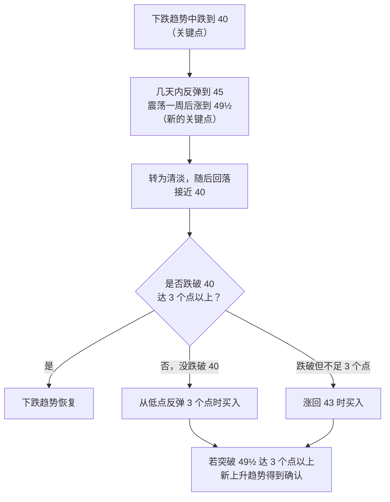

# 利弗莫尔 ②：关键价位与领头羊——《股票大作手操盘术》(1940) 的买点

::: summary 一页读懂
1. **先等股票“表现正确”**：看好一只在 22–28 美元区间横盘的 25 美元股票，不要急着买，等它创出新高（比如 30 美元左右）再说。
2. **新高买，回调不买**：上升趋势中，他在股票经过一次“正常回调”后创新高时买入；“I never buy on reactions or go short on rallies”（我从不在回调中买入，也不在反弹中做空）。
3. **关键点（Pivotal Point）**：他说只要耐心等到关键点再出手，“I have always made money”（我总是赚钱）。书中用“3 个点”作为突破或跌破关键点的确认幅度。
4. **只做领头羊**：“If you cannot make money out of the leading active issues, you are not going to make money out of the stock market as a whole.”（如果你在领头的活跃股上都赚不到钱，在整个股市也赚不到。）
5. **看板块**：用同一板块两只股票的合并走势（他叫“Key Price”）确认趋势，避免被单只股票的假动作骗。
:::

::: note 阅读说明与免责声明
本篇只引用利弗莫尔本人 1940 年的 *How to Trade in Stocks*（中文常译《股票大作手操盘术》）。原书的价格单位是美元，“点”指 1 美元，书中的幅度规则针对的是 1930 年代、股价 30 美元以上的美股，不能直接套用到有涨跌停、T+1 的 A 股。文中和 A 股短线做法的对照，是本文的类比，不是利弗莫尔的观点。原书版权状态待考，只做短篇幅引用。本文不构成任何投资建议。

本系列共 3 篇：[① 人物与两本书](/reading/livermore-1-life.html) · ② 关键价位与领头羊 · [③ 资金管理、危险信号与人性](/reading/livermore-3-money.html)。
:::

## 1. 不要急：等股票“表现正确”

第一章里，利弗莫尔描述了一种常见的失败：看好一只股票，马上买入；股票反向走，失去耐心卖掉；几天后又买回，又被套，再卖；等真正的行情开始时，人已经出局了。

他的建议是：

> “After forming a definite opinion with respect to a certain stock or stocks—do not be too anxious to get into it. Wait and watch the action of that stock or stocks marketwise.”
> （对某只股票形成明确看法后，不要急着进场。等一等，看看它在市场上的表现。）

他举的例子：一只股票价格 25 美元左右，长时间在 22–28 美元之间波动，你认为它最终会涨到 50 美元。那就耐心等它活跃起来、创出新高，比如到 30 美元左右，那时才知道市场站在你这边。

他也承认自己做不到每次都等：

> “I am human and subject to human weaknesses. Like all speculators, I permitted impatience to out-maneuver good judgment.”
> （我是人，也有人性的弱点。和所有投机者一样，我曾让急躁压倒了良好的判断。）

## 2. 正常回调之后创新高，才买

利弗莫尔说，股票进入明确趋势后，会“automatically and consistently”（自动地、一致地）沿着某种方式运行：开始几天放量上涨，然后出现他所说的“Normal Reaction”（正常回调），回调时成交量明显缩小，随后再次上涨。

> “When I see by my records that an upward trend is in progress, I become a buyer as soon as a stock makes a new high on its movement, after having had a normal reaction.”
> （当我的记录显示上升趋势正在进行时，只要股票在一次正常回调之后创出本轮新高，我就买入。）

> “Never be afraid of the normal movement. But be very fearful of abnormal movements.”
> （不要害怕正常的波动，但要非常警惕异常的波动。）

什么是“异常”？书中给的定义是：一天之内从当天极端价格回落六个点或以上，而且这只股票之前没有出现过这种情况。这就是 [③ 危险信号](/reading/livermore-3-money.html#1-危险信号不争辩先出来) 的主题。

::: warn 他明确反对的做法
“I never buy on reactions or go short on rallies.”（我从不在回调中买入，也不在反弹中做空。）同一段紧接着说：==第一笔交易亏损时，再做第二笔是愚蠢的，“Never average losses”（永远不要摊平亏损）。==这一条放在 ③ 里展开。
:::

## 3. 关键点：在行情起点出手

第五章开头：

> “Whenever I have had the patience to wait for the market to arrive at what I call a ‘Pivotal Point’ before I started to trade, I have always made money in my operations.”
> （每当我有耐心等市场到达我所说的“关键点”再开始交易，我总是赚钱。）

原因是：在关键点进场，等于在行情的“psychological time”（心理时刻）起步，一开始就有浮盈，之后才有勇气和耐心拿住，不被途中的小回调洗出去。他说：“I never benefited much from a move if I did not get in at somewhere near the beginning of that move.”（如果没在行情起点附近进场，我从这段行情里得不到多少好处。）

书中的例子（数字均为原书示例）：

*图：按 1940 年原书第五章的示例整理。*

他还提到两个细节：

- 他不用“bullish / bearish”（看多 / 看空）这类词，而用“Upward Trend / Downward Trend”（上升趋势 / 下降趋势），因为前者会让人以为趋势会持续很久，后者只描述当下。
- “A large part of a market movement occurs in the last forty-eight hours of a play”（一段行情的很大一部分出现在最后 48 小时），所以那段时间最需要在场。

::: core 解读：关键点 = 让市场先证明你对了
==关键点不是预测，而是一个让市场先表态的价位。==等价格越过关键点并走出确认幅度，再出手；第一笔就该有浮盈，否则说明时机不对。这和 A 股短线里“确认后再上”的思路相近，比如 [提问系列 · 半仓试错，赢了才加](/reading/asking-3-trading.html#3-仓位半仓试错赢了才加)。
:::

## 4. 跟随领头羊

第三章题为“Follow the Leaders”（跟随领头羊）。几条要点：

1. **别分散到整个市场**：“Do not have an interest in too many stocks at one time. It is much easier to watch a few than many.”（不要同时持有太多股票，盯几只比盯很多容易得多。）
2. **只研究当下的龙头**：“Confine your studies of movements to the prominent stocks of the day.”（只研究当下最突出的股票。）
3. **龙头会换**：就像女装的款式总在变，过去的龙头是铁路、美国糖业和烟草，后来是钢铁，再后来是汽车。旧龙头会被冷落，新龙头会上来。
4. **一个板块见顶，不等于全部见顶**：这是他自己付出代价学到的（见下）。

::: tip 和 A 股游资的“只做龙头”对照
利弗莫尔说的“leading active issues”（领头的活跃股），和 A 股短线讲的龙头股意思接近：==资金最集中、最先启动、最强的那只。==对照 [盖棉 ② 只买龙头，不买龙头的亲戚](/reading/gaipian-2-heli.html#6-只买龙头不买龙头的亲戚) 和 [赵老哥 · 媒体与网友归纳的打法](/reading/zhao-2-style.html#2-媒体与网友归纳的打法)。区别也很明显：他做的是持续数周到数月的趋势，A 股打板多是隔日到几日的接力。
:::

他承认的一个大错：1920 年代末的大牛市里，他看清铜业股的上涨已经结束，不久汽车股也见顶，于是得出一个“faulty conclusion”（错误结论）：可以放心地做空一切。结果“While I was piling up huge paper profits on my copper and motor deals, I lost even more in the next six months trying to find the top of the utility group.”（我在铜和汽车股上积累了巨额账面利润，却在接下来六个月里试图猜公用事业股的顶部，亏得更多。）

## 5. 板块确认：Key Price 与记录表

最后两章，利弗莫尔公开了自己的记录方法：

- 用一张六栏表记录价格：次级反弹、自然反弹、上升趋势、下降趋势、自然回调、次级回调。
- 上升趋势一栏用黑墨水，下降趋势一栏用红墨水，其余用铅笔。
- 对 30 美元以上的股票，大约 6 个点的反向波动才算自然反弹或自然回调的开始。
- 把同一板块两只股票的价格合并，得到“Key Price”。他认为只看一只股票容易被假动作骗，两只合在一起更可靠。

::: quote 关于“反转关键点”和“持续关键点”
中文资料常把利弗莫尔的关键点分成“反转关键点”（Reversal Pivotal Point）和“持续关键点”（Continuation Pivotal Point）。==这组术语在 1940 年原书中查不到==，原书只用“Pivotal Point”一个词。这种分法多见于后人的解读，例如 Richard Smitten 的著作。读者可以把它当作后人的整理，但不宜说成利弗莫尔原话。
:::

## 6. 自测与行动

自测 1：一只 25 美元、长期在 22–28 美元横盘的股票，利弗莫尔建议什么时候买？

等它活跃起来、创出新高（书中举例 30 美元左右），确认市场站在你这边，而不是在区间里提前买。

自测 2：他怎样定义“异常”的回调？

一天之内从当天极端价格回落六个点或以上，而且是这只股票此前没有出现过的。

自测 3：第五章例子里，股票回落到关键点 40 附近，怎样算下跌趋势恢复？

跌破 40 达三个点或以上。若没跌破，从低点反弹三个点时买；若跌破但不足三个点，涨回 43 时买。

自测 4：他在 1920 年代末犯了什么“板块”错误？

看到铜和汽车股见顶，就以为可以做空一切，结果在公用事业股上猜顶，六个月里亏掉的比铜和汽车股上赚的还多。

行动清单：

- [ ] 为自己的自选股写下各自的“关键价位”，只在价格越过后才考虑出手
- [ ] 回看最近五笔买入：有几笔是在回调中“抄”的？结果如何？
- [ ] 每个板块只盯最强的一两只，删掉其余自选

## 来源

- Jesse L. Livermore, *How to Trade in Stocks*（Duell, Sloan & Pearce, 1940），第一、二、三、五、八、九章（初版影印 PDF）：https://www.trendfollowing.com/pdfs/Jesse_Livermore-How_To_Trade_In_Stocks_%281940_original%29-EN.pdf
- 维基百科 Jesse Livermore（Richard Smitten 的相关著作列表）：https://en.wikipedia.org/wiki/Jesse_Livermore
