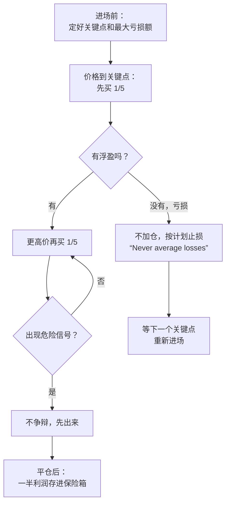

# 利弗莫尔 ③：资金管理、危险信号与人性

::: summary 一页读懂
1. **危险信号**：他引用一位“天才投机家”的话：“When I see a danger signal handed to me, I don’t argue with it. I get out!”（看到危险信号，我不争辩，直接出来。）
2. **永不摊平亏损**：“It is foolhardy to make a second trade, if your first trade shows you a loss. Never average losses.”（第一笔亏损时再做第二笔是愚蠢的。永远不要摊平亏损。）
3. **只在盈利时加仓**：想买 500 股，先买 100 股，涨了再买 100 股，“each succeeding purchase must be at a higher price than the previous one”（每一笔都必须比上一笔价格高）。
4. **把一半利润锁进保险箱**：每次成功平仓后，取出一半利润存进保险箱；收到追加保证金通知就清仓，“Why send good money after bad?”（何必往坏钱里再扔好钱？）
5. **少出手**：“There are only a few times a year, possibly four or five, when you should allow yourself to make any commitment at all.”（一年里值得出手的时候只有几次，也许四五次。）
:::

::: note 阅读说明与免责声明
本篇主要引用利弗莫尔本人 1940 年的 *How to Trade in Stocks*。少数引自 1923 年《股票大作手回忆录》的句子，均标明“勒菲弗笔下的 Livingston”，那是 Edwin Lefèvre 写的半虚构作品（见 [①](/reading/livermore-1-life.html#3-两本书谁写的写的是谁)）。原书版权状态待考，只做短篇幅引用。本文不构成任何投资建议。

本系列共 3 篇：[① 人物与两本书](/reading/livermore-1-life.html) · [② 关键价位与领头羊](/reading/livermore-2-pivotal.html) · ③ 资金管理、危险信号与人性。
:::

## 1. 危险信号：不争辩，先出来

第二章里，利弗莫尔描述了一种典型的危险信号：股票一路只有正常的回调，突然有一天放量大涨后，在收盘前一小时出现七八个点的“abnormal break”（异常下跌），第二天反弹，第三天却涨不上去。他说：

> “By ‘abnormal’ I mean a reaction in one day of six or more points from an extreme price made in that same day—something it has not had before.”
> （我说的“异常”，是指一天之内从当天的极端价格回落六个点或以上，而且是这只股票之前没有过的。）

紧接着，他引用了一位“speculator of great genius”（天才投机家）的话：

> “When I see a danger signal handed to me, I don’t argue with it. I get out! A few days later, if everything looks all right, I can always get back in again.”
> （看到危险信号，我不跟它争辩，直接出来！过几天如果一切正常，我随时可以再进去。）

这位投机家还打了个比方：如果走在铁轨上，看到快车迎面开来，没有人会傻到不让开。

::: core 解读：先出来，错了还能再进去
==出来的成本是一点手续费和可能卖飞，不出来的成本可能是无法承受的亏损。==利弗莫尔说投机者看到危险信号及时行动，可以“hold his losses to a minimum”（把损失控制在最小），再等更好的机会回来。这和段永平说的“发现错了马上停，多大的代价都是最小的代价”（见 [段永平 ② 发现错了马上停](/reading/duan-2-benfen.html#6-发现错了马上停)）是同一种取舍，只是两人判断“错”的依据不同：一个看价格行为，一个看生意本身。
:::

他还有一个反直觉的观点：长期死拿不动的所谓“投资者”，才是“the big gamblers”（真正的大赌徒），因为他们下了注就一直拿着，错了就全输掉。

## 2. 永远不要摊平亏损

> “I never buy on reactions or go short on rallies. One other point: It is foolhardy to make a second trade, if your first trade shows you a loss. Never average losses. Let that thought be written indelibly upon your mind.”
> （我从不在回调中买入，也不在反弹中做空。还有一点：第一笔交易亏损时，再做第二笔是愚蠢的。永远不要摊平亏损。把这句话牢牢刻在心里。）

| 情况 | 利弗莫尔的做法 | 常见的散户做法 |
|---|---|---|
| 第一笔有浮盈 | 按计划加仓，每笔价格都比上一笔高 | 急着卖掉落袋 |
| 第一笔亏损 | 不做第二笔，认错 | 补仓摊低成本 |
| 收到追加保证金通知 | 清仓，“You are on the wrong side of the market.”（你站错了边。） | 追加资金硬扛 |

::: warn A 股语境：补仓摊平是最常见的“反利弗莫尔”操作
“越跌越买、摊低成本”是散户最常见的做法之一，也正是利弗莫尔要求刻在心里的禁令。==补仓的前提必须是你对这家公司的判断没变，并且有充分的基本面依据，而不是只因为“价格更低了”。==短线体系里的对应纪律见 [盖棉 ③ 整体性止损](/reading/gaipian-3-discipline.html#2-整体性止损) 和 [退学炒股 ② 仓位从全仓到回撤线](/reading/tuixue-2-mode.html#3-仓位从全仓到回撤线)。
:::

## 3. 金字塔加仓：只在对的时候加

第六章开头：

> “Let us suppose that you want to buy 500 shares of a stock. Start by buying 100 shares. Then if the market advances buy another 100 shares and so on. But each succeeding purchase must be at a higher price than the previous one.”
> （假设你想买 500 股。先买 100 股，如果市场上涨，再买 100 股，以此类推。但每一笔都必须比上一笔价格高。）

他的理由是：这样做，你的每一笔交易都是盈利的，“The fact that your trades do show you a profit is proof you are right.”（交易有浮盈，本身就证明你是对的。）同一章他还要求：进场前先确定，如果判断错了，自己愿意承担多少损失。

*图：按 1940 年原书第二、四、六章整理。*

## 4. 百万美元的失误：急躁的代价

利弗莫尔在第六章说，这个故事讲出来让他“almost want to turn my face away in embarrassment”（几乎羞于抬头）。

多年前他强烈看多棉花，但市场还没准备好上涨。他忍不住先买了 2 万包，价格被他的买单推高后又跌回原位，他一气之下卖掉，亏了约 3 万美元。几天后又买回 2 万包，同样的事情又发生一次。“This costly operation I repeated five times in six weeks”（这种代价高昂的操作，我在六周里重复了五次），每次亏 2.5 万到 3 万美元，累计近 20 万美元。

他气得让经理把棉花行情机撤掉。撤掉两天后，棉花开始上涨，一口气涨了 500 点，途中只有一次 40 点的回调。他总结：自己实际亏了约 20 万美元，还错过了按原计划在关键点之后买入 10 万包可能获得的约 100 万美元利润。

::: quote 他总结的两个原因
第一，没有耐心等到关键点，“I thought I must make a few extra dollars quickly”（我以为必须赶紧多赚几块钱）。第二，因为自己判断失误而对棉花市场生气，这本身就不符合投机的正确做法。==他的结论是：犯错时不要找借口，“Just admit it and try to profit by it”（承认它，并从中获益）。==
:::

## 5. 落袋为安：把一半利润锁进保险箱

第四章题为“Money in the Hand”（落袋为安）。

> “A speculator should make it a rule each time he closes out a successful deal to take one-half of his profits and lock this sum up in a safe deposit box.”
> （投机者应该定一条规矩：每次成功平仓后，取出一半利润，锁进保险箱。）

他说，投机者从华尔街真正带走的钱，只有成功平仓后从账户里取出来的钱。同一章的其他要点：

- **太快赚到的钱留不住**：两三个月赚 500% 的人，会想“再过两个月我能赚多少”，他称之为“unhealthy money”（不健康的钱），“rolling in rapidly, and stopping for but a short visit”（来得快，只是短暂停留）。
- **追加保证金就清仓**：“When it reaches you, close your account. You are on the wrong side of the market. Why send good money after bad?”
- **安全第一**：“Never make any trade unless you know you can do so with financial safety.”（除非确定在财务上是安全的，否则不要做任何交易。）

::: tip 和芒格、段永平对照
芒格说他唯一一次外汇空头赚了一百万，但对方不停要求追加保证金，“very irritating”，从此不做（见 [芒格 ④ 理性与杠杆](/reading/munger-4-invert.html#6-理性与杠杆)）。段永平的不为清单里有一条“不用margin”（见 [段永平 ② 投资里的不为清单](/reading/duan-2-benfen.html#4-投资里的不为清单不懂不碰不用-margin不做空)）。==三个风格完全不同的人，在杠杆这件事上的结论惊人地接近。==讽刺的是，利弗莫尔自己写下这些规则，却多次因重仓和杠杆破产。
:::

## 6. 少出手：一年四五次

> “Wishful thinking must be banished… one cannot be successful by speculating every day or every week… there are only a few times a year, possibly four or five, when you should allow yourself to make any commitment at all.”
> （必须抛弃一厢情愿的想法……每天或每周都投机不可能成功……一年里值得出手的时候只有几次，也许四五次。）

他讲了一个故事：一位住在加州山里的投机者，只能看到三天前的行情，一年只去旧金山的经纪商那里两三次下单，成绩却非常好。他解释说：“Real movements do not end the day they start.”（真正的行情不会在开始的当天就结束。）住在山里，反而能给行情足够的时间。

《回忆录》里也有一句意思相近的话，常被当成利弗莫尔名言：“There is the plain fool, who does the wrong thing at all times everywhere, but there is the Wall Street fool, who thinks he must trade all the time.”（有一种普通的傻瓜，任何时候都做错事；还有一种华尔街傻瓜，觉得自己必须一直交易。）——勒菲弗笔下的 Livingston

::: core 解读：希望和恐惧放反了位置
1940 年原书说，人天生会希望也会恐惧，但把它们带进投机时，“you are apt to get the two confused and in reverse positions”（你很容易把两者搞混、放反位置）：亏损时抱着希望，盈利时却害怕。《回忆录》里 Livingston 的版本更好记：“Instead of hoping he must fear; instead of fearing he must hope.”（该希望时他得恐惧，该恐惧时他得希望。）==亏损时要怕亏得更多，盈利时要盼赚得更多。==踏空和追高的心理见 [芒格 ③ 被剥夺超级反应](/reading/munger-3-misjudgment.html#3-和交易最相关的五种倾向)。
:::

## 7. 自测与行动

自测 1：利弗莫尔对“摊平亏损”的态度是什么？

“Never average losses.”第一笔亏损时再做第二笔是愚蠢的，要把这句话刻在心里。

自测 2：想买 500 股，他建议怎样分批？

先买 100 股，上涨后再买 100 股，以此类推；每一笔都必须比上一笔价格高。

自测 3：棉花的“百万美元失误”中，他犯了哪两个错误？

一是没有耐心等到关键点就进场，在六周内反复买卖五次；二是因自己判断失误而对市场生气，撤掉了行情机，结果错过了随后 500 点的上涨。

自测 4：收到追加保证金通知时，他建议怎么做？

清仓：“You are on the wrong side of the market. Why send good money after bad?”

自测 5：“Instead of hoping he must fear; instead of fearing he must hope.” 出自哪本书？

出自 1923 年勒菲弗的《回忆录》，是 Livingston 的台词。1940 年原书里有意思相近的表述：希望和恐惧容易被放反位置。

行动清单：

- [ ] 写下自己的“危险信号”清单（例如放量长阴、跌破关键价位），出现就先减仓
- [ ] 检查当前持仓：有没有哪只是靠补仓摊低成本的？
- [ ] 下一次平仓获利后，把一部分利润转出证券账户

## 来源

- Jesse L. Livermore, *How to Trade in Stocks*（Duell, Sloan & Pearce, 1940），第一、二、四、六章（初版影印 PDF）：https://www.trendfollowing.com/pdfs/Jesse_Livermore-How_To_Trade_In_Stocks_%281940_original%29-EN.pdf
- Edwin Lefèvre, *Reminiscences of a Stock Operator*（1923），Project Gutenberg #60979：https://www.gutenberg.org/ebooks/60979
