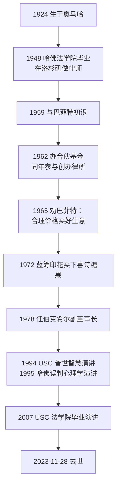

# 芒格 ①：人物与历程——律师、合伙人与“伯克希尔的建筑师”

::: summary 一页读懂
1. **身份**：查理·芒格（1924–2023），律师出身，1962 年转做投资，1978 年起任伯克希尔副董事长，直到 2023 年 11 月 28 日去世，离 100 岁生日只差 33 天。
2. **合伙基金**：据巴菲特 1984 年的《格雷厄姆-多德村的超级投资者》，芒格的合伙基金 1962–1975 年年化 19.8%，同期道指 5.0%；但中间经历了 1973、1974 两年的大幅回撤。
3. **一句话改变伯克希尔**：1965 年他对巴菲特说：“add to it wonderful businesses purchased at fair prices and give up buying fair businesses at wonderful prices.”（用合理价格买好生意，别再用好价格买一般生意。）
4. **建筑师**：巴菲特在 2023 年的信里说，芒格是今天伯克希尔的“architect”（建筑师），自己只是按图施工的“general contractor”（总承包商）。
5. **能学的**：好生意优先于便宜货、少而精、长期保持理性。
:::

::: note 阅读说明与免责声明
本篇依据芒格本人的文字（2014 年伯克希尔年报里的《副董事长的思考》）、巴菲特的致股东信（2023）和《格雷厄姆-多德村的超级投资者》（1984）。履历细节参考维基百科等公开资料，凡只见于传记、未见一手出处的数字，正文会注明。英文为原文，中文为本文译文。本文不构成任何投资建议。

本系列共 4 篇：① 人物与历程 · [② 普世智慧与少下注](/reading/munger-2-worldly.html) · [③ 人类误判心理学](/reading/munger-3-misjudgment.html) · [④ 反过来想与语录辨伪](/reading/munger-4-invert.html)。姊妹系列：[巴菲特系列](/reading/buffett-1-life.html)。
:::

## 1. 一张简历

| 项目 | 内容 |
|---|---|
| 出生 | 1924 年 1 月 1 日，内布拉斯加州奥马哈。少年时在巴菲特祖父的杂货店打过工 |
| 二战 | 1943 年中断密歇根大学的数学学业参军，在陆军航空队做气象相关工作（维基百科） |
| 学历 | 没有本科学位，凭退伍军人福利修课后进入哈佛法学院，1948 年毕业 |
| 律师 | 在洛杉矶做律师；1962 年参与创办律所 Munger, Tolles & Olson |
| 投资 | 1962 年与 Jack Wheeler 合办 Wheeler, Munger & Co.，管理到 1975 年前后 |
| 伯克希尔 | 1978 年起任副董事长；另任 Wesco 董事长（1984–2011）、Daily Journal 董事长、好市多（Costco）董事 |
| 去世 | 2023 年 11 月 28 日 |

巴菲特在 2023 年的信里补充了一个细节：两人都在奥马哈长大，住处相距不远，却直到 1959 年才第一次见面，那年芒格 35 岁。

## 2. 时间线

*图：按巴菲特 2023 年致股东信、芒格公开演讲和维基百科整理。*

## 3. 合伙基金：19.8% 和两年大回撤

巴菲特 1984 年在哥伦比亚大学的演讲里，列出了芒格合伙基金的成绩：1962–1975 年复合年化 19.8%，同期道琼斯指数年化 5.0%。巴菲特这样描述芒格的打法：

> “His portfolio was concentrated in very few securities and therefore, his record was much more volatile but it was based on the same discount-from-value approach.”
> （他的组合集中在极少数证券上，所以业绩波动大得多，但依据的是同一种“价格低于价值”的方法。）

同一张表（Table 5）也列出了逐年成绩：合伙整体 1973 年 −31.9%，1974 年 −31.5%，1975 年反弹 +73.2%。两年累计跌掉一半多，之后芒格在 1970 年代中期结束了合伙。==回撤数字出自巴菲特文中的表格，属一手；合伙具体清算时间以传记为准，待考。==

::: warn 集中的代价
年化 19.8% 的背后，是连续两年三成左右的回撤。集中持股能放大优秀判断，也会放大市场下跌时的账面损失。==想学芒格的集中，先问自己能不能扛住两年腰斩。==这也是理解他谈杠杆时格外谨慎的一个背景（他本人的说法其实更细，见 [④ 反过来想](/reading/munger-4-invert.html#6-理性与杠杆)）。
:::

## 4. 1965 年的那句话：好生意胜过便宜货

巴菲特在 2023 年的信里，用芒格去世后的第一段文字回忆了这件事。1965 年巴菲特刚买下伯克希尔纺织厂，芒格对他说：

> 沃伦，别再买伯克希尔这样的公司了。不过既然你已经控制了它，那就往里面加入用合理价格买来的好生意，放弃用好价格买一般的生意。换句话说，放弃你从偶像格雷厄姆那里学来的一切。那套方法有效，但只在小规模时有效。
>
> *“Warren, forget about ever buying another company like Berkshire. But now that you control Berkshire, add to it wonderful businesses purchased at fair prices and give up buying fair businesses at wonderful prices. In other words, abandon everything you learned from your hero, Ben Graham. It works but only when practiced at small scale.”*（巴菲特 2023 年致股东信转述）

巴菲特说，自己“With much back-sliding”（反复退回老路）才慢慢照做。喜诗糖果（1972）是这条思路的第一个大样本，详见 [巴菲特 ② 护城河与好生意](/reading/buffett-2-moat.html#4-好公司合理价胜过一般公司便宜价)。

::: quote 建筑师与总承包商
*“In reality, Charlie was the ‘architect’ of the present Berkshire, and I acted as the ‘general contractor’ to carry out the day-by-day construction of his vision.”*

实际上，查理是今天伯克希尔的“建筑师”，我只是按他的蓝图做日常施工的“总承包商”。（巴菲特 2023 年致股东信）
:::

## 5. 芒格眼中的“伯克希尔体系”

2014 年伯克希尔成立 50 周年，芒格自己写了一篇《副董事长的思考——过去与未来》，附在年报里。他把伯克希尔的管理办法总结成 15 条“Berkshire system”，下面摘几条和普通投资者最相关的：

| 原则（芒格 2014） | 本文的理解 |
|---|---|
| 只回避“无法做出有用预测”的业务 | 能力圈的公司版：看不懂的不碰 |
| 子公司 CEO 拥有“very extreme autonomy”（极大的自主权） | 选对人，然后放手 |
| 买入时“seek to pay a fair price for a good business that the Chairman could pretty well understand” | 合理价格、好生意、看得懂，三者缺一不可 |
| 几乎不卖子公司 | 好生意要拿得住 |
| 只保留很少的负债，保持“virtually perfect creditworthiness” | 永远不让自己被迫出局 |
| 董事长的第一优先是“reservation of much time for quiet reading and thinking” | 留出大段时间安静地读和想 |

::: core 解读：一套为“少犯大错”设计的系统
这些条目单看都不新鲜，难的是几十年不改。芒格在同一篇文章里说，巴菲特设计这套体系时最想要的，是让最重要的人（从他自己开始）持续保持==理性、技能和投入==。理性这个词，会贯穿本系列四篇。
:::

## 6. 自测与行动

自测 1：芒格合伙基金 1962–1975 年的成绩出自哪里？

巴菲特 1984 年的《格雷厄姆-多德村的超级投资者》：年化 19.8%，同期道指 5.0%。同文表格还写明 1973 年 −31.9%、1974 年 −31.5%。

自测 2：1965 年芒格给巴菲特的建议，核心是哪一句？

“add to it wonderful businesses purchased at fair prices and give up buying fair businesses at wonderful prices.” 用合理价格买好生意，放弃用好价格买一般生意。

自测 3：巴菲特怎样形容芒格在伯克希尔的角色？

“architect”（建筑师）。巴菲特说自己只是按图施工的“general contractor”（总承包商）。

行动清单：

- [ ] 翻出自己最近三笔买入：买的是“好生意”，还是“便宜货”？
- [ ] 估算自己的组合如果连续两年各跌三成，生活和心态能否承受
- [ ] 每周留出一段不看行情的“安静阅读与思考”时间

## 来源

- 巴菲特 2023 年致股东信（“Charlie Munger – The Architect of Berkshire Hathaway”）：https://www.berkshirehathaway.com/letters/2023ltr.pdf
- 芒格《Vice Chairman’s Thoughts – Past and Future》，伯克希尔 2014 年年报：https://www.berkshirehathaway.com/letters/2014ltr.pdf
- Warren Buffett, *The Superinvestors of Graham-and-Doddsville*（1984）：https://business.columbia.edu/insights/chazen-global-insights/superinvestors-graham-and-doddsville
- 维基百科 Charlie Munger（履历；合伙清算时间等细节引自 Janet Lowe《Damn Right!》，待考）：https://en.wikipedia.org/wiki/Charlie_Munger
