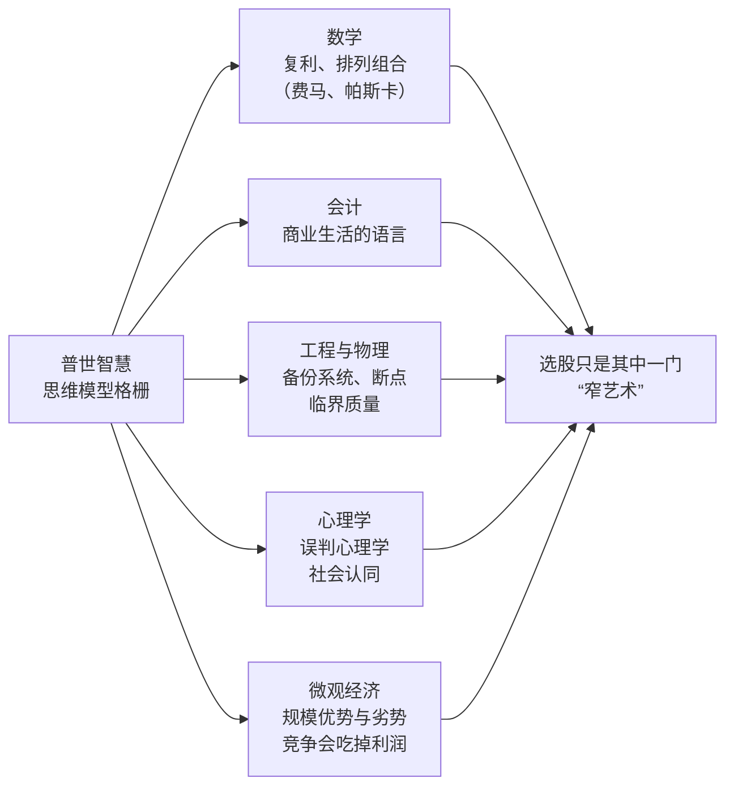

# 芒格 ②：普世智慧——1994 年 USC 演讲里的格栅与少下注

::: summary 一页读懂
1. **出处**：1994 年芒格在南加大商学院（USC Marshall）讲了一堂课，题目是《关于基本的普世智慧——它与投资管理和商业的关系》（A Lesson on Elementary Worldly Wisdom）。本篇只引这份讲稿。
2. **格栅**：孤立的事实记不住、也用不上，要把它们挂在多个学科的“思维模型格栅”上。他说 80 到 90 个重要模型就能承担约九成的分量。
3. **锤子**：只有一种模型的人，看什么问题都像钉子。他拿极端的有效市场理论举例。
4. **赛马彩池**：股市像按投注比例定赔率的赛马彩池，赢家的共同点是“bet very seldom”（很少下注），机会来时下重注。
5. **能力圈**：每个人都有能力圈，而且很难扩大，只在自己有优势的地方下注。
:::

::: note 阅读说明与免责声明
本篇的引文都出自 1994 年 USC 演讲的公开讲稿（Farnam Street 整理版）。英文为原文，中文为本文译文。讲稿是事后整理的文字，个别措辞可能和现场录音有出入。本文不构成任何投资建议。

本系列共 4 篇：[① 人物与历程](/reading/munger-1-life.html) · ② 普世智慧与少下注 · [③ 人类误判心理学](/reading/munger-3-misjudgment.html) · [④ 反过来想与语录辨伪](/reading/munger-4-invert.html)。
:::

## 1. 什么是普世智慧：把事实挂在格栅上

演讲一开头，芒格说自己要“玩个小把戏”：题目是选股，但先讲范围更大的普世智慧。他给出的第一条规则是：

> “If the facts don’t hang together on a latticework of theory, you don’t have them in a usable form. You’ve got to have models in your head.”
> （如果事实不能挂在一个理论的格栅上，它们就不是能用的形式。你脑子里得有模型。）

他接着说，只会死记硬背再背出来的学生，“fail in school and in life”（在学校和生活里都会失败）。

::: core 解读：模型是“挂钩”，不是“答案”
==格栅的意思是先有框架，再往上挂经验。==看一条新闻、一份财报时，先问它属于哪个模型：规模优势、激励、复利，还是供需？能挂上去的，才算真的“知道了”。
:::

## 2. 多学科模型：80 到 90 个就够

芒格强调要有“multiple models”（多个模型），而且要跨学科。好消息是：

> “80 or 90 important models will carry about 90% of the freight in making you a worldly-wise person. And, of those, only a mere handful really carry very heavy freight.”
> （八九十个重要模型，就能承担让你变得通达世事的大约九成分量。其中真正扛大梁的，只有寥寥几个。）

他在演讲里点到的模型，按学科大致可以这样归类：

*图：按 1994 年演讲内容整理，不是芒格本人画的图。*

几个和投资关系最紧的例子（均出自同一份讲稿）：

| 模型 | 芒格举的例子 | 本文的理解 |
|---|---|---|
| 复利与排列组合 | 复利之后最有用的是“elementary math of permutations and combinations”（基础的排列组合） | 用概率思考，而不是用感觉 |
| 规模优势 + 社会认同 | 可口可乐“available almost everywhere in the world”（几乎全世界都买得到），全球分销网络要大企业慢慢才能建成 | 心理学模型能解释护城河 |
| 竞争吃掉利润 | 航空公司给世界带来了很多好处，但自莱特兄弟以来股东累计是亏钱的 | 对社会好的行业不等于好生意 |
| 技术进步的好处归谁 | 纺织厂有人推荐效率翻倍的新织机，巴菲特说“希望它不管用，否则我就关厂” | 商品化行业里，技术红利归客户 |

最后一行可以和 [巴菲特 ② 护城河](/reading/buffett-2-moat.html#4-好公司合理价胜过一般公司便宜价) 对照着看：芒格说的“好生意”，就是技术进步和竞争吃不掉利润的生意。

## 3. 拿锤子的人：一种模型的危险

芒格说市场“partly efficient and partly inefficient”（部分有效、部分无效）。对把有效市场理论推到极端的人，他的评价是：

> “I have a name for people who went to the extreme efficient market theory—which is ‘bonkers’… Again, to the man with a hammer, every problem looks like a nail.”
> （对那些把有效市场理论推到极端的人，我有个称呼：“疯了”。……还是那句话：对拿锤子的人来说，每个问题都像钉子。）

他的解释是：这套理论能让数学好的人做出漂亮推导，所以有吸引力；问题是它的基本假设“did not tie properly to reality”（跟现实对不上）。

::: warn 别只带一把锤子
做短线的人容易把一切都看成情绪和资金，做价值的人容易把一切都看成估值。==只用一个模型，是普世智慧想治的头号毛病。==本站的游资、价值两条线可以互相当“第二把工具”。
:::

## 4. 赛马彩池：很少下注，下就下重注

芒格最喜欢用来比喻股市的模型，是赛马场的彩池（pari-mutuel）制度：赔率由所有人的下注决定，热门马赔率低，冷门马赔率高。明显的好马人人都看得出来，所以赢钱并不容易。那么长期赢家靠什么？

> “They bet very seldom… the wise ones bet heavily when the world offers them that opportunity. They bet big when they have the odds. And the rest of the time, they don’t. It’s just that simple.”
> （他们很少下注……聪明人在世界给出机会时下重注。有胜算时下大注，其余时间不下。就这么简单。）

他转述了巴菲特的“20 孔打卡”：如果一辈子只能做 20 笔投资，打完就不能再投，你会想得非常仔细，并且重仓真正想透的那几笔。他还说伯克希尔累积的财富里，“the top ten insights account for most of it”（最重要的十个洞见贡献了大部分）。

::: tip 本文的理解：少下注不等于不努力
同一段里芒格说：“The way to win is to work, work, work, work and hope to have a few insights.”（赢的方法是工作、工作、再工作，然后指望有几个洞见。）==大量研究，极少出手==，这和 [巴菲特 ④ 集中还是分散](/reading/buffett-4-competence.html#2-集中还是分散) 是同一个意思。短线体系里“看对了才加仓”的做法，见 [提问系列 · 仓位](/reading/asking-3-trading.html#3-仓位半仓试错赢了才加)。
:::

## 5. 能力圈与市场先生

讲到伯克希尔为什么不碰科技股，芒格说是因为“personal inadequacies”（自身的不足），然后说：

> “Every person is going to have a circle of competence. And it’s going to be very hard to advance that circle.”
> （每个人都有自己的能力圈，而且很难把它扩大。）

他用自己举例：如果按音乐水平给人排位，他会排到低得说不出口的位置。所以要找到自己有优势的地方，“play within your own circle of competence”（在自己的能力圈内玩）。详见 [巴菲特 ④ 能力圈](/reading/buffett-4-competence.html#1-能力圈知道边界比圈子大更重要)。

对格雷厄姆的体系，芒格说最好的部分是“市场先生”：

> “Instead of thinking the market was efficient, he treated it as a manic-depressive who comes by every day.”
> （格雷厄姆不认为市场是有效的，而是把它当成一个每天都上门报价的躁郁症患者。）

你可以买、可以卖，也可以什么都不做。详见 [巴菲特 ③ 市场先生](/reading/buffett-3-value.html#4-市场先生)。

## 6. 卖鱼钩的人：激励决定行为

讲到投资管理行业为什么普遍跑不赢，芒格讲了一个故事。他问一个卖钓具的人：这些紫色绿色的鱼饵，鱼真的会咬吗？对方答：

> “Mister, I don’t sell to fish.”
> （先生，我不是卖给鱼的。）

意思是鱼饵设计出来是为了让钓鱼的人买，不是为了让鱼上钩。芒格说很多投资管理人就像这个卖钓具的人：按伯克希尔的方式拿着几块好资产不动，客户会变富，但管理人很难收到高管理费。所以“what makes sense for the investor is different from what makes sense for the manager”（对投资者合理的事，和对管理人合理的事不一样）。

::: quote 本文的理解：先看对方靠什么赚钱
荐股群、付费课程、券商研报，都可以先问一句：==他是卖给鱼的，还是卖给钓鱼人的？==激励这个模型，在 [③ 人类误判心理学](/reading/munger-3-misjudgment.html) 里排第一位。
:::

## 7. 自测与行动

自测 1：芒格说多少个模型能承担大约九成的分量？

80 到 90 个重要模型（“80 or 90 important models will carry about 90% of the freight”），其中真正扛大梁的只有几个。

自测 2：赛马彩池模型里，长期赢家的共同点是什么？

“They bet very seldom.” 很少下注；有胜算时下重注，其余时间不下。

自测 3：“I don’t sell to fish” 这个故事说明了哪个模型？

激励：产品和建议是按买单的人设计的，未必对最终使用者有利。投资者和管理人的利益并不一致。

自测 4：芒格怎样评价极端的有效市场理论？

他称之为“bonkers”（疯了），并用“对拿锤子的人来说，每个问题都像钉子”来形容：理论内部自洽，但基本假设和现实对不上。

行动清单：

- [ ] 写下自己常用的 5 个判断模型，看看是否都来自同一个学科
- [ ] 回顾过去一年的交易次数：如果只有 20 张“打孔卡”，哪几笔值得用掉？
- [ ] 下一次看到荐股或推销时，先写下对方的收费方式

## 来源

- Charlie Munger, *A Lesson on Elementary Worldly Wisdom As It Relates To Investment Management & Business*，USC Business School，1994（Farnam Street 讲稿）：https://fs.blog/great-talks/a-lesson-on-worldly-wisdom/
- 巴菲特 1984 年《格雷厄姆-多德村的超级投资者》也有“to a man with a hammer, everything looks like a nail”的说法（巴菲特称是“a friend”说的）：https://business.columbia.edu/insights/chazen-global-insights/superinvestors-graham-and-doddsville
