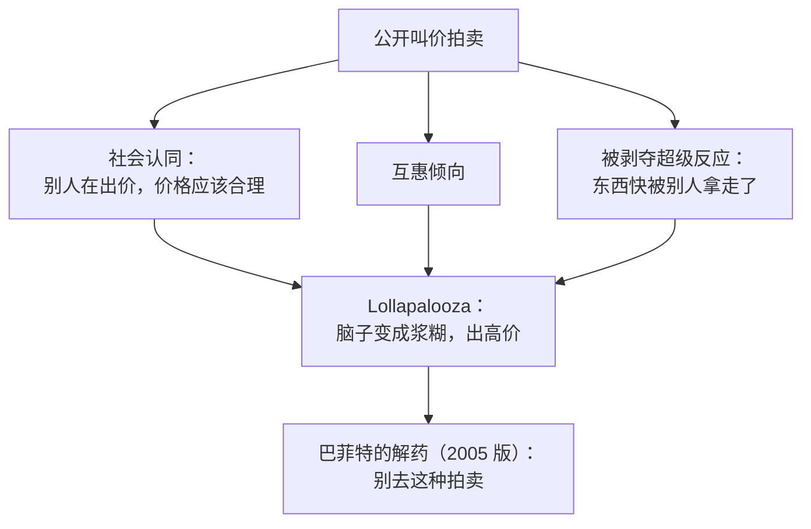

# 芒格 ③：人类误判心理学——1995 哈佛演讲与 2005 修订版

::: summary 一页读懂
1. **两个版本**：1995 年前后芒格在哈佛讲了“24 Standard Causes of Human Misjudgment”（人类误判的 24 个标准原因），讲稿由 Whitney Tilson 整理。2005 年他为《穷查理宝典》全面重写，扩成 25 条“倾向”（Tendency）。
2. **第一条是激励**：两版都把激励放在第一位。他说自己理解激励的能力一直在同龄人前 5%，却“all my life I’ve underestimated it”（一辈子都低估了它）。
3. **和炒股最相关的几条**：避免不一致（不愿改主意）、过度自我评价（买了就觉得更好）、过度乐观、被剥夺超级反应（亏损和“差一点到手”特别痛）、社会认同（跟着别人做）。
4. **Lollapalooza**：几种倾向朝同一个方向叠加时，结果会走向极端。公开叫价拍卖就是“专门把脑子变成浆糊”的场景。
5. **怎么用**：把这份清单当成检查表，在下单前逐条过一遍。
:::

::: note 阅读说明与免责声明
1995 年版是根据录音整理的讲稿，整理者 Whitney Tilson 标注的日期是“Estimated date: June, 1995”（估计 1995 年 6 月）。2005 年版是芒格本人凭记忆重写的文字，收入《穷查理宝典》，Farnam Street 经授权刊出全文。两版编号不同，本文注明出自哪一版。英文为原文，中文为本文译文。本文不构成任何投资建议。

本系列共 4 篇：[① 人物与历程](/reading/munger-1-life.html) · [② 普世智慧与少下注](/reading/munger-2-worldly.html) · ③ 人类误判心理学 · [④ 反过来想与语录辨伪](/reading/munger-4-invert.html)。
:::

## 1. 两个版本，一份清单

| | 1995 年哈佛版 | 2005 年修订版 |
|---|---|---|
| 形式 | 现场演讲，事后整理 | 芒格本人书面重写 |
| 条目 | 24 个“标准原因” | 25 个“倾向” |
| 第一条 | 低估激励（reinforcement / incentives）的力量 | Reward and Punishment Superresponse Tendency（奖惩超级反应倾向） |
| 最后一条 | 多种原因叠加 | Lollapalooza Tendency（多种倾向叠加导致极端结果） |
| 风格 | 口语化，例子多 | 更系统，每条都附“解药” |

2005 年版的序言里，芒格说自己找好判断力的方法是反过来：

> “I had long looked for insight by inversion in the intense manner counseled by the great algebraist, Jacobi: ‘Invert, always invert.’ I sought good judgment mostly by collecting instances of bad judgment, then pondering ways to avoid such outcomes.”
> （我一直按照大数学家雅可比的劝告，用逆向的方式寻找洞见：“反过来，总是反过来。”我寻求好判断的主要办法，是收集坏判断的例子，然后琢磨怎样避免那样的结局。）

这句话是 [④ 反过来想](/reading/munger-4-invert.html) 的起点。

## 2. 第一条：激励

1995 年版：

> “I think I’ve been in the top 5% of my age cohort all my life in understanding the power of incentives, and all my life I’ve underestimated it.”
> （我认为自己理解激励力量的能力，一辈子都在同龄人的前 5%，可我一辈子都低估了它。）

他举的例子是联邦快递：夜班总是不能按时把包裹转运完，讲道理、劝说都没用。后来改成按班次付钱、装完就可以下班，问题马上解决。2005 年版还讲了施乐的例子：销售佣金设计让业务员更愿意推销旧的、更差的机器。

2005 年版的结论是：

> “Never, ever, think about something else when you should be thinking about the power of incentives.”
> （在应该考虑激励力量的时候，永远、永远不要去想别的。）

::: core 解读：先问“谁因此得利”
公告、研报、荐股、主力“护盘”，都可以先问==这件事让谁得利，他的报酬怎么算==。这和 [② 卖鱼钩的人](/reading/munger-2-worldly.html#6-卖鱼钩的人激励决定行为) 是同一个模型。网上流传的“Show me the incentive and I’ll show you the outcome”在这两份讲稿里都查不到，见 [④ 语录辨伪](/reading/munger-4-invert.html)。
:::

## 3. 和交易最相关的五种倾向

下面五条出自 2005 年版，括号里是原文编号。

| 倾向 | 芒格原文要点 | 在股市里的样子 |
|---|---|---|
| 避免不一致（5） | 大脑不愿改变，会形成“first conclusion bias”（第一结论偏差）；达尔文的解药是专门找反面证据 | 买入后只看利好，不看利空 |
| 过度自我评价（12） | 买了猪腩期货的人，“even more strongly than before”（比买之前更坚信）自己的投机正确 | 持仓的股票越看越顺眼 |
| 过度乐观（13） | 引狄摩西尼：“What a man wishes, that also will he believe.”（人想要什么，就会相信什么。）解药是费马和帕斯卡的概率数学 | 只算赚多少，不算概率 |
| 被剥夺超级反应（14） | 十元损失带来的痛苦大于十元收益带来的快乐；“差一点到手”被拿走，反应像失去已拥有的东西 | 死扛亏损、踏空后追高 |
| 社会认同（15） | 电梯实验：十个人都面朝后站，进来的陌生人常常也转过身去 | 看到别人都在买就跟进 |

被剥夺超级反应那一条，芒格还讲了自家的狗：性情温顺，唯一会咬人的情况，是有人想从它嘴里拿走已经叼着的食物。他说：“Humans are much the same as this Munger dog.”（人和这只芒格家的狗差不多。）

::: warn 踏空和亏损为什么那么痛
==“差一点到手”的东西被拿走，大脑会当成真实的损失。==这能解释为什么踏空比亏钱还难受，见 [退学炒股 ③ 踏空为什么比亏钱难受](/reading/tuixue-3-xiaoming.html#3-踏空为什么比亏钱难受)。1995 年版里芒格说老虎机设计者故意制造“bar, bar, walnut”这样的差一点中奖，因为他们“understand human psychology”（懂人性）。
:::

## 4. Lollapalooza：几种倾向叠加

2005 年版第 25 条的全称是“The Tendency to Get Extreme Consequences from Confluences of Psychological Tendencies Acting in Favor of a Particular Outcome”（多种心理倾向朝同一结果汇合，导致极端后果的倾向）。他说这条“dominates life”（主导着生活），并用它解释米尔格拉姆电击实验的极端结果。

1995 年版说得更直白：

> “Again, three, four, five of these things work together and it turns human brains into mush. And maybe you think this doesn’t happen in picking investments? If so, you’re living in a different world than I am.”
> （还是那样，三四五个因素一起起作用，就会把人脑变成浆糊。你也许以为挑选投资时不会这样？如果你这么想，那你和我活在不同的世界里。）

他举的例子是公开叫价拍卖：

*图：按 1995 年版和 2005 年版讲稿整理。*

::: tip 本文的理解：连板股的情绪也是一场“拍卖”
连板股的竞价、封单、群聊里的喊单，很像公开叫价：别人在抢（社会认同），怕错过（被剥夺），自己之前看好过（避免不一致）。==几种倾向叠在一起时，最该做的是先离开现场。==游资系统用规则对冲这一点，例如 [职业炒手 · 弱市不做](/reading/zhiye-2-core.html#1-第一原则弱市不做)。
:::

## 5. 解药：检查表与反面证据

两份讲稿给出的办法很朴素：

1. **检查表**：2005 年版讲“可得性误判”时说，解药包括“use of checklists, which are almost always helpful”（使用检查表，几乎总是有帮助）。
2. **专找反面证据**：达尔文训练自己特别留意与自己假设相反的证据，“more so if he thought his hypothesis was a particularly good one”（越觉得自己的假设好，越要找反证）。
3. **欢迎坏消息**：伯克希尔有一句常说的话：“Always tell us the bad news promptly. It is only the good news that can wait.”（坏消息请马上告诉我们，只有好消息可以等。）
4. **用概率代替感觉**：对付过度乐观，用费马和帕斯卡的简单概率数学。

::: quote 芒格的自我提醒（2005 版）
他说这份清单是从各个发现者那里“stolen”（偷来的），再按“Munger’s notion of what makes recall easy”（芒格觉得好记的方式）重新命名，目的是方便自己避免犯错。==清单不是学术理论，是一个实践者给自己用的工具。==
:::

## 6. 自测与行动

自测 1：1995 年版和 2005 年版各有多少条？

1995 年哈佛版是 24 个“Standard Causes”，2005 年修订版是 25 个“Tendency”，最后一条是 Lollapalooza。

自测 2：芒格说他对激励的理解一直在同龄人前 5%，结果呢？

“all my life I’ve underestimated it”，一辈子都低估了激励的力量。

自测 3：为什么“差一点到手”会特别痛？

被剥夺超级反应：差一点得到又被拿走时，人的反应和失去长期拥有的东西差不多。老虎机故意制造“差一点中奖”。

自测 4：公开叫价拍卖里叠加了哪些倾向？巴菲特的解药是什么？

社会认同、互惠、被剥夺超级反应等叠加（Lollapalooza）。解药是“Don’t go to such auctions”——别去。

行动清单：

- [ ] 把上面五种倾向抄成一张卡片，下单前逐条打钩
- [ ] 为当前最大的持仓写下三条反面证据
- [ ] 回想最近一次踏空后追高：当时有几种倾向在同时起作用？

## 来源

- Charlie Munger, *The Psychology of Human Misjudgment*（2005 年修订版，收入《穷查理宝典》），Farnam Street 授权全文：https://fs.blog/great-talks/psychology-human-misjudgment/
- Charlie Munger on the Psychology of Human Misjudgment, Speech at Harvard University, estimated June 1995, transcribed by Whitney Tilson（Internet Archive 存档）：https://web.archive.org/web/2016/http://www.rbcpa.com/mungerspeech_june_95.pdf
