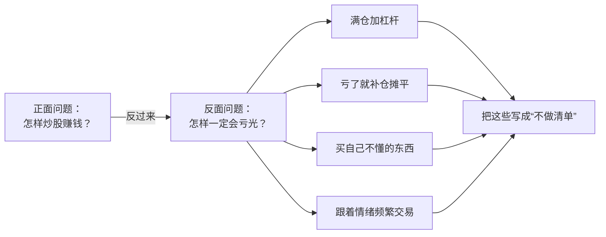

# 芒格 ④：反过来想——2007 USC 毕业演讲、理性与语录辨伪

::: summary 一页读懂
1. **反过来想**：2007 年在南加大法学院毕业典礼上，芒格说，想帮印度，不要问“怎样帮印度”，要问“什么在对印度造成最大的伤害，怎样避免它”。
2. **先求配得上**：“the safest way to try and get what you want is to try and deserve what you want.”（得到想要东西最稳妥的办法，是让自己配得上它。）
3. **铁律**：除非能比支持者更好地讲出反方论点，否则自己无权对一个问题发表意见。
4. **理性**：2023 年 Daily Journal 股东会上，有人问什么品质帮他最多，他答：“That’s easy — rationality.”（这很简单：理性。）
5. **语录辨伪**：网上流传的几句“芒格名言”，在本系列引用的一手讲稿里查不到，本文逐条标为待考。
:::

::: note 阅读说明与免责声明
本篇主要依据 2007 年 5 月 USC 法学院毕业演讲的公开讲稿，以及 2023 年 2 月 Daily Journal 股东会的问答记录（Kingswell 的第三方逐字整理，非公司官方文本）。英文为原文，中文为本文译文。本文不构成任何投资建议。

本系列共 4 篇：[① 人物与历程](/reading/munger-1-life.html) · [② 普世智慧与少下注](/reading/munger-2-worldly.html) · [③ 人类误判心理学](/reading/munger-3-misjudgment.html) · ④ 反过来想与语录辨伪。
:::

## 1. 反过来想：从“怎样成功”到“怎样避免失败”

演讲中，芒格提到院长开场讲的故事：一个乡下人想知道自己会死在哪里，好永远不去那个地方。芒格说这个故事里有“a profound truth”（深刻的道理），然后说：

> “If you want to help India, the question you should ask is not, ‘How can I help India?’ You think, ‘What’s doing the worst damage in India? What would automatically do the worst damage and how do I avoid it?’ You’d think they are logically the same thing, they’re not.”
> （如果你想帮印度，该问的不是“我怎样帮印度”，而是“什么在对印度造成最大的伤害？什么会自然而然地造成最大伤害，我怎样避免它？”你会以为这两个问题逻辑上是一回事，其实不是。）

> “Inversion will help you solve problems that you can’t solve in other ways.”
> （反过来想，能帮你解决用别的办法解决不了的问题。）

他当场示范：人生中什么会真的失败？答案很简单，“sloth and unreliability”（懒惰和不可靠）。

*图：按 2007 年演讲的逆向思考方法，套用到交易上的示例，反面问题由本文列出。*

::: core 解读：反过来想的产物是一张“不做清单”
==正面问题通常没有标准答案，反面问题的答案往往很具体。==把“怎样必然亏光”列出来，再逐条避开，就是一套可执行的纪律。段永平把同样的思路叫“stop doing list”，见 [段永平 ② 不为清单](/reading/duan-2-benfen.html#3-不为清单不对的事情不做)。游资体系里的整体性止损也是这个思路，见 [盖棉 ③ 整体性止损](/reading/gaipian-3-discipline.html#2-整体性止损)。
:::

## 2. 先求配得上

> “I got at a very early age the idea that the safest way to try and get what you want is to try and deserve what you want. It’s such a simple idea. It’s the golden rule so to speak.”
> （我很早就懂得：得到你想要的东西，最稳妥的办法是让自己配得上它。这个道理很简单，可以说就是黄金法则。）

他把这句话落到行为上：给世界提供的东西，应该是你站在对面时也愿意买的东西。演讲最后，他说文明能达到的最高形式是“a seamless web of deserved trust”（一张无缝的、值得信任的网）：程序很少，只有完全可靠的人彼此正确地信任。

## 3. 学习机器

芒格说，没有巴菲特这台“continuous learning machine”（持续学习的机器），伯克希尔的成绩不可能出现。他接着说：

> “I constantly see people rise in life who are not the smartest, sometimes not even the most diligent, but they are learning machines. They go to bed every night a little wiser than when they got up.”
> （我不断看到一些人在人生中崛起，他们不是最聪明的，有时也不是最勤奋的，但他们是学习机器。他们每晚睡觉时，都比早上起床时更聪明一点。）

他还讲了“assiduity”（勤勉）这个词，说他喜欢这个词，因为它的意思是坐下来、不做完不起身。

## 4. 要避开的思维方式

> “Generally speaking, envy, resentment, revenge, and self-pity are disastrous modes of thought.”
> （总的来说，嫉妒、怨恨、报复和自怜，都是灾难性的思维方式。）

他特别提到自怜“gets pretty close to paranoia”（很接近偏执），而偏执是最难扭转的东西之一。另外两条：

- **极端的意识形态**：它会“cabbages up one’s mind”（把脑子变成一棵卷心菜）。
- **扭曲的激励系统**：不要待在一个让自己越来越蠢、越来越坏的“perverse incentive system”里。

::: warn 本文的理解：亏损后的自怜和报复
大亏之后想“报复性”地赚回来，或者陷在“市场针对我”的自怜里，正是芒格说的灾难性思维。==连续成功之后的大亏，常常就是从这里开始的==，见 [退学炒股 ③ 连续成功之后的大亏](/reading/tuixue-3-xiaoming.html#4-连续成功之后的大亏)。
:::

## 5. 铁律：先把反方讲好

讲到意识形态，芒格说他有一条“iron prescription”（铁律），帮他在偏向某种立场时保持清醒：

> “I’m not entitled to have an opinion on this subject unless I can state the arguments against my position better than the people do who are supporting it.”
> （除非我能比支持者更好地讲出反对我立场的论点，否则我无权对这个问题发表意见。）

同一场演讲里他也提到“objectivity maintenance”（维持客观），举的还是达尔文特别留意反面证据的例子，和 [③ 的解药](/reading/munger-3-misjudgment.html#5-解药检查表与反面证据) 一脉相承。

::: tip 用法：写一段“空头陈述”
买入一只股票之前，先写一段最有力的看空理由。==写不出来，或者写出来自己无法反驳，就先别买。==
:::

## 6. 理性与杠杆

2023 年 2 月的 Daily Journal 股东会，是芒格去世前最后几次长时间公开问答之一。有人问什么品质对他帮助最大：

> “That’s easy — rationality. If you’re just not crazy, you have a big advantage over 95% of the people… If you’re patient and a gratification-deferrer, in addition to being not crazy, then it’s practically a cinch.”
> （这很简单：理性。只要你不疯，就比 95% 的人有很大优势……如果在不疯之外，你还有耐心、能延迟满足，那几乎就是稳操胜券了。）

关于杠杆，他的说法比网上流传的版本细得多。主持人 Becky Quick 问：您说过毁掉人的三样东西是“ladies, liquor, and leverage”（女人、酒和杠杆），为什么还用杠杆？他答：

> “You’re right. I used a little on my way up and so did Warren, by the way.”
> （你说得对。我在上升阶段用过一点，顺便说一句，沃伦也用过。）

他解释说，巴菲特合伙基金早年借钱做的是与大盘涨跌无关的事件套利（清算、并购等）。他还说，自己晚年很长时间不用杠杆，最近只在机会“ridiculously good”（好得离谱）时在 Daily Journal 等处用了一点。说到唯一一次外汇空头时，他说赚了一百万美元，但“it was a very irritating way to make a million dollars”（这种赚一百万的方式非常烦人），因为对方不停地要他追加保证金，他说以后再也不做了。

::: warn 本文的理解：芒格不是“绝对不用杠杆”
一手记录里的芒格并没有说“永远不要用杠杆”，他说的是：只有在机会极好、并且你真的是那种“判断稳了就真的稳”的人时，才可能少量使用。==对绝大多数散户来说，配资和融资满仓不符合这两个条件。==A 股语境下的配资风险，见本站术语“配资”和 [退学炒股 ② 仓位](/reading/tuixue-2-mode.html#3-仓位从全仓到回撤线)。
:::

同一场问答中，他也公开承认错误：

> “I regard Alibaba as one of the worst mistakes I ever made… I didn’t stop to realize that it’s still a goddamn retailer.”
> （我认为阿里巴巴是我犯过的最严重的错误之一……我没有停下来想一想，它说到底还是一个零售商。）

## 7. 语录辨伪：查不到出处的“芒格名言”

下面几句在中文网络上流传很广。本系列检索了 1994 年 USC 演讲、1995 年和 2005 年两版误判心理学、2007 年 USC 毕业演讲、2014 年《副董事长的思考》和 2023 年 Daily Journal 问答记录，都没有找到原句。

| 流传说法 | 检索结果 | 处理 |
|---|---|---|
| “The big money is not in the buying and selling, but in the waiting.”（大钱不在买卖，而在等待） | 上述一手文本中未见 | 待考；意思接近 ② 的“很少下注” |
| “Show me the incentive and I’ll show you the outcome.”（给我看激励，我就告诉你结果） | 上述一手文本中未见；激励的观点本身在 1995 / 2005 版里都有 | 待考；可改引 ③ 的“Never, ever, think about something else…” |
| “It’s not supposed to be easy. Anyone who finds it easy is stupid.”（投资本就不该容易，觉得容易的人都是傻子） | 上述一手文本中未见；常见于他人著作的转述 | 待考 |
| “我只想知道我会死在哪里，这样我就永远不去那里” | 2007 年演讲里，这是院长讲的乡下人故事，芒格表示认同 | 可引，但应说明出处是“芒格转述并认同” |

这些说法未必是假的，可能出自没有公开整理的访谈或私下谈话。==只是在找到可核对的出处之前，不宜加引号当作芒格原话。==巴菲特语录的类似情况见 [巴菲特 ⑤ 流传但查不到出处的话](/reading/buffett-5-cases.html#7-流传但查不到出处的话)。

## 8. 自测与行动

自测 1：“想帮印度”的例子说明了什么方法？

反过来想：不问“怎样帮”，问“什么造成最大伤害、怎样避免”。芒格说反过来想能解决用别的办法解决不了的问题。

自测 2：芒格的“铁律”是什么？

除非能比支持者更好地讲出反对自己立场的论点，否则无权发表意见。

自测 3：2023 年他说对自己帮助最大的品质是什么？

理性（rationality）。只要不疯，就比 95% 的人有优势；再加上耐心和延迟满足，几乎稳操胜券。

自测 4：“女人、酒和杠杆”这句话，2023 年的问答里是谁说出来的？芒格怎样回答？

是主持人 Becky Quick 在提问中转述的。芒格承认自己和巴菲特早年用过一点杠杆，晚年很长时间不用，只在机会好得离谱时少量使用。

行动清单：

- [ ] 写下“怎样一定会在股市亏光”的 5 条答案，贴在交易软件旁边
- [ ] 为最大的一笔持仓写一段空头陈述
- [ ] 转发“芒格名言”之前，先查一下出处

## 来源

- Charlie Munger, 2007 USC Law School Commencement Address（2007-05-13），James Clear 整理讲稿：https://jamesclear.com/great-speeches/2007-usc-law-school-commencement-address-by-charlie-munger
- Daily Journal Annual Meeting Q&A（2023-02-15），Kingswell 第三方逐字整理：https://www.kingswell.io/p/charlie-munger-q-and-a-2023-daily
- Charlie Munger, *The Psychology of Human Misjudgment*（2005 年修订版）：https://fs.blog/great-talks/psychology-human-misjudgment/
- Charlie Munger, *A Lesson on Elementary Worldly Wisdom*（1994）：https://fs.blog/great-talks/a-lesson-on-worldly-wisdom/
