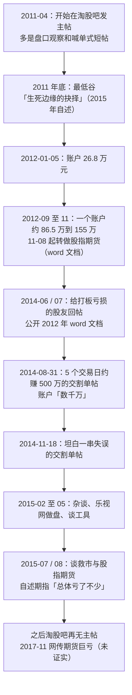

# 瑞鹤仙 ①：人物与足迹——26.8 万、闭关两年半与 16 篇主帖

::: summary 一页读懂
1. **他是谁**：淘股吧 ID ==yxkrrhx==。他自己说“我的id有些怪，如果拼不出来，可以叫我瑞鹤仙，或者瑞兄”（2014-08-31）。一位 2012—2015 年间在 A 股超短圈出名的职业股民。
2. **本人确认的经历**：“我2012年1月5日，账户里面只有26.8万元，现在账户里面已经有了数千万”（2014-08-31）。他说钱主要靠“这2年半来艰苦的闭关炒股”，并劝后来者“千万不要学”。
3. **留下的文字**：他的淘股吧博客至今能看到 16 篇主帖（2011-04 至 2015-08）。最有分量的是 2012 年的 word 文档、2014 年两份带交割单的长帖，以及 2015 年谈工具、救市和期指的几篇。
4. **流传最广的身世多数无法核实**：1984 年生、湖北人、名校毕业、做过程序员、写过遗书等说法只见于论坛整理稿，各版本互相矛盾，本文标为待考。
5. **2017 年“期货亏光 6 亿”是传闻**：新浪财经当天报道时就写明“未能确认该消息的真实性”，有业内人士表示“似乎并不属实”。
:::

::: note 阅读说明与免责声明
本系列优先采用三类材料：① 瑞鹤仙本人的淘股吧主帖（标注发帖日期）；② 第三方整理的帖内回复（单独标注）；③ 媒体报道（新浪财经 2017）。网上的“瑞鹤仙语录”“选股原则”等汇编，查不到原帖的一律标为==待考==，其中有的段落明显是别人写的通用教程。文中个股只是历史记录，不构成推荐。本文不构成任何投资建议。

本系列共 3 篇：① 人物与足迹 · [② 复盘预判与交割单](/reading/ruihe-2-method.html) · [③ 仓位、工具与心态](/reading/ruihe-3-defense.html)。
:::

## 1. 能确认什么，不能确认什么

| 信息 | 可信度 | 依据 |
|---|---|---|
| 淘股吧 ID yxkrrhx，自称“瑞鹤仙”“瑞兄” | ==高== | 2014-08-31《回馈淘股吧（我是如何在5个交易日赚500万的）》原帖 |
| 2012-01-05 账户 26.8 万元，2014 年 8 月“数千万” | 高 | 同上，本人自述（未公开完整资金曲线） |
| 2012 年 9 月底到 11 月初，一个账户从约 86.5 万到 155 万 | 高 | 2014-07-05 公开的 2012 年 word 文档，附交割单 |
| 2011 年底是人生最低谷，“当年是被骂醒的” | 高 | 2015-05-02《工欲善其事必先利其器》原帖 |
| 2015 年“资金过亿”、后来“6 亿” | 低 | 只见于整理稿。他 2015-05-02 自己说的是“我从几十万到几千万”，==待考== |
| 1984 年生、湖北人、同济或“上海某著名高校”毕业、程序员、加拿大游戏公司、腾讯 offer、写过遗书 | 低 | 只见于论坛整理稿和公众号，学校、入市年份（2007 / 2009 / 2011）各版本不同，==待考== |
| 席位在宜昌三家营业部 | 低 | 新浪财经 2017 转述“网友指出”。他本人只说过当年在“上海XX营业部开户” |
| 2017 年期货亏损 6 亿到 2000 万 | 低 | 新浪财经：“未能确认该消息的真实性”，==待考== |

::: warn 先把传说放一边
“3 年千倍”“4 年从 26 万到上亿”这些标题都是整理稿给的。本人原帖能确认的只有起点 26.8 万和 2014 年的“数千万”。他还多次强调自己的路“后来者千万不要学”。读他的文字，重点应该放在==他怎样复盘、怎样认错==上，而不是数字。
:::

## 2. 时间线

*图：依据原帖日期整理；“最低谷”“26.8 万”为本人自述，2017 年传闻未证实。*

## 3. 他写过什么：16 篇主帖

下表是他淘股吧博客里能看到的全部主帖（未登录时部分帖子只显示正文，图片交割单看不到）：

| 日期 | 标题 | 要点 |
|---|---|---|
| 2011-04-19 | 昨天大成，今天吴中，光大深南每天都被深套！ | 从盘口推算别人的亏损，结论是“手风不顺的时候要总结” |
| 2011-05-30 | 大家说说凤凰股份 | 量价异常，猜主力在做量 |
| 2011-06-16 | 明天707双环科技板！！！ | 典型喊单：“明日开盘就买707，必赚无疑！” |
| 2011-12-25 | 对未来股市改革的思考（只有这样才有牛市） | 主张蓝筹股 T+0、熔断、退市制度 |
| 2012-11-10 | 泽熙已经开始清空股票了！ | 从私募净值下跌推断“全面清仓” |
| 2014-04-10 | 沪港通奠定了牛市的基础 | “增量资金、场外资金就是牛市的基础” |
| 2014-06-14 | 致30万打板剩14万老婆闹离婚的股友 | 职业炒股“注定了要孤独”；超短不一定要打板 |
| 2014-07-05 | 我2012年的word文档，献给淘股吧迷茫的职业股民 | 他自认“基本反映了我炒股的核心逻辑” |
| 2014-08-31 | 回馈淘股吧（我是如何在5个交易日赚500万的） | 浙报传媒、人民网、北斗星通交割单 |
| 2014-11-18 | 聊聊操作、谈谈心得（总是不顺和带有遗憾应接受） | 中核科技等一连串失误的复盘 |
| 2014-12-13 | 先谈成飞，再谈交建，再谈券商 | 主力持股信心与筹码松动 |
| 2015-02-05 | 杂谈，想到哪说到哪 | 转战创业板；乐视网“做了一回主力” |
| 2015-03-21 | 预告帖 | 用平板上论坛，预告发帖 |
| 2015-05-02 | 工欲善其事必先利其器，谈谈职业股民忽视的问题 | L2、显示器、自定义面板，以及为什么还要写心得 |
| 2015-07-31 | 市场低迷，关键时刻，我所做的及我所想的 | 乐视网一单盈利 400 多万；期指的期现联动和持仓量 |
| 2015-08-30 | 关于股指期货关于国家队救市，我的理解与思考 | 批评救市方法；期指“总体亏了不少” |

::: tip 从帖子列表能读出什么
- **他也喊过单**。2011 年的“必赚无疑”、2012 年的“泽熙清仓”，都是今天看来很粗糙的判断。瑞鹤仙是在 2012 年闭关之后才变成后来那个人。==不要因为名气就把一个人的每句话都当真==，他自己的早期帖子就是反例。
- **最有价值的帖子都在讲错误**。2012 年 word 文档里有一句“失败的交割单的重要性远超成功的交割单”，2014-11-18 那篇整篇都在复盘失误。
- **他关心制度**。T+0、沪港通、期指、救市都写过长文。这和他后来“做个股结合大盘”的主张一脉相承（见 [②](/reading/ruihe-2-method.html#4-做个股要结合大盘)）。
:::

## 4. 从 26.8 万到“数千万”：本人怎么说

他对那段经历的描述散在几篇帖子里，按时间顺序摘录：

> 我2012年1月5日，账户里面只有26.8万元，现在账户里面已经有了数千万。绝大部分是靠我这2年半来艰苦的闭关炒股的努力换来的（主动断绝了社会交往，只有后悔的，后来者千万不要学）。——2014-08-31

> 因为一回想起2011年底自己最痛苦的日子，生死边缘的抉择，然后过去几年来不断收到的站内信，仿佛看到了当年的自己……——2015-05-02

> 我当年是被骂醒的，但是换一个人可能就就此沉沦了。——2015-05-02

> 自己全职炒股的这几年，开心的日子真的很少，而收盘后充满懊恼和遗憾甚至悔恨的日子却很多。——2014-11-18

还有一个反直觉的细节。他说关键时刻父母打来“不断给我减压+鼓劲”的电话，“反而促成了我第二天的大亏几十万”，因为“越做的不好，家人越关心，就感觉越对不起家人”（2014-06-14）。

::: core 一句话
==他把成功归于“闭关”，却反复劝人别学闭关。==真正能学的不是断绝社交，而是他每天收盘后的复盘方法（见 [②](/reading/ruihe-2-method.html)）。
:::

## 5. 流传版身世：哪些是整理稿加上去的

网上最常见的版本大致是：1984 年生于湖北，上海名校毕业，在游戏公司做程序员；2011 年拿家里 50 万元创业兼炒股，9 个月亏到 26 万；写过遗书，给名人写信求助；拿到腾讯 offer 后决定最后一搏，2012 年 2 至 5 月扭亏，从此职业炒股。

对照原帖：

- **能对上的**：26.8 万这个起点、2011 年底的低谷、“被骂醒”、闭关断绝社交。
- **对不上或查不到的**：出生年、籍贯、学校（同济大学 / “上海某著名高校”两说）、入市时间（2007 / 2009 / 2011 三说）、加拿大游戏公司、腾讯 offer、遗书。这些在他的主帖里都找不到，整理稿也从不给出处。“50 万亏到 26 万”出自一条流传语录，原帖同样没有找到。

::: warn 关于“我选股的原则与方法”
有一篇流传很广的《瑞鹤仙：我选股的原则与方法》，开头用第三人称讲他的故事，后面是“强势股的特征”“涨停次日低开缩量收阴的不要”等条目。==这些条目的文风和他的原帖完全不同，像是通用的短线教程被挂上了他的名字==，本系列不采用。
:::

## 6. 2017 年的传闻与之后

2017 年 11 月 15 日，新浪财经报道网传瑞鹤仙“用炒股赚的钱去做期货，结果6亿身家亏到2000万”。同一篇报道写明：

- “新浪期货频道经过多方打听，并未能确认该消息的真实性。但有数位期货内大佬表示，该消息似乎并不属实。”
- 文中“2012年11月……公开一篇心得《我是如何在股市赚到第一个500万》”的说法，把 2012 年的 word 文档和 2014 年的 500 万交割单帖混在了一起。
- 文中“删除了所有文章”与事实不符：截至 2026 年 10 月，他的淘股吧博客仍能看到上面 16 篇主帖。他离开的应该是别的社区（另有网友回忆他 2015 年 5 月删光帖子离开雪球，待考）。

本人 2015-08-30 的帖子倒是写过期指的真实亏损：“本人先开空大赚后觉得跌的差不多了反手，然后大亏，总体亏了不少”。这是他自己说的，但和“6 亿”没有任何关系。

::: quote 他对期货杠杆的原话
“你转1000万到期货账户里面，平时最多只能用300万。另外700万是用来放在里面保命的，这就是期货。”——2015-07-31
:::

之后他在淘股吧再没有发过主帖，近况不明。

## 7. 和其他前辈对照

- 淘股吧网友退学炒股 2017 年发过一帖《赵老哥跟瑞鹤仙就像李白和杜甫》，正文只有一句：“一个浪漫一个现实，一个激情一个悲壮”（见 [退学炒股 ①](/reading/tuixue-1-life.html)）。
- [赵老哥](/reading/zhao-1-life.html#3-他自己写过什么博客里的几个帖子)几乎不写方法，瑞鹤仙却写了大量长文和交割单剖析，两人正好相反。
- 他在 2014-08-31 的帖子里说，起步阶段“帮助我最大的就属淘股吧”。流传语录里还有一句，说他做得不顺时会默念炒股养家的“卖出风险”，这句原帖未核到，==待考==。养家的原话见 [炒股养家 ①](/reading/yangjia-1-overview.html#第-1-章-全景图一张图看懂养家心法)。

## 8. 自测与行动

自测 1：瑞鹤仙的淘股吧 ID 是什么？“瑞鹤仙”这个名字从哪来？

ID 是 yxkrrhx。他在 2014-08-31 的帖子里说：“我的id有些怪，如果拼不出来，可以叫我瑞鹤仙，或者瑞兄。”

自测 2：本人原帖能确认的资金数字有哪些？

2012-01-05 账户 26.8 万元；2012 年 9 月底到 11 月初一个账户约 86.5 万到 155 万；2014 年 8 月账户“数千万”。“过亿”“6 亿”都没有出现在他的原帖里。

自测 3：2017 年“期货亏光”的说法为什么只能存疑？

最早报道它的新浪财经当天就写明“未能确认该消息的真实性”，还有业内人士表示“似乎并不属实”。同一篇报道里另有两处与原帖不符：把两篇帖子混为一篇，并称他删除了所有文章。

读完这一篇，可以做的事：

- [ ] 遇到“某某语录”或身世故事，先找原帖日期和链接，找不到就打个问号
- [ ] 翻出自己最早的交易记录，看看那时的判断方式和现在有什么不同
- [ ] 想一想自己若全职炒股，家人、收入和心理压力能撑多久
- [ ] 把“只有后悔的，后来者千万不要学”这句话抄下来，放在想全职之前再读一遍

## 来源

- yxkrrhx（瑞鹤仙）淘股吧博客（帖子列表与发帖日期）：https://www.tgb.cn/blog/206476
- 《回馈淘股吧（我是如何在5个交易日赚500万的）》（2014-08-31）：https://www.tgb.cn/a/1ykz0gY9zeO
- 《我2012年的word文档，献给淘股吧迷茫的职业股民》（2014-07-05）：https://www.tgb.cn/a/1ykyPfpemAK
- 《致30万打板剩14万老婆闹离婚的股友》（2014-06-14）：https://www.tgb.cn/a/1ykyLlnVbyk
- 《聊聊操作、谈谈心得（总是不顺和带有遗憾应接受）》（2014-11-18）：https://www.tgb.cn/a/1ykzaKCikk8
- 《工欲善其事必先利其器，谈谈职业股民忽视的问题》（2015-05-02）：https://www.tgb.cn/a/1ykzApmE1Q0
- 《市场低迷，关键时刻，我所做的及我所想的》（2015-07-31）：https://www.tgb.cn/a/1ykzX3Agw4J
- 《关于股指期货关于国家队救市，我的理解与思考》（2015-08-30）：https://www.tgb.cn/a/1ykA4leCQSs
- 其余早期主帖：https://www.tgb.cn/a/1ykvT6XQg0Y （2011-04-19）、https://www.tgb.cn/a/1ykw29ogceT （2011-06-16）、https://www.tgb.cn/a/1ykwsrSs7QR （2011-12-25）、https://www.tgb.cn/a/1ykx7wNsh6V （2012-11-10）、https://www.tgb.cn/a/1ykyzpiPU9f （2014-04-10）
- 新浪财经，《天才的陨落 股神瑞鹤仙期货亏尽6亿身家》，2017-11-15：https://finance.sina.cn/2017-11-15/detail-ifynwnty3235102.d.html
- 二手整理（身世、语录，可信度低）：淘股吧“瑞鹤仙经典语录” https://m.tgb.cn/a/1J5IC6nXTgV ；闽发论坛“瑞鹤仙删光所有帖子离开雪球之前最后的判断” https://www.xiarj.com/10385.html
