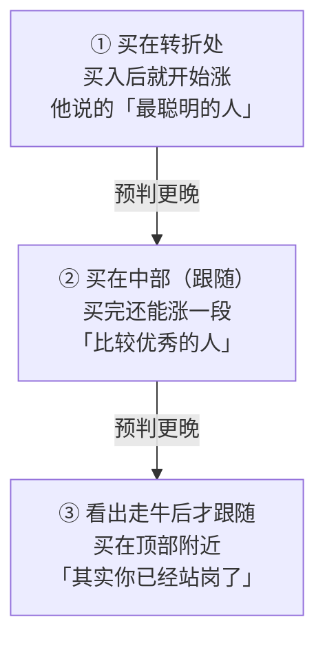
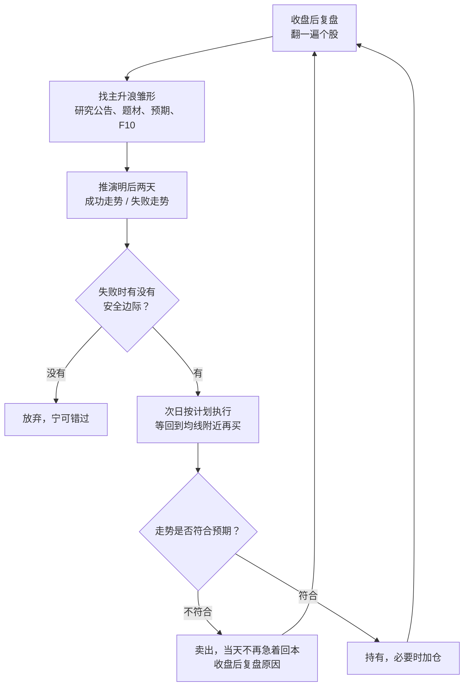

# 瑞鹤仙 ②：复盘预判与交割单——“只需预测1天”、T+1 推演两天与失败单

::: summary 一页读懂
1. **核心逻辑**：2012 年他给自己定的方向是“参与这种价值股的主升浪”，认为这是“投资和投机技术的完美结合”。他看不起“炒消息、抢帽子”式的“裸炒”。
2. **反对两句流行话**：他认为“重个股、轻指数”和“不预测、只跟随”都是错的。原话：“你要做的不是不去预测，反而是要更加努力的研究如何预测……==只需预测1天就足够了==。”
3. **失败单比成功单重要**：“失败的交割单的重要性远超成功的交割单！”判断落空（他叫 ==YY==）之后，“不是当日急于回本再去买入一个股票，而是就地休息”。
4. **T+1 要推演两天**：买入前要预设之后两天的成功走势和失败走势，看失败时有没有安全边际（帖内回复，据第三方整理版）。
5. **大资金视角要分开看**：他公开过怎样用自己的买单影响分时走势。这是几千万资金才有的手段，散户既学不来，也可能触及监管红线。
:::

::: note 阅读说明与免责声明
本篇引文主要来自三篇原帖：2014-07-05 公开的 2012 年 word 文档、2014-08-31 交割单帖、2014-11-18 失误复盘帖。2014-11-18 帖子下的回复引自第三方整理版（StockGod 整理 PDF），标注“帖内回复”。交割单图片未登录看不到，本文只用文字部分。文中个股只是历史记录，不构成推荐。本文不构成任何投资建议。

本系列共 3 篇：[① 人物与足迹](/reading/ruihe-1-life.html) · ② 复盘预判与交割单 · [③ 仓位、工具与心态](/reading/ruihe-3-defense.html)。
:::

## 1. 2012 年的转向：从“裸炒”到价值股的主升浪

2012 年 11 月，他在一个 QQ 群里上传了一份 word 文档，2014 年 7 月才公开到淘股吧。开头讲自己“闭关”的原因：

> 虽然我盈利不错，但是我仔细分析后感觉还是没有保障，没有安全感——如果就当时自己的炒股的做法，我没有信心把自己的后半辈交给股市。

闭关之后他给出的答案有两条：

> 如果我要纯投机那么就去做股指期货……而对于炒消息、抢帽子自己并不擅长，而且从内心中也很鄙视这种‘裸炒’的方法……但是，如果我找到了有价值的股票的短线机会，那么我就会参与这种价值股的主升浪，这才是投资和投机技术的完美结合。

这份文档附了 2012-09-28 至 11-05 的交割单，账户“从约86.5万——>155万。盈利79.1%”。主角是沧州大化（600230），买入理由是季报业绩预期。他甚至按季报公布日“倒推计算”主力的节奏。

::: tip 解读：短线也要有“价值锚”
他说的“价值股”不是长期持有，而是==有业绩或重大预期支撑、短期内会被市场重新定价的股票==。题材只是买入理由的一部分，更关键的是“市场愿意给多少估值”。这和单纯追涨停的打法是两条路。
:::

## 2. 失败的交割单：YY、就地休息、不追高

word 文档最有价值的部分是他对亏损的剖析。他特意写道：

> 失败的交割单的重要性远超成功的交割单！

三个例子：

| 交易 | 发生了什么 | 他的结论 |
|---|---|---|
| 10-15 买 000404 | 预期市场会把它从地热概念转成炒业绩，第二天割肉，亏 5.6% | “==YY容易受伤==，YY就是自己预期某个股能连续涨停，自己预期主力会来炒这个股” |
| 亏损之后 | 想当天马上买别的股票回本 | “不是当日急于回本再去买入一个股票，而是就地休息……你受伤后就不能再次受伤了，那无异于给伤口上撒盐！” |
| 10-17 追高沧州大化 | 原计划低吸，看到拉升“就激动了，感觉自己踏空了”，当日被套 6% | 追高是“致命错误”；但收盘后分析出已经洗盘，第二天“拼死不出”，获利卖出 |

最后一笔他还拿另一位股友对照：同一天买入，第二天低位割肉，“这就是没有分析出里面持筹人心态的结果。如果你不分析清楚博弈对象，那么超短投机就很容易被洗。”

::: core 核心心法
==受伤之后先停手，收盘后再想。==这和利弗莫尔“永远不要摊平亏损”（见 [利弗莫尔 ③](/reading/livermore-3-money.html#2-永远不要摊平亏损)）、退学炒股的“错了就割”（见 [退学炒股 ②](/reading/tuixue-2-mode.html#4-卖出与纠错)）说的是同一件事：亏损时最大的敌人是急于扳回来的自己。
:::

## 3. “只需预测1天”：为什么他反对“不预测、只跟随”

这是他被引用最多的一段，出自 2012 年 word 文档：

> 【不预测、只跟随】——这个观点也是极大错误的。请问，你为什么跟随呢？因为大盘或者个股明显走好了。那么明显走好了为什么你就要跟随呢？因为你预判你买入后还能涨。那么很简单了，这不是预测是什么？

他把买点分成三档：

*图：依据 2012 年 word 文档整理。*

他的结论是：

> 你要做的不是不去预测，反而是要更加努力的研究如何预测，如何预判，如何根据过去未来和当日盘面去预判第二天的走势，==只需预测1天就足够了，然后不断重复做这种预测1天的做法==，做好了，你每天都是胜利的。

::: warn 别读成“我能预测市场”
他说的预测有两个限定：只预测==第二天==，而且每次都同时想好失败的情况（见第 5 节）。把它读成“我能预判大势、可以重仓押注”，正好和他的本意相反。
:::

## 4. 做个股要结合大盘

同一份文档里，他也否定了“重个股、轻指数”：

> 如果你不能正确的预测大盘，那么你就不能提前于别人买入，最终你只能被大盘和市场牵着鼻子走，陷入被动。

他举的例子是珠江实业（600684）：10 月 31 日他在 8.52 元的低位卖出，一位股友当天也卖了。下午他又以比卖价高 1 毛钱的价格分批买回，最终满仓，股友没有买回，“原因就是，对后市大盘看法不同”。之后该股两个涨停。

他关心大盘的方式不只是看指数，还会研究制度和资金面：

- **2014-04-10**：沪港通是“变相的在资本项目下可兑换开启了一个小小的……口子”，“增量资金、场外资金就是牛市的基础”。
- **2015-02-05**：判断当时是“大盘股的估值修复，创业板的牛市”，并认为估值修复行情 3000 至 3100 点“是一个合理价位”，上下 20% 都算正常波动。他还提醒：“很多人陷入了非牛即熊的思维怪圈”，牛熊之间还可以是多年横盘。
- **2015-07-31**：盘中看期指和现货谁带动谁。如果是现货带动期货上涨，“95%概率是假涨”。

这和[小鳄鱼说的“势”](/reading/xiaoeyu-2-style.html#3-势共振上涨共振下跌)、[钙片说的“市场合力”](/reading/gaipian-2-heli.html#1-市场合力先问自己在不在主流里)是一类思路：先判断环境，再决定做不做、做多大。

## 5. T+1：买之前先推演两天

2014-11-18 那篇帖子下，有人问他为什么放弃迪士尼板块。他的回复（帖内回复，据第三方整理版）把 [[T+1]] 的约束讲得很透：

> 因为T+1，所以买股必须要考虑至少2天的走势而不能只考虑日内走势，且须考虑预设未来2天的成功走势和失败走势，然后权衡如果今天买了，今天和明天走失败走势的情况下是否有安全边际。当然这样就会丧失很多机会，但是换取了稳定盈利的胜率更大。

具体到那次：陆家嘴涨停时成交额只有 2 亿多，封单不到他预期的一半，“缩量涨停第二天必然大幅高开”，第二天没有买点，第三天“也很难有大肉”，所以放弃。

同一帖里还有两条回复：

- **怎样找主升浪**：“还是只能用笨办法，每天复盘翻一遍个股，把走势符合主升浪雏形的找出来。然后研究其公告啊，题材啊，预期啊，F10等等。然后再不断跟踪——这些都是很累很烦的苦力活。”
- **为什么那天不买**：“马上就要跌到10日均线了，我为什么要还没有到10日均线的时候就提前介入呢？”可以对照[利弗莫尔的“正常回调之后才买”](/reading/livermore-2-pivotal.html#2-正常回调之后创新高才买)。

*图：依据 2012 年 word 文档与 2014-11-18 帖内回复整理。*

## 6. 选股：预期、强化预期、龙头

还是 2014-11-18 的帖子。有人问他 11 月 4 日为什么买中核科技（000777），他的回答是一条预期链（帖内回复，据第三方整理版）：

1. 中广核在香港 IPO，募资从 10 亿美元加到 30 亿美元，“市场热捧”；
2. 另一家核电巨头中核会不会也上市？最可能的途径是资产注入中核科技，“类似成飞集成，他们共同点就是老板是一个超级航母，而儿子是迷你小船”；
3. 核电重启需要资金，“又强化了这个预期”。

主帖里他还反省自己“远离了市场主流”：

> 作为超短选手，远离了市场主流是很不职业的，很不称职的。

关于龙头，他在回复里说，中国交建作为龙头“量度升幅已经足够大，翻倍了”，所以不去“抬轿子”，改做补涨的中材国际，结果不如预期。一位股友点评说他做的是跟风股，“而0777，一直是核电龙头，因此操作容易成功”，他回了一句“谢谢你的指出”。可以对照[钙片的“只买龙头”](/reading/gaipian-2-heli.html#6-只买龙头不买龙头的亲戚)。

2014-12-13 那篇则讲了怎样看龙头的筹码：他认为关键是“主多的大主力的持股信心”，当发现大主力在散户追涨时主动出货，“筹码已经绝对的松动了”，即使尾盘被拉到涨停也不再参与。

## 7. 大资金视角：做盘与“交割单中有黄金”

2014-08-31 的交割单帖展示了另一面。为了保住浙报传媒的利润，他在人民网涨停板上“花了几千万……封板”，并且“不能撤单，我撤单的话人民网一定会再次开板”。北斗星通那天，他特意指出一笔成交：

> 9:58:49 秒 45.48元这一笔。当时暂时买气已尽（卖气也已尽），但假如我不买这一笔，价格就会在45.45止步下跌，因为我这一笔，最高到了45.63，这样，分时图就摆脱了早盘高点后带来的下跌短趋势，变成了震荡中枢，为后市拉板创造了条件。

2015-02-05 他又写道，曾“动用全部账户，将乐视网运作成了1条直线上涨……并且没有在龙虎榜留下任何痕迹”。

::: warn 这部分不能照搬
- 这是几千万资金才有的操作，散户的一笔单子影响不了分时。
- 用自有资金连续买卖去影响价格、拉抬后卖出，在今天的监管口径下可能被认定为异常交易甚至操纵市场。==监管近年明显趋严==，[章盟主 2024 年的罚单](/reading/zhang-1-life.html#62-处罚决定书)就是例子。本文只记录他当年的说法，不评价其合规性。
- 他自己也说：“最终炒股要成功还是要靠各位自己的悟道”。
:::

## 8. 自测与行动

自测 1：他为什么说“不预测、只跟随”自相矛盾？

因为“跟随”的前提是相信买入后还会涨，这本身就是预测。他主张努力研究怎样预判，但只预测第二天，并不断重复。

自测 2：什么是他说的“YY”？受伤之后他建议怎么做？

YY 是自己臆想某只股票会连续涨停、主力会来炒。判断落空亏损后，不要当天急着买别的回本，而是“就地休息”，收盘后再仔细分析。

自测 3：T+1 制度下，他买入前要多想哪一步？

要推演至少两天：预设之后两天的成功走势和失败走势，看如果走失败路径，今天的买点有没有安全边际。没有就放弃，宁可错过机会。

自测 4：为什么第 7 节的做盘手法不适合普通人学？

一是需要几千万级别的资金才能影响分时；二是用资金影响价格可能触及异常交易或操纵的监管红线。

读完这一篇，可以做的事：

- [ ] 每天收盘后只写一条对“明天”的预判，并写出失败时的应对
- [ ] 把最近一笔亏损单写成剖析：当时的预期是什么，是不是 YY
- [ ] 亏损当天给自己定一条规则：不再开新仓
- [ ] 买入前问一句：如果明后两天走失败路径，我会亏多少？
- [ ] 每周复盘一次大盘环境，看看自己的个股判断有没有结合大盘

## 来源

- 《我2012年的word文档，献给淘股吧迷茫的职业股民》（2014-07-05 发布，文档写于 2012 年 11 月）：https://www.tgb.cn/a/1ykyPfpemAK
- 《回馈淘股吧（我是如何在5个交易日赚500万的）》（2014-08-31）：https://www.tgb.cn/a/1ykz0gY9zeO
- 《聊聊操作、谈谈心得（总是不顺和带有遗憾应接受）》（2014-11-18）：https://www.tgb.cn/a/1ykzaKCikk8
- 同帖帖内回复整理版（StockGod 整理 PDF，第三方）：http://xqdoc.imedao.com/14fb45c139210a3fefa01668.pdf
- 《先谈成飞，再谈交建，再谈券商》（2014-12-13）：https://www.tgb.cn/a/1ykzeOf7Wgn
- 《杂谈，想到哪说到哪》（2015-02-05）：https://www.tgb.cn/a/1ykzmJOY1nd
- 《沪港通奠定了牛市的基础》（2014-04-10）：https://www.tgb.cn/a/1ykyzpiPU9f
- 《市场低迷，关键时刻，我所做的及我所想的》（2015-07-31）：https://www.tgb.cn/a/1ykzX3Agw4J
