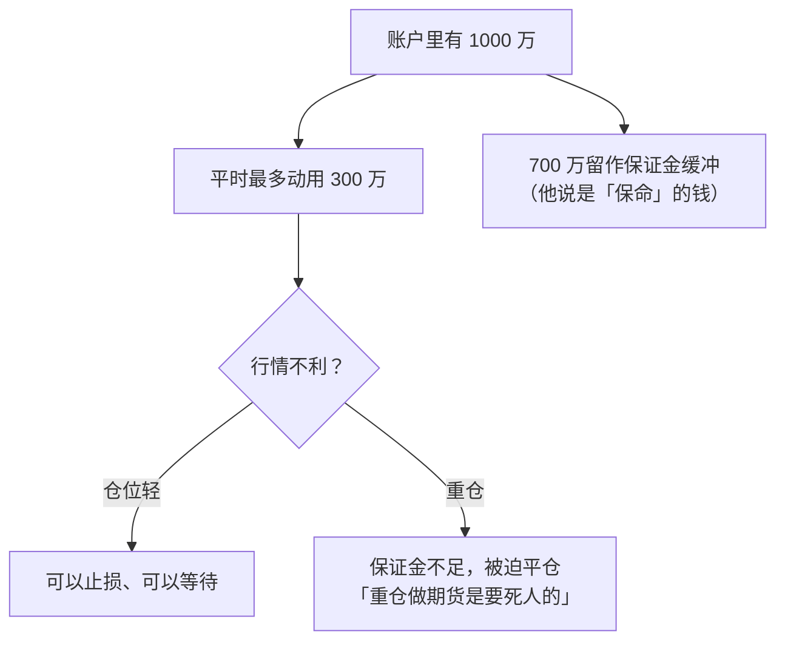

# 瑞鹤仙 ③：仓位、工具与心态——“控制仓位，默念100遍”

::: summary 一页读懂
1. **仓位是反人性的**：2014 年一段失误连连的操作之后，他在持仓截图前写下“控制仓位，默念100遍”。2012 年的交易里，他==低吸重仓、高抛轻仓==，并用国债逆回购控制节奏。
2. **超短不等于打板**：“低吸、追涨、做T、打板……，掌握的方法越多，赢面越大”（2014-06-14）。
3. **工具是职业股民的“兵器”**：他主张职业股民一定要用 L2 行情，“不要拿着大刀长矛在市场里面和别人洋枪洋炮作战”（2015-05-02）。
4. **心态**：“瑞鹤仙，你已经够努力了，要想更上一层楼，你需要的是一颗平淡的心！”（2014-11-18）。他也坦言小资金职业炒股“注定了要孤独”。
5. **期货与杠杆**：“重仓做期货是要死人的”。2015 年股灾中他自述期指“总体亏了不少”。
:::

::: note 阅读说明与免责声明
本篇引文主要来自 2014-06-14、2014-11-18、2015-05-02、2015-07-31、2015-08-30 五篇原帖和 2012 年 word 文档。流传很广的“防守靠2个东西：1是选股，2是仓位”等段落查不到原帖，标为==待考==。他谈到的软件、行情刷新频率都是 2015 年前后的情况，今天未必适用。本文不构成任何投资建议。

本系列共 3 篇：[① 人物与足迹](/reading/ruihe-1-life.html) · [② 复盘预判与交割单](/reading/ruihe-2-method.html) · ③ 仓位、工具与心态。
:::

## 1. 仓位：原帖里能看到的做法

他没有写过系统的仓位规则，但原帖里有几处具体做法：

| 出处 | 原话或做法 | 含义 |
|---|---|---|
| 2012 年 word 文档 | “大部分低吸都是重仓（60万元以上）而高抛是轻仓（30万元）” | 主升浪里做滚动，买得多、卖得少，底仓不丢 |
| 同上 | “最后2天连续大阳……我是满仓，坚决不做任何T” | 加速段不折腾 |
| 同上 | “逆回购很重要，是控制自己节奏心态以及对市场理解的重要手段” | 大涨大跌时把钱放进逆回购，等低吸机会 |
| 同上 | “不贪，不贪才能大赚……有了资金就有了主动权” | 赚到预期就卖，“卖出了风险，得到了利润” |
| 2014-11-18 帖内回复（第三方整理） | “对于我而言，300万以下的单笔交易都具有随意性和试探性” | 先用小单试探，确认后才加 |
| 2014-11-18 主帖 | “行情转弱，只能控制仓位……（控制仓位，默念100遍）” | 不顺时先降仓位 |

::: tip 解读：逆回购是“空仓的仪式感”
很多人空仓时手痒。他的办法是把资金放进[[逆回购]]，既有一点利息，也给自己一个“这笔钱今天不动”的明确动作。==空仓也是一种仓位==。
:::

一段流传很广的话常被冠以他的名字：“防守靠2个东西：1是选股，2是仓位……控制仓位，绝对是反人性的，但是这也是没有办法绕过的。”这段话和他的思路一致，但本文没有找到原帖，==待考==。可以对照 [Asking 的半仓试错](/reading/asking-3-trading.html#3-仓位半仓试错赢了才加)和[退学炒股的回撤线](/reading/tuixue-2-mode.html#3-仓位从全仓到回撤线)。

## 2. 超短不等于打板

2014 年 6 月，有位股友发帖说自己 30 万打板剩 14 万，老婆闹离婚。瑞鹤仙专门开了一个主帖回复，贴出 12 个交易日约盈利 170 万的交割单：

> 超短也并不就是一定要打板，手法多种多样。低吸、追涨、做T、打板……，掌握的方法越多，赢面越大，能应付的情况就越多。

他列出这 12 天用到的手法：“低吸、追涨（半路板）、做T、打板、融券300ETF对冲。打板也并不是重中之重。”

::: core 核心心法
==只会一种手法的人，只能在一种行情里赚钱。==他的意思不是什么都做，而是在不同行情里有可用的工具。这和[小鳄鱼按行情切换手法](/reading/xiaoeyu-2-style.html#1-他的交易框架自述)、[职业炒手说“短线的精髓不是打板”](/reading/zhiye-3-mode.html#1-短线的精髓不是打板)是一个方向。
:::

## 3. 工具：L2、显示器和自定义面板

2015-05-02 的帖子专门谈“职业股民忽视的问题”。他的比喻是：

> 一个短跑高手一定视其跑鞋为利器、一个乒乓高手一定视其球拍为珍宝……而到了职业炒股，很多股民却不重视股票以外的装备、设备、软件等。

他当时的配置和理由：

- **三套 L2 行情**：通达信 L2 是主力软件，界面快、可自定义面板；同花顺 L2 用来晚上复盘“盘中的多空搏杀”；东方财富 L2 看外盘期货和港股。
- **为什么必须 L2**：“L2刷新行情3秒一次，普通的6秒。本来100B 1S的单子，在普通行情里面就变成了101S，严重误导看盘者。打板排队、十档行情等都是需要L2的。”
- **显示器**：从几十万到几千万一直用一块 23 寸，后来换两块，再换成一块 34 寸带鱼屏。“更多的6个什么的，其实增益很小，人只有一双眼睛”。

::: warn 时效性
这些是 2015 年的说法。各家软件的功能、行情推送频率和收费今天都已经变化。==值得学的是“弥补硬件短板最便宜”这个思路==，具体配置以当下为准，而且工具再好也替代不了复盘。
:::

## 4. 心态：平淡的心与孤独

2014-11-18 那篇帖子是他少见的情绪剖白：

> 以往自己面对失误的操作和遗憾的操作，总是非常非常的痛苦和自责，然后就一股脑的拼命复盘，拼命研究，经常研究到深夜后实在困得不行了就趴在键盘上这么一晚上就过去了。

> 瑞鹤仙，你已经够努力了，要想更上一层楼，你需要的是一颗平淡的心！（现在我经常在心里对自己这么说），激动或者灰心，只能使自己技术变形操作走样。

2014-06-14 那篇谈到职业炒股和家庭：

> 职业炒股，在200万资金之前（一线城市400万），都属于要快速积累阶段……对心理的压力、能力、要求就会显得变态的高。因为心理上的波动容易引起交易失误，同时对自己的自信产生打击，继而恶性循环。所以小资金职业炒股、注定了要孤独。

2015-05-02 那篇谈嫉妒：他说自己“嫉妒心不是很强”，看到朋友赚得比自己多，“自己甚至比他都开心”。另一段流传的话（“我自己大约是做到了2000万以上的时候才慢慢比较能够抗住别人的吹嘘”）原帖未核到，==待考==。

更早的 2011-04-19，他就写过一句后来他自己反复践行的话：

> 不好作战的时候不要勉强，手风不顺的时候要总结。特别是要总结，为什么在当下的市场特点下自己手风不顺，而不是硬要交易希望自己赶快弥补亏损。

::: quote 金句
“激动或者灰心，只能使自己技术变形操作走样。”——2014-11-18
:::

可以对照[退学炒股《我和小明》里的“连续成功之后的大亏”](/reading/tuixue-3-xiaoming.html#4-连续成功之后的大亏)和[炒股养家的“情绪是情绪，操作是操作”](/reading/yangjia-5-position.html#第-10-章-心态与信念情绪是情绪操作是操作)。

## 5. 期指与杠杆：他自己的教训

2012 年 11 月，他一度转去做[[股指期货]]。2015 年 7、8 月，他连发两篇长帖谈期指和救市，有两点值得记住：

1. **杠杆的用法**：“你转1000万到期货账户里面，平时最多只能用300万。另外700万是用来放在里面保命的，这就是期货。”“重仓做期货是要死人的。”（2015-07-31）
2. **自己也会亏**：“本人先开空大赚后觉得跌的差不多了反手，然后大亏，总体亏了不少。”（2015-08-30）

他在 2015-08-30 的帖子里还批评当时的救市方法，认为只在现货上买、不在期指上表态，“使了牛大的劲得到鼠般的果”。这是他个人的观点，读者可以当作一位“股期双栖”交易者的视角，不必当作结论。

*图：依据 2015-07-31 原帖整理。*

::: warn 关于杠杆
2017 年“期货亏光 6 亿”的传闻没有得到证实（见 [①](/reading/ruihe-1-life.html#6-2017-年的传闻与之后)），但他本人的帖子已经说明：即使是这样的高手，在 2015 年的期指上也“总体亏了不少”。==[[杠杆]]放大的不只是收益，还有判断错误的代价。==可以对照[利弗莫尔的“危险信号”](/reading/livermore-3-money.html#1-危险信号不争辩先出来)。
:::

## 6. 为什么他还要写心得

2015-05-02 的帖子里，他写了一段很少有人引用的内心独白：

> 那么瑞鹤仙，你又不是这个市场上最牛逼的，最能赚钱的，你何苦写你闭门炒股用透支生命和青春换来的东西呢？

他给自己的回答是：“比我差的，还在底层的职业股民，也的确是能从我的心得体会中得到帮助的，也许走出下一个瑞鹤仙呢？”

这也解释了他的帖子为什么大多在讲失误：他希望后来者从中看见自己。

## 7. 自测与行动

自测 1：2012 年他做主升浪滚动时，低吸和高抛的仓位有什么区别？

大部分低吸重仓（60 万元以上），高抛轻仓（30 万元）。这样做波段时不容易把底仓丢掉。加速段的最后两天则满仓不做 T。

自测 2：他用国债逆回购做什么？

控制节奏和心态：大涨或大跌的日子把资金放进逆回购，等待低吸机会，避免手痒乱买。

自测 3：他对期货账户资金的使用比例怎么说？

转 1000 万进期货账户，平时最多只用 300 万，另外 700 万“放在里面保命”。他还说“重仓做期货是要死人的”。

自测 4：“防守靠选股和仓位”这句话能确认是他说的吗？

不能。这段话在汇编里很常见，思路也和他一致，但本文没有找到原帖，所以标为待考。

读完这一篇，可以做的事：

- [ ] 给自己定一条规则：试探仓上限多少，确认后才能加到多少
- [ ] 空仓的日子把资金放进逆回购或货币基金，用这个动作提醒自己“今天不动”
- [ ] 列出自己会用的手法，想想现在的行情下哪一种最合适
- [ ] 检查自己的行情软件和屏幕布局，有没有影响判断的短板
- [ ] 如果使用杠杆，写下“只动用三成资金”这类上限并严格执行

## 来源

- 《我2012年的word文档，献给淘股吧迷茫的职业股民》（2014-07-05）：https://www.tgb.cn/a/1ykyPfpemAK
- 《致30万打板剩14万老婆闹离婚的股友》（2014-06-14）：https://www.tgb.cn/a/1ykyLlnVbyk
- 《聊聊操作、谈谈心得（总是不顺和带有遗憾应接受）》（2014-11-18）：https://www.tgb.cn/a/1ykzaKCikk8
- 同帖帖内回复整理版（StockGod 整理 PDF，第三方）：http://xqdoc.imedao.com/14fb45c139210a3fefa01668.pdf
- 《工欲善其事必先利其器，谈谈职业股民忽视的问题》（2015-05-02）：https://www.tgb.cn/a/1ykzApmE1Q0
- 《市场低迷，关键时刻，我所做的及我所想的》（2015-07-31）：https://www.tgb.cn/a/1ykzX3Agw4J
- 《关于股指期货关于国家队救市，我的理解与思考》（2015-08-30）：https://www.tgb.cn/a/1ykA4leCQSs
- 《昨天大成，今天吴中，光大深南每天都被深套！》（2011-04-19）：https://www.tgb.cn/a/1ykvT6XQg0Y
- 二手汇编（“防守靠2个东西”等段落，原帖未核到）：闽发论坛“瑞鹤仙实操技术传授” https://www.xiarj.com/1061.html
