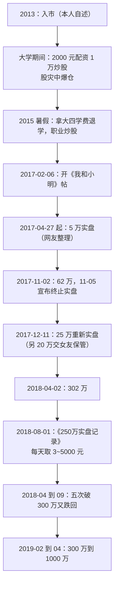

# 退学炒股 ①：人物与实盘——从爆仓退学到 14 个月 150 倍

::: summary 一页读懂
1. **他是谁**：淘股吧 ID“退学炒股”，网友称“退神”。按他本人 2017 年 8 月的自述：2013 年入市，大学期间配资炒股，股灾时爆仓，“后来拿着大四的学费退学了”。
2. **公开实盘**：2017 年 2 月 6 日开《我和小明》帖，边交易边写心得。按网友整理的实盘截图时间线，两段实盘累计约 ==14 个月 150 倍==（5 万 → 62 万；25 万 → 302 万）。
3. **两次主动停**：2017 年 11 月因“影响力越来越大，它的副作用慢慢突显出来了”终止实盘；2018 年 8 月起另开《250万实盘记录》，改为“稳中求进”。
4. **成名后的困境**：2018 年资金“破了300W又马上跌回来，这样来来回回有五次”。2019 年初用两三个月从 300 万做到 1000 万，他把这归于“市场好转和运气”。
5. **最值得读的不是收益**，而是他把心理活动逐日写下来的那份坦诚（见 [③ 我和小明](/reading/tuixue-3-xiaoming.html)）。
:::

::: note 阅读说明与免责声明
本系列以退学炒股在淘股吧的原帖为一手来源：帖子标题、日期和浏览量来自其博客页面。帖子全文需登录查看，引文依据公开的完整跟帖整理稿，按日期标注。实盘资金时间线来自网友依据其截图做的整理，属于二手材料。出生年份、籍贯等来自论坛整理，标为“据论坛”。涉及家庭的内容只保留与他职业选择直接相关、且由他本人公开写出的部分。本文不构成任何投资建议。

本系列共 3 篇：① 人物与实盘 · [② 交易模式](/reading/tuixue-2-mode.html) · [③ 我和小明](/reading/tuixue-3-xiaoming.html)。
:::

## 1. 能确认什么，不能确认什么

| 信息 | 可信度 | 依据 |
|---|---|---|
| 淘股吧 ID“退学炒股”，2017-02-06 发《我和小明》 | ==高== | 博客页面，浏览量逾 500 万 |
| 2013 年入市、配资爆仓、拿大四学费退学 | 较高 | 本人 2017-08-12 跟帖自述 |
| 湖南人、1994 年生 | 中 | 论坛整理稿；他发过《下一届游资看湖南》（2017-11-12），但没直接说自己是湖南人 |
| 实盘 5 万 → 62 万、25 万 → 302 万 | 中 | 网友依据其截图整理；原帖截图需登录 |
| 2019 年 300 万 → 1000 万 | 较高 | 本人 2019-04-22 跟帖 |
| 后来改名、做到 3000 万、隐退 | 低 | 只见于论坛传闻，==待考== |

## 2. 时间线

*图：本人跟帖与网友整理的实盘时间线合并。网友整理部分为二手材料。*

他在 2017-08-12 的跟帖里讲了为什么退学：

> 我2013年入市……当时用2000块配资1W炒股，没有想着要去积累本金，盈利多少就花费多少，这个状态持续到大三，股灾直接爆仓，后来拿着大四的学费退学了。

同一段里，他提到父亲去世后家里留下债务，所以给自己定了一条原则：“==做任何事的前提是自己关心的人生活不会因为自己的失败而变差==”。

::: warn 不要模仿的部分
退学、配资、全部身家押在股市，这些是他的经历，不是方法。他自己后来写过“借钱不适用于短线操作”（2017-08-26），理由详见 [③](/reading/tuixue-3-xiaoming.html#6-观众借钱与别人的交割单)。==幸存者的故事最容易让人忽略沉没的大多数。==
:::

## 3. 实盘曲线：两段实盘、两次终止

网友“地主ge”依据他帖子里的截图整理了资金节点（二手材料）：

| 日期 | 资金 | 备注 |
|---|---|---|
| 2017-02-06 | 5 万 | 开帖 |
| 2017-04-27 | 5 万 | 3 月底曾到 7.6 万，暂停后重新开始 |
| 2017-07-05 | 10 万 | 第一次翻倍 |
| 2017-08-28 | 20 万 | 第二次翻倍 |
| 2017-09-22 | 40 万 | 第三次翻倍 |
| 2017-11-02 | 62 万 | 随后终止实盘 |
| 2017-12-11 | 25 万 | 重新实盘，取出大部分资金 |
| 2018-02-02 | 55 万 | |
| 2018-03-08 | 117 万 | 持有万兴科技 |
| 2018-04-02 | 302 万 | 三个半月约 12 倍 |

整理者把两段收益率连乘，得到约 14979%，也就是“14 个月 150 倍”。

::: tip 读这张表要注意
- “150 倍”是**两段收益率的连乘**，中间取出过资金，不是账户从 5 万一路涨到 750 万。
- 第一段的起点有两种说法（2 月 6 日或 4 月 27 日）。
- 2017 年 8 月 16 日他还给自己定过一个“小目标”：到年底翻倍，资金达到 25 万。可见快速增长发生在他自己都没预期到的时候。
:::

他在 2017-11-05 终止实盘时写道：

> 实盘帖我决定终止，因为没有存在的意义了，起初我的目的是为了记录自己，证明自己，但随着影响力越来越大，它的副作用慢慢突显出来了。

## 4. 成名之后：300 万的五次反复

2018 年 8 月 1 日，他另开了《250万实盘记录》：

> 经过近期的起起落落，以及看到一些吧友的悲惨故事之后，才深刻明白过去的这点成果来之不易，我想我应该要格外珍惜。因此我做了两点改变，一是稳中求进，不在追求短期的暴利；二是把账面上的利润转化到生活中，每天取3~5000元，逐步把车房买了。

但心态并没有立刻稳住。2018-09-12 他复盘：

> 至4月份起心态就开始乱了，对应的就是资金始终突破不了，破了300W又马上跌回来，这样来来回回有五次……我的预期收益很高，我还想继续一年几十倍的成绩，当我的收益达不到预期时我就会不断去寻找赚钱的机会，基本每天都是满仓，无效交易非常多。

2018-08-13 他列出了自己“求快”的三个原因：对盈利没有明确目标；论坛做多气氛太浓，“让人感觉不到现在正处在高度危险的熊市之中”；想维持“高手”形象。

::: core 成名的代价
==一年百倍之后，最难的是接受“正常”。==预期被成绩抬高，交易就会变成去追预期，而不是等机会。这和炒股养家说的“[情绪是情绪，操作是操作](/reading/yangjia-5-position.html#第-10-章-心态与信念情绪是情绪操作是操作)”正好互为注脚。
:::

## 5. 他怎么看自己的成绩

2019-04-22，资金从 300 万到 1000 万后，他写道：

> 这次从300W到一千万速度能这么快，主要还是归于市场好转和运气，这种运气有点类似于连续抛十次硬币都是正面的情况，除去这两者，最大的可能应该是我做到了部分知行合一，知的内容全在我和小明这篇帖子里。

> 我也觉得自己在股市里的成就不会太高，从入市到现在没有想过要成为赵老哥徐翔这样的人物，股市对我来说最大的意义还是实现财务自由。

他 2017-09-02 还发过一帖《赵老哥跟瑞鹤仙就像李白和杜甫》，正文只有一句：“一个浪漫一个现实，一个激情一个悲壮”。想了解[赵老哥](/reading/zhao-1-life.html)和[瑞鹤仙](/reading/ruihe-1-life.html)，可以对照着读。

## 6. 自测与行动

自测 1：“14 个月 150 倍”是怎么算出来的？

网友把两段实盘的收益率连乘：第一段约 5 万到 62 万，第二段约 25 万到 302 万，中间取出过资金。它不是一个连续账户的净值曲线。

自测 2：他为什么终止第一段实盘？

“随着影响力越来越大，它的副作用慢慢突显出来了”。关注的人多了，他开始想证明自己（见 ③ 的“观众是一把双刃剑”）。

自测 3：2018 年他“五次破 300 万又跌回”的原因是什么？

本人总结是预期收益太高，“基本每天都是满仓，无效交易非常多”，还萌生过用外部资金的想法。

- [ ] 把自己的收益拆成“行情贡献”和“能力贡献”两部分
- [ ] 如果成绩突然变好，提前写下“下一阶段的合理预期”
- [ ] 检查资金来源：是否有借款或配资？有就先处理掉
- [ ] 读完 [③ 我和小明](/reading/tuixue-3-xiaoming.html)，给自己的“小明”起个名字

## 来源

- 退学炒股淘股吧博客（帖子列表、日期、浏览量）：https://www.tgb.cn/blog/1035186
- 《我和小明》原帖（2017-02-06，全文需登录）：https://www.tgb.cn/a/1ykBGTOOa5F
- 《250万实盘记录》原帖（2018-08-01）：https://www.tgb.cn/a/1ykDHgVuUDs
- 《赵老哥跟瑞鹤仙就像李白和杜甫》（2017-09-02）：https://www.tgb.cn/a/1ykCpo8Iers
- 《下一届游资看湖南》（2017-11-12）：https://www.tgb.cn/a/1ykCDY61xFc
- 《我和小明》完整跟贴整理稿（按日期的引文依据）：http://www.qingzhouquanzi.com/449.html
- 地主ge，《退学炒股—模式学》（实盘资金时间线，二手）：https://m.tgb.cn/a/2csAWH3yDGa
- 钓手江十七，《退学炒股（心理大师）-〈淘股吧顶级游资的思考〉》（生平整理，二手）：https://www.tgb.cn/a/2usOwZOmyFh-1
