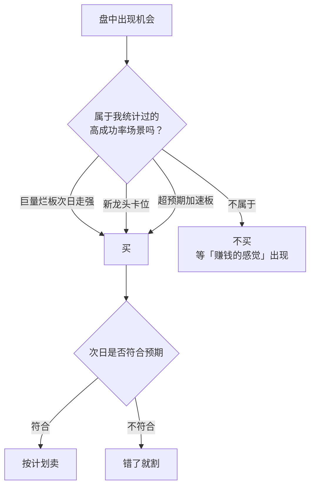

# 退学炒股 ②：交易模式——确定性、分仓与“赚钱的感觉”

::: summary 一页读懂
1. **不拘形式**：他不认同“打板的只能打板”，“对于我而言，要的是一个==确定性==”。
2. **三种高成功率场景**：他举过的例子是“前一天巨量烂板次日开盘走强、新龙头卡位、超预期加速板”。
3. **打板第一要义**：“封死”，宁可第二天低开，也不要当天回落。
4. **仓位的演变**：从潜意识里“喜欢全仓一个股”，到“以后坚决半仓操作”，再到设一条约 10 个点的回撤线：线上全仓，触线分仓。
5. **卖出纪律**：“错了就割”“操作只有对错，盈利交给市场”，以及不要“卖错之后的盲目纠错”。
6. **2019 年补课**：他发现论坛常提的“情绪周期”是一年前少见的词，承认“以前找到的金矿，现在可能一文不值”。
:::

::: note 阅读说明与免责声明
第 1–6 节全部来自退学炒股在《我和小明》帖中的跟帖（依据完整跟贴整理稿，按日期标注）。第 7 节是网友依据其交割单做的复盘，属于二手解读，会单独标明。他从未系统写过“模式说明”，本文的分节是整理者的归纳。打板、接力等手法风险很高。本文不构成任何投资建议。

本系列共 3 篇：[① 人物与实盘](/reading/tuixue-1-life.html) · ② 交易模式 · [③ 我和小明](/reading/tuixue-3-xiaoming.html)。
:::

## 1. 不拘形式，只要确定性

> 很多人都说要有模式，只做模式。我很困惑，打板的就一定只能打板，接力的只能去接力，低吸的只能去低吸，半路的只能去半路吗？可能连我自己都弄不明白，对于我而言，要的是一个确定性，如果能确定它当天会涨停那我绝对不会在涨停去买了。（2017-03-24）

> 盈利不分贵贱。赚同样的钱，在牛股上赚的比在普通股票上赚的更有面子，打板赚的比低吸赚的更有成就感……本质上这些都是一样的都是为了盈利，我们不应拘泥于形式上的区别。（2017-08-10）

::: tip 和赵老哥的“模式内”矛盾吗？
看起来相反，其实是一回事。[赵老哥](/reading/zhao-2-style.html#1-本人说过的话可溯源)说的“模式”是**自己有把握的范围**；退学炒股反对的是把模式理解成**一种固定的买入形式**。两人都在说：==只做自己确定的，不做自己不懂的。==
:::

他在 2017-08-31 对“系统”的定义很简洁：

> 系统是根据经验对买卖点设定的要求……它的作用就是让你去做自己最难手的事，不再临时起意情绪用事。

## 2. 三种高成功率的场景

> 培养一种能赚钱的感觉。有没有过这种经历，当你看到某个走势时你内心非常会确定它会涨，而经过统计这种情况下买入的成功率非常高，这种感觉就是经验，要做的就是等待这种情况出现时再买……比如==前一天巨量烂板次日开盘走强、新龙头卡位、超预期加速板==等这些情况买入时成功率是很高的。（2017-08-30）

*图：本文按 2017-08-30、2017-03-19 的跟帖整理。三种场景是他举的例子，不是完整清单。*

2018-03-14 他又补了一段“性格控制与股票技术”：入市一年基本都能找到一个“较为确定的买点”，“如果只买这个点，那么赢钱的几率很大，但是很少有人会做到只买这个点”。==技术给出买点，性格决定你是不是只买这个点。==

关于打板，他只留下过一句硬规则：

> 打板第一要义：封死 另可第二天低开，也不要当天回落（2017-02-28，原文“另可”应为“宁可”）

## 3. 仓位：从全仓到回撤线

他的仓位观在 2017 年下半年变了三次：

| 日期 | 想法 |
|---|---|
| 2017-07-25 | “分仓就是为了防止连续失败后的大幅回撤。它会减少单个票的收益，但不会减少总体收益，因为机会不止一个。” |
| 2017-08-16 | “全仓一个股，赚了我会非常高兴，亏了我会非常痛苦……半仓操作时，我心态非常平稳……以后坚决半仓操作。” |
| 2017-09-07 | 列出“全仓七问”：停牌怎么办？能否承受连续失败？更好的标的出现怎么办？…… |
| 2017-09-09 | “设置一个回撤线，资金在回撤线之上则全仓，资金到了回撤线则分仓，回撤线根据资金最高点变动，大概10个点左右的幅度。” |
| 2017-12-20 | 分两个账户操作后，“以前全仓一个股的时候根本接受不了像跌停、黑天鹅、停牌这些情况，现在基本不用担心了” |

“全仓七问”里的第二问很有代表性：

> 你愿意承受连续失败之后造成的大幅回撤吗？不愿意，但我觉得这种可能性很小。事实上，这种情况发生的概率很大，抛硬币时连续5次出现同一面的情况常有发生，资金回撤50%需要盈利100%才能回到原点。

::: core 对照 Asking
回撤线的思路，和 Asking 的“[半仓试错，赢了才加](/reading/asking-3-trading.html#3-仓位半仓试错赢了才加)”异曲同工：==状态好时进攻，状态差时自动降档==。区别是 Asking 按单笔的对错调仓，退学炒股按账户的回撤调仓。
:::

## 4. 卖出与纠错

> 错了就割，千万不要抱有任何幻想，将操作和盈利分别看待，它们两者没有必然联系。==操作只有对错，盈利交给市场。==（2017-03-19）

> 不可吃着碗里看着锅里。很多时候当一个新标的达到买点时，上次买入的还没达到卖点就提前卖出去买入新标的……上次买入的标的它具有一个很重要的性质，那就是主动权。（2017-08-10）

> 卖错之后的盲目纠错。很多人卖掉一个股之后它上涨了，结果意识到自己卖错了然后又去追回来，但此时的买点是你的最佳买点吗？……如果卖错了，我们应该反思卖错的原因，而不是进行盲目的补救。（2017-08-27）

他还记录过一次真实的失误。2017-11-17，他判断持仓股特停后还会涨，出去旅游时锁仓不卖，结果跌停，亏了 10 个点。他的总结是：“我有解决办法那就是分仓，但我没有，所以是我的错……大盘不好时只要空仓即可，但我没有，所以是我的错。”

## 5. 牛市思维是短线的毒药

> 牛市思维对于短线资金是致命的，它会让你从主观上高估个股的强度，从而错失最佳的买卖点。（2017-07-07）

> “牛市来了”这句话是短线的毒药……短线，牛市与熊市的区别是，牛市机会多熊市机会少，确定性与牛熊无关。（2017-09-13）

关于空仓，他有一个很特别的定义：

> 空仓，不是靠回避股市，也不是靠限制交易来达成，真正意义上的空仓是处在看着盘打开交易软件随时准备下单的状态中完成。（2017-03-12）

> 说句实在话，我觉得空仓比抓到一个涨停板更加喜悦，看到洁净的界面时心里特别舒畅。（2017-03-22）

这和职业炒手“[空仓与复利](/reading/zhiye-2-core.html#2-空仓与复利)”可以对照着读。但他也很坦白：2017-12-20 他又说“行情不好的时候完全空仓？对我来说，这是不存在的”。==同一个人在不同阶段的说法会变，读原帖要看日期。==

## 6. 2019 年的补课：情绪周期

2019-02-24，资金一年没有增长，他写了一篇长跟帖：

> 直到近期浏览了淘股吧的一些帖子，发现人们常提到的一些词语，是一年前鲜少见到的，情绪周期-高度板-超跌低价……以前找到的金矿，现在可能一文不值……短线，本质是人与人之间的博弈，少数人赚大多数人的游戏，公平竞争前提下，想赢的唯一方法就是要提前获知大多数人的想法。

这段话说明了两件事：

1. **方法会过期**：市场在变，“题还没解完就开始换题”。
2. **他回到了炒股养家的框架**：[情绪周期](/reading/yangjia-2-emotion.html#第-4-章-情绪周期赚钱效应与亏钱效应的轮回)、群体博弈。不同路径的短线高手，最后常会在同一套语言里相遇。

## 7. 他人复盘的交割单（二手）

网友依据其交割单做过不少复盘（属于二手解读，可信度取决于复盘者）：

- 葫芦大侠（2023）：竞价、低吸、打板、半路、翘板“都有”，最多的是开盘弱转强直接上车、打板等几类。
- 红门山（2026）：概括为“纯粹的情绪流博弈 + 严苛的隔日纪律 + 精准的主线聚焦”。
- 皆妙笔（大鹏鸟笔记）：逐笔图解了 2017–2019 年的交割单，例如雄安概念龙头“回调再启动”时开盘买一半、板上买一半，炸板后次日竞价离场。

::: warn 别迷信交割单
退学炒股自己说过：“别人的交割单毫无用处，因为你不知道当时他为什么要买为什么要卖”（2017-10-10）。交割单只能看到结果，看不到当时的判断。==用他的心得去读交割单，比反过来更有用。==
:::

## 8. 自测与行动

自测 1：他举过哪三种高成功率场景？

前一天巨量烂板、次日开盘走强；新龙头卡位；超预期加速板。

自测 2：回撤线怎么用？

以资金最高点为基准设一条约 10 个点的回撤线，资金在线上时全仓，触线后分仓。回撤线随资金最高点上移。

自测 3：“操作只有对错，盈利交给市场”是什么意思？

判断一笔交易要看它是否符合自己的规则，而不是看这一笔赚没赚钱。错了就割，不要抱幻想。

- [ ] 写下自己统计过的 2–3 个“高成功率场景”，不在清单里的不做
- [ ] 给账户设一条回撤线，并写明触线后怎么降仓
- [ ] 卖出后一周内不追回同一只股票，除非出现新的计划内买点
- [ ] 把自己的规则按日期记录，回头看哪些变了、为什么变

## 来源

- 《我和小明》原帖（2017-02-06 起，全文需登录）：https://www.tgb.cn/a/1ykBGTOOa5F
- 《我和小明》完整跟贴整理稿（本文按日期引用的依据）：http://www.qingzhouquanzi.com/449.html
- 退学炒股淘股吧博客：https://www.tgb.cn/blog/1035186
- 葫芦大侠，《退学炒股的交割单复盘总结》，2023-11-05（二手）：https://www.tgb.cn/a/238nH9FThtk
- 红门山，《从交割单总结退学炒股的交易模式》，2026-06-06（二手）：https://www.tgb.cn/a/2spbxDlGnWa
- 皆妙笔，《一年复利近150倍，超短高手退学炒股交割单图解复盘（一）》（二手）：https://www.jiemiaobi.com/archives/17452
