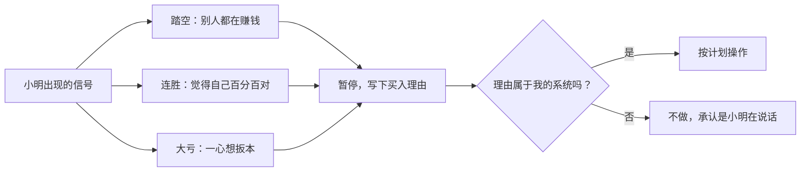

# 退学炒股 ③：《我和小明》——与心魔相处的交易心理学

::: summary 一页读懂
1. **小明是谁**：帖子开头像在讲一个初中同学，读下去才明白，“小明”是他心里那个冲动、急躁、想赌一把的自己。有网友在帖里一语道破：“另一个你——小明”，他回复“楼上两位说对了”。
2. **三种最想操作的时刻**：看到别人都赚钱时（踏空）；连续成功、自信十足时；大亏之后一心想扳本时。
3. **踏空为什么比亏钱难受**：因为你把踏空当成了亏损，而且这种“亏损”不会让你怀疑自己的水平。
4. **连续成功之后为什么常有大亏**：“自信是什么？就是把小概率的事件当成是大概率事件。”
5. **四步自救**：放慢脚步；保持平和；理智思考每一个决定；反思提高。
6. **知行合一**：2019 年他把 300 万到 1000 万部分归因于“做到了部分知行合一，知的内容全在我和小明这篇帖子里”。
:::

::: note 阅读说明与免责声明
本篇引文全部来自退学炒股《我和小明》帖的跟帖，依据公开的完整跟贴整理稿，按发帖日期标注。原帖全文需登录淘股吧查看。他在帖中写过不少低落、失眠甚至绝望的时刻，本文只摘录与交易心理有关的部分。如果你在交易中也长期失眠、情绪低落，请先照顾好自己，必要时寻求专业帮助。本文不构成任何投资建议。

本系列共 3 篇：[① 人物与实盘](/reading/tuixue-1-life.html) · [② 交易模式](/reading/tuixue-2-mode.html) · ③ 我和小明。
:::

## 1. 小明是谁

> 我三年多的股票交易生涯一直碌碌无为，很大的一部分原因就是小明，尽管我一点也不愿意见到他，但他总能找到机会跟我交流。（2017-02-06）

> 这几天大涨，小明对我说，别人都赚钱你却踏空了，赶紧去买一个吧。我跟他说，不管其他股涨不涨，没有自己的标的就不买，瞎买一个就会使自己陷入被动。（2017-02-09）

> 我一直在努力把小明提取出来，希望能跟他交流，最好的就是希望能看见他。（2017-02-12）

::: tip 为什么要给心魔起名字
把冲动“外化”成一个人，就能和它对话、和它吵架，而不是被它悄悄接管。这和巴菲特讲的[市场先生](/reading/buffett-3-value.html#4-市场先生)是同一种技巧：==市场先生是外面那个情绪化的人，小明是里面那个。==两个都不能让他替你做决定。
:::

*图：依据 2017-02-22 的跟帖整理。暂停和写下理由是本文给出的练习方法，不是他的原话。*

## 2. 三种最想操作的时刻

> 人处在什么情境下最想去操作？一，看到别人都赚钱的时候，踏空心理；二，当自己连续成功之后，此时自信心十足；三，当自己大亏的时候，一心想要扳本。因此，当遇到这三种情况时需要时刻保持警醒。（2017-02-22）

::: core 核心心法
==最想操作的时候，往往是最不该操作的时候。==这三种情况的共同点是：驱动力来自自己的情绪，而不是市场给出的机会。
:::

## 3. 踏空为什么比亏钱难受

> 为什么踏空比亏钱给人的感觉更难受……踏空是别人赚钱了而你没有，你认为如果你持仓了也必然会赚那么多，所以你把踏空当成是一种亏损；这种亏损与你持仓亏损的区别是，持仓亏损可能是我技不如人，而踏空并不能说明我水平差只是我没有参与。所以有这种感觉的大都是对自我认可度比较高的人。（2017-02-24）

半年后，他记录了自己的进步：

> 现在不会因为踏空而痛苦，我很喜欢看着别人的股票涨停，很精彩，就像是看一场电影一样。（2017-08-16）

## 4. 连续成功之后的大亏

> 为什么每次赚钱后都会来一次大亏……当一个人成功一次后会增加自信心，连续成功便会自信心爆棚，对自己的判断是百分百认可……只有直到大亏时才会使信心大幅下降。（2017-02-20）

> 自信是什么？就是把小概率的事件当成是大概率事件，比如在熊市当中你连续赚钱了，会让你产生一种错觉，认为这不是熊市……所以控制回撤有两个方法，一是随时保持理性，二是在心理层面提高回撤点。（2017-05-23）

大亏后的第二天（2017-02-21），他写下了四步：

> 第一步，放慢自己的脚步。第二步，保持一个平和的心态。第三步，理智思考每一个决定。第四步，学反思提高。（整理稿原文如此，“学”后疑脱“习”字）

> 我明知道该去赚哪些钱，可却妄想掌控所有，不让任何机会错过；我明知道做一件事的风险，却去妄想会不会发生奇迹；我明知道慢即是快的道理，却从来没有放慢过自己的脚步。（2017-02-21）

## 5. 常见的偏执

> 股市中一些常见的偏执心理，比如抄底要抄最低点，打板要打最早板，做接力的死也要找个连板上，又如追求当天账面的盈利否则看着不舒服，不能空仓就算只买了100股也行，等等。内心对形式的偏执，就像双眼被黑布蒙住了一样，使我们看不透事物的本质。（2017-02-23）

他还列过三个“阻碍进步的常见错误”（2017-03-03）：

| 错误 | 他的描述 |
|---|---|
| 加钱 | 大亏后不反思而是加钱，“加再多钱也无事于补”（原文如此，应为“无济于事”） |
| 只盯自己的股票 | 收盘后只找信息“来告诉自己是对的” |
| 归咎外界 | “要是T+0我肯定赚，这个游资不砸盘肯定涨……” |

还有一个关于“勤奋”的反常识：

> 水平提升只能通过更多的交易次数达到是一种误解。这是对自己赌性重的一种借口，水平的提升在于反思总结，而不是机械的操作。（2017-08-30）

## 6. 观众、借钱与别人的交割单

**观众**（2017-08-27）：

> 观众是一把双刃剑……一种是从此开始变得谨慎，对买卖要求更加严格……另一种是急于证明自己，不会放过每一次能盈利的机会，出手频率变高急买急卖……如果是为了证明自己能赢，那就主动把观众的评价屏蔽掉，因为你需要面对的只是你自己。

两个多月后，他终止了实盘帖（见 [①](/reading/tuixue-1-life.html#3-实盘曲线两段实盘两次终止)）。

**借钱**（2017-08-26）：

> 借钱不适用于短线操作。一是短线操作本身就是高风险高收益的方式……如果再去加大资金，那么风险和收益两者都会同时放大，这是相当于拿了一把刀架在自己脖子上；二是在操作的时候心态会把控不好……三是大部分人不知道收手。

**别人的交易**（2017-10-10）：

> 不要过多地关注别人的交易。一是别人的交割单毫无用处，因为你不知道当时他为什么要买为什么要卖……二是别人的实盘会扰乱自己的心态……别人的言语不管说得对不对都可以看可以听，看多了总会遇到那么一句能点醒自己的话，但交易应该独立思考。

::: warn 一个自指的提醒
这一条同样适用于读他本人：他的实盘截图和交割单，你也看不到当时的理由。所以这个系列花最多篇幅的是他的心得，而不是他的个股。
:::

## 7. 知行合一

> 为什么知行合一很难？这主要是对行所带来的结果没有深刻的认识……当不断体会到痛苦后，在这件事上就会慢慢变得知行合一，当忘记痛苦时可能又会随心所欲。（2017-08-11）

> 不要让这次的操作影响你下次的情绪……把每一次操作后的情绪分开，当下一次操作开始时你的情绪应该是要平淡的。（2017-08-09）

> 了解别人会让你知道如何赚钱，了解自己会让你知道如何不输钱。（2017-06-17）

炒股养家说“[情绪是情绪，操作是操作](/reading/yangjia-5-position.html#第-10-章-心态与信念情绪是情绪操作是操作)”；钙片把止损落到总市值上，用“[整体性止损](/reading/gaipian-3-discipline.html#2-整体性止损)”约束自己。退学炒股的办法是把小明写下来，一天一天地写。==方法不同，目的一样：让情绪和下单之间隔一道墙。==

## 8. 自测与行动

自测 1：人在哪三种情境下最想操作？

看到别人都赚钱（踏空）；连续成功、自信十足；大亏之后想扳本。

自测 2：为什么踏空常常比亏钱更难受？

人把踏空当成了亏损，而且这种“亏损”不会让人怀疑自己的水平。他认为这种感觉多见于自我认可度高的人。

自测 3：他对“自信”的定义是什么？对交易有什么含义？

“把小概率的事件当成是大概率事件”。连胜后要警惕：赚钱可能来自环境，而不是能力。

自测 4：为什么他说“别人的交割单毫无用处”？

因为看不到买卖时的理由；而且别人的盈亏会扰乱自己的心态。

本周的“小明日记”练习：

- [ ] 每次下单前写一句：这是我，还是小明？
- [ ] 遇到“踏空 / 连胜 / 大亏”三种情境时，强制暂停 10 分钟
- [ ] 收盘后记录当天最强烈的一种情绪，以及它有没有影响下单
- [ ] 一周后回看：小明最常在什么时候出现？
- [ ] 屏蔽一个让你焦虑的“观众”来源（群、榜单或论坛帖）

## 来源

- 《我和小明》原帖（2017-02-06 起，全文需登录）：https://www.tgb.cn/a/1ykBGTOOa5F
- 《我和小明》完整跟贴整理稿（本文引文依据）：http://www.qingzhouquanzi.com/449.html
- 退学炒股淘股吧博客：https://www.tgb.cn/blog/1035186
- 《看了我的实盘贴之后有什么感受？》（2017-11-04）：https://www.tgb.cn/a/1ykCCtkBc7M
