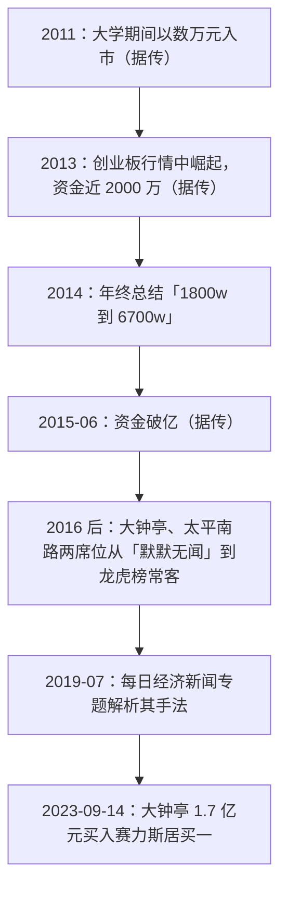

# 小鳄鱼 ①：人物与足迹——90 后游资代表，和他那篇年终总结

::: summary 一页读懂
1. **他是谁**：媒体称“小鳄鱼”是一位南京籍 90 后游资。每日经济新闻明确说这是“化名”，他“没接受过采访”，外界只能通过论坛发言和龙虎榜了解他。
2. **一篇年终总结**：流传最广的自述，是他的 2014 年度总结：“今年从1800w做到6700w”，“给自己70分”。心得只有两行：==大局观==和==节奏感==。
3. **席位**：媒体普遍认为南京证券南京大钟亭、中投证券（现中金财富）南京太平南路是他的核心席位。界面新闻统计，2014 年以来两席位上榜总额分别为 192.36 亿元和 129.85 亿元。
4. **传闻多**：“廖国沛门生”“本名某某”“四年 8000 元到 1 亿”等说法，媒体都写明“无从考证”，==待考==。
5. **仍然活跃**：2023-09-14，大钟亭席位以 1.7 亿元买入赛力斯居买一（界面新闻）。
:::

::: note 阅读说明与免责声明
小鳄鱼本人从未接受采访，原始论坛 ID 也没有权威说法。本篇以每日经济新闻（2019）、界面新闻（2019、2023）为主，自述部分只用流传较一致、能找到早期转载的两段文字，并标明“原帖待考”。资金数字均为“据传”。文中个股只是历史记录，不构成推荐。本文不构成任何投资建议。

本系列共 2 篇：① 人物与足迹 · [② 隔日交易框架](/reading/xiaoeyu-2-style.html)。
:::

## 1. 能确认什么，不能确认什么

| 信息 | 可信度 | 依据 |
|---|---|---|
| 存在一位被市场称为“小鳄鱼”的南京游资，常用南京大钟亭、南京太平南路等席位 | ==较高== | 每经、界面多篇报道，龙虎榜持续可见 |
| 90 后 | 中 | 媒体“据市场传闻” |
| 2011 年以数万元入市，2013 年近 2000 万，2014 年约 7000 万，2015 年破亿 | 中低 | 媒体均写“网上广泛流传”“无从考证”；与 2014 年总结的“1800w 到 6700w”大致吻合 |
| “佛山帮”廖国沛的门生，或佛山前辈给过资金 | 低 | 每经称“市场传言无从考证”，==待考== |
| 本名 | 低 | 只见于自媒体，本文不采用 |
| 原始淘股吧 ID | 低 | 各种说法互相矛盾，本文未能核实，==待考== |

## 2. 时间线

*图：依据每日经济新闻、界面新闻和流传的年终总结整理，“据传”项未经证实。*

## 3. 2014 年终总结：1800 万到 6700 万

这篇总结是小鳄鱼流传最广的“原话”。下面按论坛转载稿全文引用（原帖发表平台和 ID ==待考==，最早可见的转载把它当作他在 2014 年底写的年度总结）：

::: quote 2014 年度总结（转载稿）
转眼又是一年，今年身边的朋友基本都取得了不小的进步，自己也慢慢的成长了，今年从1800w做到6700w，总体还算满意的，其实前面做的真一般，尤其是7月份，让我对自己有了一次深刻的反思。最后三个月冲刺了下，主要行情好，不是水平有多高，给自己70分。

1.大局观 看指数 看热点 看主流 看个股 看盘口
2.节奏感 心态 买点的舒适感 通过仓位和交易策略来保持交易的主动性

再叫我说什么，我真不知道说什么，其实我们要承认，==真正赚大钱的时候很少，真正非常好的个股很少，不要被短线频繁的交易蒙蔽了双眼==
:::

::: tip 怎么读这段话
- **自评很低调**：一年近 4 倍，他说“主要行情好，不是水平有多高”。2014 年下半年正是牛市启动期。
- **大局观是从上到下的顺序**：指数 → 热点 → 主流 → 个股 → 盘口。这和职业炒手“先大盘后板块再个股”的三层筛选几乎一样（见 [职业炒手 ③](/reading/zhiye-3-mode.html#2-自上而下的三层筛选)）。
- **节奏感讲的是主动权**：用仓位和策略保证自己永远有选择，而不是被套住、被迫等待。
- **最后一句最值钱**：好机会很少，频繁交易会让人误以为天天都有机会。
:::

## 4. 席位与媒体画像

每日经济新闻（2019-07-09）写道，南京大钟亭和南京太平南路两家营业部“在2016年前还默默无闻”，近两年“异军突起”。截至 2019 年 7 月 5 日，太平南路一年上榜 144 次，平均上榜成交额 1685 万元。关联席位还包括长江证券上海世纪大道、天风证券上海兰花路等。

界面新闻（2019）引用一位研究游资的人士的说法：“如果说60后游资的典型代表是章建平，70后是孙国栋，80后是赵老哥，那么90后的游资代表非小鳄鱼莫属。”这把他放进了一条清晰的谱系：[章盟主](/reading/zhang-1-life.html) → 孙哥 → [赵老哥](/reading/zhao-1-life.html) → 小鳄鱼。

2023 年 9 月 14 日，赛力斯涨停，龙虎榜买一是大钟亭（1.7 亿元），买二是章盟主常用的国泰君安上海江苏路（1.15 亿元）。界面新闻对他的描述是“在趋势行情下能够与时俱进，对价值投机炒作理解独到”。

::: warn 席位≠本人
媒体的说法是“市场人士均认为”。同一营业部里可能有多路资金，部分席位多年后也可能易主。按席位“跟踪小鳄鱼”本身就有误差。
:::

## 5. 自测与行动

自测 1：小鳄鱼的 2014 年总结里，“大局观”包括哪几个层次？

看指数、看热点、看主流、看个股、看盘口，从大到小。

自测 2：哪些关于他的说法应该标为“待考”？

师承（廖国沛门生）、本名、原始论坛 ID、早期每一年的具体资金数字。媒体自己都写了“无从考证”。

自测 3：他怎么评价自己 2014 年近 4 倍的收益？

“主要行情好，不是水平有多高，给自己70分。”他还特别反思了 7 月份做得不好。

- [ ] 用“指数 → 热点 → 主流 → 个股 → 盘口”的顺序复盘一次今天的市场
- [ ] 给自己今年的交易打分，并写下“哪些收益来自行情，哪些来自水平”
- [ ] 数一数上个月有多少交易属于“被频繁交易蒙蔽了双眼”

## 来源

- 每日经济新闻，《深度：炒股4年从万元做到上亿？90后游资“小鳄鱼”操盘手法大揭秘！》，2019-07-09：https://www.nbd.com.cn/articles/2019-07-09/1352328.html
- 界面新闻，《游资新势力：揭秘90后小鳄鱼操盘手法》，2019：https://m.jiemian.com/article/3119703_qq.html
- 界面新闻，《小鳄鱼、章盟主领衔，四大游资携手豪买4个亿，“团宠”赛力斯成色如何？》，2023-09-15：https://www.jiemian.com/article/9678655.html
- 2014 年度总结转载稿（理想论坛，原帖待考）：https://www.55188.com/thread-18883683-1-1.html
- 凤凰网，《90后一线游资小鳄鱼是如何变成如今的大鳄的！（附操盘方法）》，2018-05-11（语录早期转载）：https://finance.ifeng.com/c/7coTrjfWCDz
