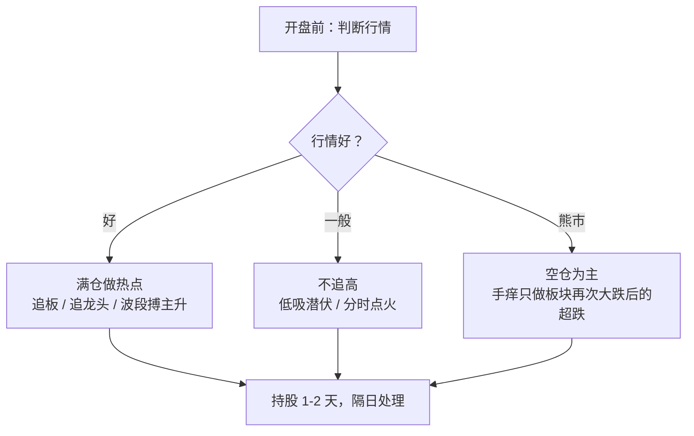

# 小鳄鱼 ②：隔日交易框架——六种手法、揣摩与势

::: summary 一页读懂
1. **隔日交易**：他的自述是“基本是隔日交易，持股1-2天，行情好的时候可能适当增长持股时间”。
2. **六种手法**：追板、分时点火、低吸潜伏、强势超跌反弹、波段搏主升、空仓。按行情切换：好时满仓追龙头，差时低吸或空仓，“==熊市中空仓都是正确的==”。
3. **只看四样**：K 线、成交量、均线、分时图，“其他的都不看”。
4. **揣摩**：“做股票的本质就是人与人的博弈”，要想清楚为什么今天拉这个股票。
5. **龙虎榜上的路数**：媒体复盘出二板接力、强势股反包、高位接力龙头、热点大票首板，也记录了失手的单子。
:::

::: note 阅读说明与免责声明
第 1–3 节的“自述”来自 2018 年起被凤凰网、界面新闻等转载的小鳄鱼语录，界面新闻称其为“网上流传的小鳄鱼语录”。原始发帖平台和时间==待考==，所以引文按转载稿，并注明首个可查转载。第 4–5 节为每日经济新闻、界面新闻依据席位数据做的复盘，属于第三方解读。文中个股只是历史记录，不构成推荐。本文不构成任何投资建议。

本系列共 2 篇：[① 人物与足迹](/reading/xiaoeyu-1-life.html) · ② 隔日交易框架。
:::

## 1. 他的交易框架（自述）

::: quote 转载稿（首见凤凰网 2018-05-11）
首先我的交易模式，基本是隔日交易，持股1-2天，行情好的时候可能适当增长持股时间。我的交易框架里，对不同的行情有不同的手法主要分为，追板，分时点火，低吸潜伏，强势超跌反弹，波段搏主升，空仓。当天怎么操作，一般要看具体的盘面。核心还是主要依赖市场的热点题材股票，行情好的时候满仓做，追龙头。行情不好不追高，低吸为主，或者空仓。熊市中空仓都是正确的，想管住自己的手也不容易，只能做一做超跌，也就是下跌一段时间后，板块再次大幅下挫的情况。技术分析主要用的是k线，成交量，均线和分时图的走势，其他的都不看。
:::

把这段话画成一张决策图：

*图：本文按转载的自述整理，各手法的具体标准他没有公开。*

::: tip 对照
- 和[赵老哥](/reading/zhao-2-style.html#2-媒体与网友归纳的打法)几乎只做板不同，小鳄鱼是**多手法按行情切换**。每日经济新闻称他“算是一个全能型的选手”。
- “熊市中空仓都是正确的”和职业炒手“[弱市不做](/reading/zhiye-2-core.html#1-第一原则弱市不做)”同一个意思，但他坦白“想管住自己的手也不容易”，所以给自己留了一个小口子：只做超跌。
:::

## 2. 揣摩：技术分析背后是人心

同一份转载稿里，他讲了“揣摩”：

> 我觉得做股票的本质就是人与人的博弈，心里的较量，所以从技术分析到市场参与者心里的揣摩很重要，事实上技术分析的背后就是投资大众心里的表现。还有就是炒作的逻辑，为什么今天拉这个股票，公司基本面的拐点？还是有什么题材？还是整个板块的异动还是个股行为？这个需要积累，而且==必须第一时间买进，不可追太高（除非市场情绪很好，龙头可追）==，因为很多股票市场是不怎么认可的，会冲高回落，那么就难了。

这和炒股养家“[交易的本质是群体博弈](/reading/yangjia-2-emotion.html#第-3-章-第一性原理交易的本质是群体博弈)”是同一个出发点。小鳄鱼给出的是一组具体的追问：

| 追问 | 想回答什么 |
|---|---|
| 为什么今天拉它？ | 驱动来自基本面拐点、题材，还是板块异动？ |
| 是板块还是个股？ | 有没有合力，会不会孤军深入 |
| 现在追是不是太高？ | 除非情绪很好、是龙头，否则不追 |
| 市场认不认可？ | 不认可的票会冲高回落 |

他还说过找风格的过程：“我一开始做短线但是亏得快，后来做长线，发现我的性格太急躁做不来，再改到短线，然后坚持到现在。”（同一转载稿）

## 3. 势：共振上涨，共振下跌

另一段常被转载的话（网易号 2020 年转载，原帖==待考==）：

> 炒股基本靠势，有时候搞不懂为什么这么烂的题材和个股都能封住，有时候也搞不懂为什么自己搞了个这么好的板也被闷杀，把握好了这个势，共振上涨，共振下跌，交易的大部分我觉得基本就能解决了……每个阶段都有每个阶段的感悟。

::: core 一句话
==个股的好坏，常常输给环境的强弱。==烂题材在强势里也能封板，好板在弱势里也会被闷杀。所以他的框架第一步永远是“判断行情”，而不是选股。
:::

## 4. 龙虎榜上的四种路数（第三方复盘）

| 路数 | 案例（据每经 / 界面，2019） | 要点 |
|---|---|---|
| 二板接力 | 中国出版，2019-04-16 二板买入 3477.40 万元，次日卖出 3831.81 万元 | “相对要偏低位一些，也就是打二板比较多” |
| 强势股反包 | 双塔食品，2019-06-17 尾盘涨停日买入 2481.11 万元，次日高开出货 | 只做主线里的强势股，“反包只有大主流在时才容易连板”（网文归纳） |
| 高位接力龙头 | 复旦复华七板（2019-03-19）买入 4042.77 万元，次日卖出；领益智造四连板买一 | 热门概念 + 持续连板 + 人气高 |
| 热点大票首板 | 京东方 A，2019-02-12 两席位合计买入 1.28 亿元，次日卖出 | 有题材的大盘龙头，封板后次日容易获利退出 |

界面新闻的总结是：“基本以隔日交易为主，极少的情况下才会锁仓”，这与他的自述一致。

## 5. 失手的单子

媒体也记录了他的失手（B 档）：

- **三鑫医疗**（2019-05-09）：二板买入 1575.34 万元，结果开板，收盘只涨 2.94%，“第二天割肉”。
- **深科技**（2019-03-25）：3 日龙虎榜买入 4124.93 万元，当天未能涨停，随后三根阴线。
- **中信国安**（2019-03-21）：1.23 亿元助其涨停，次日收跌 4.24%，此后持续回调。

每日经济新闻的评语很到位：“游资打板赚钱靠的是胜率，如果胜率高，大赚小亏，在复利的威力下，资金就能得到复合快速增长。”==失手不可怕，可怕的是失手后不走。==

## 6. 对照：和赵老哥、退学炒股比

| | 赵老哥 | 小鳄鱼 | 退学炒股 |
|---|---|---|---|
| 核心手法 | 板上买，模式单一 | 多手法按行情切换 | 不拘形式，只要确定性 |
| 持股 | 有利就跑，连板才留 | 隔日为主 | 隔日为主，严格止损 |
| 关键词 | 模式内 | 大局观、节奏感 | 确定性、心态 |
| 详见 | [赵老哥 ②](/reading/zhao-2-style.html) | 本篇 | [退学炒股 ②](/reading/tuixue-2-mode.html#1-不拘形式只要确定性) |

同样强调“做个股要结合大盘”、反对“只跟随不预测”的，还有[瑞鹤仙](/reading/ruihe-2-method.html#4-做个股要结合大盘)。

## 7. 自测与行动

自测 1：小鳄鱼的六种手法是什么？

追板、分时点火、低吸潜伏、强势超跌反弹、波段搏主升、空仓。

自测 2：熊市里他怎么做？

空仓“都是正确的”。实在要做，只做板块下跌一段时间后再次大幅下挫的超跌。

自测 3：什么时候可以追高？

按他的说法，“不可追太高（除非市场情绪很好，龙头可追）”。

- [ ] 给自己的手法分档：哪些只在强势用，哪些弱势也能用，哪些时候空仓
- [ ] 下一笔买入前回答四个问题：为什么今天拉它？板块还是个股？是否太高？市场认不认可？
- [ ] 复盘时只用 K 线、成交量、均线、分时四样工具，看看是否够用
- [ ] 记录每一笔隔日交易的次日处理，检查有没有把“隔日”拖成“被动长线”

## 来源

- 凤凰网，《90后一线游资小鳄鱼是如何变成如今的大鳄的！（附操盘方法）》，2018-05-11（交易框架、揣摩、风格选择的早期转载）：https://finance.ifeng.com/c/7coTrjfWCDz
- 网易号（赢在择时），《股海人物传：“小鳄鱼”的操盘手法和悟道心法》，2020-04-21（“炒股基本靠势”转载）：https://www.163.com/dy/article/FAO7JG6S0539FKQ5.html
- 每日经济新闻，《深度：炒股4年从万元做到上亿？90后游资“小鳄鱼”操盘手法大揭秘！》，2019-07-09：https://www.nbd.com.cn/articles/2019-07-09/1352328.html
- 界面新闻，《游资新势力：揭秘90后小鳄鱼操盘手法》，2019：https://m.jiemian.com/article/3119703_qq.html
- 闽发论坛整理（战法归纳，二手）：https://www.xiarj.com/7920.html
