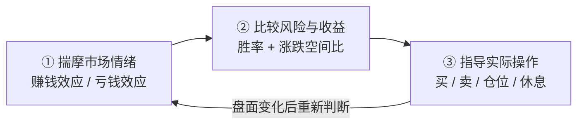
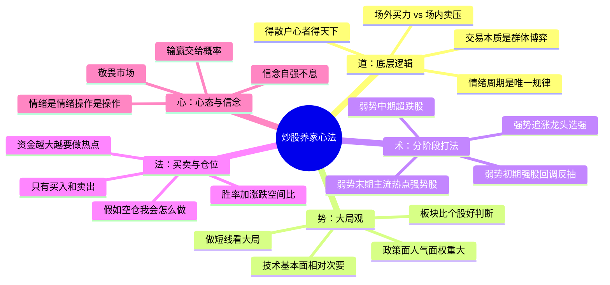
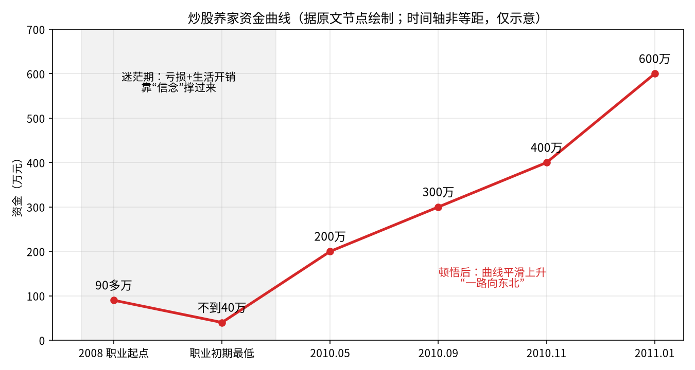
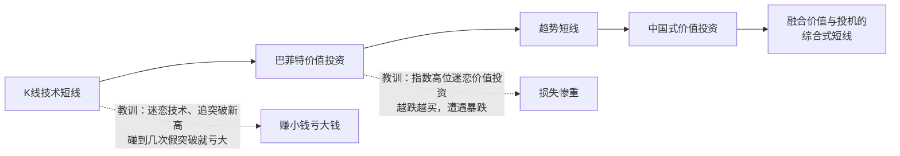

# 炒股养家 ①：总览与人物——一张图看懂养家心法

::: summary 一页读懂：7 条核心心法
1. **看人不看图**：交易是群体博弈，读懂场内外资金的心理，比读懂 K 线重要。（[第 3 章](/reading/yangjia-2-emotion.html#第-3-章-第一性原理交易的本质是群体博弈)）
2. **情绪是唯一的规律**：赚钱效应吸引资金，亏钱效应赶走资金，循环往复。（[第 4 章](/reading/yangjia-2-emotion.html#第-4-章-情绪周期赚钱效应与亏钱效应的轮回)）
3. **判断为末，应变为本**：看的是长线，做的是短线，如果判断错了，应变就是了。（[第 5 章](/reading/yangjia-3-dashi.html#第-5-章-大局观做的是短线看的是更大的局)，p.12）
4. **阶段决定打法**：强势追涨龙头；弱势初期做回调反抽，中期做超跌，末期做新主流强势股；没热点就休息。（[第 6 章](/reading/yangjia-3-dashi.html#第-6-章-分阶段打法强势弱势初期中期末期)）
5. **只问未来，不问成本**：只有买入和卖出；拿不准时问“假如我空仓会怎么做”。（[第 8 章](/reading/yangjia-4-trade.html#第-8-章-卖出与持仓没有止损只有买入和卖出)）
6. **重仓要苛刻**：满仓要胜率 90%+、上涨 30～50%、下跌 3～5%。（[第 9 章](/reading/yangjia-5-position.html#第-9-章-仓位与赢面胜率--涨跌空间比)）
7. **心态要淡定**：做对的事，输赢交给概率；稳定的复利才是职业炒股的根本。（[第 10 章](/reading/yangjia-5-position.html#第-10-章-心态与信念情绪是情绪操作是操作)，p.15、21）

*以上条目摘自[第 13 章](/reading/yangjia-6-practice.html#第-13-章-总结与金句速查卡)“五句话记住养家”与原文金句，按阅读顺序排列。*
:::

::: note 阅读说明
**它是什么**：本篇是《炒股养家心法：从总体到实战的系统教程》拆分后的第 1 / 6 篇。教程把《70 后游资翘楚炒股养家心法语录》（悟道心法编辑，共 28 页）这份零散语录，重新整理成一套从总体到实战的学习路线。全部六篇：[① 总览与人物](/reading/yangjia-1-overview.html)、[② 群体博弈与情绪周期](/reading/yangjia-2-emotion.html)、[③ 大局观与分阶段打法](/reading/yangjia-3-dashi.html)、[④ 选股、买点与卖出](/reading/yangjia-4-trade.html)、[⑤ 仓位、赢面与心态](/reading/yangjia-5-position.html)、[⑥ 实战演练、误区与金句](/reading/yangjia-6-practice.html)；系列第 ⑦～⑩ 篇是在此之外收集的原帖、问答与报道。

**标注约定**：「原文」或 `p.X` 出自 PDF 第 X 页，尽量保留原话；💡 **讲解** 是教程作者补充的通俗解释、类比或例子，**不是**原文；⚠️ **坑** 是原文点名的常见错误。

⚠️ **风险提示**：本教程只是对一份公开语录的学习整理，**不构成任何投资建议**。原文里的胜率、收益等数字都是养家本人的口述，没有经过核实；短线交易风险很高，请独立判断。
:::

## 第 0 章 一句话读懂这份资料

**一句话**：养家的“心法”就是==**琢磨市场情绪，据此比较风险和收益，再拿这个比较结果指导操作**==。

原话（p.2）：
> 本人理论体系的核心思想是基于对市场情绪的揣摩，进而判断风险和收益的比较，并指导实际操作，故暂名曰心法。

拆开就是一条三步的链：

💡 **讲解**：大部分人炒股是“看图说话”，盯着 K 线、指标；养家是“看人说话”，盯着**市场上其他人此刻在想什么**。图形只是人心留下的脚印，他要读的是人心本身。

---

## 第 1 章 全景图：一张图看懂养家心法

先把整套体系摆出来，后面每一章展开其中一支。

用“盖房子”来类比这五层（💡 讲解）：

| 层次 | 好比 | 回答的问题 | 对应章节 |
|---|---|---|---|
| 道（底层逻辑） | 地基 | 股价为什么涨跌？ | [第 3、4 章](/reading/yangjia-2-emotion.html#第-3-章-第一性原理交易的本质是群体博弈) |
| 势（大局观） | 选址 | 现在该进攻还是防守？ | [第 5 章](/reading/yangjia-3-dashi.html#第-5-章-大局观做的是短线看的是更大的局) |
| 术（分阶段打法） | 户型 | 这个阶段该用什么招？ | [第 6、7 章](/reading/yangjia-3-dashi.html#第-6-章-分阶段打法强势弱势初期中期末期) |
| 法（买卖与仓位） | 施工规范 | 怎么买、怎么卖、下多重？ | [第 8、9 章](/reading/yangjia-4-trade.html#第-8-章-卖出与持仓没有止损只有买入和卖出) |
| 心（心态信念） | 住的人 | 怎么不被自己的情绪坑？ | [第 10 章](/reading/yangjia-5-position.html#第-10-章-心态与信念情绪是情绪操作是操作) |

原文里有一组浓缩口诀（p.2），可以当作整套体系的“目录”：

::: quote 浓缩口诀（p.2）
> 高手买入龙头，超级高手卖出龙头。
> 别人贪婪时我更贪婪，别人恐慌时我更恐慌。
> 敢于大盘低位空仓，敢于大盘高位满仓；心中无顶底，操作自随心。
> 永不止损，永不止盈。只有进场，出局。
> 得散户心者得天下；人气所向，牛股所在。
> 买入机会，卖出风险，只做对的交易，胜负交给概率，多一份淡定，少一分胜负心。
> 博弈，就是在动态的变化过程中，时刻寻求最优化的策略。
:::

> 💡 **讲解：“别人贪婪时我更贪婪”** 和巴菲特那句“别人贪婪时我恐惧”方向正好相反。按养家的逻辑（p.12）：人贪婪是因为赚了钱，赚钱效应弥漫的市场**机会多于风险**，所以该更积极；人恐慌是因为亏了钱，亏钱效应弥漫的市场**风险多于机会**，所以该更谨慎。他是**顺着**群体情绪走、并且比群体走得更坚决，不是对着干。不过他也说过“不刻意反向操作”（p.22），而且会在亏钱效应走到极致、恐慌盘宣泄完之后低吸超跌股（见[第 6 章](/reading/yangjia-3-dashi.html#第-6-章-分阶段打法强势弱势初期中期末期)）。所以这句口诀讲的是**顺着情绪定仓位**，跟他在情绪拐点上的具体打法要结合起来看。

---

## 第 2 章 人物与心路：从 90 万亏到 40 万，再到 600 万

### 2.1 人物速写（p.1）

- 70 后，上海人，90 年代末入市。
- 2008 年开始职业炒股，起初从 90 多万亏到最低不到 40 万；同时要扛房贷、车子油钱、孩子奶粉钱。
- 后来“逐渐悟道”：2010 年 5 月资金到 200 万，9 月 300 万，11 月 400 万，2011 年 1 月 600 万，“资金曲线平滑上升”。
- 他在淘股吧（原文写作“淘县”）留下的多是“道”层面的讨论，很少谈具体技术。

*图 2-1：根据原文给出的几个资金节点画的示意图。“90 多万”“不到 40 万”取近似值，时间轴不等距。*

### 2.2 方法论的五次进化（p.3–4）

他踩过的两个大坑（p.3）：
1. **价值投资阶段**：在指数高位迷恋价值投资，越跌越买，结果遭遇暴跌，损失惨重。
2. **短线初级阶段**：迷恋技术，常买突破新高的股，“赚么赚点小钱，碰到几个假突破就亏大了”。

他学过的人（p.3、7）：唐能通、童牧野（在营业部见过面）、巴菲特、彼得·林奇、闽发论坛和淘股吧的好手，尤其是 **asking** 和 **职业炒手**，后两位是他的精神榜样。

### 2.3 他最想强调的两个字：信念

> 技巧性的东西，asking 和炒手基本都说了，我能反复强调的就是信念二字。（p.3）
> 亏钱不是做短线的错，刚开始学，水平不够，交点学费也是应该的，最可怕的是失去了信念。（p.21）

💡 **讲解**：这一章看着像人物传记，其实是在打预防针：**连他也亏过一半本金，而且这段亏损并不是靠技巧熬过来的，靠的是信念，再加上持续优化策略**。后面学到的任何方法，新手照做都可能先亏一阵，要有这个心理准备。

---

## 本篇自测与清单

自测：养家给自己的“心法”下的定义可以拆成哪三步？

揣摩市场情绪 → 比较风险与收益（胜率 + 涨跌空间比）→ 指导实际操作；盘面变化后重新判断（p.2，第 0 章）。

自测：“道 · 势 · 术 · 法 · 心”五层分别回答什么问题？

道：股价为什么涨跌；势：现在该进攻还是防守；术：这个阶段用什么招；法：怎么买卖、下多重；心：怎么不被自己的情绪坑（第 1 章表格）。

自测：养家自述踩过的两个大坑是什么？

指数高位迷恋价值投资、越跌越买；短线初级阶段迷恋技术、追突破新高，碰到假突破就亏大（p.3）。

自测：他说自己最想反复强调的是哪两个字？

“信念”——技巧性的东西 asking 和炒手基本都说了（p.3）。

读完本篇，勾一勾：

- [ ] 能用一句话讲清“心法”的三步链条
- [ ] 知道五层结构各对应系列里的哪一篇
- [ ] 记住他职业初期从 90 多万亏到不到 40 万的经历，给自己的学习期留出亏损预期

下一篇：[② 群体博弈与情绪周期](/reading/yangjia-2-emotion.html)。

## 来源

- 《70 后游资翘楚炒股养家心法语录》（悟道心法编辑，“游资语录精编 30 篇系列”之一，PDF 共 28 页；本地资料《情绪周期炒股养家心法语录精编》）。正文 `p.X` 均指该 PDF 页码。
- 语录原始出处多为淘股吧炒股养家的帖子与回复，网友整理版可参考：淘股吧《炒股养家心法（转）》https://m.tgb.cn/a/1KAdGAYzcje ；原帖之一《我如何在股市赚了200万》转载 https://m.tgb.cn/a/2oLta4CHEK0 （详见本系列 [⑦ 原帖现场](/reading/yangjia-7-thread.html)）。
