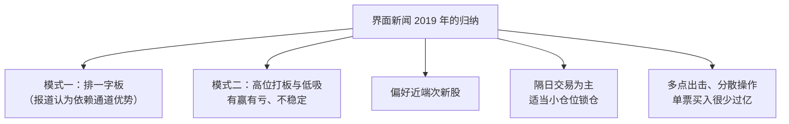

# 炒股养家 ⑩：媒体视角与传闻辨析——席位、一字板与多点出击

::: summary 一页读懂
1. **媒体怎么看他**：界面新闻 2019 年的报道援引研究游资的人士，称其为"淘股吧第一高手"，并梳理了其常用席位与操盘方式。
2. **排一字板**：报道认为其一大特点是利用"通道优势"在一字板阶段介入，确定性较高。
3. **高位打板与低吸有赢有亏**：报道统计的近期案例里，高位介入的胜率"并不算高"。
4. **隔日为主、多点出击**：买入次日退出居多，偶尔小仓位锁仓；资金大了"多点出击其实也是一种无奈"。
5. **传闻要分清**：网传本名、出生年份、资金规模、辞职细节等，多来自自媒体，本文一律标注待考、不采用。
:::

::: note 阅读说明与免责声明
本文整理公开媒体报道与网络流传信息，用于理解"养家心法"背后这个人的交易风格与公众形象。**席位归属、资金规模均为媒体或网友推断，并非本人确认**；报道中的个股案例只是复述 2019 年的新闻内容，**不构成任何投资建议**。凡自媒体来源的生平细节，均标为传闻 / 待考。
:::

## 1. 一篇报道：《"淘股吧第一高手"操盘揭秘》

2019 年 7 月 30 日，界面新闻发表深度报道，开头写道：从淘股吧中走出过不少游资高手，炒股养家就是其中之一，研究游资的黄先生"甚至将其称为'淘股吧第一高手'"。

报道列出的常用席位均在华鑫证券的多个营业部（上海宛平南路、茅台路、淞滨路、松江，宁波沧海路，南昌红谷中大道，西安西大街等），并统计了 2014 年以来这些席位登上[[龙虎榜]]的金额：

| 席位 | 2014 年以来上榜金额（报道统计） |
|---|---|
| 华鑫证券上海宛平南路 | 256.62 亿元 |
| 华鑫证券宁波沧海路 | 105.68 亿元 |

报道还发现，席位最活跃的时段集中在 **2015 年 3 月至 12 月**和 **2016 年 8 月至 2017 年 9 月**；2017 年 10 月之后上榜金额大幅减少。

::: warn 席位归属是推断
"某席位 = 某游资"是市场和媒体根据长期观察做出的推断，==本人并未公开确认==。阅读时把它当作"媒体视角"，而不是确定事实。
:::

## 2. 报道归纳的几种操盘方式

### 2.1 排一字板与"通道优势"

报道认为，"排一字板"是其一大绝技：在新股或热门股连续一字板阶段介入，开板时退出。报道举了几只 2019 年的新股和热门股为例，并解释了所谓**通道优势**——集合竞价前的申报由券商汇集后集中报送，报送先后影响排板先后；券商的快速通道有资金门槛和费用，普通投资者难以获得。

报道最后也提到，不少投资者对"券商 VIP 快速交易通道"颇有微词，认为有违"公开、公平、公正"原则。

::: tip 解读：普通人学不了这一招
这一模式依赖的是交易通道和资金规模，而不是"心法"。对普通读者来说，==更值得关注的是报道里另外几种模式的胜负记录==。
:::

### 2.2 高位打板与低吸：有赢有亏

报道梳理了 2019 年春季的几次高位介入：有的次日冲高卖出获利，有的买在阶段高点后亏损离场，还有在三连板个股上追高当天即跌停的案例。报道的结论是：

> 即使是身经百战的炒股养家，在高位介入个股时的胜率也并不算高，经常出现买在个股股价处于阶段最高位的情况。

::: core 顶级游资也会亏
这一段与养家自己的说法一致：他从不说自己能看准每一笔，而是强调"做对的交易，输赢交给概率"、控制回撤（见 [⑤ 仓位、赢面与心态](/reading/yangjia-5-position.html)）。高位打板"盈利能力极为不稳定"，恰好说明为什么他把仓位和赢面放在首位。
:::

### 2.3 近端次新、隔日为主与偶尔锁仓

- **近端次新**：刚开板不久的次新股无套牢盘、交投活跃，报道举了 2019 年的例子，也记录了买入次日跌停的失手案例。
- **隔日为主**：很多时候买入次日就退出；但在题材有新消息催化时，也会小仓位锁仓几天。
- 关于持仓时间，报道引用的正是他 2010 年原帖里"强势学钙片、弱势学炒手、平衡学先手"的那段话（见 [⑦ 原帖现场](/reading/yangjia-7-thread.html)）。

### 2.4 多点出击

报道观察到，虽然资金量大，其单只股票的买入金额"很少会突破亿元"，并引用了他关于冲击成本的说法——"多点出击其实也是一种无奈"，资金大了，本可亏 2–3 个点结束的操作可能变成 5–6 个点。这段话教程里也有收录（见 [⑤ 仓位、赢面与心态](/reading/yangjia-5-position.html) 的"资金规模与打法"）。

## 3. 传闻辨析

网络上关于炒股养家的"人物故事"很多，以下按来源可信度整理：

| 说法 | 常见来源 | 本文处理 |
|---|---|---|
| 90 年代末入市，2008 年开始职业炒股，从 90 多万亏到不到 40 万 | 本人帖子自述、语录 PDF p.1–2 | **可采信为自述**（见 [①](/reading/yangjia-1-overview.html)） |
| 2010 年 5 月实盘赛账户到 200 万 | 本人 2010-05-25 发帖 | **可采信为自述**（见 [⑦](/reading/yangjia-7-thread.html)） |
| 70 后、上海人 | 语录 PDF 编者介绍 | 二手介绍，**基本可信但未经本人确认** |
| 本名、具体出生年份 | 自媒体文章 | **传闻 / 待考，本文不采用** |
| 原为国企员工，因拒绝外派而辞职；家人曾下"最后通牒" | 自媒体文章 | **传闻 / 待考** |
| 2015 年资金已达 10 亿量级、"数十亿" | 自媒体文章、网友整理 | **传闻 / 待考** |
| 2012 年 8 月 18 日发表"养家心法" | 自媒体文章 | **待考**（原帖未找到） |
| 席位均在华鑫证券 | 界面新闻等媒体、网友整理 | 媒体推断，**非本人确认** |

::: warn 一段"养家语录"可能另有作者
网上流传一组六句话——"市场氛围与情绪是本，K 线与技术是末……人气是超短的命根"——常被归到养家名下。2026 年 9 月淘股吧有网友就此询问另一位用户，该用户回复"是阿，十几年前写的了"。这组话==原始作者存疑==，本系列不把它当作养家原话。
:::

## 4. 自测与行动

自测 1：界面新闻统计的上榜金额最高的席位是哪一个？最活跃的是哪两段时间？

华鑫证券上海宛平南路（256.62 亿元）；2015 年 3–12 月、2016 年 8 月至 2017 年 9 月。

自测 2：报道认为哪种模式胜率高、哪种不稳定？

排一字板（依赖通道优势）确定性较高；高位打板与低吸有赢有亏、盈利能力不稳定。

自测 3：为什么"本名、资金规模"等信息不应当作事实引用？

它们多来自自媒体或网友推断，没有本人确认或权威来源。

读游资报道时的自查：

- [ ] 这条信息是本人说的、媒体推断的，还是自媒体讲的故事？
- [ ] 报道里的"成功模式"是否依赖普通人没有的条件（通道、资金）？
- [ ] 我有没有只记住了赢的案例，而忽略了亏的案例？

## 来源

- 界面新闻，刘沥泷，《【深度】"淘股吧第一高手"操盘揭秘》，2019-07-30：https://www.jiemian.com/article/3199143.html
- 腾讯新闻（自媒体）《炒股养家：不羁的灵魂》，2022-09-02（生平叙事来源，待考）：https://news.qq.com/rain/a/20220902A0B58000
- 皆妙笔《顶级游资篇：炒股养家（40W-10亿）》，2023-08-28（本名、资金等传闻来源，不采用）：https://www.jiemiaobi.com/archives/18725
- 淘股吧跟帖（六句语录作者存疑）：https://www.tgb.cn/dialog/2uMSCNQOfZ3_102566845_1
- 2010 年原帖转载：https://m.tgb.cn/a/2oLta4CHEK0
