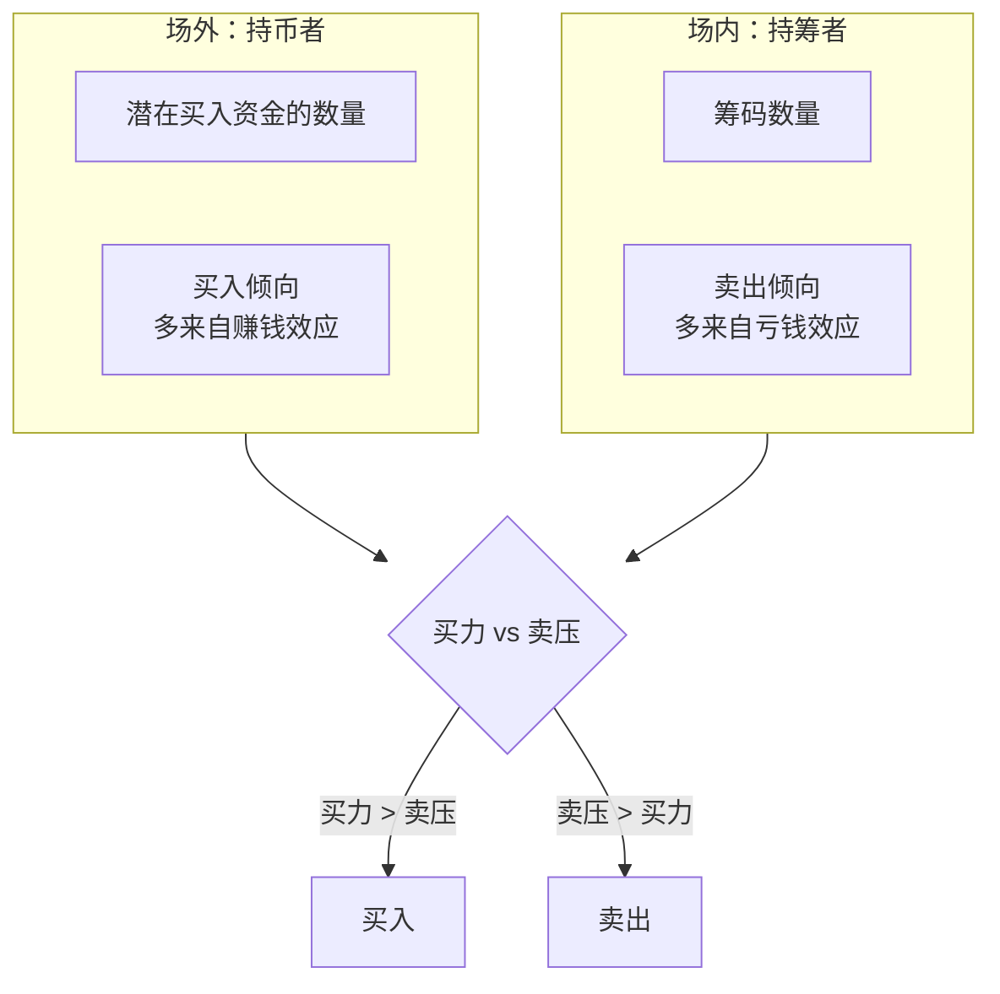
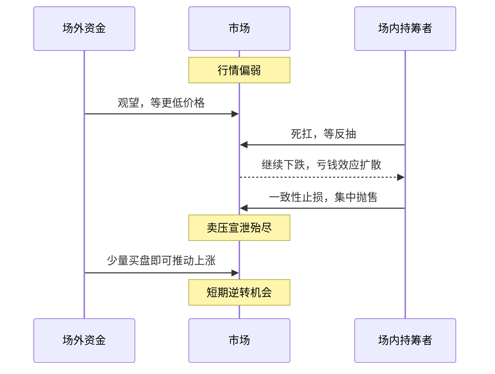
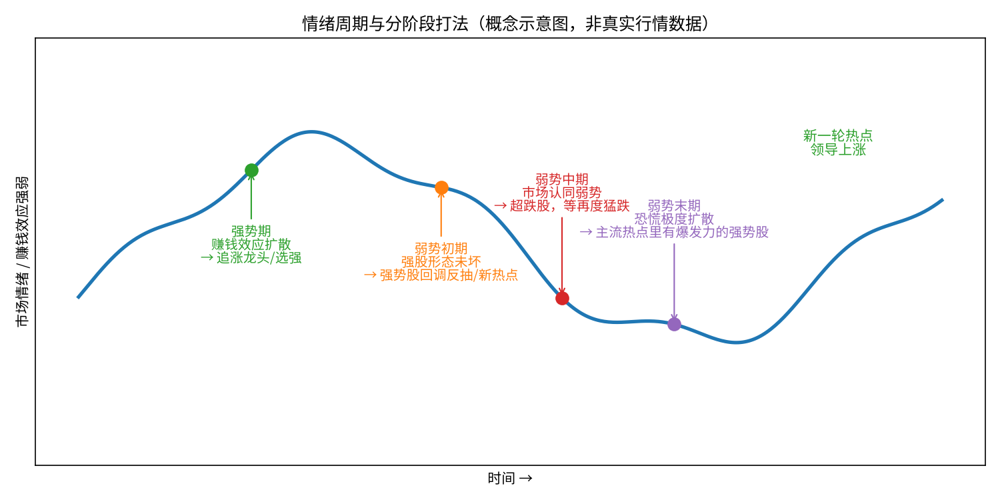

# 炒股养家 ②：群体博弈与情绪周期——交易的第一性原理

::: summary 本篇要点
1. **核心公式**：比较场外潜在买入资金与买入倾向、场内筹码与卖出倾向，前者大就买、后者大就卖（p.4、12）。
2. **倾向从哪来**：买入倾向多来自赚钱效应，卖出倾向多来自亏钱效应。
3. **弱势逆转**：场内人作出一致性止损时，是短期逆转机会（p.12）。
4. **唯一规律**：情绪转变的过程就是规律，“一千年内”不会大变（p.5）。
5. **更高境界**：不只克服自己的贪婪恐慌，而是借市场的贪婪恐慌指导决策（p.5）。
:::

::: note 阅读说明
**它是什么**：本篇是《炒股养家心法：从总体到实战的系统教程》拆分后的第 2 / 6 篇。教程把《70 后游资翘楚炒股养家心法语录》（悟道心法编辑，共 28 页）这份零散语录，重新整理成一套从总体到实战的学习路线。全部六篇：[① 总览与人物](/reading/yangjia-1-overview.html)、[② 群体博弈与情绪周期](/reading/yangjia-2-emotion.html)、[③ 大局观与分阶段打法](/reading/yangjia-3-dashi.html)、[④ 选股、买点与卖出](/reading/yangjia-4-trade.html)、[⑤ 仓位、赢面与心态](/reading/yangjia-5-position.html)、[⑥ 实战演练、误区与金句](/reading/yangjia-6-practice.html)；系列第 ⑦～⑩ 篇是在此之外收集的原帖、问答与报道。

**标注约定**：「原文」或 `p.X` 出自 PDF 第 X 页，尽量保留原话；💡 **讲解** 是教程作者补充的通俗解释、类比或例子，**不是**原文；⚠️ **坑** 是原文点名的常见错误。

⚠️ **风险提示**：本教程只是对一份公开语录的学习整理，**不构成任何投资建议**。原文里的胜率、收益等数字都是养家本人的口述，没有经过核实；短线交易风险很高，请独立判断。
:::

## 第 3 章 第一性原理：交易的本质是群体博弈

### 3.1 核心公式（p.4、12）

::: core 核心公式
> 交易的本质是群体博弈，追根溯源的话，就是随时衡量，**场外的潜在买入者的钱的数量和买入倾向**，与**场内筹码的数量和卖出倾向**，==当前者大于后者就买入，当后者大于前者就卖出==。
:::

💡 **讲解（类比）**：把一只股票想成一辆公交车。场内的人是**车上的乘客**（筹码），场外的人是**站台上等车的人**（资金）。车上的人想下车，站台的人想上车，股价就是车票价格。站台上人多、想上车的心切，车上的人又不想下，票价就涨；反过来就跌。养家每天做的事，就是**估算站台上和车厢里的人数和心态**。

### 3.2 推理链：倾向从哪来？

| 力量 | 主要来源 | 原文 |
|---|---|---|
| 买入倾向 | 赚钱效应 | “买入倾向的推理，大多来自赚钱效应” |
| 卖出倾向 | 亏钱效应 | “卖出倾向的推理，大多来自亏钱效应” |
| 最终决策 | 再结合大盘、主流热点 | “操作是瞬间的，判断是动态的” |

### 3.3 弱势里的逆转时刻（p.12）

> 若行情偏弱，则相对有利于场外。有钱的在场外等更低的价格，有股的在场内等反抽，而一旦**场内人作出一致性止损**时，则是短期逆转机会。

### 3.4 颠覆性观点：主力是散户（p.1、22）

> 得散户心者得天下；人气所向，牛股所在。
> 好的股票，主力是散户，而所谓庄家反而是跟风的。
> 很多人认为跟着大户买有赢面，那么大户又是跟着谁买呢？asking，他的选股思路却是大众情人。（p.21）

💡 **讲解**：“大众情人”的意思是**大多数短线资金都愿意去买的股票**。真正推动连板的是成千上万个散户的合力，大资金反而是顺着这股合力走。所以养家说：

> 我做跟随者，不做发动者。绝不是引导市场，而是跟随的更紧一点。（p.15）

### 3.5 为什么技术图形“相对次要”（p.5–6）

> 纯技术有其局限性，同一张 k 线图，在不同时期不同背景下，其背后所参与的投资者的心理状态也大不相同。同样的技术形态，后期的走势却可能完全不同。

> ⚠️ **坑**：追求“技术量化”。养家说自己“曾经让我大量的时间钻这个牛角尖”，并反问：“炒股若是这样可行的话，那些基金经理们应该比炒手们更有优势了。”（p.4）

---

## 第 4 章 情绪周期：赚钱效应与亏钱效应的轮回

### 4.1 规律只有一条

::: core 唯一的规律
> 如果说股市有什么规律的话，==这种情绪转变的过程就是规律==，而且可以预期的一千年内，这种规律亦不会有大的改变。（p.5）
:::

情绪转变的过程（p.4–5）：**酝酿 → 开展 → 逐步蔓延**，场内筹码的情绪从“下跌空间有限”转向“失望离场”；与此同时场外资金在慢慢积累；**情绪逆转那一刻**，资金又蜂拥而入，周而复始。

### 4.2 两个自我强化的循环（p.8、13–14）

养家把市场参与者分成两类：**喜欢追涨的人**和**喜欢抄底的人**。两类人都会因为赚钱而强化行为，因为亏钱而“自我惩罚”。

```mermaid
flowchart TB
    subgraph UP["追涨者循环"]
        U1["追涨赚钱"] --> U2["自信增加<br/>快速投入下一个品种"]
        U2 --> U3["影响周围人群<br/>甚至埋怨仓位太少"]
        U3 --> U4["热点有持续性<br/>行情推向高潮"]
        U4 --> U5["赚钱效应告一段落"]
        U5 --> U6["追涨接连失手<br/>资金大幅回落"]
        U6 --> U7["自我惩罚、反思<br/>减少操作"]
        U7 --> U8["强势股没有后继者<br/>补跌"]
    end
    subgraph DOWN["抄底者循环"]
        D1["抄底赚钱"] --> D2["继续抄底<br/>大盘难以大跌"]
        D2 --> D3["抄底开始亏钱"]
        D3 --> D4["自我惩罚<br/>减少抄底"]
        D4 --> D5["稍有卖压便无抵抗式下跌<br/>崩溃前兆"]
        D5 --> D6["直到卖出者无以为继"]
    end
```

> 这两种心理变化过程，不断循环往复，踏准了节奏，就能分辨出机会的大小，进而决定进出的仓位。（p.8）

### 4.3 情绪周期示意图

*图 4-1：情绪周期和各阶段打法的概念示意（教程绘制，不是真实行情）。具体打法见[第 6 章](/reading/yangjia-3-dashi.html#第-6-章-分阶段打法强势弱势初期中期末期)。*

### 4.4 用情绪判断大势：几个可观察信号

| 信号 | 含义 | 原文 |
|---|---|---|
| 股神遍地 | 人气最旺 | “股神遍地的时候就是人气最旺的时候”（p.11） |
| 超跌品种稳住了 | 强势股机会大些 | p.8 |
| 超跌品种继续创新低 | 强势股补跌在即 | p.8 |
| 抄底的人开始减少，稍有卖压就无抵抗下跌 | 崩溃前兆 | p.14 |
| 连续上涨一段后的集体涨停 | 要特别小心 | p.18 |
| 连续下挫一段后的集体大幅下挫 | 左侧交易好时机 | p.18 |
| 市场整体交易量 | 好手仓位与之正相关 | “机会多时多操作，机会少时少操作”（p.25） |

> ==有赚钱效应的情况下，做热点为主。有恐慌效应的情况下，做超跌为主。==根据市场的赚钱效应和恐慌效应来判断大势。（p.8）

### 4.5 高一层的境界：用市场的情绪，而不是克服自己的情绪

> 市场很多人讨论的是如何克服贪婪和恐慌，虽然不错，但是着眼点仅在自身，难免局限。高手进出，买卖的一刻力求淡定，借助市场的贪婪和恐慌反过来指导决策，着眼点在整个市场，境界自然高了一层。（p.5）

> 茫然本身也是市场情绪的一部分，想办法跳出自身情绪，在更高的高度俯看市场情绪。（p.21）

💡 **讲解**：好比冲浪。新手老想着“别怕浪”，这是在克服自己；老手看的是“浪从哪来、多大、什么时候碎”，这是在借用海。你自己感到茫然，往往说明很多人也茫然，这本身就是一个情绪读数。

---

## 本篇自测与清单

自测：按核心公式，什么时候买、什么时候卖？

场外买力（资金数量 × 买入倾向）大于场内卖压（筹码数量 × 卖出倾向）时买，反之卖（p.4、12）。

自测：弱势里的“短期逆转机会”出现在什么时刻？

场内持筹者作出一致性止损、卖压宣泄殆尽，少量买盘即可推动上涨时（p.12）。

自测：追涨者和抄底者两个循环有什么共同点？

赚钱时强化自己的行为，亏钱时“自我惩罚”减少操作；踏准两种心理的节奏，就能分辨机会大小、决定仓位（p.8）。

自测：“用市场的情绪”与“克服自己的情绪”区别在哪？

后者着眼点只在自身；前者把市场的贪婪和恐慌当作读数来指导买卖，境界高一层（p.5）。

读完本篇，勾一勾：

- [ ] 今天是赚钱效应还是亏钱效应占主导？
- [ ] 超跌品种稳住了，还是继续创新低？
- [ ] 有没有“股神遍地”的迹象？
- [ ] 抄底资金在增加还是减少？

下一篇：[③ 大局观与分阶段打法](/reading/yangjia-3-dashi.html)。

## 来源

- 《70 后游资翘楚炒股养家心法语录》（悟道心法编辑，“游资语录精编 30 篇系列”之一，PDF 共 28 页；本地资料《情绪周期炒股养家心法语录精编》）。正文 `p.X` 均指该 PDF 页码。
- 语录原始出处多为淘股吧炒股养家的帖子与回复，网友整理版可参考：淘股吧《炒股养家心法（转）》https://m.tgb.cn/a/1KAdGAYzcje ；原帖之一《我如何在股市赚了200万》转载 https://m.tgb.cn/a/2oLta4CHEK0 （详见本系列 [⑦ 原帖现场](/reading/yangjia-7-thread.html)）。
