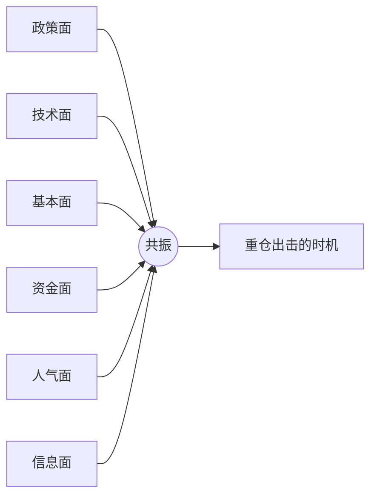
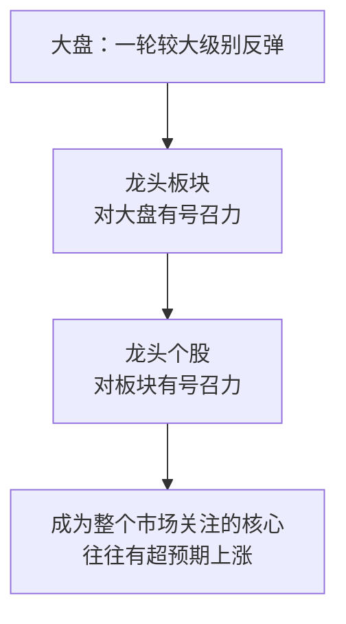
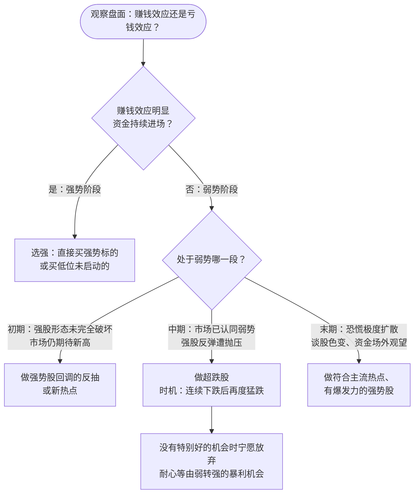
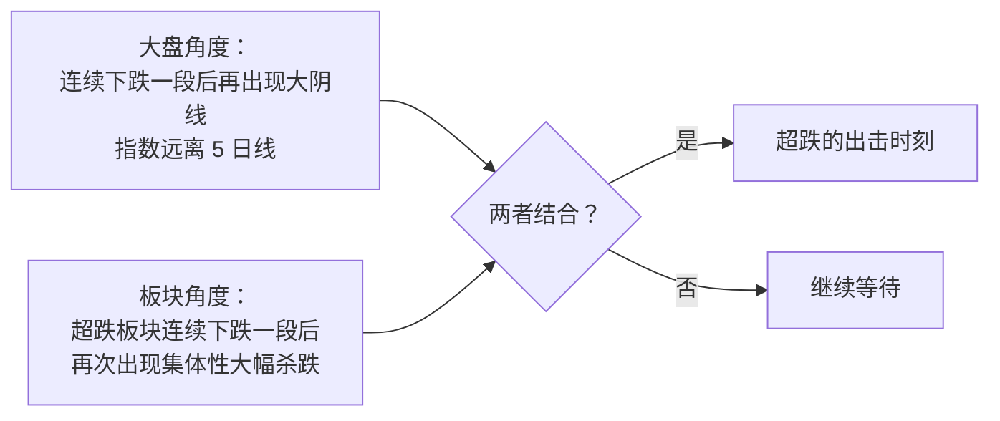

# 炒股养家 ③：大局观与分阶段打法——强势、弱势初中末

::: summary 本篇要点
1. **大局观**：政策、技术、基本、资金、人气、信息面形成共振时，才是重仓出击的时机（p.24）。
2. **权重**：政策面与人气面权重大，技术面和基本面相对次要（p.11）。
3. **四种组合**：不看好大盘、又没有热点时，“就多休息吧”（p.11）。
4. **判断为末，应变为本**：设计无论对错都留有退路的打法（p.12）。
5. **分阶段**：强势追涨龙头；弱势初段做回调反抽、中段做超跌、末段追主流强势股（p.9、16）。
:::

::: note 阅读说明
**它是什么**：本篇是《炒股养家心法：从总体到实战的系统教程》拆分后的第 3 / 6 篇。教程把《70 后游资翘楚炒股养家心法语录》（悟道心法编辑，共 28 页）这份零散语录，重新整理成一套从总体到实战的学习路线。全部六篇：[① 总览与人物](/reading/yangjia-1-overview.html)、[② 群体博弈与情绪周期](/reading/yangjia-2-emotion.html)、[③ 大局观与分阶段打法](/reading/yangjia-3-dashi.html)、[④ 选股、买点与卖出](/reading/yangjia-4-trade.html)、[⑤ 仓位、赢面与心态](/reading/yangjia-5-position.html)、[⑥ 实战演练、误区与金句](/reading/yangjia-6-practice.html)；系列第 ⑦～⑩ 篇是在此之外收集的原帖、问答与报道。

**标注约定**：「原文」或 `p.X` 出自 PDF 第 X 页，尽量保留原话；💡 **讲解** 是教程作者补充的通俗解释、类比或例子，**不是**原文；⚠️ **坑** 是原文点名的常见错误。

⚠️ **风险提示**：本教程只是对一份公开语录的学习整理，**不构成任何投资建议**。原文里的胜率、收益等数字都是养家本人的口述，没有经过核实；短线交易风险很高，请独立判断。
:::

## 第 5 章 大局观：做的是短线，看的是更大的局

### 5.1 大局观是什么

> 大局观，这是道的范畴，尽量培养自己站在更高的高度看整个市场。单个个股走势本身有不确定性……把整个板块一起看就更容易理解，**政策面、技术面、基本面、资金面、人气面……等集合于一身时形成的共振**。（p.24）

> 当政策、资金、技术、信息等各方面都较好的时候便是重仓出击博取利润的时机，如此往复不断复利。（p.24）

### 5.2 各因素权重（p.11）

| 因素 | 权重 | 原文要点 |
|---|---|---|
| 政策面 | **大** | 相对独立，市场会围绕政策反复炒作，“这是中国股市的特色” |
| 人气面 | **大** | 是一个循环过程，跟赚钱效应有关 |
| 技术面 | 相对次要 | “技术图形相对次要，对于市场情绪的把握才是重点” |
| 基本面 | 相对次要 | 到了一定阶段，“什么技术啊，基本面的都不重要” |
| 信息公告 | 考量因素之一 | “如果你对市场理解的不够深刻，光钻研这些也是徒劳”（p.24） |
| 成交回报 | 辅助 | 是股市资讯的一部分，“有助于心理分析”（p.12） |
| 外围股市 | 偶尔可用 | 外围很差有时会影响开盘，部分情况下可以“利用外围做反向操作”（p.26） |

### 5.3 从个股到板块再到大盘

> 通常一轮较大级别的反弹，其中会有一个龙头板块，而这个龙头板块的龙头个股往往有超预期的上涨。这个板块要求对大盘有号召力，而这个龙头也要求对这个板块有号召力。（p.11）

### 5.4 大盘与个股的四种组合（p.11）

| | 有强热点（高强度板块） | 没有热点 |
|---|---|---|
| **看好大盘** | 积极进攻 | 大盘涨势中相对风险小，找强势品种操作 |
| **不看好大盘** | 注重风险，但“如果有强热点，则仍可参与操作” | **“就多休息吧”** |

> 看天气，如果觉得要下雨了，就早点回家，不要贪玩，天气好了再出来，说简单点就是这样。（p.7）

### 5.5 判断为末，应变为本

> 看的是长线，做的是短线，如果判断错了，应变就是了……==判断为末，应变为本==。（p.12）
> 对于阶段的判断本身也是一个动态的过程，可能会错，但是好的策略，就是在判断错误的时候仍然可以占有一定的应变优势。（p.11）
> 在操作的那一刻，很多高手对于大盘的判断也是不确定的，是良好的操作策略使然。（p.14）

💡 **讲解**：养家没说自己能预测大盘，他说的是：**设计一种无论对错都留有退路的打法**。理想状态是（p.21–22）“如果大盘上涨，我的股票大涨，如果大盘下跌，我的股票不跌或者小跌，如此反复，积小胜为大胜。”

---

## 第 6 章 分阶段打法：强势、弱势初期/中期/末期

这是整份语录里**最能直接上手**的一部分。

### 6.1 总口诀

::: core 分阶段总口诀
> **强势市场追涨龙头，弱势市场低吸回调，格局转换预先埋伏可能炒作的热点。**（p.9）
> **弱势初段低吸止损，弱势中段低吸崩溃，弱势末段追涨强势。**（p.16）
:::

### 6.2 阶段判断与打法流程

### 6.3 分阶段对照表

| 阶段 | 市场特征（原文） | 买股逻辑 | 选什么 | 出处 |
|---|---|---|---|---|
| **强势** | 赚钱效应下资金不断进入 | 强的标的被后来资金选中的概率大 | 最强的龙头，或低位未启动的 | p.5、9 |
| **弱势初期** | 强股形态未完全破坏，市场仍期待新高 | 强势股之前有号召力和人气，回调较大 | 强势股回调反抽、新热点 | p.9–10 |
| **弱势中期** | 市场认同弱势；超跌股伴随崩溃盘，抛压稍缓 | 少量买盘就能推动超跌股反弹 | 跌得最惨的股 | p.10 |
| **弱势末期** | 恐慌极度扩散、谈股色变，大量资金场外观望 | 会出来一个有持续性的热点领导上涨 | 主流热点里有爆发力的强势股 | p.10 |

### 6.4 弱势里的买点：宁愿慢三分

> 下跌期的操作，绝大多数买入是**等大阴线后，第二天再探底的时候**。难点在于对时机的把握，过早介入容易吃套，所以原则上==**宁愿慢三分**==。（p.10）

**超跌出击时刻（p.8）**：两个条件同时满足。

### 6.5 资金级别不同，打法也不同（p.7）

> 小资金阶段，下跌初期仍可以积极进攻，随着资金的增大，犯错的成本也随之加大，在确认下跌后，倾向于防守。市场弱势时自然机会就少，市场强势时，60% 以上赢面的机会较多。

> 💡 **讲解：为什么“下跌末期追强势”反而对？** 直觉上大跌之后该买最便宜的。但养家看的是**资金的情绪**：观望已久的游资“心中那份被隐藏多日的激情又会被重新点燃”（p.10），新一轮行情的领涨热点会吸走最多资金，所以“好的策略就是把筹码放在最有爆发力的个股上”。

---

## 本篇自测与清单

自测：“判断为末，应变为本”想说明什么？

没人能稳定预测大盘，好的策略是在判断错误时仍有应变优势（p.11–12）。

自测：大盘不好、又没有热点时，养家怎么做？

“就多休息吧”；“觉得要下雨了，就早点回家”（p.7、11）。

自测：弱势初期、中期、末期各做什么？

初期做强势股回调反抽或新热点；中期做跌得最惨的超跌股，时机在连续下跌后的再度猛跌；末期做符合主流热点、有爆发力的强势股（p.9–10）。

自测：“超跌的出击时刻”要满足哪两个条件？

大盘连续下跌后再出现大阴线、远离 5 日线；超跌板块连续下跌后再次集体大幅杀跌——两者同时出现（p.8）。

读完本篇，勾一勾：

- [ ] 我判断的阶段是：强势 / 弱势初 / 弱势中 / 弱势末
- [ ] 这个阶段对应的打法，和我准备做的交易一致吗？
- [ ] 如果判断错了，我的应变方案是什么？
- [ ] 弱势里买点是否等到了“大阴线后第二天再探底”？

下一篇：[④ 选股、买点与卖出](/reading/yangjia-4-trade.html)。

## 来源

- 《70 后游资翘楚炒股养家心法语录》（悟道心法编辑，“游资语录精编 30 篇系列”之一，PDF 共 28 页；本地资料《情绪周期炒股养家心法语录精编》）。正文 `p.X` 均指该 PDF 页码。
- 语录原始出处多为淘股吧炒股养家的帖子与回复，网友整理版可参考：淘股吧《炒股养家心法（转）》https://m.tgb.cn/a/1KAdGAYzcje ；原帖之一《我如何在股市赚了200万》转载 https://m.tgb.cn/a/2oLta4CHEK0 （详见本系列 [⑦ 原帖现场](/reading/yangjia-7-thread.html)）。
