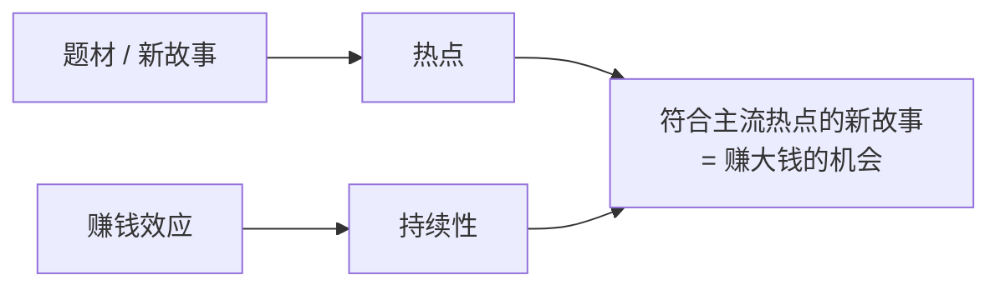
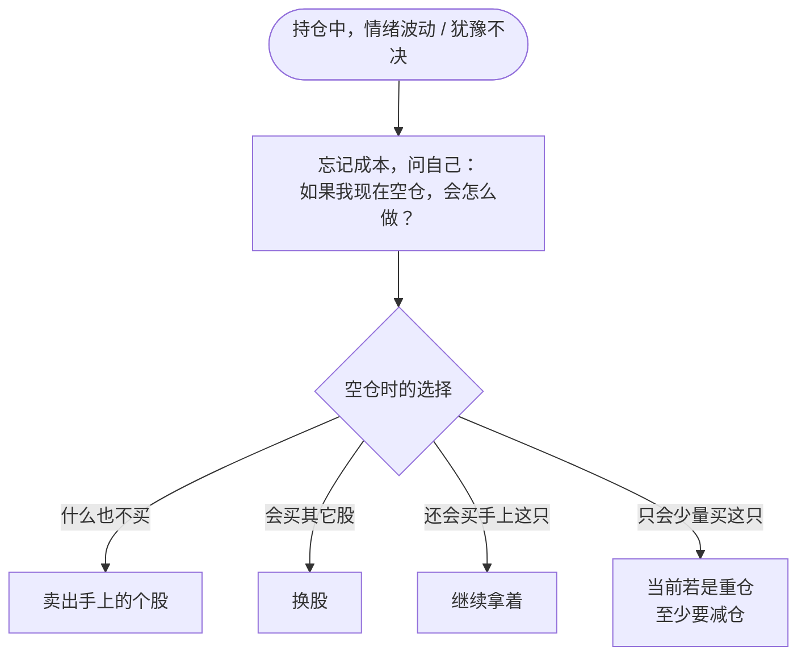

# 炒股养家 ④：选股、买点与卖出——热点、切题与“假如空仓”

::: summary 本篇要点
1. **选股范围**：要么是当前的热门，要么是预判会成为热门的品种（p.21）。
2. **切题**：拉升那一刻，市场要一眼认出它是什么概念（p.9）。
3. **打板看环境**：重仓买入的一刹那，要有后市 3～5 个涨停空间的判断（p.20）。
4. **没有止损，只有买卖**：卖出只看对未来的判断，不看买入成本（p.16–19）。
5. **假如空仓测试**：持仓犹豫时问自己“如果我现在空仓，会怎么做”（p.19、27）。
:::

::: note 阅读说明
**它是什么**：本篇是《炒股养家心法：从总体到实战的系统教程》拆分后的第 4 / 6 篇。教程把《70 后游资翘楚炒股养家心法语录》（悟道心法编辑，共 28 页）这份零散语录，重新整理成一套从总体到实战的学习路线。全部六篇：[① 总览与人物](/reading/yangjia-1-overview.html)、[② 群体博弈与情绪周期](/reading/yangjia-2-emotion.html)、[③ 大局观与分阶段打法](/reading/yangjia-3-dashi.html)、[④ 选股、买点与卖出](/reading/yangjia-4-trade.html)、[⑤ 仓位、赢面与心态](/reading/yangjia-5-position.html)、[⑥ 实战演练、误区与金句](/reading/yangjia-6-practice.html)；系列第 ⑦～⑩ 篇是在此之外收集的原帖、问答与报道。

**标注约定**：「原文」或 `p.X` 出自 PDF 第 X 页，尽量保留原话；💡 **讲解** 是教程作者补充的通俗解释、类比或例子，**不是**原文；⚠️ **坑** 是原文点名的常见错误。

⚠️ **风险提示**：本教程只是对一份公开语录的学习整理，**不构成任何投资建议**。原文里的胜率、收益等数字都是养家本人的口述，没有经过核实；短线交易风险很高，请独立判断。
:::

## 第 7 章 选股与买点：热点、龙头、切题、打板、超跌

### 7.1 选股范围只有两类（p.21）

> 选股而言，要么是**当前的热门**，要么是**预判会成为热门**的品种。

> 符合主流热点的新故事是赚大钱的机会。==**热点来自题材，持续性来自赚钱效应。**==（p.16）

### 7.2 两种介入方式（p.16、26）

| 方式 | 做法 | 适用 |
|---|---|---|
| 提前预判埋伏 | 格局转换时，预先埋伏可能炒作的热点；可选低价或超跌的 | 有预判能力时 |
| 盘中追击 | 热点确认后追最强的 | 热点明确时 |

> 随机应变为主。各种因素形成共振的那一刻，就相对选择重仓出击。（p.26）

### 7.3 “切题”原则

> 如果是追龙头，那么追最强的，如果是潜伏，那么可以选择低价的或者超跌的，但是一定要切题，既然有确定是 xxx 概念的，为什么还要选应该、可能是 xxx 概念的呢。要在拉升的那一刻，==**市场一眼就知道它是什么概念**==，这样才能吸引跟风的。（p.9）

💡 **讲解**：好比开餐厅，招牌上写“川菜”，大家一看就进来；写“可能有点辣的融合菜”，路人就犹豫了。短线资金只有几秒钟做决定，**题材辨识度就是吸引跟风盘的能力**。

### 7.4 买龙头还是买跟风？（p.18）

| 选择 | 养家的理由 |
|---|---|
| 买龙头 | 不是因为胆子大，而是根据**板块整体动能**，龙头应有相应溢价，而股价**尚未反映溢价**时介入 |
| 买跟风 | 不是因为胆子小，而是龙头赚钱效应十足，部分跟风品种尚处低位，随时可能被龙头激发 |

> 我们这个市场，有大量的短线客，做短线的想的都是要做龙头，只要被市场确定为龙头，卖给谁就不再是问题。要买的人很多，筹码有限，所以就造成连续涨停的结果。（p.16）

但养家同时提醒（p.27）：
> 所谓的龙头理论实际并不科学……在我看来没有永远的龙头，虽然买龙头是一种方法，但是**想办法卖出龙头才是更高的境界**。

### 7.5 打板（板上买票，p.20）

- 板上买票“基本占了本人操作的一半”。
- 纯 K 线技术的打板，统计胜率约 45%，简单追龙头模式胜率也差不多，“大致于澳门赌场”（p.27）。所以**打板看的是市场环境和热点，不是图形**。
- **3～5 板原则**：“==重仓买入的一刹那要有后市还有 3 到 5 个涨停空间的判断==。一只股票如果你没有后市 3-5 涨停空间的判断，那么一个板也不要重仓买入。”
- 指标：“除了成交量，基本什么指标都不看。成交量，主要是看成交量的变化。”成交量再结合价格变化，“揣摩场内和场外人心的变化”。

### 7.6 其他买点要点

| 场景 | 要点 | 出处 |
|---|---|---|
| 尾盘买股 | 买预期热点第二天能持续的品种，前提是判断热点的持续性 | p.11 |
| 突破买入 | “还处在见招拆招的阶段”，应追求“未出招已应招”，想想能不能更早下手 | p.4 |
| 不知道为什么涨的股 | 找原因，找不到就不管，“赚自己看得懂的钱就够了” | p.11 |
| 只有技术形态好、没有逻辑支撑 | “就算买，也只能轻仓，放弃也不可惜” | p.16 |
| 次新股 | 弹性大，历来是大盘反弹阶段大幅炒作的对象；一旦转入风险区，相对风险成倍增加，属于高风险高收益 | p.26 |
| 个股行为的强势票 | 不确定性较大；板块性行为大体有规律，可以耐心总结 | p.17 |
| 买前自问 | “往上敢不敢看 30% 的空间，往下敢不敢越跌越买”，都是肯定才买 | p.23 |

> 💡 **注意**：“往下敢不敢越跌越买”是买前用来检验信心的问题，不是让你真的去越跌越买。养家[第 2 章](/reading/yangjia-1-overview.html#第-2-章-人物与心路从-90-万亏到-40-万再到-600-万)那次“越跌越买”的价值投资损失惨重，[第 8 章](#第-8-章-卖出与持仓没有止损只有买入和卖出)还会讲到他反对亏钱后“赌徒式加码”。

---

## 第 8 章 卖出与持仓：没有“止损”，只有买入和卖出

### 8.1 永不止损，永不止盈

> 在我的操作模式里面，从来没有“止损”这两个字。（p.23）
> 股票操作只有买入和卖出，没有止损和割肉。（p.16）
> 如果你还有补仓或者止损的想法，就说明你的心里还有**成本这个障碍**，好的操作，应该是最简单的，只有买入或者卖出。（p.17）

> ⚠️ **别误会**：这**不是**“亏了也死扛”。恰恰相反：
> > 止损，不看好了就卖出，管它是不是止损。因为简单，所以果断，最忌自己都不看好了，只是因为套了几个点，还在犹豫。（p.19）
>
> 意思是：==**卖出的依据只看对未来的判断，不看买入成本**==。所以“止损”“止盈”这两个以成本为参照的词就用不上了。

### 8.2 核心工具：“假如我现在空仓”测试（p.19、27）

::: core 持仓犹豫时只问一句
==忘记成本，问自己：如果我现在空仓，会怎么做？==
:::

这是全书最具操作性的工具之一，原文还补了一个**量化要求**（p.27）：“如果空仓也只是考虑少量买自己手上的股的话，那么至少现在是重仓的话也要减仓。”

### 8.3 其他卖出与持仓原则

| 原则 | 原文 | 出处 |
|---|---|---|
| 高点买入遇大跌不要“拿中线” | 那是心理障碍，“不愿意认输……虚荣心在作怪，操作上应该用理性来应对” | p.11 |
| 不为解套错过机会 | 卖出后重新审视市场捕捉新机会，“不必为了所谓的解套而错失其它的机会” | p.16 |
| 失手就卖 | “重仓出击，务求完胜，一旦失手，卖出重来” | p.18 |
| 被套也不慌 | “如果市场一定要连续下跌让我亏一笔钱也无妨，等反抽卖出就是了” | p.15 |
| 做 T 不刻意 | 机会大时买、风险大时卖，恰好发生在同一天同一只股上才叫做 T，“不要刻意为了做 T 而做” | p.22 |
| 看到不良信号 | 个人偏保守，“发现盘面不良信号倾向于退出观望” | p.17 |

---

## 本篇自测与清单

自测：养家的选股范围只有哪两类？

当前的热门；预判会成为热门的品种（p.21）。

自测：为什么要“切题”？

短线资金决策时间很短，题材辨识度决定能否吸引跟风盘（p.9）。

自测：“3～5 板原则”是什么？

重仓买入时要有后市还有 3 到 5 个涨停空间的判断，没有就一个板也不重仓（p.20）。

自测：“假如空仓”测试的四种结果分别怎么处理？

什么也不买 → 卖出；会买别的 → 换股；还会买这只 → 继续拿；只会少量买 → 重仓要减仓（p.27）。

读完本篇，勾一勾：

- [ ] 它是当前热门，或有理由预判会成为热门？
- [ ] 题材切题，市场一眼能认出概念？
- [ ] 我知道它为什么涨吗？
- [ ] 重仓前有 3～5 板空间的判断吗？
- [ ] 持仓犹豫时，做过“假如空仓”测试吗？

下一篇：[⑤ 仓位、赢面与心态](/reading/yangjia-5-position.html)。

## 来源

- 《70 后游资翘楚炒股养家心法语录》（悟道心法编辑，“游资语录精编 30 篇系列”之一，PDF 共 28 页；本地资料《情绪周期炒股养家心法语录精编》）。正文 `p.X` 均指该 PDF 页码。
- 语录原始出处多为淘股吧炒股养家的帖子与回复，网友整理版可参考：淘股吧《炒股养家心法（转）》https://m.tgb.cn/a/1KAdGAYzcje ；原帖之一《我如何在股市赚了200万》转载 https://m.tgb.cn/a/2oLta4CHEK0 （详见本系列 [⑦ 原帖现场](/reading/yangjia-7-thread.html)）。
