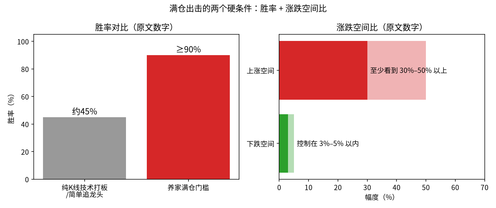
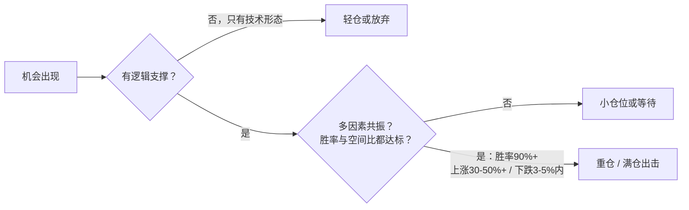
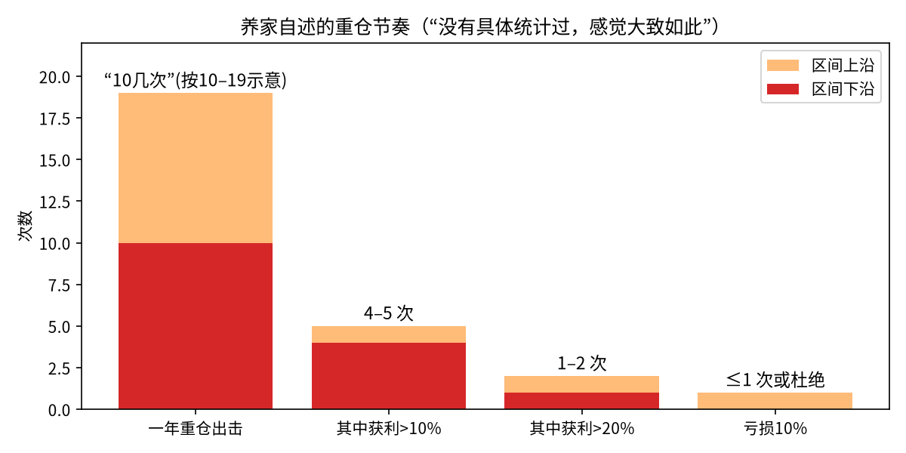
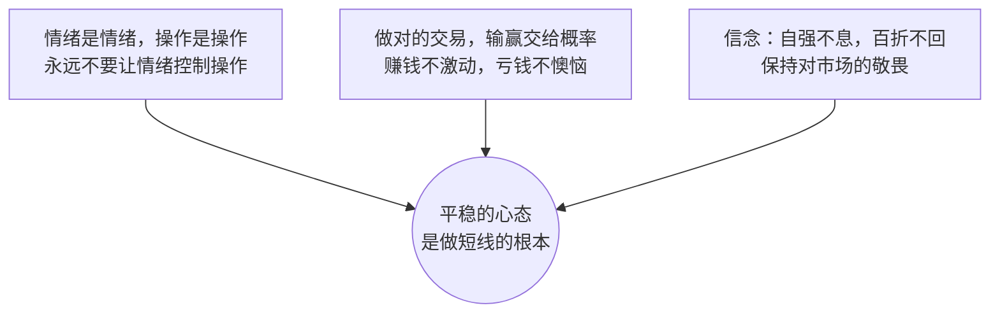

# 炒股养家 ⑤：仓位、赢面与心态——胜率 × 涨跌空间比

::: summary 本篇要点
1. **赢面**：胜率 + 涨跌空间比；满仓要胜率 90% 以上、上涨 30%–50%、下跌 3%–5% 以内（p.26）。
2. **按胜率下注**：根据胜率决定仓位轻重；只有技术形态 → 轻仓（p.16–17）。
3. **重仓节奏**：一年十几次重仓，4–5 次 10% 以上获利，亏损 10% 控制在 1 次或杜绝（p.7、16，自述）。
4. **控制回撤**：最重要的是回避系统性崩溃风险（p.7、25）。
5. **心态**：情绪是情绪，操作是操作；做对的交易，输赢交给概率（p.15–16）。
:::

::: note 阅读说明
**它是什么**：本篇是《炒股养家心法：从总体到实战的系统教程》拆分后的第 5 / 6 篇。教程把《70 后游资翘楚炒股养家心法语录》（悟道心法编辑，共 28 页）这份零散语录，重新整理成一套从总体到实战的学习路线。全部六篇：[① 总览与人物](/reading/yangjia-1-overview.html)、[② 群体博弈与情绪周期](/reading/yangjia-2-emotion.html)、[③ 大局观与分阶段打法](/reading/yangjia-3-dashi.html)、[④ 选股、买点与卖出](/reading/yangjia-4-trade.html)、[⑤ 仓位、赢面与心态](/reading/yangjia-5-position.html)、[⑥ 实战演练、误区与金句](/reading/yangjia-6-practice.html)；系列第 ⑦～⑩ 篇是在此之外收集的原帖、问答与报道。

**标注约定**：「原文」或 `p.X` 出自 PDF 第 X 页，尽量保留原话；💡 **讲解** 是教程作者补充的通俗解释、类比或例子，**不是**原文；⚠️ **坑** 是原文点名的常见错误。

⚠️ **风险提示**：本教程只是对一份公开语录的学习整理，**不构成任何投资建议**。原文里的胜率、收益等数字都是养家本人的口述，没有经过核实；短线交易风险很高，请独立判断。
:::

## 第 9 章 仓位与赢面：胜率 × 涨跌空间比

### 9.1 赢面 = 胜率 + 涨跌空间比（p.26）

::: core 满仓的两个条件
> 赢面包括胜率和涨跌空间比。譬如满仓出击时，对我来说必须满足以下两个条件才会做这样的决策，一方面是==**胜率要求 90% 以上**==，另一方面是……==**上涨的空间至少要看到 30%-50% 以上，而下跌的空间应该在 3%-5% 以内**==。
:::

*图 9-1：左边是胜率对比（约 45% 来自原文对纯技术打板的统计说法），右边是满仓时要求的涨跌空间。数字都出自原文。*

> 💡 **讲解（教程演算，非原文）**：按期望值粗算，假设胜率 90%、赢时 +30%、输时 -5%，单次期望约为 0.9×30% − 0.1×5% = **+26.5%**。再看胜率 45% 的打板，如果赢亏幅度相同，期望就是负的。这就是养家把纯技术打板比作赌场的原因。

### 9.2 根据胜率决定下注轻重

> 根据胜率的百分比，决定下注仓位的轻重。（p.17）
> 经历 n 次失手后，大致知道出击的成功率。（p.18）
> 做短线，盈亏比很重要，权衡风险和收益，做出相应的决策。（p.16）
> 仓位，让自己觉得舒服就可以。（p.16、17）

### 9.3 重仓节奏（p.7、16）

> 重仓出击相对少些，平均一年 10 几次左右，其中 4-5 次 10% 以上的获利包括 1-2 次 20% 以上，亏损 10% 控制在 1 次或杜绝。……反应在收益率曲线上，就是平时稳攀升为主，偶尔跳跃式上扬，极少大幅回落。

> 一年把握 4-5 次重仓必杀，再加上平时小机会累计，翻番自然不是问题。（p.16）

*图 9-2：养家自述的重仓节奏。原文注明“没有具体统计过，感觉大致如此”。*

### 9.4 资金规模与打法（p.18、22）

| 资金级别 | 打法 |
|---|---|
| 百万以下 | 操作方式多种多样，“高接低挡不亦乐乎”，一买一卖鼠标点一下 |
| 百万级 | 放弃一些左侧交易模式，选有**板块热点保护**的品种为主 |
| 千万级 | 冲击成本大增，学会**分仓**，放弃一些个股性机会，**操作热点为主** |

> 资金大了必然增加冲击成本……本来可能亏 2-3 个点结束的操作，要变成 5-6 个点的损失，更有较长的卖出时间，从而影响其它品种的操作，小资金相对灵活的多，来去自如。（p.22）

### 9.5 控制回撤 = 回避系统性崩溃

> 控制回撤，最重要的就是回避系统性崩溃风险，事实上绝大部分崩溃都有前兆，从赚钱和亏钱效应的演变过程可以进行推断，不过为此可能也会放弃很多机会。（p.7、25）
> 短线好手几乎不会出现季度性亏损，盈利从杜绝亏损开始。（p.9）
> 衡量一个职业选手最重要的指标就是盈利的稳定性。（p.20）==稳定的复利才是职业炒股的根本。==（p.21）

### 9.6 为什么不碰股指期货（p.16、20）

股指期货容错率低：股票炒手的优势是判断热点，大盘判断错了也未必亏钱；股指期货判断错了就是亏钱，加上杠杆会影响心态，心态又反过来影响操作。养家还提到，asking、炒手、just999 等实盘高手在股指期货上也不乏亏损，说明“即便无法判断日内高低点，亦可把股市作提款机”。

---

## 第 10 章 心态与信念：情绪是情绪，操作是操作

### 10.1 三条心法

::: core 三条心法

:::

### 10.2 原文要点

- **概率观**：“只要系统没有问题，赚钱不值得激动，因为那是概率，亏钱也不必懊恼，因为那是概率。”（p.16）“股票操作是科学，做对的操作就可以了，输赢交给概率。”（p.15）
- ⚠️ **最大忌讳**：“==在买卖受损时赌徒式加码，亏钱了就急于翻本，乱操作一气，容易错上加错，后果严重==。”（p.19）
- **知易行难**：“当时机不成熟或者市场对自己不利时，理性地面对风险，当机会来临时，全力拼取。这句话理解不难，做到却不易，很多人往往因为亏钱就想着急于扳回，一再对抗风险，机会来临时却又麻木于自己深套中的个股。”（p.6，原文多次重复）
- **判断不一致时**：“当市场的发展和自己的判断不一致时，要重新审视，越是关键时刻，越要冷静处理。”（p.6）
- **心态从哪来**：“股票做好了，能实现稳定盈利，心态自然也就不是问题了。”（p.22）
- **先过心理关**：“先克服心理障碍，之后多操作，多思考，概率会告诉你以后应该怎么做，如果不能克服心理障碍，再多的失败也不能转化为经验。”（p.17）
- **简单化**：“操作应简单化，想的太多临盘难免犹豫”；“有些人早上起床要闹铃，有些人不需要，因为已经成为习惯。”（p.20）
- **放下错过**：“重要的不在于错过了什么，在于当下应该把握什么。”（p.21）
- **敬畏**：“过去的稳定增长也好，只代表过去，还是让未来的来检验吧，时刻保持对市场的敬畏之心。”（p.25）
- **自知**：“我是风险极度厌恶型。”（p.14）“擅于做短线的人，应该清楚自身的特点，寻找出适合自己的方法。”（p.6）

### 10.3 短线需要的综合素质（p.6、23）

| 素质 | 说明 |
|---|---|
| 冷静理智的心理 | 情绪不干扰操作 |
| 良好的大局观 | 看更大的局 |
| 完善的交易系统 | “要有一套适合自己的有效系统，然后坚决执行”（p.14） |
| 具体操作方法 / 信念 | p.6 写的是“具体操作方法”，p.23 写的是“信念” |

> 事实上，如果不考虑情绪，而只是纯技术的话，我现在的水准不支持可以在股市上获得稳定盈利。（p.23）

---

## 本篇自测与清单

自测：满仓出击要同时满足哪两个条件？

胜率 90% 以上；上涨空间至少 30%–50%，下跌空间 3%–5% 以内（p.26）。

自测：资金从百万以下到千万级，打法怎么变？

百万以下可多种多样；百万级放弃部分左侧交易、选有板块热点保护的品种；千万级要分仓、以操作热点为主（p.18、22）。

自测：养家说的“最大忌讳”是什么？

买卖受损时赌徒式加码、急于翻本（p.19）。

自测：他认为好心态从哪来？

“股票做好了，能实现稳定盈利，心态自然也就不是问题了”（p.22）。

读完本篇，勾一勾：

- [ ] 这笔交易的胜率和涨跌空间比够不够当前仓位？
- [ ] 我是在按机会定仓位，还是按“想赢回来”定仓位？
- [ ] 有系统性崩溃前兆时，我是否先降低了仓位？
- [ ] 今天有没有让情绪影响操作？

下一篇：[⑥ 实战演练、误区与金句](/reading/yangjia-6-practice.html)。

## 来源

- 《70 后游资翘楚炒股养家心法语录》（悟道心法编辑，“游资语录精编 30 篇系列”之一，PDF 共 28 页；本地资料《情绪周期炒股养家心法语录精编》）。正文 `p.X` 均指该 PDF 页码。
- 语录原始出处多为淘股吧炒股养家的帖子与回复，网友整理版可参考：淘股吧《炒股养家心法（转）》https://m.tgb.cn/a/1KAdGAYzcje ；原帖之一《我如何在股市赚了200万》转载 https://m.tgb.cn/a/2oLta4CHEK0 （详见本系列 [⑦ 原帖现场](/reading/yangjia-7-thread.html)）。
