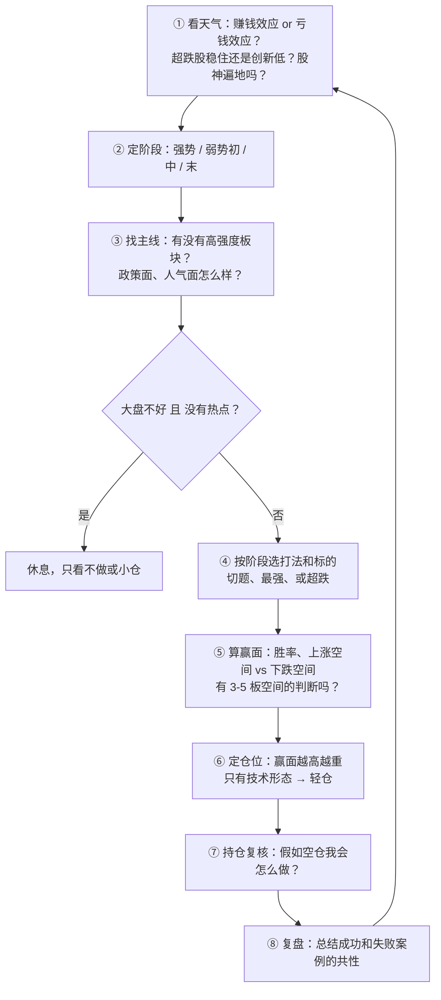
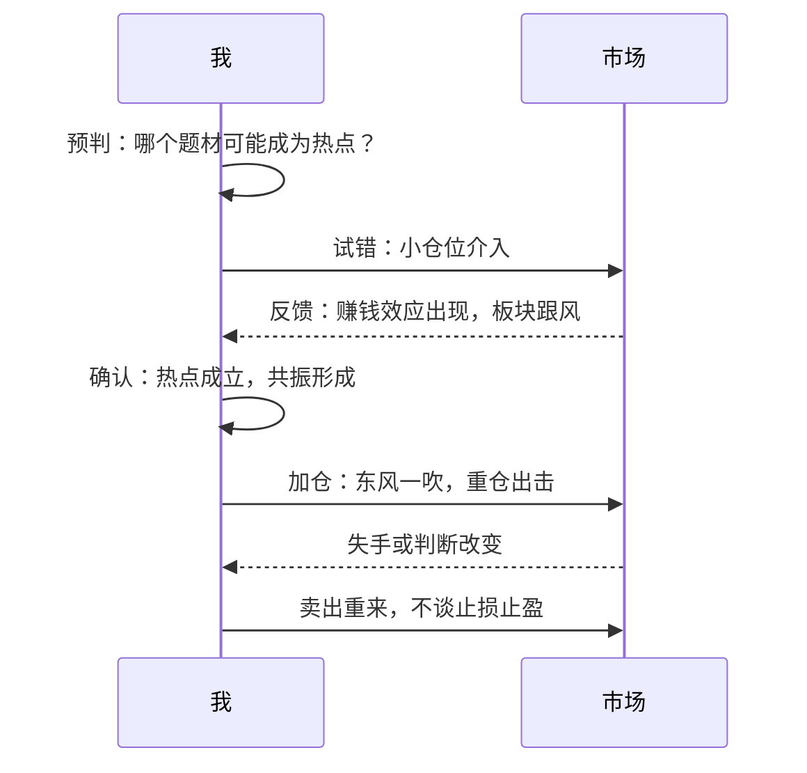
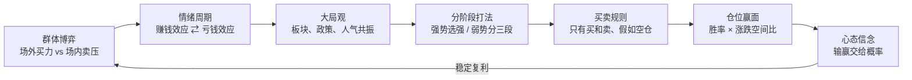
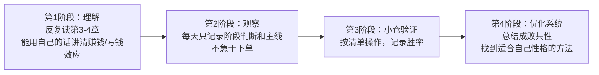

# 炒股养家 ⑥：实战演练、误区与金句——每日流程与检查清单

::: summary 本篇要点
1. **每日八步**：看天气 → 定阶段 → 找主线 → 选打法 → 算赢面 → 定仓位 → 持仓复核 → 复盘。
2. **预判—试错—确认—加仓**：万事俱备，东风一吹才是行动的时刻（p.20）。
3. **五道情景题 + 可打印检查清单 + 复盘模板**。
4. **十大误区**：从“高位越跌越买”到“抄高手实盘”。
5. **金句速查卡与学习路线**，以及原文页码索引。
:::

::: note 阅读说明
**它是什么**：本篇是《炒股养家心法：从总体到实战的系统教程》拆分后的第 6 / 6 篇。教程把《70 后游资翘楚炒股养家心法语录》（悟道心法编辑，共 28 页）这份零散语录，重新整理成一套从总体到实战的学习路线。全部六篇：[① 总览与人物](/reading/yangjia-1-overview.html)、[② 群体博弈与情绪周期](/reading/yangjia-2-emotion.html)、[③ 大局观与分阶段打法](/reading/yangjia-3-dashi.html)、[④ 选股、买点与卖出](/reading/yangjia-4-trade.html)、[⑤ 仓位、赢面与心态](/reading/yangjia-5-position.html)、[⑥ 实战演练、误区与金句](/reading/yangjia-6-practice.html)；系列第 ⑦～⑩ 篇是在此之外收集的原帖、问答与报道。

**标注约定**：「原文」或 `p.X` 出自 PDF 第 X 页，尽量保留原话；💡 **讲解** 是教程作者补充的通俗解释、类比或例子，**不是**原文；⚠️ **坑** 是原文点名的常见错误。

⚠️ **风险提示**：本教程只是对一份公开语录的学习整理，**不构成任何投资建议**。原文里的胜率、收益等数字都是养家本人的口述，没有经过核实；短线交易风险很高，请独立判断。
:::

## 第 11 章 实战演练：每日流程、情景题与检查清单

> 本章是教程作者把原文原则**编排成可执行的流程和练习**，每一步都标了原文依据。情景题是虚构的练习场景，不是原文案例。

### 11.1 每日决策流程

依据：①④ p.7–8、11；② p.9–10；③ p.11、24；⑤ p.20、26；⑥ p.16–17；⑦ p.19、27；⑧ p.4、21。

### 11.2 原文里的“预判—试错—确认—加仓”节奏（p.20）

> 理念的东西，简单说就是把握市场热点，实际操作中，预判、试错、确认、加仓等。赚该你赚的那部分就可以了，不必过于拘泥。万事俱备的时候，东风一吹，才是行动的时刻。

### 11.3 情景练习（先自己想，再看参考思路）

**情景 1**：你持有一只股，买在高位，已经套了 8%。今天板块继续走弱，你心里想“再等等，回本就走”。

参考思路

- 用“假如空仓”测试：如果现在空仓，你会买这只吗？不会，那就卖出（p.27）。
- “最忌自己都不看好了，只是因为套了几个点，还在犹豫。”（p.19）
- “不必为了所谓的解套而错失其它的机会。”（p.16）
- 高点买入遇大跌就“拿中线不动”，是虚荣心在作怪（p.11）。

**情景 2**：大盘连跌两周，今天又是一根大阴线，指数远离 5 日线；你关注的一个超跌板块今天集体大幅杀跌。

参考思路

- 大盘和板块两个超跌条件同时满足，是“超跌的出击时刻”（p.8）。
- 买点通常是“等大阴线后，第二天再探底的时候”，“宁愿慢三分”（p.10）。
- 如果市场已认同弱势（中期），选“跌得最惨的股”；没有特别好的机会时宁愿放弃（p.10）。

**情景 3**：市场热闹，身边人都在晒收益，一个新题材今天有三只股涨停。A 是正宗概念股，已经两板；B 号称“可能沾边”，还没怎么涨。

参考思路

- 强势阶段选强：强的标的被后来资金选中的概率大（p.5、9）。
- 切题：“既然有确定是 xxx 概念的，为什么还要选应该、可能是 xxx 概念的呢？”（p.9）A 优于 B。
- 重仓前问自己：有没有后市 3～5 个涨停空间的判断？没有就一个板也不重仓（p.20）。
- 同时注意：“股神遍地的时候就是人气最旺的时候”（p.11）；连续上涨一段后的集体涨停要特别小心（p.18）。

**情景 4**：大盘不好，也看不到任何持续性热点。你手痒，想做点什么。

参考思路

- “如果既不看好大盘，又没有热点，就多休息吧。”（p.11）
- “要下雨了，就早点回家。”（p.7）
- 老手不做光看也能感受市场变化；新手可以小仓试，“多亏些或许能增长点经验”（p.17）。

**情景 5**：你连续三笔亏损，想下一笔加倍仓位把钱赢回来。

参考思路

- 这正是原文说的“最大的忌讳”：赌徒式加码、急于翻本（p.19、25）。
- 仓位应该看下一个机会的胜率和空间比，跟之前亏了多少无关（p.17、26）。
- 亏损经验要用来优化策略（p.21）。

### 11.4 交易前检查清单（可打印）

**大势**
- [ ] 当前是赚钱效应还是亏钱效应占主导？
- [ ] 超跌品种是稳住了，还是继续创新低？
- [ ] 处在强势 / 弱势初 / 中 / 末哪个阶段？我的打法对得上吗？

**标的**
- [ ] 它是当前热门，或者是我有理由预判会成为热门的吗？
- [ ] 题材是否“切题”，市场能不能一眼认出它是什么概念？
- [ ] 它是板块里最强的（追龙头），还是低位有补涨潜力的（跟风或潜伏）？
- [ ] 我知道它为什么涨吗？不知道就放弃。

**赢面与仓位**
- [ ] 有逻辑支撑，还是只有技术形态？（只有形态 → 轻仓）
- [ ] 往上敢看 30% 吗？重仓的话，有 3～5 个板空间的判断吗？
- [ ] 胜率和涨跌空间比够不够当前这个仓位？

**持仓复核**
- [ ] 如果现在空仓，我还会买它吗？买多少？
- [ ] 我是不是在因为成本或解套犹豫？
- [ ] 我是不是因为前面亏了想加码翻本？

### 11.5 复盘模板

| 日期 | 阶段判断 | 主线热点 | 操作 | 依据（赚钱/亏钱效应、共振） | 结果 | 成功或失败共性 | 能否更早下手？ |
|---|---|---|---|---|---|---|---|
| | | | | | | | |

依据：“多思考和总结自己成功例子的共性和失败例子的共性，成功的例子里面再思考能不能更早一点下手，未必要等突破以后。”（p.4）

---

## 第 12 章 十大误区避坑指南

| # | 误区 | 养家的说法 | 出处 |
|---|---|---|---|
| 1 | 指数高位迷恋价值投资，越跌越买 | 结果遭遇暴跌，损失惨重 | p.3 |
| 2 | 迷恋技术、追突破新高 | 赚点小钱，碰到几个假突破就亏大了 | p.3 |
| 3 | 追求技术量化 | 钻牛角尖；真可行的话，基金经理比炒手更有优势 | p.4 |
| 4 | 只盯着克服自己的贪婪恐慌 | 着眼点仅在自身；应借市场的情绪指导决策 | p.5 |
| 5 | 被套后拿成中线 | 不愿认输、虚荣心作怪 | p.11 |
| 6 | 心里还有成本、补仓、止损 | 好的操作只有买入或卖出 | p.17 |
| 7 | 亏钱急于翻本、赌徒式加码 | 最大忌讳，错上加错 | p.19 |
| 8 | 迷信龙头理论、纯技术打板 | 胜率约 45%，大致相当于赌场；没有永远的龙头 | p.27 |
| 9 | 觉得跟着大户买就有赢面 | 大户又跟谁买？要选“大众情人” | p.21 |
| 10 | 抄实盘、看高手操作 | 不知道操作那一刻的想法；“功夫未到时，你即使看了全部实盘，也不能了解” | p.19 |

一个真实对照（p.27）：
> 我有个朋友也做短线，追龙头为主，刚开始大家都是几十万，行情好的时候，他主动和我比收益率，经常超过我，行情不好的时候就听不到他的声音，现在他还是几十万。

💡 **讲解**：这个故事说明的就是[第 9 章](/reading/yangjia-5-position.html#第-9-章-仓位与赢面胜率--涨跌空间比)那句话：衡量职业选手最重要的是**盈利的稳定性**，不是行情好时的峰值收益。

---

## 第 13 章 总结与金句速查卡

### 13.1 一张图复盘全书

### 13.2 五句话记住养家

1. **看人不看图**：交易是群体博弈，读懂场内外资金的心理，比读懂 K 线重要。
2. **情绪是唯一的规律**：赚钱效应吸引资金，亏钱效应赶走资金，循环往复。
3. **阶段决定打法**：强势追涨龙头；弱势初期做回调反抽，中期做超跌，末期做新主流强势股；没热点就休息。
4. **只问未来，不问成本**：只有买入和卖出；拿不准时问“假如我空仓会怎么做”。
5. **重仓要苛刻，心态要淡定**：满仓要胜率 90%+、上涨 30～50%、下跌 3～5%；做对的事，输赢交给概率。

### 13.3 金句速查卡

| 主题 | 金句 | 页码 |
|---|---|---|
| 心法定义 | 基于对市场情绪的揣摩，进而判断风险和收益的比较，并指导实际操作 | p.2 |
| 龙头 | 高手买入龙头，超级高手卖出龙头 | p.2 |
| 人气 | 得散户心者得天下；人气所向，牛股所在 | p.2 |
| 博弈 | 博弈，就是在动态的变化过程中，时刻寻求最优化的策略 | p.2 |
| 规律 | 情绪转变的过程就是规律，一千年内亦不会有大的改变 | p.5 |
| 主动 | 掌握市场之心，胜利接踵而至；心被市场掌握，失败连绵不绝 | p.5 |
| 天气 | 觉得要下雨了，就早点回家，天气好了再出来 | p.7 |
| 应变 | 判断为末，应变为本 | p.12 |
| 跟随 | 我做跟随者，不做发动者 | p.15 |
| 热点 | 热点来自题材，持续性来自赚钱效应 | p.16 |
| 价值观 | 价值投资=短线投机，区别只在于操作的时间区间和对价值的认知 | p.19 |
| 超短 | 波段不确定性很大，超短才是相对确定的 | p.21 |
| 复利 | 稳定的复利才是职业炒股的根本 | p.21 |
| 心法 | 天下武功唯快不破，天下股市唯心法不破 | p.22 |
| 模式 | 追涨也好，低吸也好，问题不在模式，而在何种阶段应用，以及火候 | p.22 |
| 职业门槛 | 股市收入能超过开销；收益至少跑赢最优秀的公募基金和大多数私募；志向远大，操作稳健 | p.26 |

### 13.4 学习路线建议（💡 教程建议）

::: warn 原文编辑者的忠告（p.28）
一定要建立与自己性格、天赋相匹配的交易系统；==在无法稳定盈利的情况下，不要投入过多资金==。
:::

---

## 附录 原文结构与页码索引

| 页码 | 主要内容 |
|---|---|
| p.1 | 人物介绍：经历、资金曲线、“上士闻道”引语 |
| p.2 | 心法定义与核心口诀；职业初期困境 |
| p.3–4 | 方法演变、信念；群体博弈本质；突破买入的局限 |
| p.4–6 | 情绪转变规律；强势选强、弱势低吸；技术局限；短线综合素质 |
| p.7 | 资金级别与策略；重仓频率；控制回撤；看天气 |
| p.8 | 超跌度的把握；赚钱效应的展开 |
| p.9–11 | 分阶段打法（强势、弱势初中末）；龙头板块；尾盘；政策面与人气面 |
| p.12–14 | 群体博弈再述；追涨者与抄底者的心理循环；风险收益衡量 |
| p.14–17 | 系统与执行；跟随者；买入卖出；盈亏比；股指期货；补仓与止损；仓位 |
| p.18–20 | 资金规模；龙头与跟风；价值投资=短线投机；忘记成本；打板与 3–5 板空间 |
| p.21–23 | 大众情人；选股范围；稳定复利；冲击成本；主力是散户；买前自问 |
| p.24–26 | 大局观与共振；阶段与节奏；职业门槛；次新股；满仓条件 |
| p.27 | 假如空仓法；打板胜率 45%；龙头理论不科学；朋友的故事 |
| p.28 | 编辑者忠告；30 篇系列目录截图（推广内容） |

**说明**：
- 原文是论坛语录汇编，不少段落重复出现（比如“买入倾向的推理”“当时机不成熟……全力拼取”），本教程已合并去重。
- p.28 的图片是同系列 30 篇语录的文件列表截图，附带付费领取的推广信息（加微信、30 元），跟心法本身无关，所以本教程没有收录，也不做推荐。
- 原文有个别错别字或口语化表达（如“淘县”应为淘股吧，“宣泄怠尽”应为“殆尽”，“如何我现在是空仓”应为“如果”，“大致于澳门赌场”应为“大致等于”，“建立立即退出”应为“建议立即退出”，“已经成为惯”应为“习惯”），引用时保留原意，个别地方顺手改正了。

## 来源

- 《70 后游资翘楚炒股养家心法语录》（悟道心法编辑，“游资语录精编 30 篇系列”之一，PDF 共 28 页；本地资料《情绪周期炒股养家心法语录精编》）。正文 `p.X` 均指该 PDF 页码。
- 语录原始出处多为淘股吧炒股养家的帖子与回复，网友整理版可参考：淘股吧《炒股养家心法（转）》https://m.tgb.cn/a/1KAdGAYzcje ；原帖之一《我如何在股市赚了200万》转载 https://m.tgb.cn/a/2oLta4CHEK0 （详见本系列 [⑦ 原帖现场](/reading/yangjia-7-thread.html)）。
