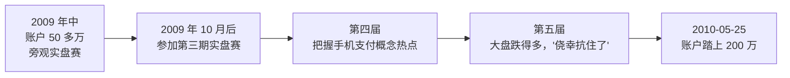
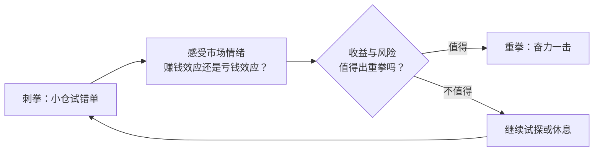

# 炒股养家 ⑦：原帖现场——2010 年《我如何在股市赚了200万》问答

::: summary 一页读懂
1. **一个帖子的起点**：2010-05-25 凌晨，养家在淘股吧发帖：实盘赛账户踏上 200 万整数关，"自从职业炒股2年以来，扣除生活开销，这200万全部是从股市中赚来"。
2. **感谢与榜样**：他说从前辈身上"得到最多的是对于短线操作的信念"，"asking和职业炒手是我们的榜样"。
3. **方法随阶段切换**：强势学钙片做主升浪，弱势学职业炒手做超跌反弹，平衡格局学先手试错加仓——"集百家之所长"。
4. **试错单 = 刺拳**：小赢小亏的试错单是为了感受市场情绪，决定何时出重拳。
5. **关于职业炒股**："好比80年代的下海"，"这是一场赌博"，值不值得要自己判断。
:::

::: note 阅读说明与免责声明
很多流传的"养家心法"语录，最早就出自这个帖子里他对网友的回复。本文按时间和主题整理这个帖子（据转载，原帖 topicID 307466，2010 年 5–8 月），用自己的话串联，只做简短引用。原帖由网友转载，**个别字句可能与原帖有出入**；帖中提到的个股只是复述当年的讨论，**不构成任何投资建议**。与系列教程（①～⑥）重复的观点，只做简述并给出链接。
:::

## 1. 帖子是怎么开始的

2010 年 5 月 25 日 00:08，ID "炒股养家"发了一个四句话的帖子：

> 今天很高兴参加实盘大赛的帐户踏上了200万整数关，自从职业炒股2年以来，扣除生活开销，这200万全部是从股市中赚来。

> 非常感谢职业炒手、asking等短线高手，从闽发到淘股吧，本人一直默默的潜水，不断的向前辈们学，但是从他们身上得到最多的是对于短线操作的信念，因为有了信念，才会全身心的投入。

最后一句是："200万在实盘赛的选手里面算不得什么，不过这不是一个目标，这只是一个开始"。

::: tip 为什么值得读原帖
系列教程（①～⑥）读的是**整理后的语录**，像一本教科书；原帖是**问答现场**——网友带着质疑和具体问题来，他怎么回答、回答时的语气和分寸，能看出这些心法是在什么情境下说出来的。
:::

## 2. 从 50 万到 200 万：他自己怎么说

有网友问"用多少钱？花了多长时间？"，他答：一年前这个账户 50 多万，一直默默关注实盘赛，"10月后开始参加第三期比赛，到今天达到200万"。

*图：根据帖子里他对网友的回答整理；后续 300 万、600 万等节点见 [① 总览与人物](/reading/yangjia-1-overview.html)。*

被问到"到底怎么赚的"，他的回答后来成了语录里的名句：

> 最重要的是信念二字，具体操作上一个是对于热点的把握，一个是对于大盘和个股分时高低点的把握。

而对自己的成绩，他很克制：也许是"人品的集中爆发"，也许方法真的有效，"还需要时间的检验"，要"始终保持对市场的敬畏之心"。

## 3. 两招师承：和 asking 学、和炒手学

有网友拿着他的交割单追问，他借此讲了自己的两个手法：

1. **强势追击热点**：某日黄金股集体封死涨停，他"选个相对盘小的介入，随后两天轻松赚出"；
2. **介入超跌板块**：如当时超跌的钢铁板块，"类似于这段时间的地产股的超跌"。

> 第一招是和asking学的，第二招是和炒手学的，哈哈

还有一次被问到怎么买到涨停股，他把话题拉回热点本身：

> 买康强电子，实际是买手机支付，买手机支付是买新兴产业，一个新故事出现在主流热点时候，便是赚大钱的机会，对于主流热点的把握才是关键之所在，至于涨停板的技巧则流于表面，相对是次要的。

::: core 一层层往上问
买一只股 → 实际是买一个题材 → 实际是买一个产业趋势。==真正决定胜负的是"新故事 + 主流热点"，涨停板技巧只是表面。==（"热点来自题材"的展开见 [④ 选股、买点与卖出](/reading/yangjia-4-trade.html)）
:::

## 4. 按阶段换方法：集百家之所长

被问"成功率多大，是赚足了再走还是隔日短线"时，他给了一个按阶段切换的回答（据转载原文大意）：

| 市场阶段 | 学谁 | 怎么做 |
|---|---|---|
| 强势 | 钙片 | 做最强个股的主升浪，可以多拿几天 |
| 弱势 | 职业炒手 | 超跌反弹，大盘超跌时买超跌股，大部分第二天冲高就走；情况不利，亏钱也走 |
| 平衡格局 | 先手 | 部分持有热点板块观察变盘方向，试错、加仓、向上买，顺势而为 |

> 成功率有多大，我也没有统计过，总之根据不同的市场阶段的情况，选择适合的方法，所以我的方法就是集百家之所长

他还提到早年在闽发大量学"不动明王"的涨停板技巧，认为其"过于注重这些"，但下跌阶段的"高接低挡之法"让他受用。

::: tip 解读：没有"我的模式"
网友问"楼主主要做低吸吗"，他说模式是"跟随市场的情况随时变化的"：前阶段大盘下跌为主，就以低吸做超跌反弹为主。后来语录里"问题不在模式，而在何种阶段应用"的说法（见 [⑥ 实战演练、误区与金句](/reading/yangjia-6-practice.html) 的金句卡），分阶段打法（见 [③ 大局观与分阶段打法](/reading/yangjia-3-dashi.html)），在这里已经成形。
:::

## 5. 试错单就像拳击里的刺拳

2010 年 7 月，有人问他为什么在大盘看起来风险极大的一天还有多笔买入。他的回答：

> 我的操作里面含有很多的试错单，这些单子的结果大多是小赢小亏，到底是赚是亏不重要，重要的是在于我能借此感受到市场的情绪，从而判断收益和风险，以决定是否奋力一击，那才是关键。

> 就好比拳击的时候很多的刺拳是为了试探对手，这些刺拳有没有打中不重要，重要的是借这个试探判断何时该出重拳，那才是关键。

紧接着他补了一句：个人"是反对预测的，即便心中有预测也是为了应变做准备"。

::: warn 别把"试错"当成乱买
试错单的目的是**获取信息**，所以仓位很小、结果"小赢小亏"；它和"亏了加码翻本"完全相反（后者是养家说的最大忌讳，见 [⑤ 仓位、赢面与心态](/reading/yangjia-5-position.html)）。
:::

## 6. 回应质疑：量化、做梦与"不做巴菲特"

帖子里也有不少质疑。几段回应很有个性：

- 有人说"技术不能量化就是蒙人"，他答：追求技术量化"曾经让我大量的时间钻这个牛角尖"，"炒股若是这样可行的话，那些基金经理们应该比炒手们更有优势了"。（教程 [② 群体博弈与情绪周期](/reading/yangjia-2-emotion.html) 也收录了这一条）
- 有人说"这200万是自己梦里做出来的"，他答："有时候感觉是像做梦，难道股市赚钱的秘密就是这样，如果是个梦的话，还要继续，因为目标还很远。"
- 有人说半职业炒股十年、坚持自己的投资之道，他答："十年复十年，人生匆匆几个十年，股票有价，青春无价，所以我不做巴菲特。"
- 有人想找高手的实盘来学，他答："功夫未到时，你即使看了全部实盘，也不能了解，功夫到了，只言片语便知。"

## 7. 要不要辞职职业炒股？

一位 40 岁、炒股 9 年的上班族说想辞职职业炒股，家里人不支持。养家的回答是整个帖子里最长的一段之一：

> 我觉得现在的职业炒股，好比80年代的下海，当时很多人对于下海也不置可否，结果很多人成为万元户，当然也可能被淹死，能不能成功，是很多因素共同构成的。

他坦言自己当年辞职"好比跳下水的时候还没有学好游泳"，是在呛水中学会的，最后说：

> 这是一场赌博，没有人能告诉你是不是一定会成功，就看你自己觉得是不是值得。

另一处他给出了职业门槛（股市收入能超过开销、收益跑赢最优秀的公募和多数私募、"志向一定要远大，操作务必要稳健"），见 [⑥ 实战演练、误区与金句](/reading/yangjia-6-practice.html) 的金句卡。

::: note 整理者提醒
养家本人把职业炒股称为"一场赌博"。这一段适合用来理解他的心路，而不是作为辞职炒股的鼓励。
:::

## 8. 其他零散回答

| 问题 | 他的回答（摘要） |
|---|---|
| 买的股是盘中临时选的吗？ | 大部分操作是盘中临时决定，但题材、基本面平时多有准备，"很少出击一只完全看技术形态的个股" |
| 资金曲线为什么这么稳？ | 不确定时偏保守，平时小阴小阳为主；确定性高时奋力出击博取大阳；"操作模式决定市值曲线" |
| 为什么早早卖掉正在拉升的股？ | 当时判断大盘较弱，操作偏保守；想要控制风险，收益自然也要降低 |
| 基本面消息看哪些网站？ | 大多数交易不太关注基本面，要查的话最常用 google 和百度 |
| 怎么判断日内高低点？ | "非本人强项"，并举例实盘高手在股指期货中也不乏亏损 |
| 站内信拜师、合作？ | 不考虑合作；"精髓的东西，asking和炒手都讲了，有心的话自己多体会便是了" |
| 职业炒股累吗？ | 花的时间比上班多，但"是自己爱好的东西，就不觉得累"，"还充满着梦想" |

## 9. 自测与行动

自测 1：被问"到底怎么赚的"，养家说最重要的是什么？具体操作上抓哪两点？

信念二字；具体操作上，一是热点的把握，二是大盘和个股分时高低点的把握。

自测 2：他说"第一招和 asking 学，第二招和炒手学"，分别是哪两招？

强势追击热点（板块集体涨停时选相对盘小的介入）；介入超跌板块做反弹。

自测 3：试错单和"刺拳"的类比想说明什么？

试错单本身赚亏不重要，重要的是借它感受市场情绪、判断收益和风险，从而决定何时出重拳。

自测 4：他怎么看"辞职职业炒股"？

好比 80 年代下海，可能成功也可能被淹死；"这是一场赌博"，要自己判断是否值得。

读原帖时可以做的练习：

- [ ] 找出一条教程里的语录，在原帖里找到它的上下文
- [ ] 想一想：当年的提问者为什么会这样问？他的困惑和我有没有相似之处？
- [ ] 把"按阶段换方法"的表格对照到最近一段行情，判断当时属于哪个阶段

## 来源

- 淘股吧转载《炒股养家语录 我如何在股市赚了200万-短线职业炒股的信念》（据转载，原帖为炒股养家 2010-05-25 发表，含 2010 年 5–8 月回复）：https://m.tgb.cn/a/2oLta4CHEK0
- 同帖 PDF 版本的公开索引（"共117页"）：https://www.5shubook.com/d-74722.html
- 淘股吧《炒股养家心法原汁原味摘抄版（转）》：https://m.tgb.cn/a/22y3txkHRwL
- 系列教程依据：《70 后游资翘楚炒股养家心法语录》PDF（本地资料）
