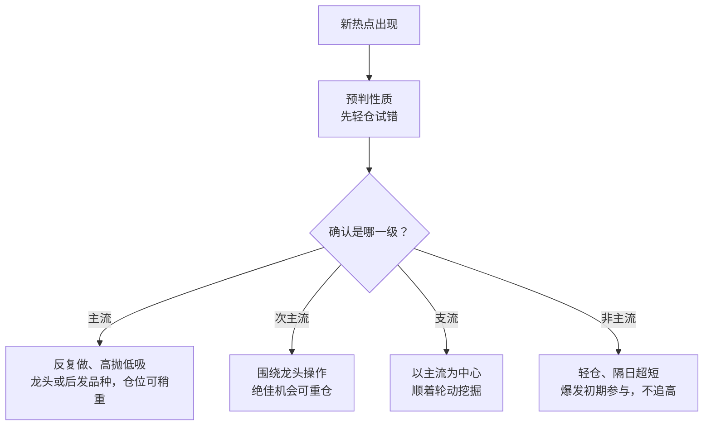
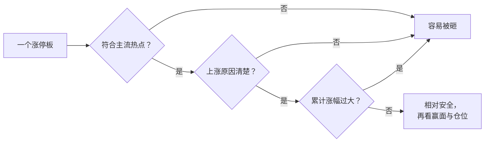

# 炒股养家 ⑧：热点分级与涨停板——主流、支流与"容易被砸的板"

::: summary 一页读懂
1. **热点要分级**：主流、次主流、支流、非主流，各有不同的操作策略；先预判性质，"先试错轻仓买入，确认后再追涨加仓"。
2. **主流反复做，非主流隔日走**："主流是反复做，高抛低吸反复做，非主流的隔日超短为主。"
3. **涨停板分两类**：投资性的"往上看有较大空间，往下敢越跌越买"；投机性的要求大盘好、热点最强，通常隔日超短。
4. **容易被砸的板**：不符合主流热点的、不明原因的、累计涨幅过大的。
5. **新故事别急着卖**："既然准备赚大钱，何必着急卖出。"
:::

::: note 阅读说明与免责声明
本文素材来自淘股吧网友（@次新股投顾）整理的《养家心法》问答集（约 5 万字，由多位网友的资料与养家帖子、留言汇编而成，问题多为整理者归纳，**原帖日期与上下文多数待考**）。系列教程（①～⑥）已讲过的内容（选股两类、切题、龙头与跟风、3～5 板原则、尾盘买股等）这里只给链接，本篇只整理教程**没有覆盖**的部分。引用均为短句，文中个股与题材只是复述当年的讨论，**不构成任何投资建议**。
:::

## 1. 热点为什么要分级

教程里讲过"热点来自题材，持续性来自赚钱效应"（[④ 选股、买点与卖出](/reading/yangjia-4-trade.html)）。问答集里，养家把热点再细分成四级：

> 关于热点，有长期的主流，也有短期的支流，长期的主流能持续，可以反复做，短期的支流，爆发力强，都有可操作性。

拿不准是哪一级时，他的做法是：先预判性质，==预判可以先试错轻仓买入，确认后再追涨加仓==。

| 级别 | 特征（原文要点） | 策略（原文要点） |
|---|---|---|
| **主流** | 涨幅大、时间跨度长 | 反复做；第一波赶上就做足，没赶上的等回落后再做下一波；可直接买相对确定的龙头或后发品种，仓位稍重也无妨 |
| **次主流** | 涨幅和时间跨度少于主流，仍有可操作性 | 以围绕龙头操作为主；有绝佳机会也可以重仓搏杀 |
| **支流** | 各支流循序轮动，时间上契合主流，直至主流完结 | 主流不倒的情况下，以主流为中心逐步挖掘 |
| **非主流** | 时间短，因技术面或消息面短期有爆发力 | 快进快出、隔日超短；爆发初期可参与，后市不追高；轻仓参与，隔日卖出 |

*图：按问答集第 17–18 问整理。*

> 只要有赢面的股票都可以做，区别只是操作策略上，主流是反复做，高抛低吸反复做，非主流的隔日超短为主。

::: tip 解读：分级决定"拿多久、下多重"
同样是一个涨停，属于主流还是非主流，决定了你能不能反复做、敢不敢加仓、第二天要不要走。==先分级，再谈买点。==
:::

## 2. 怎样第一时间发现热点

问答集里这条答得极简：

> 多看涨幅榜和异动榜的共性

关于追板，他还给了一个按热点级别区分的做法：先判定是否主流热点（"持续时间比较长的可以反复活跃的热点"），**如是，不必等涨停也可随时先买入，等确认强度后再行加仓**；如果不是主流热点就等，强度够高再排队龙头。

## 3. 两类涨停板：投资性与投机性

> 根据对热点的持续性，主次流等的划分，我把涨停板板分为投资性和投机性两类。

| | 投资性涨停 | 投机性涨停 |
|---|---|---|
| 要求 | 往上看有较大空间，往下敢越跌越买 | 当天大盘环境较好，当天是最强或次强的热点 |
| 买法 | "想买就买，不管几个点" | 很大程度上在板上买 |
| 特点 | 后市可反复操作 | 持续性不一定好，但短期爆发力强 |
| 持有 | 可反复做 | 通常隔日超短 |

他接着强调：

> 一个新故事出现在主流热点时候，便是赚大钱的机会，对于主流热点的把握才是关键之所在，至于涨停板的技巧则流于表面，相对是次要的。

（这句话最早出现在 2010 年的原帖里，见 [⑦ 原帖现场](/reading/yangjia-7-thread.html)。）

::: warn "越跌越买"只用于检验信心
"往下敢越跌越买"和教程里的"买前自问"一样，是检验自己对这只票有没有足够信心的问题，不是真的去越跌越买（养家自己在价值投资阶段就因"越跌越买"损失惨重，见 [① 总览与人物](/reading/yangjia-1-overview.html)）。
:::

## 4. 什么样的涨停板容易被砸

问答集第 33 问，养家列了三条：

1. 不符合主流热点的；
2. 不明原因的；
3. 累计涨幅过大的。

整理者还补充了两条（**非养家原话**）：跟风的；早盘无量、换手不足拉升的。

## 5. 几个具体时点与场景

### 5.1 9:30 买什么

> 9:30买股，前一天封死涨停买不到的龙头品种，或者利好消息刺激的品种，前一种需要对热点的持续性有判断，后一种需要对消息敏感。

（尾盘买股的思路见 [④ 选股、买点与卖出](/reading/yangjia-4-trade.html) 的"其他买点要点"。问答集里还多了一句：尾盘买时"看的是更大的局"——10 元买的时候，看的应该是 15 或者 20 元甚至更高，实际可能赚三五个点就走了。）

### 5.2 下跌市里，什么时候介入相对安全

> 市场在不断下跌的时候，会有一些股票还能创新高，这些冒头的如果被杀了，其他人看着脚也会发软，但是这些冒头的不断的赚钱，后面就会有资金开始前赴后继，此时介入相对安全。

::: tip 解读：看"冒头股"的命运
冒头股被杀 → 大家脚软，继续观望；冒头股持续赚钱 → 资金前赴后继。它们就像试探市场情绪的先头部队，其结果本身就是情绪读数。
:::

### 5.3 第二波还是高潮顶点？

> 看几天内，赚钱效应的持续性，高潮的顶点只能感觉，很难精确判断，不过赚到自己该赚的部分就可以了。

### 5.4 如何避免冲高就卖

> 我的重要理论之一，符合主流热点的新故事是赚大钱的机会。既然准备赚大钱，何必着急卖出。即使行情弱于预期，宁愿回落卖出，少赚些无妨，但是提早卖出，错失的可能一年中为数不多的绝佳机会，两者权衡，先持有观望是上策。

注意这一条==只针对"符合主流热点的新故事"==；非主流仍是隔日超短。

### 5.5 大品种还是小品种

- 同等条件下选小的，爆发力好；没有合适的小品种，或小品种容纳不了资金，也可以选大品种。
- 一轮主升中，小品种常连续拉升；大品种通常拉一根大阳后横盘两三天再拉，小品种效率更高。

### 5.6 板块内的强度梯度与联动

- 一个板块启动后，随着时间先后，强度一般呈**梯度递减**；但跨度较长的主流热点，往往会出现几波不同阶段的强势股。
- 龙头与跟风怎么选，见 [④ 选股、买点与卖出](/reading/yangjia-4-trade.html)。问答集里这一条后面还注了一句：买低位跟风"论坛名id职业炒手正是此路好手"。
- 联动："联动说明市场资金的关注度高，但是赚钱效应才是激发资金不断进场的最大动力。"

## 6. 自测与行动

自测 1：主流和非主流热点的操作策略有什么区别？

主流：反复做、高抛低吸，可买龙头或后发品种、仓位稍重；非主流：轻仓、快进快出、隔日超短，爆发初期参与，后市不追高。

自测 2：投资性涨停和投机性涨停各有什么要求？

投资性：往上有较大空间、往下敢越跌越买，可反复操作；投机性：当天大盘较好、当天最强或次强热点，通常隔日超短。

自测 3：养家列出的"容易被砸的涨停板"有哪三类？

不符合主流热点的、不明原因的、累计涨幅过大的。

自测 4：下跌市里，什么情况下介入相对安全？

逆势创新高的"冒头股"持续赚钱、资金开始前赴后继的时候。

复盘时给热点分级：

- [ ] 今天涨停最集中的题材，属于主流、次主流、支流还是非主流？依据是什么？
- [ ] 我参与的涨停，是投资性还是投机性？持有策略是否匹配？
- [ ] 它有没有"不符合主流 / 不明原因 / 累计涨幅过大"中的任何一条？
- [ ] 涨幅榜和异动榜上的股票，共性是什么？

## 来源

- 淘股吧《炒股养家心法（转）》（网友 @次新股投顾 整理的 52929 字问答集转载，问题编号 7、9、14、15、16、17、18、20、30、31、33、35、39、40）：https://m.tgb.cn/a/1KAdGAYzcje
- 同一整理稿的网页转载《养家心法-网友整理的完整版共5万字》：https://www.xiarj.com/8378.html
- 2010 年原帖转载（"买康强电子，实际是买手机支付……"出处）：https://m.tgb.cn/a/2oLta4CHEK0
