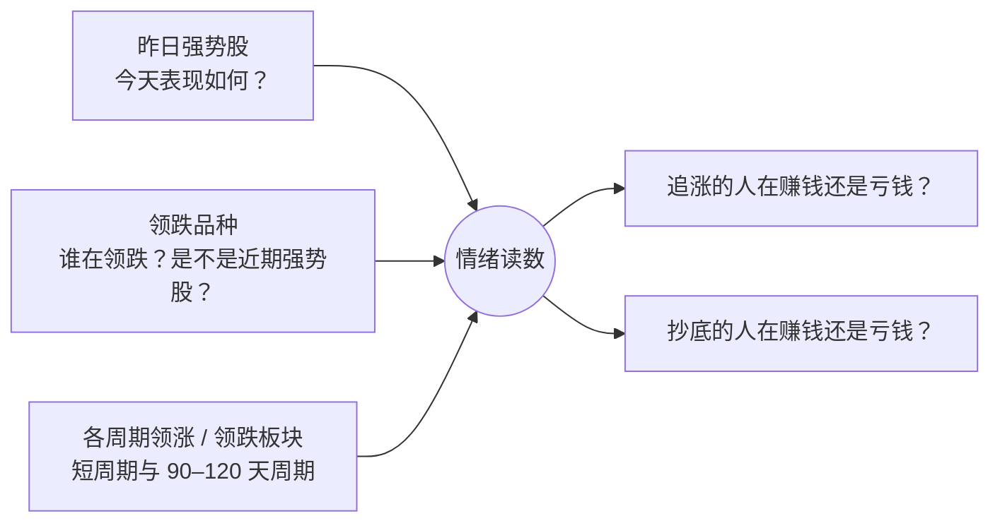
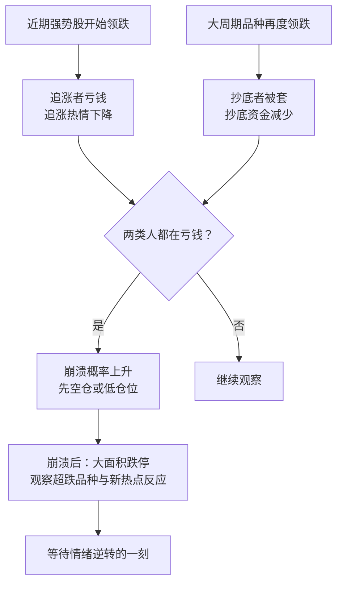
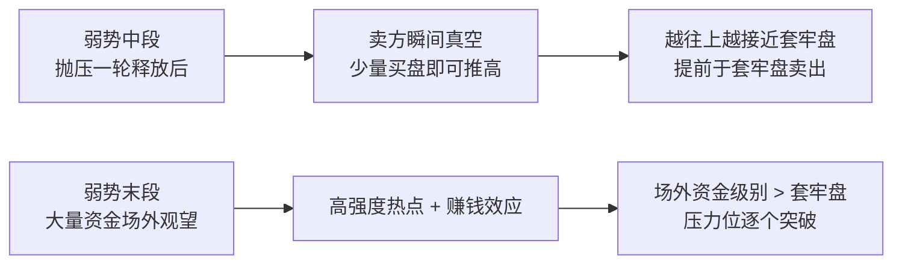

# 炒股养家 ⑨：情绪仪表盘——领涨领跌统计、崩溃标准与反弹三段

::: summary 一页读懂
1. **情绪可以"统计"**：参考"前一天涨幅前 20 名的个股第二天的表现"这类指标，再加上领跌品种、各周期的领涨领跌板块。
2. **崩溃有标准**：较大面积跌停（几十到上百家）、部分品种 20%–30% 以上跌幅；之后观察超跌品种和新热点的反应，等待情绪逆转。
3. **崩溃有前兆**：近期强势股领跌（打击追涨）、大周期品种再度领跌（套住抄底资金）——两类人都亏钱时，崩溃概率上升。
4. **下跌趋势分段做**：初期做仍有主升能力的品种，中期做大周期超跌，末段等有持续性、多方共振的新热点。
5. **从 asking 学到的**："行情好就多做做，行情不好就多休息，做的话，做最强的。"
:::

::: note 阅读说明与免责声明
本文素材来自淘股吧网友整理的《养家心法》问答集（第 21、22、41、44–47 问等），原帖日期多数**待考**，问题标题多为整理者归纳。追涨者与抄底者的心理循环、弱势"初中末"三段的基本框架，教程 [② 群体博弈与情绪周期](/reading/yangjia-2-emotion.html) 与 [③ 大局观与分阶段打法](/reading/yangjia-3-dashi.html) 已讲过，本篇只补充**怎么观察、怎么量化、当年怎么用**。文中个股、点位只是复述历史讨论，**不构成任何投资建议**。
:::

## 1. 情绪也能做成"仪表盘"

问到"对市场情绪的揣摩主要观察哪些方面"，养家举了一个当年网友收评里的统计：以**前一天涨幅前 20 名的个股第二天的表现**为基准——

> 类似这样的统计指标就是市场情绪的一部分。

他自己的做法是在此基础上再加两样：==**领跌品种**，以及**各个周期阶段的领涨领跌板块**==。

::: tip 解读：两个指标对应两类人
"昨日强势股今天的表现"衡量的是**追涨的人**赚不赚钱；"大周期领跌品种"衡量的是**抄底的人**赚不赚钱。两类人的盈亏会自我强化（循环图见 [② 群体博弈与情绪周期](/reading/yangjia-2-emotion.html)），所以这两个读数能提前提示情绪的方向。
:::

## 2. 情绪崩溃的标准

问答集第 44 问，问的是"情绪崩溃的具体标准是什么"。养家的回答分两层：

**特征**：较大面积跌停（几十到上百家），幅度上部分品种有 20%–30% 以上跌幅（原文作"不少数品种"）；然后观察各阶段超跌品种以及新热点的反应，"等待情绪逆转的一刻"。

**前兆**（结合当时盘面）：

1. 领跌品种中有一部分是近期强势股——会打击后市追涨的热情，也说明赚钱效应降低；
2. 更重要的是，90–120 天周期级别的品种再度领跌，让一部分喜欢抄底的资金被套：

> 而抄底的人也亏钱的话，继续抄底的就会减少，这种状况就可能引发崩溃。

他的应对是：这种盘面"表示后市有一定崩盘的概率"，判断本身也是动态的，==先空仓或低仓位回避==——"只是当下先空仓或低仓位回避这种概率，会使自己操作上更为主动"。

::: core 关键不是预测，而是"先回避"
养家没有说自己能预测崩溃，他说的是：出现前兆时先降低仓位，"会使自己操作上更为主动"。这与教程里"控制回撤 = 回避系统性崩溃"一致（见 [⑤ 仓位、赢面与心态](/reading/yangjia-5-position.html)）。
:::

### 2.1 一个当年的例子：自贸区调整之后

问答集第 45 问记录了他对一次自贸区题材深幅调整后的看法（原帖日期**待考**，从内容推测约在 2013 年）。要点：

- "现在市场集体看空，说明大部分资金都在场外"，短期不一定是坏事——一旦再度反弹，热点反而可能有可操作性；
- 刚崩溃过，"一部分潜在的做空能量释放掉了"，所以"崩溃之前要非常小心"；
- 接下来看量：如果能放量涨，大概率说明是个阶段低点；如果反抽缩量、横盘消耗反抽周期，后市就要继续小心；
- 方向上，关注受益改革、未炒作充分、相对低位的品种。

::: tip 解读：崩溃后反而更从容
崩溃之前，做空能量积蓄、风险最大；崩溃之后，大部分资金在场外、做空能量释放，反而进入"观察反弹质量"的阶段。==用"放量还是缩量"来检验反弹==，是一个可以复用的观察方法。
:::

## 3. 下跌趋势里的分段与"本质"

教程 [③](/reading/yangjia-3-dashi.html) 讲了弱势初、中、末三段怎么做。问答集第 46 问给了更细的四段划分和当年的例子：

| 阶段 | 特征 | 做什么 | 当年例子（原文） |
|---|---|---|---|
| 初期 | 仍有主升能力的品种 | 做这些品种，回落后还可以再做一波 | 触摸屏、抗癌 |
| 第二阶段 | 强势品种多已在高位、有二次见顶嫌疑 | 选大周期超跌品种 | 地产 |
| 第三阶段 | 强势品种大幅回落，大周期超跌品种完成反弹 | 参与部分个股性机会，耐心等待由弱转强 | — |
| 末段 | 恐慌极度扩散，谈股色变 | 等一个有持续性、政策 / 技术 / 资金共振的热点领导上涨 | "1664 之后的水泥" |

（"1664"指 2008 年 10 月上证指数约 1664 点的低点——整理者注。）

> 下跌趋势，谨慎为上，保住本金为主，等市场由弱转强时才是奋力搏击利润的时候。

他还解释了"弱势中段低吸崩溃"为什么有效：

> 其上涨的本质不在于买的力量有多强，而在于抛的力量瞬间真空。

以及"弱势末端追涨强势"为什么有效：大队人马在场外观望，一旦热点强度较高、赚钱效应形成，"因场外资金级别大过短期套牢级别"，压力位被逐个突破。

### 3.1 论反弹：三个阶段的三个案例

在一篇"论反弹"的回复里，他给每个阶段都配了一个前辈或个股的例子（原文提及）：

- **初期**做强势股回调：选上涨过程中有强大号召力和人气的品种，"asking在包钢上的操作就是经典的例子"；
- **中期**找跌得最惨的，重点在选时，"炒手的汉王科技就是"，但时机难把握，"没有特别好的机会时，宁愿放弃"；
- **末期**选符合主流热点的新故事，并强调"不同阶段下的把握和后续的应变策略才是重点"。

他还提醒：超跌反弹越往上，解套盘的抛压越大，"就需要更大的外盘动力"。

## 4. 从 asking 那儿学到了什么

问答集里有两问与 asking 有关：

> 大体上就是行情好就多做做，行情不好就多休息，做的话，做最强的。

被问"asking 说的多做多错，少做少错是什么情况下"，他结合当时盘面解释：市场缩量严重、多空僵持，恐慌心理尚未有效释放，短期以谨慎防守为主；后市要么向下释放恐慌（"这是短线资金比较欢迎的，意味着将来的行情级别会较大"），要么出现意料之外的利多导致心理逆转——即便如此，保持谨慎"仍然有利于将来第一时间把握新主流"。

::: tip 三代人的同一句话
Asking 的"行情不好就多休息"、职业炒手的"弱市不做"、养家的"要下雨了就早点回家"，说的是同一件事。可以对照阅读 [Asking 系列](/reading/asking-3-trading.html) 与 [职业炒手系列](/reading/zhiye-2-core.html)。
:::

## 5. 自测与行动

自测 1：养家在"前日强势股次日表现"之外，还加入了哪些观察？

领跌品种，以及各个周期阶段的领涨领跌板块。

自测 2：情绪崩溃的特征和前兆分别是什么？

特征：较大面积跌停（几十到上百家）、部分品种 20%–30% 以上跌幅。前兆：近期强势股领跌打击追涨；大周期品种再度领跌套住抄底资金——两类人都亏钱时崩溃概率上升。

自测 3：为什么说"弱势中段低吸崩溃"的本质不在买方？

上涨"不在于买的力量有多强，而在于抛的力量瞬间真空"——抛压释放后，少量买盘就能推高。

自测 4：自贸区调整后，养家用什么检验反弹质量？

量能：放量涨，大概率是阶段低点；反抽缩量或横盘消耗反抽周期，后市要继续小心。

每日情绪仪表盘（可以记在复盘表里）：

- [ ] 昨日涨幅前列的个股，今天整体是涨是跌？
- [ ] 今天领跌的是谁？有没有近期强势股？
- [ ] 大周期（如 90–120 天）超跌品种是否再度领跌？
- [ ] 跌停家数是否异常放大？
- [ ] 如果崩溃前兆出现，我的仓位是否已经降下来？

## 来源

- 淘股吧《炒股养家心法（转）》（网友 @次新股投顾 整理的问答集转载，第 21、22、41、44、45、46、47 问）：https://m.tgb.cn/a/1KAdGAYzcje
- 同一整理稿的网页转载《养家心法-网友整理的完整版共5万字》：https://www.xiarj.com/8378.html
- 系列教程依据：《70 后游资翘楚炒股养家心法语录》PDF（本地资料）
