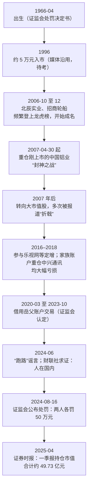
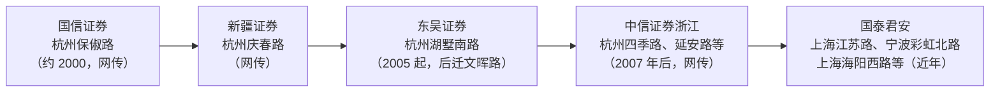

# 章盟主 ①：人物与足迹——从 5 万元到"游资盟主"，哪些是真的

::: summary 一页读懂
1. **他是谁**：网名"章盟主"，本名章建平。证监会 2024 年的处罚决定书写明：男，1966 年 4 月出生，自由职业，住杭州。这是目前**唯一的官方身份信息**。
2. **从不发声**：他从未公开接受采访，也没有公开账号。网上流传的"章盟主语录"**没有可靠出处**（见 [②](/reading/zhang-2-style.html#3-章盟主语录辨伪)）。
3. **成名战**：据财联社梳理，2006 年做北辰实业、招商轮船，2007 年重仓刚上市的中国铝业，"一战封神"。
4. **席位与家族账户**：多个券商营业部被网友标注为他的席位，但**大多无法证实**。妻子方文艳、岳父方德基等家族成员常出现在上市公司十大流通股东名单里。
5. **合规红线**：2020-03 至 2023-10，他借用岳父的证券账户交易。2024 年两人各被证监会顶格罚款 50 万元。
:::

::: note 阅读说明与免责声明
章盟主本人不写文章、不接受采访，所以本系列**没有"他说"，只有"别人怎么报道他"**。来源分三档：① 官方文件（证监会处罚决定书）；② 正规媒体报道（财联社、证券时报、华尔街见闻、央广网等）；③ 自媒体和股吧的流传说法。第 ③ 档统一标"待考"。涉及家族成员的内容，只引用媒体已公开报道的部分。文中个股只是历史记录，不构成推荐。本文不构成任何投资建议。

本系列共 2 篇：① 人物与足迹 · [② 打法、挫折与"语录"辨伪](/reading/zhang-2-style.html)。
:::

## 1. 能确认什么，不能确认什么

华尔街见闻 2023 年的报道开头就说，他"从未公开接受过采访，也从未在网络上亮过相"，业内甚至"没有一张被证实的照片"。所以读他的故事，第一步是把信息分档：

| 信息 | 内容 | 来源档次 |
|---|---|---|
| 本名、性别、出生年月、住址城市 | 章建平，男，1966 年 4 月出生，自由职业，住杭州市拱墅区 | ① 证监会〔2024〕51 号 |
| 家族关系 | 岳父方德基；妻子方文艳；三人为一致行动人（央广网引上市公司增持公告） | ② 媒体引公告 |
| 籍贯 | 杭州临安人（财联社） | ② |
| 1996 年 5 万元入市，1997 年做到约 20 万 | 多家媒体沿用的"公开消息" | ②，原始出处不明，**待考** |
| 2007 年资产近 20 亿元 | 媒体写作"据说" | ②/③，**待考** |
| 学历、早年工作、辞职经历 | 股吧和自媒体流传，版本互相矛盾 | ③，**待考** |
| 某营业部是他的席位 | 多为网友和看盘软件标注 | ③，**大多无法证实** |

::: warn 早年经历版本打架
东方财富股吧一篇流传很广的文章说：他毕业后分配到杭州解放路百货商店，1992 年辞职，回临安做复印机维修。华尔街见闻转述的版本却是"1990 年代末"大学毕业后才分配到解放路百货，这和 1996 年入市的说法对不上。两个版本**都没有一手出处**，本文都不采信，只作为"流传的故事"记录在这里。
:::

## 2. 时间线

*图：根据证监会文件与财联社、华尔街见闻、证券时报报道整理。*

## 3. 成名三战（据财联社）

财联社 2024-06-07 的报道把他的成名经历归纳成三段：

| 时间 | 个股 | 报道中的数据 |
|---|---|---|
| 2006-10 至 12 | 北辰实业 | 上市当天就在东吴证券湖墅南路席位买入；3 个月里席位 14 次登上龙虎榜，累计买入 2.5 亿元、卖出 2 亿元；股价从 2.37 元涨到 8.91 元 |
| 2006-12 | 招商轮船 | 同样快进快出，7 个交易日里席位 10 次上榜，期间连续三天涨停 |
| 2007-04 至 10 | 中国铝业 | 2007-04-30 上市当天介入并站在多方；到 10 月股价涨到 60.6 元，市场统计他"保守估计赚取上亿元" |

::: tip 解读：三战的共同点
三只都是**刚上市、市值不小、正赶上牛市**的股票，而且都发生在 2006–2007 年的大牛市里。==大资金 + 大牛市 + 新上市的权重股==，这是那个年代的特定组合。财联社的概括是"尤好在权重大票主升浪上重仓出击"。这和炒股养家、钙片说的"强势阶段做最强股的主升浪"同属一个大方向，只是他用的资金量大得多（见 [钙片 ①](/reading/gaipian-1-life.html#2-养家为什么点他的名)）。
:::

## 4. 席位：被标注的和被证实的

游资圈习惯通过龙虎榜上的营业部（[[席位]]）来"认人"。网上给他标过的席位，大致按时间是：

*图：按华尔街见闻 2023、财联社 2024、证券时报 2025 的报道整理。*

但要注意三点：

1. 华尔街见闻明确写道：迄今没有任何证据足以证明国君江苏路席位和他有必然关联。报道还说，一些被"谣传"为他的席位，后来又被流传的信息否定了。
2. 证监会处罚决定书只写了岳父的账户开在"国泰君安证券某营业部"，**没有写是哪一家**。
3. 营业部是很多客户共用的通道，一个席位的买卖不一定来自同一个人。

::: warn 别把"席位 = 某人"当成事实
看盘软件上的"顶级游资-章盟主"这类标签，是第三方根据经验贴上去的。跟着标签买卖，等于把别人的猜测当作信号（见 [②](/reading/zhang-2-style.html#5-我们能学什么)）。
:::

## 5. 家族账户与一致行动人

公开报道里常见的是"章盟主家族"。私募排排网 2024 年根据上市公司定增信息整理：章建平与方文艳是夫妻，方德基是方文艳的父亲，方章乐是两人的儿子。华尔街见闻还提到岳母李凤英。央广网引用一份上市公司增持公告说，章建平、方文艳、方德基三人构成[[一致行动人]]，同为信息披露义务人。

这些名字常出现在上市公司的十大流通股东名单里。私募排排网统计，2023 年三季度到 2024 年一季度，"章盟主家族"每季度的持股总市值都在 38 亿元左右。

## 6. 2024 年：谣言与罚单

### 6.1 "跑路"谣言

2024 年 5 月底起，社交平台流传"游资章盟主跑路了"的小作文，还有自称是他妻子的辟谣截图。财联社 2024-06-07 报道：

- 记者多方求证，章建平确实在国内；所谓"妻子发言辟谣"也是假的；
- 另一位知名牛散"股痴流沙河"受他委托发布澄清；
- 有业内人士说，近期确有不少游资被约谈，可能是谣言发酵的根源。

### 6.2 处罚决定书

证监会〔2024〕51 号行政处罚决定书（2024-05-27 作出，同年 8 月 16 日公布）认定：

- 2014-07-15，"方德基"的国泰君安普通账户和信用账户开立；
- 2020-03-01 至 2023-10-27，方德基把上述账户出借给章建平，章建平借用这些账户交易；
- 违反《证券法》第五十八条，按第一百九十五条，对两人各自"责令改正，给予警告，并处以 50万元罚款"。

中新网指出，第一百九十五条规定的罚款上限就是 50 万元，所以这是**顶格处罚**。

::: core 核心提醒
=="借用亲属账户"在新《证券法》下，出借人和借用人都要罚。==哪怕是家人之间，哪怕账户里只是自己的钱。这是任何交易者都该知道的合规底线。
:::

## 7. 自测与行动

自测 1：关于章盟主，唯一的官方身份信息来自哪里？写了什么？

证监会〔2024〕51 号行政处罚决定书：章建平，男，1966 年 4 月出生，自由职业，住杭州市拱墅区。

自测 2：为什么说"国君江苏路 = 章盟主"不能当作事实？

这是看盘软件和网友的标注。华尔街见闻明确说没有证据证明二者必然关联。处罚决定书也只写了"国泰君安证券某营业部"，没有写是哪一家。

自测 3：他因为什么被处罚？罚了多少？

2020-03 至 2023-10 借用岳父方德基的证券账户交易。两人各被责令改正、警告，并罚款 50 万元（顶格）。

读游资故事时的清单：

- [ ] 把信息分成**官方文件 / 正规媒体 / 自媒体流传**三档
- [ ] 看到"据说""网传"的数字，先打问号
- [ ] 不把龙虎榜席位标签当成"某人在买"的事实
- [ ] 记住合规底线：不借用、不出借证券账户

## 来源

- 中国证监会行政处罚决定书（章建平、方德基）〔2024〕51 号：https://www.csrc.gov.cn/csrc/c101928/c7500956/content.shtml
- 央广网 2024-08-17《违规借用他人证券账户 超级牛散章建平被证监会顶格处罚》（一致行动人关系）：https://www.cnr.cn/ziben/yw/20240817/t20240817_526856758.shtml
- 中新网 2024-08-19（第一百九十五条罚款上限）：http://www.chinanews.com.cn/cj/2024/08-19/10270958.shtml
- 财联社 2024-06-07《连续多日网传"知名牛散章建平跑路"，证实来了》（求证在国内；北辰实业、招商轮船、中国铝业；籍贯；常用席位）：https://www.cls.cn/detail/1698415
- 华尔街见闻 2023-04-22《"折翼"的"游资盟主"》（从不受访、席位变迁及"无证据"说明、家族账户、乐视与中兴案例）：https://wallstreetcn.com/articles/3687186
- 私募排排网（腾讯新闻）2024-08-19（家族成员与季度持仓市值）：https://news.qq.com/rain/a/20240819A01AB600
- 证券时报 2025-04-23《近50亿猛怼三只科技"新宠"》：https://www.stcn.com/article/detail/1687796.html
- 东方财富股吧《游资风云从5万到20亿元》（早年经历的流传版本，待考）：https://guba.eastmoney.com/news,gssz,727617002.html
