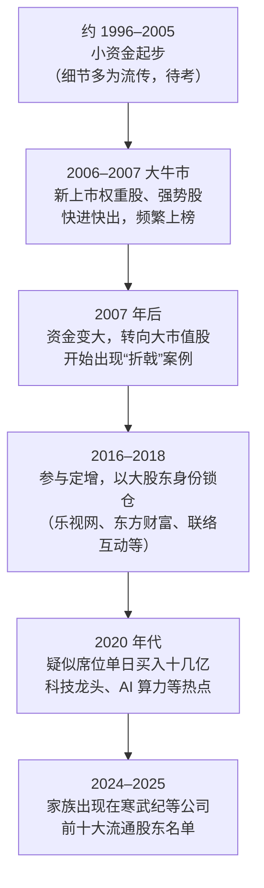
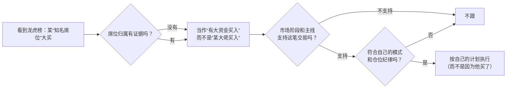

# 章盟主 ②：打法、挫折与"语录"辨伪——从龙虎榜和持仓看一位大资金游资

::: summary 一页读懂
1. **风格是"被归纳"出来的**：他本人没说过自己怎么做。媒体根据龙虎榜和持仓归纳出几条：早期快进快出、偏爱权重大票主升浪、重仓出击、追逐市场热点。
2. **资金越大，打法越变**：从 2006 年前后的新股、强势股短打，到 2016 年后参与定增、以十大流通股东身份持股，再到近年单日买入十几亿元的科技龙头。
3. **挫折一样醒目**：乐视网定增、家族账户重仓中兴通讯、2023 年中科曙光高位买入次日被套……**大资金也会看错，而且错起来代价更大**。
4. **"语录"多半不是他说的**：网上流传的"章盟主经典语录"找不到任何本人出处，内容和其他游资的公开说法高度雷同。
5. **能学的是方法论**：怎样读龙虎榜而不神化席位，大资金为什么会被规模拖住，以及合规底线。
:::

::: note 阅读说明与免责声明
本篇所有关于"打法"的描述，都来自媒体或自媒体对公开交易数据（龙虎榜、上市公司十大流通股东、定增公告）的**归纳**，不是章建平本人的说法。席位归属本身就有不确定性（见 [① 第 4 节](/reading/zhang-1-life.html#4-席位被标注的和被证实的)），所以基于席位的分析一律标"疑似"。自媒体的说法标"待考"。文中个股只是历史记录，不构成推荐。本文不构成任何投资建议。

本系列共 2 篇：[① 人物与足迹](/reading/zhang-1-life.html) · ② 打法、挫折与"语录"辨伪。
:::

## 1. 媒体怎么归纳他的打法

把几家媒体的说法放在一起：

| 特征 | 媒体原话或要点 | 来源 |
|---|---|---|
| 早期快进快出 | 早期手法"以快进快出为主"，常用席位频繁登上龙虎榜 | 证券时报 2025 |
| 权重大票主升浪 | "尤好在权重大票主升浪上重仓出击，风格剽悍" | 财联社 2024 |
| 新股、次新股 | 北辰实业、中国铝业都是上市当天介入；2017 年起也现身多只次新股 | 财联社 2024；东财股吧（待考） |
| 追热点、持股期短 | 家族持仓里"持股超半年的公司很少，偏向于追市场热点" | 私募排排网 2024 |
| 敢于转换打法 | 他"敢于追热点，敢于转换打法" | 华尔街见闻 2023（引"一些渠道信息"） |
| 整板操作、"头雁效应" | 用上亿资金建仓龙头，带动整个板块 | 网易号自媒体 2024，**待考** |

::: tip 解读：一句话概括
如果只用一句话：==在市场主线最强的时候，用大资金重仓最有代表性的大市值股票==。这和 Asking"只干龙头"、钙片"只买龙头，不买龙头的亲戚"是同一个思路（见 [Asking ②](/reading/asking-2-longtou.html#1-什么才是龙头)、[钙片 ②](/reading/gaipian-2-heli.html#6-只买龙头不买龙头的亲戚)）。区别在于资金量：几十亿元的资金只能选成交额足够大的股票，这也解释了他为什么"日益关注大市值股"。
:::

## 2. 打法随资金演变

*图：按华尔街见闻、证券时报、私募排排网、知乎盐选等报道整理。*

几组公开数据（都是媒体统计）：

- **定增**：2016 年 8 月，他出资 11.2 亿元认购乐视网定增，共 2488.34 万股，锁定到 2017 年 8 月（华尔街见闻）。另有一本知乎盐选读物统计，他参与乐视网、东方财富、联络互动三次[[定增]]，合计 28.8 亿元（**待考**）。
- **大单**：2021-07-22，疑似席位单日买入三安光电 13.42 亿元；2023-04-20 前后，疑似席位三日买入中科曙光 20.83 亿元；2023-06-01，疑似席位买入科大讯飞超 12 亿元（华尔街见闻、私募排排网）。
- **持仓**：证券时报 2025 年报道，截至 2025-04-22，章建平出现在 3 家公司的一季报[[十大流通股东]]中，期末参考市值合计约 49.73 亿元。其中寒武纪持股从 2024 年年报的 533.88 万股增加到 608.63 万股。

## 3. 章盟主"语录"辨伪

网上流传着不少"章盟主经典语录"，私募排排网 2024 年的文章也"根据网络资料"整理了 9 条。但：

- 华尔街见闻：他"从未公开接受过采访"；
- 网易号一篇讲他操作特色的文章直说：坊间传闻的所谓"章盟主语录"，"也并没有太确切的来源"；
- 我们也没有找到任何本人渠道（采访、公开账号、论坛 ID）能对上这些话。

所以本文**不把它们当作章盟主的话**，只列出流传版本的主题，并指出哪些前辈有内容相近、又有出处的说法：

| 流传"语录"的主题 | 能否找到本人出处 | 有出处的相近说法 |
|---|---|---|
| 赚赔都要平常心，盈亏皆属正常 | 否 | 炒股养家"情绪是情绪，操作是操作"（见 [养家 ⑤](/reading/yangjia-5-position.html#第-10-章-心态与信念情绪是情绪操作是操作)） |
| 只做主流板块的龙头 | 否 | Asking、钙片、职业炒手（见 [职业炒手 ③](/reading/zhiye-3-mode.html#2-自上而下的三层筛选)） |
| 下降通道里赚钱是偶然、亏钱是必然 | 否 | 职业炒手"弱市不做"（见 [职业炒手 ②](/reading/zhiye-2-core.html#1-第一原则弱市不做)） |
| 不会空仓的人不会战斗 | 否 | 职业炒手的空仓哲学（同上） |
| 不会止损，亏损无穷无尽 | 否 | 钙片"整体性止损"（见 [钙片 ③](/reading/gaipian-3-discipline.html#2-整体性止损)） |
| 盲目冲动、频繁交易是亏损主因 | 否 | 巴菲特"不作为是明智的"（见 [巴菲特 ④](/reading/buffett-4-competence.html#4-不作为也是智慧)） |

::: warn 为什么要较这个真
把别人的话安到名人头上，会造成两种误解：一是以为"学会这几句话就能像他一样赚钱"；二是忽略了他真实的风格（重仓权重股、做定增、大额单笔），以及这种风格的代价。==引用一句话之前，先问出处在哪。==
:::

## 4. 挫折清单

| 时间 | 事件 | 报道中的结果 | 来源 |
|---|---|---|---|
| 2007 年前后 | 中信证券 | "大赚又亏损"，细节未披露 | 华尔街见闻 |
| 2016–2018 | 乐视网定增 | 2018 年 1 月复牌后连续 12 个跌停，打开时筹码市值缩水约 80% | 华尔街见闻 |
| 2017 末–2018 | 中兴通讯（岳父、岳母账户合计 6802.49 万股） | 2018 年二季度遭遇连续跌停，持股市值损失近 10 亿元 | 华尔街见闻 |
| 2017-04 | 冀东水泥 | 2.5 亿元买入，巨亏出局 | 东财股吧，**待考** |
| 2021-07 | 三安光电（疑似席位） | 高位买入后股价大幅下滑 | 华尔街见闻 |
| 2023-04 | 中科曙光（疑似席位） | 涨停日大额买入，次日全天在前日收盘价下方成交，"暂时套牢" | 华尔街见闻 |

::: quote 对照：巴菲特说"规模是业绩的锚"
巴菲特 1984 年在哥伦比亚大学的演讲里说："Size is the anchor of performance."（规模是业绩的锚。）资金大了，仍然可以跑赢平均，但优势会缩小（见 [巴菲特 ④](/reading/buffett-4-competence.html#5-规模是业绩的锚)）。
章盟主的轨迹是游资版的注脚：资金到了几十亿，能做的股票变少，进出时对价格的冲击变大，判断错误的代价也成倍放大。
:::

## 5. 我们能学什么

1. **读龙虎榜，不神化席位**：一个营业部的买入，可能来自很多客户。席位标签是猜测，买入金额也只是当天的快照，你看到时往往已经晚了一步。
2. **跟踪大资金的局限**：大资金也会在高位买、也会被套。他的赢面来自整体的仓位管理和对市场阶段的判断，不是每一笔都对。照抄单笔交易，学不到这些。
3. **风格要和资金匹配**：小资金适合的打法（打板、快进快出），资金大了会失效。反过来，大资金的打法（定增、重仓权重股）也不适合小资金照搬。
4. **合规是底线**：借用亲属账户在法律上明确禁止，被查到就是顶格罚款（见 [① 第 6 节](/reading/zhang-1-life.html#6-2024-年谣言与罚单)）。

*图：读龙虎榜的一个检查流程（本文整理）。*

## 6. 自测与行动

自测 1：媒体对章盟主风格最常见的概括是什么？

早期快进快出；偏爱在权重大票的主升浪上重仓出击；追逐市场热点、持股期短。资金变大后，也参与定增、以大股东身份持股。

自测 2：为什么本文不引用"章盟主语录"？

他从未公开受访，网上的语录找不到任何本人出处，连整理他事迹的自媒体也承认这些语录"并没有太确切的来源"。

自测 3：乐视网定增给他带来了什么结果？

据华尔街见闻：2016 年出资 11.2 亿元认购。2018 年 1 月复牌后连续 12 个跌停，打开时筹码市值缩水约 80%。

自测 4：巴菲特那句"规模是业绩的锚"怎么解释他的挫折？

资金越大，可选的股票越少，进出冲击越大，判断失误的代价越高，所以超额收益会缩小，错误也更显眼。

读龙虎榜清单：

- [ ] 记下"知名席位"大买时，同时记下**当天的市场阶段**和主线
- [ ] 3 天、10 天后回看这些大买的结果，统计胜率，不要只记住成功的
- [ ] 遇到"某大佬语录"，先查出处，查不到就当作无名氏的话
- [ ] 不借用、不出借证券账户

## 来源

- 证券时报 2025-04-23《近50亿猛怼三只科技"新宠"，顶级游资章盟主近期大手笔出击》（早期快进快出、定增亏损、中兴、2025 持仓与席位成交额）：https://www.stcn.com/article/detail/1687796.html
- 财联社 2024-06-07（"尤好在权重大票主升浪上重仓出击"）：https://www.cls.cn/detail/1698415
- 华尔街见闻 2023-04-22《"折翼"的"游资盟主"》（转换打法、乐视定增、中兴、三安光电、中科曙光、"规模"与折戟）：https://wallstreetcn.com/articles/3687186
- 私募排排网（腾讯新闻）2024-08-19（家族持仓"偏向于追市场热点"；中科曙光、科大讯飞大单；流传"语录"9 条）：https://news.qq.com/rain/a/20240819A01AB600
- 网易号·股市悟道 2024-02《章建平：从5万到100亿，三大操盘特色》（"语录"无确切来源；整板操作说法，待考）：https://www.163.com/dy/article/IRN1TQ1U0539O37W.html
- 知乎盐选《游资投资方法与案例详解》（三次定增合计 28.8 亿元，付费内容，待考）：https://www.zhihu.com/market/pub/119959972/manuscript/1283988879519932416
- 东方财富股吧《游资风云从5万到20亿元》（冀东水泥等，待考）：https://guba.eastmoney.com/news,gssz,727617002.html
- Columbia Business School, Warren Buffett, *The Superinvestors of Graham-and-Doddsville*（"Size is the anchor of performance"）：https://business.columbia.edu/insights/chazen-global-insights/superinvestors-graham-and-doddsville
