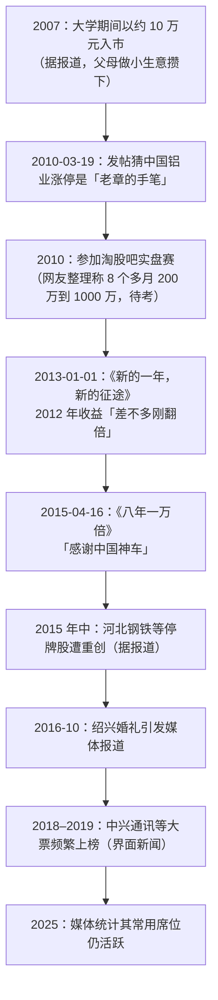

# 赵老哥 ①：人物与足迹——“八年一万倍”的原帖、席位与争议

::: summary 一页读懂
1. **他是谁**：多家媒体报道，赵老哥本名赵强，1987 年生，浙江绍兴人，毕业于杭州一所财经大学。2007 年用父母给的 10 万元入市。
2. **一句话成名**：2015 年 4 月 16 日，他在淘股吧发帖《八年一万倍》，正文只有一句：“今天是值得纪念的一天，资金终于上了一个大台阶，感谢中国神车！！！”
3. **本人文字极少**：他的淘股吧博客只有寥寥几个主题帖，多数是生活感慨。网上流传的“赵老哥语录”大多是二手整理（见 [②](/reading/zhao-2-style.html#5-语录辨伪那份十一条)）。
4. **席位**：媒体普遍认为中国银河证券绍兴营业部是他最核心的席位，但这属于市场推断，本人从未确认。
5. **不是常胜**：2015 年他也在河北钢铁、新能泰山等停牌股上“遭重创”（都市快报，2016）。“一万倍”背后还有融资杠杆。
:::

::: note 阅读说明与免责声明
本篇只采用三类材料：① 赵老哥淘股吧博客里的原帖（标注发帖日期）；② 主流媒体报道（中国证券报/人民网、都市快报/新浪、界面新闻）；③ 论坛整理稿（单独标注“二手”）。资金数字大多来自“熟悉他的人士”转述，本文一律标为“据报道”，本人从未公开交割单全貌。文中个股只是历史记录，不构成推荐。本文不构成任何投资建议。

本系列共 2 篇：① 人物与足迹 · [② 打板、模式与语录辨伪](/reading/zhao-2-style.html)。
:::

## 1. 能确认什么，不能确认什么

| 信息 | 可信度 | 依据 |
|---|---|---|
| 淘股吧 ID“赵老哥”，2015-04-16 发《八年一万倍》 | ==高== | 原帖仍在其博客，浏览量近 200 万 |
| 本名赵强、1987 年生、绍兴人 | 较高 | 中国证券报（2016-08）、都市快报（2016-10）均有报道；后者称他曾要求论坛删除婚礼照片，“基本可以断定”是本人 |
| 2007 年 10 万元入市，2015 年到“10 亿元级别” | 中 | 媒体均引自“熟悉赵老哥的人士”，另有传言称 20 亿以上，==待考== |
| 核心席位：银河证券绍兴营业部 | 中 | 媒体和龙虎榜数据商的推断，本人未确认 |
| 早期资金曲线（2009 年近 200 万、2010 年近千万、2011 年 1500 万） | 低 | 只见于论坛整理帖，各版本说法不一，==待考== |

::: warn 关于“八年一万倍”
都市快报援引营业部人士的话说，知名游资“基本都会有融资操作”，券商还可能给更高的融资比例。换句话说，==“一万倍”很大程度上是加了杠杆的结果==，也是牛市加上幸存者偏差的产物。把它当作可复制的路径，是最危险的读法。
:::

## 2. 时间线

*图：本文依据原帖日期和媒体报道整理，“待考”项未经证实。*

## 3. 他自己写过什么：博客里的几个帖子

赵老哥在淘股吧的公开主题帖很少。下面是他博客里能直接看到的几篇（引文为原帖正文，未登录时部分帖子只显示开头）：

| 日期 | 标题 | 原帖要点 |
|---|---|---|
| 2010-03-19 | 中国铝业不会又是老章的手笔吧？？？ | “第一次封涨停时的那连续的一万手大单最近也就他能做得出”。这里的“老章”就是[章盟主](/reading/zhang-1-life.html#4-席位被标注的和被证实的) |
| 2010-04-28 | （标题较粗俗，略） | 情绪化的盘中吐槽 |
| 2011-12-14 | 忙了几年终于开始休息了，折磨的行情 | “突然发觉自己除了股票外有兴趣的不多了”“唯有心老了” |
| 2013-01-01 | 新的一年，新的征途 | “2012年收益差不多刚翻倍……去年给我最大的收获就是==牛股要学会做波段敢拿敢做T==。还有就是==切忌别做自己模式外的操作，因为这个去年损失不少==。” |
| 2013-05-12 | 股票和女人 | “真心觉得女人比股票复杂多了” |
| 2015-02-06 | 请网友们注意素质，积点口德吧！！！ | “==做板本来就是高风险手法，现在世道更是极端==，大家注意风险的同时请文明炒股！！！” |
| 2015-04-16 | 八年一万倍 | “今天是值得纪念的一天，资金终于上了一个大台阶，感谢中国神车！！！” |

::: tip 从原帖能读出什么
- **一个打板手**：他自己说“做板本来就是高风险手法”，从不美化打板。
- **模式纪律是用钱买来的**：“别做模式外的操作”不是格言，而是 2012 年亏钱之后的总结。中国证券报引用时写作“切记别做自己模式外的操作，因为去年因为这个损失不少”，与原帖略有出入，以原帖为准。
- **很少讲方法**：这是整理稿里“语录”多到可疑的原因之一。
:::

## 4. 中国中车与“赵一万”

都市快报（2016-10-11）的说法是：2015 年 4 月初，他“通过放大资金杠杆”大手笔建仓中国中车（时名中国南车），两周盈利“高达 5 亿元以上”，期间该股拉出 7 个涨停。此役之后，他有了“赵一万”的外号。

中国证券报（2016-08-22）补充了一个细节：后来被证监会处罚的游资孙国栋（“孙哥”），“曾在‘赵老哥’所发帖《八年一万倍》下留言祝贺，从而证实了其真实性”。

::: warn 同一只股票的另一面
一份网友整理稿记录，2015 年 6 月有股民自称以 170 万本金加融资四倍全仓中国中车，最终输掉一切并轻生。这件事本文未能找到主流媒体的原始报道，==待考==。但它提醒我们：同一段行情里，杠杆让少数人成为传奇，也让更多人倾家荡产。
:::

## 5. 席位与杠杆

界面新闻（2019-03-03）引用数据商“短线王”的资料，列出赵老哥常用的 7 个营业部，包括浙商证券绍兴分公司、中国银河证券绍兴、华泰证券浙江分公司等。按其统计，2014 年以来银河绍兴上榜金额 1146.41 亿元，“是赵老哥最为核心的席位”。

但要注意三点：

1. 席位归属是**市场推断**，不是监管或本人披露。同一营业部里可能有很多大户。
2. 上榜金额包括买和卖，不等于他的资金规模。
3. 媒体还提到他会“更换营业部”，所以按席位跟踪本身就有误差。

## 6. 挫折与争议

- **2015 年停牌股**：都市快报称，他 2015 年在河北钢铁、新能泰山、新兴铸管、国投电力四只股票上“遭重创”，“好在严格的止损避免了进一步损失”。中国证券报则把河北钢铁等的大额亏损记在孙国栋名下。两篇报道对谁亏了多少说法不同，本文不下结论，==待考==。
- **网友攻击**：2015 年 2 月他发帖抱怨“好多攻击我的帖子和发言”。打板会砸到跟风盘，这是游资和散户之间长期的紧张关系。
- **公开形象**：除了《八年一万倍》，他几乎不回应外界。2016 年婚礼照片流出后，据报道他要求论坛删帖。
- **合规**：截至本文整理时，本文没有查到证监会对赵强本人的公开处罚记录。证监会处罚过的“赵姓”当事人与他无关，不要混淆。

::: core 一句话
==赵老哥最可靠的“心法”只有两句原话：牛股要敢拿敢做 T；别做自己模式外的操作。==其余大多是别人替他总结的。
:::

## 7. 自测与行动

自测 1：《八年一万倍》原帖写了什么？

只有一句话：“今天是值得纪念的一天，资金终于上了一个大台阶，感谢中国神车！！！”没有方法，也没有交割单。

自测 2：“别做自己模式外的操作”出自哪里？

出自 2013-01-01 的《新的一年，新的征途》，是他对 2012 年亏损的总结，原文是“切忌别做自己模式外的操作，因为这个去年损失不少”。

自测 3：为什么不能把“一万倍”当成可复制的路径？

一是有融资杠杆（据报道）；二是赶上了 2014–2015 年的牛市；三是幸存者偏差，同样打板加杠杆的人里，大多数没有留下名字。

读完这一篇，可以做的事：

- [ ] 写下自己的“模式内”清单：我只做哪几种买点
- [ ] 回看最近 10 笔亏损，标出哪些属于模式外操作
- [ ] 遇到“某某语录”，先问一句：原帖在哪里？
- [ ] 不加杠杆。如果已经加了，算一算连续 5 次失败后的回撤

## 来源

- 赵老哥淘股吧博客（帖子列表与发帖日期）：https://www.tgb.cn/blog/154034
- 《八年一万倍》原帖（2015-04-16）：https://www.tgb.cn/a/1ykzxrp9Knp
- 《新的一年，新的征途》（2013-01-01）：https://www.tgb.cn/a/1ykxeRXwXKx
- 《请网友们注意素质，积点口德吧！！！》（2015-02-06）：https://www.tgb.cn/a/1ykzmOFhE2C
- 《忙了几年终于开始休息了，折磨的行情》（2011-12-14）：https://www.tgb.cn/a/1ykwqzoXcCH
- 《中国铝业不会又是老章的手笔吧？？？》（2010-03-19）：https://www.tgb.cn/a/1ykv36e9sfg
- 中国证券报（人民网转载），《八年一万倍 三个火枪手：新生代敢死队浮出水面》，2016-08-22：http://money.people.com.cn/stock/n1/2016/0822/c67815-28654140.html
- 都市快报（新浪转载），《绍兴股神赵老哥八年赚10亿 曾叹女友比好股难找》，2016-10-11：http://finance.sina.com.cn/money/cfgs/2016-10-11/doc-ifxwrhpn9635722.shtml
- 界面新闻，《【深度】八年10000倍，游资大佬赵老哥是如何操盘的？》，2019-03-03：https://www.jiemian.com/article/2865306.html
- 私募排排网（腾讯新闻），《陈小群、章盟主、赵老哥、呼家楼等9大游资最新动向曝光！》，2025-02-10（银河绍兴席位近况）：https://news.qq.com/rain/a/20250210A04FY300
- 二手整理（早期资金曲线等，可信度低）：淘股吧“淘县名人堂·赵老哥” https://m.taoguba.com.cn/Article/4014199/1 ；钓手江十七《淘股吧顶级游资的思考·赵老哥》 https://m.tgb.cn/a/2usJJ1beA2N
