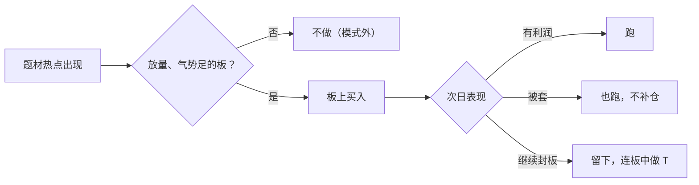

# 赵老哥 ②：打板、模式与语录辨伪——“别做自己模式外的操作”

::: summary 一页读懂
1. **可溯源的原话只有几句**：“牛股要学会做波段敢拿敢做T”“切忌别做自己模式外的操作”“做板本来就是高风险手法”。都出自他的淘股吧原帖。
2. **媒体归纳的打法**：以板上买入为主，“出手就是全仓”，次日“有利就跑，被套也跑，只有连续封板的留下”（中国证券报转述熟悉其手法的投资者）。
3. **大资金之后**：界面新闻 2019 年的案例显示，他常在中兴通讯、京东方 A 这类“大块头”上出手，也做龙头调整后的第二波。原因之一是资金容量。
4. **语录辨伪**：流传最广的“二板定龙头……只做龙头，只做主升，只做惯性”十一条，在他的博客里找不到原文，==出处待考==。
5. **能学的**：模式内交易、错了就走、对大资金容量的清醒认识。不能学的：全仓加杠杆的打法。
:::

::: note 阅读说明与免责声明
本篇把材料分成三档：A 档为赵老哥淘股吧原帖；B 档为主流媒体对其打法的归纳（多为匿名“熟悉其手法的人士”或分析师转述，属于第三方解读）；C 档为论坛流传的“语录”，单独辨伪。打板属于高风险手法，赵老哥本人也这样说。文中个股只是历史记录，不构成推荐。本文不构成任何投资建议。

本系列共 2 篇：[① 人物与足迹](/reading/zhao-1-life.html) · ② 打板、模式与语录辨伪。
:::

## 1. 本人说过的话（可溯源）

::: quote A 档：原帖
- “去年给我最大的收获就是==牛股要学会做波段敢拿敢做T==。还有就是==切忌别做自己模式外的操作，因为这个去年损失不少==。”（2013-01-01，《新的一年，新的征途》）
- “==做板本来就是高风险手法==，现在世道更是极端，大家注意风险的同时请文明炒股！！！”（2015-02-06）
- “今天中国铝业估计又是老章的手笔 第一次封涨停时的那连续的一万手大单最近也就他能做得出”（2010-03-19）
:::

还有一批带日期的发言，出自闽发论坛 2018 年的整理稿，例如：

- “最近做板没啥收益，点火倒是挺爽 天天追高亏钱 该在电脑前贴个纸条 手痒剁手”（标注 2011-06-13）
- “千万别看了只字片语就模仿开板买风险太大了”
- “我们这行一将功成万骨枯，不想因为我的事例带更多盲目的追随者，我毕竟是个特例”

这些话语气和他的原帖一致，但原始回帖本文**未能直接核对**（淘股吧回帖需登录），只能算 ==B- 档==。

::: core 读原话的收获
三句原话里，有两句在讲**风险**和**边界**：打板是高风险手法，不要做模式外的事。还有一句（“一将功成万骨枯”，B- 档）在劝人别盲目模仿他。==真正的赵老哥，比“语录”里那个喊着“热点就是印钞机”的形象谨慎得多。==
:::

## 2. 媒体与网友归纳的打法

中国证券报（2016-08-22）引用了两位“熟悉赵强手法的投资者”的复盘（B 档，第三方解读）：

| 维度 | 归纳 |
|---|---|
| 买点 | “基本都是板上买，都是买一板的比较多” |
| 仓位 | “出手就是全仓，大多数时间都在市场参与，只有大盘极端恶劣的情况下休息”，“大多数是买3-4只股票” |
| 卖点 | “第二天有利就跑，被套也跑，只有连续封板的留下” |
| 风格 | “讲究K线和分时的气势”，“很少模式外的操作，如低吸，波段都没有” |
| 盈利结构 | “二成个股贡献八成利润，八成个股小亏小赢” |
| 连板 | 另一位投资者称他三连板后第四天高开“继续加仓”，在第五、六个涨停时清仓，并总结“有三必有五，有五必有七” |

::: warn “有三必有五”不是规律
“有三必有五”是这位投资者对牛市强势股的经验总结，不是赵老哥原话，也不是统计规律。中国证券报原文就写明“这是许多强势飙涨股在牛市行情的一种强势特征”。==换到弱市，三连板之后直接大面的情况比比皆是。==
:::

*图：依据中国证券报转述的“熟悉其手法的投资者”的归纳绘制，属于第三方解读，不是赵老哥本人的系统说明。*

## 3. 案例：中兴通讯、亚夏汽车、华能水电（界面新闻 2019）

界面新闻（2019-03-03）用“短线王”的席位数据复盘了几笔交易。以下均为媒体依据席位推断，属于 B 档：

| 类型 | 案例 | 席位动作（据报道） |
|---|---|---|
| 超跌大票首板 | 中兴通讯，2018-07-03 | 连续 8 个跌停后，银河绍兴主封，买入 9236.75 万元，次日冲高回落收涨 2.6% |
| 龙头调整后的第二波 | 亚夏汽车，2018-06 | 9 连板后小幅调整，6 月 7 日入场，之后连板中“不断做T锁定收益”，6 月 28 日跌停时净卖出 3797.07 万元 |
| 根部第二波 | 华能水电，2018-01-16 | 次新股回调约 25% 后买入 4995.08 万元助其涨停，次日收涨 2.61% |
| 失手 | 中国软件，2018-04-25 | 买入 4155.42 万元助其涨停，次日收跌 9.84%，5 月 4 日跌停时卖出 3307.93 万元 |

分析人士王伟的评价是：“虽然偏爱短线炒作，但是一直比较稳健。”同一篇文章也提到，他“更多时候是稳步拉升”，而不是“盘中直线拉升吸引人气”。

## 4. 大资金之后：为什么偏爱“大块头”

界面新闻给出两个解释：

1. **监管**：游资被处罚的案例增多，生态在变，“搞小票之外，也会尝试引领大票的趋势”。
2. **容量**：资金到了 10 亿元级别，只做中小市值就只能长期低仓位，或者同时做很多只股票。

这和[章盟主](/reading/zhang-2-style.html#2-打法随资金演变)的轨迹几乎一样，也和巴菲特说的“[规模是业绩的锚](/reading/buffett-4-competence.html#5-规模是业绩的锚)”是同一个道理：==资金越大，能用的方法越少，超额收益越难。==

## 5. 语录辨伪：那份“十一条”

网上流传最广的“赵老哥炒股心法”大致是这样的条目（节选）：

> 二板定龙头，一板能看出来个毛……短期交易，不讲价值，不讲技术，只讲故事……只做龙头，只做主升，只做惯性。不做反抽，不做波动……跟风股，不看、不买、不研究……

本文对照了他的博客，结论如下：

| 条目 | 判断 | 理由 |
|---|---|---|
| “牛股要学会做波段敢拿敢做T”“别做自己模式外的操作” | ==可信== | 原帖原文（2013-01-01） |
| “弱市不做最强的就是来扔钱的”“小资金做大的最好方式还是做板”“开了以后买……砸开以后封回的板” | 较可信，待核 | 见于 2018 年闽发论坛整理稿，口语化、带上下文，与原帖风格一致，但原始回帖未能核对 |
| “二板定龙头……”十一条 | ==待考== | 博客里找不到原文；书面化、排比句式，与他口语化的原帖风格差别很大；不同整理稿措辞不一，有的还夹带后来的行情注释 |
| “我只跟随不预测” | 待考 | 只见于整理稿，且与 Asking 的“我只跟市场走，不预测”混排在一起 |

::: tip 辨伪的通用方法
1. 先找原帖：ID 主页 → 帖子列表 → 发帖日期。
2. 看文风：口语、错别字、语气词，通常比排比句更像本人。
3. 看是否混入别人的话：整理稿常把职业炒手、Asking 的话和他的放在一起（参见 [Asking ④ 流传语录](/reading/asking-4-mind.html#5-流传语录待考)）。
4. 带具体日期和个股的，比“十大心法”可信。
:::

## 6. 我们能学什么

- **模式内交易**：先写清楚自己只做哪几种板，模式外的机会一律放过。
- **错了就走**：媒体归纳的“被套也跑”，和钙片“[只买龙头不买龙头的亲戚](/reading/gaipian-2-heli.html#6-只买龙头不买龙头的亲戚)”、职业炒手“[弱市不做](/reading/zhiye-2-core.html#1-第一原则弱市不做)”一样，都是先保命。
- **认清容量**：资金变大后，方法要跟着变。
- **不该学的**：全仓、加杠杆、追求“一万倍”。他本人说过“我毕竟是个特例”（B- 档）。

## 7. 自测与行动

自测 1：哪几句话可以确定是赵老哥的原话？

“牛股要学会做波段敢拿敢做T”“切忌别做自己模式外的操作，因为这个去年损失不少”（2013-01-01）；“做板本来就是高风险手法”（2015-02-06）；以及《八年一万倍》的那一句。

自测 2：“有三必有五”是谁说的？靠得住吗？

是中国证券报转述的一位熟悉其手法的投资者的总结，不是赵老哥原话。它只是牛市强势股的经验特征，弱市里不成立。

自测 3：为什么那份“十一条”标为待考？

博客里找不到原文；文风书面化，与他的原帖差异大；各版本措辞不一，还夹带后人的行情注释。

把赵老哥的经验转成自己的规则：

- [ ] 写下“模式内”的 3 种买点，其他一律不做
- [ ] 规定次日的处理规则：有利润怎么走、被套怎么走
- [ ] 统计自己的盈利结构：前 20% 的交易贡献了多少利润
- [ ] 引用任何“游资语录”前，先找到原帖链接

## 来源

- 赵老哥淘股吧博客：https://www.tgb.cn/blog/154034
- 《新的一年，新的征途》（2013-01-01）：https://www.tgb.cn/a/1ykxeRXwXKx
- 《请网友们注意素质，积点口德吧！！！》（2015-02-06）：https://www.tgb.cn/a/1ykzmOFhE2C
- 《中国铝业不会又是老章的手笔吧？？？》（2010-03-19）：https://www.tgb.cn/a/1ykv36e9sfg
- 中国证券报（人民网转载），《八年一万倍 三个火枪手：新生代敢死队浮出水面》，2016-08-22：http://money.people.com.cn/stock/n1/2016/0822/c67815-28654140.html
- 界面新闻，《【深度】八年10000倍，游资大佬赵老哥是如何操盘的？》，2019-03-03：https://www.jiemian.com/article/2865306.html
- 闽发论坛，《赵老哥股市心法（凝炼详解版）》，2018-12-03（二手整理，B- 档）：https://www.xiarj.com/880.html
- 流传“十一条”的整理稿示例（C 档，待考）：https://m.tgb.cn/a/2usJJ1beA2N ；https://m.tgb.cn/a/2hizlDAPge5
