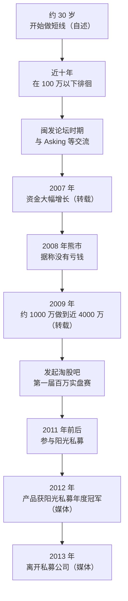

# 职业炒手 ①：人物与经历——"校长"的十年百万与两年四千万

::: summary 一页读懂
1. **他是谁**：淘股吧 ID "职业炒手"，江湖人称"校长"，被视为成都帮的代表人物；多方转载称其本名王涛。
2. **慢的十年**：自述"我在100万以下徘徊了10年"——从 10 万到 100 万用了近十年。
3. **快的两年**：跨过 100 万后，熊市不亏、牛市翻倍，约两年冲上 4000 万以上（转载说法）。
4. **布道者**：早年活跃于闽发论坛，后发起淘股吧第一届百万实盘赛，留下大量帖子。
5. **私募与隐退**：媒体报道，王涛管理的产品获 2012 年阳光私募冠军，2013 年离开该私募公司。
:::

::: note 阅读说明与免责声明
本文根据论坛帖子转载与媒体报道整理，用自己的话复述，只引用简短原话。**媒体报道里的"王涛"并未提及"职业炒手"这一网名**，二者为同一人是论坛与自媒体的普遍说法，本文标为"多方转载认为，待考"。出生年份、早年履历、资金数字等多来自转述，凡标"待考"的请谨慎看待。本文不构成任何投资建议。
:::

## 1. "校长"是谁

在淘股吧的"名人堂"里，职业炒手是绕不开的名字：

- 网友称他"校长"，因为很多后来成名的短线选手都读过他的帖子、参加过他发起的比赛；
- 他被视为**成都帮**的祖师级人物；
- 打法上以==打首板==、做主流热点龙头著称，更以"弱市不做""空仓"的风控哲学闻名。

炒股养家说："技巧性的东西，asking 和炒手基本都说了"——这里的"炒手"就是他。

## 2. 时间线

*图：论坛转载与媒体报道综合整理；"转载"标注的数字未经核实。*

### 2.1 慢的十年

他在帖子里说：

> 我从30 岁才开始做短线

又说自己"在100万以下徘徊了10年"。他认为==百万以下是最艰难的阶段==，关键是做出"第一个 10 倍"（见本系列第 4 篇）。

::: tip 解读：为什么慢的十年重要
十年里资金没怎么长，但他在打磨方法、学会空仓。一旦方法成熟，复利会在很短时间里爆发——这也是他反复强调"弱市不亏钱，这才是复利增长的关键"的原因。
:::

### 2.2 快的两年

据东方财富财富号的一篇整理文章（转述，**待考**）：

- 2007 年年初他花钱买了一辆车后，账户只剩约 100 万，到年底做到约 700 万；
- 2008 年大熊市里没有亏钱；
- 2009 年从约 1000 万做到近 4000 万。

另有说法称他在 2015 年的行情里资金又翻了十几倍——**这一条属于传闻**，本文不作采信。

::: warn 数字只是故事
这些数字都来自转述，无法核实；更重要的是，它们发生在特定的市场年代。我们要学的是"熊市不亏"背后的空仓纪律，而不是去追求某个收益数字。
:::

## 3. 实盘赛与论坛

职业炒手是淘股吧**第一届百万实盘赛**的发起人（网友称"职业炒手杯"）。用真实账户公开交易、接受所有人检验，这种形式后来成为淘股吧的传统，也让很多新人第一次看到"高手到底是怎么交易的"。

他在论坛上的帖子覆盖面很广：大盘判断、主流热点、打板、空仓、回撤控制、学习路径……这些构成了本系列后面三篇的主要素材。

## 4. 阳光私募的一段经历

媒体报道里能查到的是"王涛"这个名字：

- 央广网 2012 年报道称，王涛 1995 年起在农业银行从事国债交易，1998 年正式进入 A 股；其管理的产品以高频交易风格著称。（这与论坛自述的履历并不完全一致，**待考**。）
- 新浪财经 2012 年底报道，银帆系产品在 2012 年私募排名中名列前茅。
- 证券时报 2013-10-21 报道：王涛管理的银帆三期 2012 年收益 48.42%，获私募冠军，超越沪深 300 约 40 个百分点；之后他离开银帆投资，退出所持 20% 股权，原因是：

> 做阳光私募，付出和收获不成正比

（不同媒体统计口径不同，2012 年收益数字有 47.92%、48.42% 等版本。）

::: core 一个耐人寻味的选择
拿下冠军后反而离开私募，回到自己管理资金的状态。这和他"大资金要学慢"的说法相呼应：规模和约束变了，打法和收益结构都会变。
:::

## 5. 他和 Asking

两人是论坛时代的好友。Asking 说过"我和职业炒手兄所找的才是龙头"；职业炒手则回忆"当年asking到成都反复跟我强调两个字，跟随"。两人的语录里有不少相似的话（如"弱市不做"），常被网友混在一起收录，读的时候需要留意出处。

## 6. 自测与行动

自测 1：职业炒手在多少资金以下"徘徊了 10 年"？

100 万。他认为百万以下最艰难，关键是做出第一个 10 倍。

自测 2：媒体报道中，王涛离开私募的原因是怎么说的？

"做阳光私募，付出和收获不成正比"（证券时报 2013-10-21）。

自测 3：为什么本文把"职业炒手 = 银帆王涛"标为待考？

媒体报道只写本名王涛，没有提网名；二者是同一人来自论坛和自媒体的普遍说法，缺少一手确认。

读人物故事时的提醒：

- [ ] 区分**论坛自述、网友转述、媒体报道**三种来源
- [ ] 记住"十年百万"的慢，而不只是"两年四千万"的快
- [ ] 把注意力放在"熊市不亏"的方法上

## 来源

- 皆妙笔转载"淘县名人堂"2023-09-02（本名、校长、成都帮、十年百万与两年四千万、实盘赛、闽发论坛、"我在100万以下徘徊了10年"、"当年asking到成都……"）：https://www.jiemiaobi.com/archives/23641
- 东方财富财富号·谈股论鑫 2024-10-07（出生地与年份、2007–2009 年资金变化、"我从30 岁才开始做短线"，转述待考）：https://caifuhao.eastmoney.com/news/20241007101924387995640
- 证券时报 2013-10-21（银帆三期 48.42%、离开银帆、"做阳光私募，付出和收获不成正比"）：http://epaper.stcn.com/paper/zqsb/html/2013-10/21/content_510920.htm ；新浪转载：http://finance.sina.com.cn/money/smjj/20131021/034017051202.shtml
- 新浪财经 2012-12-24 私募排名报道：http://finance.sina.com.cn/money/smjj/20121224/050814090932.shtml
- 央广网 2012-11-10（王涛履历）：http://sc.cnr.cn/2012scfw/jingji/chanjing/201211/t20121110_511327948.shtml
- 东方财富股吧·库迪研究院（Asking"我和职业炒手兄……"）：https://guba.eastmoney.com/news,gssz,746795238.html
