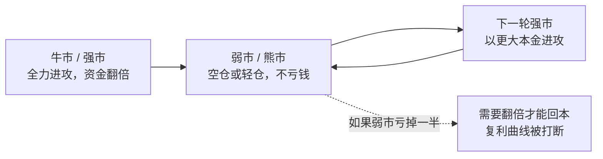
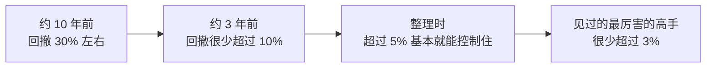
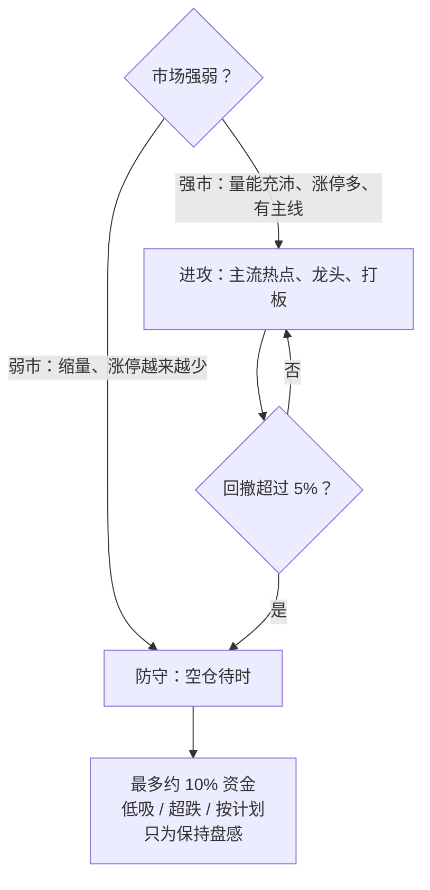

# 职业炒手 ②：核心心法——弱市不做，空仓是最重要的技术

::: summary 一页读懂
1. **第一原则**：他把"弱市不做"称为短线炒手第一原则。
2. **空仓胜过一切进攻**：所有进攻模式，都不如"空仓待时"这一最简单的防守战术重要。
3. **复利的关键**："弱市不亏钱，这才是复利增长的关键。而且是关键中的关键。"
4. **回撤红线**：每一次资金回调不能超过最高点的 5%；他的回撤从约 30% 一路压到 10%、5%。
5. **弱市不等于完全离场**：明知要创新低，也可拿约 10% 资金保持盘感；但战术要切换。
:::

::: note 阅读说明与免责声明
本文整理职业炒手关于空仓与风控的论坛原话（简短引用，出处见文末）。"解读"为整理者的通俗说明。文中比例、幅度是他个人的经验数字，**不构成任何投资建议**。
:::

## 1. 第一原则：弱市不做

几乎所有职业炒手语录合集的第一条，都是"弱市不做"——他称之为==短线炒手第一原则==。

> 所有的进攻模式，其实都不如空仓待时这一最简单的防守战术重要

> 弱市学会空仓是度过漫漫熊市的唯一法门

::: core 为什么空仓这么难
空仓不需要任何技术，却是最难的技术。他说：

> 超短的难点不在技术，在心态控制，空仓这个技术环节不过关，就会淘汰80%的短线选手

在另一处，他把"无法空仓，停不下来手"列为短线选手最大的坎。
:::

## 2. 空仓与复利

> 弱市不亏钱，这才是复利增长的关键。而且是关键中的关键。

*图：用"牛市赚、熊市守"理解复利。*

::: tip 解读：一道算术题
亏 50% 需要赚 100% 才能回本；亏 10% 只要赚约 11%。弱市少亏，就等于给下一轮牛市留住了"本金的底"。据转载，他的理想是牛市里赚 5–10 倍，熊市里不伤元气。
:::

## 3. 回撤红线：5%

> 每一次资金回调的幅度不能超过最高的5%

他还描述过自己回撤控制的演进（东方财富财富号整理）：

原话："我见过的最厉害的高手回撤幅度很少超过3%"。

### 3.1 连续亏损时怎么办

> 遇到连续亏损的时候，强行空仓，清空心态。甚至离开市场几天。这是个控制回撤的秘诀。

::: warn 两个"最忌"
> 短炒最忌的就是生气，和赌气

> 急和躁，才是亏钱的内因

连续亏损后最容易"想赢回来"，而这恰恰是回撤扩大的开始。
:::

## 4. 识别弱市与见顶

### 4.1 熊市反弹见顶的特征

他描述熊市反弹见顶的特征是："缩量滑涨，无赚钱效应，涨停股票越来越少"，对应的策略是"短线忍手、中线清仓、长线减仓"。

> 真正的顶部，从来都是有足够的时间来让你离开。

### 4.2 亏钱多发生在哪里

据转载，他总结亏钱多发生在**头部震荡**和**底部震荡**两个阶段——方向不明、来回折腾的时候。但他也说：

> 量能充沛的市场震荡阶段，赚钱机会甚至大于单边上涨阶段

::: tip 解读：看量不看涨跌
"震荡"本身不可怕，可怕的是**缩量**震荡；只要成交量充沛、有资金在搏杀，短线就有机会。这和 Asking"有量就能来钱"一脉相承。
:::

## 5. 弱市里的战术切换

完全不看市场会丢掉盘感。他的做法是：

> 明知道要创新低，还是应该拿出10%的资金来战斗。以保持敏锐的市场感觉

同时，弱市的战术要整体切换（财富号整理）：

| 强市 | 弱市 |
|---|---|
| 重仓进攻 | **空仓为最佳**，最多小仓位 |
| 追涨 | **低吸代替追涨** |
| 强势股 | **超跌代替强势** |
| 随机应变 | **计划性代替随意性** |

还有一句很有人情味的话："行情不好的时候少看盘多聊天"。

## 6. 自测与行动

自测 1：为什么"弱市不亏钱"是复利的关键？

大亏需要更大的涨幅才能回本，会打断复利曲线；弱市守住本金，下一轮强市才能以更大的基数增长。

自测 2：他给自己的回撤红线是多少？连续亏损时怎么办？

不超过最高点的 5%。连续亏损时强行空仓、清空心态，甚至离开市场几天。

自测 3：熊市反弹见顶有哪些特征？

缩量滑涨、没有赚钱效应、涨停股票越来越少。

自测 4：弱市里为什么还保留约 10% 的资金？

为了保持敏锐的市场感觉（盘感），而不是为了赚钱；战术上以低吸、超跌和计划性为主。

风控自查清单：

- [ ] 我知道账户从最高点回撤了多少吗？
- [ ] 现在是强市还是弱市？依据是量能和涨停数量，而不是感觉
- [ ] 弱市里我的仓位是否控制在很小的比例？
- [ ] 连续亏损后，我是否停下来了，而不是想"赢回来"？
- [ ] 最近一次交易，是不是因为"生气、赌气、急躁"？

## 来源

- 皆妙笔转载"淘县名人堂"2023-09-02（"所有的进攻模式……"、"弱市学会空仓……"、"弱市不亏钱……"、"每一次资金回调……"、"超短的难点不在技术……"、"遇到连续亏损的时候……"、"短炒最忌……"）：https://www.jiemiaobi.com/archives/23641
- 东方财富财富号·谈股论鑫 2024-10-07（第一原则、回撤演进、"我见过的最厉害的高手……"、熊市反弹见顶特征、"真正的顶部……"、"量能充沛……"、"明知道要创新低……"、弱市战术、"急和躁……"、"无法空仓，停不下来手"、"行情不好的时候少看盘多聊天"）：https://caifuhao.eastmoney.com/news/20241007101924387995640
- 淘股吧相关整理帖：https://www.tgb.cn/a/2urHNvQU02D-1 、https://www.tgb.cn/a/1YnlfVWsqF0
