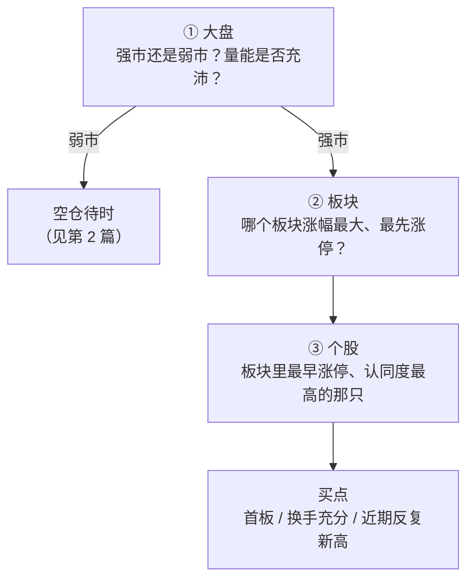

# 职业炒手 ③：选股与买卖——咬准主线，打最强板块的最早涨停

::: summary 一页读懂
1. **自上而下**："先看大盘，再看板块，再选个股"；基本功就是"看大盘做个股"。
2. **只做主流**："不在主流热点的股票，我看都不看。一定要咬准主线。"哪个板块涨幅最大，哪个就是主流。
3. **龙头看认同度**："龙头并不是谁先涨谁就是，主要看市场的认同度。"
4. **打板选最早**：选当天最强板块里最早涨停的个股（第二、三只也可以）；第一个涨停换手越大越好。
5. **四层境界**：待时、顺势、借势、造势——"其实顺势才是王道"。
:::

::: note 阅读说明与免责声明
本文整理职业炒手关于选股与买卖的论坛原话（简短引用，出处见文末）和整理者的解读。打板等手法风险很高，且交易规则与市场结构已与当年不同，本文**不构成任何投资建议**。
:::

## 1. 短线的精髓不是打板

很多人以为职业炒手 = 打板。他自己纠正过：

> 短线的精髓，就是做热点，做龙头。并非一般人以为的单纯的打板。

> 短即是短，赚的就是快钱。

他对短线的目标也很明确：参与每一个热点，资金小的时候，做得越快越赚钱。

## 2. 自上而下的三层筛选

> 基本功就是看大盘做个股

*图：按他的"先看大盘，再看板块，再选个股"整理。*

### 2.1 什么是主流

> 哪个板块涨幅最大，哪个就是主流。

> 不在主流热点的股票，我看都不看。一定要咬准主线。

> 热点就是趋势，板块就是趋势，资金的流向就是趋势！

> 每轮行情的实质，就是场外资金蜂拥而来，呼啸而去。

::: tip 解读：用结果定义主流
他没有用"政策利好""业绩好"来定义主流，而是用**涨幅**这一结果——资金用真金白银投出来的票，才是主流。这避免了"我觉得这个题材会火"的主观预测。
:::

### 2.2 牛市里的机会

> 牛市中最大的机会就是最热的板块中还有没涨的

## 3. 龙头：看认同度

> 龙头并不是谁先涨谁就是，主要看市场的认同度。

这一点与 Asking"先于大盘、带动板块"的定义互为补充：Asking 强调**时机**，职业炒手强调**认同**——市场里的大多数资金承认它是龙头，它才是龙头。

他还有一句流传很广的口诀：做龙头股，要==眼到、手到、心到==。（这句话在网友合集里也常被署名 Asking，原始出处待考。）

::: tip 解读：眼到、手到、心到
整理者的理解：**眼到**是看得见——第一时间发现最强的板块与个股；**手到**是下得去——确认后果断执行；**心到**是拿得住——想清楚逻辑，不被盘中波动吓跑。（此为解读，非原文。）
:::

::: core 资金不是关键，合力才是
> 真正的短线好手不在于自己的资金实力有多强。而在于在特殊的时间调动市场人气，启动市场合力为我所用。
:::

## 4. 打板：选最早、要换手

据财富号整理，他的选股方法是：选当天最强板块中最早涨停的个股，第二只、第三只也可以。其他要点：

> 第一个涨停, 换手越大越好

- 打板的品种最好是**近期反复创新高**的；
- 技术指标只看三样："技术指标只看三个就够了。K线组合, 均线, 成交量"。

> 打板对于初学者来说，不是赚钱的方法，是快速理解市场的方法

::: warn 打板是理解市场的工具，不是印钞机
他自己就说打板对初学者主要是"快速理解市场的方法"。打板失败的亏损往往很快，必须服从弱市不做和 5% 回撤的纪律。
:::

### 4.1 时间型 vs 空间型

据财富号整理，他把自己的模式称为**时间型**——抓的是"什么时候"出手，以快取胜；而炒股养家更像**空间型**，对空间有明确要求（转载中养家的说法是"没有30%的空间不出手，没有50%的空间不打板"）。

| | 时间型（职业炒手） | 空间型（炒股养家，据转载） |
|---|---|---|
| 关注点 | 出手的时机与节奏 | 预期的上涨空间 |
| 典型动作 | 最强板块最早涨停 | 空间不够就不出手 |
| 适合 | 反应快、频率高 | 判断周期、少而精 |

## 5. 四层境界：待时、顺势、借势、造势

> 超短线四层境界; 待时，顺势，借势，造势。 其实顺势才是王道.

::: tip 解读：为什么"顺势才是王道"
"造势"听起来最厉害，但需要资金、时机和人气同时具备，普通人做不到也不该去做。待时（空仓）和顺势（跟主流）才是人人可以练习的基本功。
:::

### 5.1 中线与短线

> 中线重在选股, 短线重在选时。选股靠分析和调研, 选时靠经验。

> 炒股就是炒概率

## 6. 自测与行动

自测 1：职业炒手如何判断哪个板块是主流？

"哪个板块涨幅最大，哪个就是主流"——用市场结果来判断，而不是主观预测。

自测 2：他认为龙头的判断标准是什么？

市场的认同度，而不是谁先涨。

自测 3：打板对初学者的意义是什么？

不是赚钱的方法，而是快速理解市场的方法。

自测 4：四层境界里哪一层是"王道"？

顺势。

复盘清单（对照自己的选股流程）：

- [ ] 先判断了大盘强弱，再看板块？
- [ ] 所选个股是否在**当天涨幅最大的板块**里？
- [ ] 它是板块里**最早涨停**、认同度最高的吗？
- [ ] 第一个涨停的**换手**是否充分？
- [ ] 我是在"顺势"，还是在"预测"？

## 来源

- 皆妙笔转载"淘县名人堂"2023-09-02（"短线的精髓……"、"短即是短……"、"基本功就是看大盘做个股"、"不在主流热点的股票……"、"热点就是趋势……"、"龙头并不是谁先涨谁就是……"、"真正的短线好手……"、"第一个涨停, 换手越大越好"、"技术指标只看三个……"、"打板对于初学者……"、四层境界、"中线重在选股……"、"炒股就是炒概率"、眼到手到心到）：https://www.jiemiaobi.com/archives/23641
- 东方财富财富号·谈股论鑫 2024-10-07（"先看大盘，再看板块，再选个股"、"哪个板块涨幅最大……"、"每轮行情的实质……"、"牛市中最大的机会……"、最早涨停选股法、时间型与空间型、参与每一个热点）：https://caifuhao.eastmoney.com/news/20241007101924387995640
- 淘股吧网友合集（"眼到、手到、心到"署名 Asking 的版本）：https://m.tgb.cn/a/2tl1u4BGkdT
