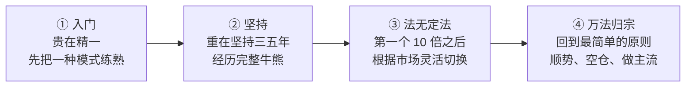

# 职业炒手 ④：成长路径与语录——从入门到第一个 10 倍

::: summary 一页读懂
1. **百万以下最难**：他在 100 万以下徘徊了 10 年，突破的关键是做出"第一个 10 倍"。
2. **学习四阶段**：入门贵在精一 → 重在坚持三五年 → 法无定法（第一个 10 倍之后）→ 万法归宗。
3. **理解与控制**："理解偏重于进攻，控制在于防守"，控制体现在无效交易越来越少。
4. **内功口诀**："战战兢兢，如履薄冰。"
5. **书单**：《股票大作手回忆录》（据称每次上战场都放在桌前）、只铁《短线英雄》。
:::

::: note 阅读说明与免责声明
本文整理职业炒手关于学习成长与心态的论坛原话，并附按主题排列的金句卡。所有引用均列出处；解读部分为整理者的理解。本文仅供学习，**不构成任何投资建议**。
:::

## 1. 最难的是百万以下

他在帖子里说，自己"在100万以下徘徊了10年"。在他看来，小资金阶段最艰难，而突破的标志是做出==第一个 10 倍==——那意味着方法真正成型了。

> 大资金要学慢，小资金要学快，越快越好。

::: tip 解读：小资金的"快"
小资金没有冲击成本，可以快速进出、追逐每一个热点，这是它唯一的优势；资金大了之后，必须放慢、分仓。据转载，他说一般人百万就分仓，而他到千万才分仓。
:::

## 2. 学习的四个阶段

*图：根据他的"学习次序"四步整理，括号内说明为整理者概括。*

::: core 先精一，再无定法
初学者最常犯的错是什么都学、什么都做。他的顺序是：==先把一种方法做到精，坚持三五年，做出第一个 10 倍==，然后才谈得上"法无定法"。
:::

## 3. 理解力与控制力

> 理解偏重于进攻，控制在于防守…控制体现在无效交易越来越少

> 自控能力是内功。买卖技巧是招式。

| | 理解力（进攻） | 控制力（防守） |
|---|---|---|
| 是什么 | 读懂大盘、主流、龙头 | 管住手、守纪律 |
| 体现在 | 抓住机会的能力 | 无效交易越来越少 |
| 比喻 | 招式 | 内功 |

他还认为，合格的炒手技术要全面：追涨、杀跌、低吸、空仓都要会（整理者概括，非原文逐字）。

## 4. 内功：心态

> 战战兢兢，如履薄冰。 这八个字，可以作为短线交易内功心法的口诀

> 急和躁，才是亏钱的内因

> 短炒最忌的就是生气，和赌气

> 超短的难点不在技术，在心态控制，空仓这个技术环节不过关，就会淘汰80%的短线选手

他还说过："实力游资都是大散户"——再大的资金，本质上也是在和市场博弈的个人，没有人能控制市场。

::: warn 心态问题的信号
- 亏了想马上赢回来（赌气）
- 看到别人赚钱就着急（急躁）
- 空仓几天就手痒（停不下来手）

出现这些信号时，他的建议是强行空仓、清空心态，甚至离开市场几天。
:::

## 5. 书单

据转载，他每次上战场都在桌前放一本《股票大作手回忆录》，并推荐过只铁的《短线英雄》。他对"学习"的态度是：

> 真传一句话，假传万卷书

## 6. 金句卡

::: quote 关于原则
"所有的进攻模式，其实都不如空仓待时这一最简单的防守战术重要"
:::

::: quote 关于复利
"弱市不亏钱，这才是复利增长的关键。而且是关键中的关键。"
:::

::: quote 关于主流
"不在主流热点的股票，我看都不看。一定要咬准主线。"
:::

::: quote 关于龙头
"龙头并不是谁先涨谁就是，主要看市场的认同度。"
:::

::: quote 关于境界
"超短线四层境界; 待时，顺势，借势，造势。 其实顺势才是王道."
:::

::: quote 关于顶部
"真正的顶部，从来都是有足够的时间来让你离开。"
:::

::: quote 关于跟随
"当年asking到成都反复跟我强调两个字，跟随。"
:::

::: quote 关于本质
"炒股就是炒概率"
:::

## 7. 自测与行动

自测 1：学习四阶段分别是什么？

入门贵在精一 → 重在坚持三五年 → 法无定法（第一个 10 倍之后）→ 万法归宗。

自测 2：控制力进步的标志是什么？

无效交易越来越少。

自测 3：为什么小资金要"学快"？

小资金没有冲击成本，快速进出、参与每个热点是它的优势；资金大了才需要放慢、分仓。

成长自查清单：

- [ ] 我现在**只专注一种模式**吗？
- [ ] 我已经坚持记录交易多久了？
- [ ] 本月**无效交易**的次数比上月少了吗？
- [ ] 我有没有在连续亏损后强行休息？
- [ ] 读过《股票大作手回忆录》吗？

## 8. 系列回顾

本系列四篇：人物与经历 → 弱市不做与空仓 → 主流热点与打板 → 成长路径与语录。建议接着读 **Asking 系列**（他反复提到的"跟随"出自这里）和 **炒股养家系列**（信念与情绪周期）。

## 来源

- 皆妙笔转载"淘县名人堂"2023-09-02（"我在100万以下徘徊了10年"、第一个 10 倍、学习次序四步、"理解偏重于进攻……"、"自控能力是内功……"、"大资金要学慢……"、分仓说法、合格炒手技术全面、"战战兢兢，如履薄冰……"、"短炒最忌……"、"超短的难点……"、金句卡多数条目）：https://www.jiemiaobi.com/archives/23641
- 东方财富财富号·谈股论鑫 2024-10-07（"急和躁……"、"实力游资都是大散户"、书单、"真传一句话，假传万卷书"、"真正的顶部……"）：https://caifuhao.eastmoney.com/news/20241007101924387995640
- 淘股吧相关整理帖：https://www.tgb.cn/a/2urHNvQU02D-1 、https://www.tgb.cn/a/1YnlfVWsqF0
