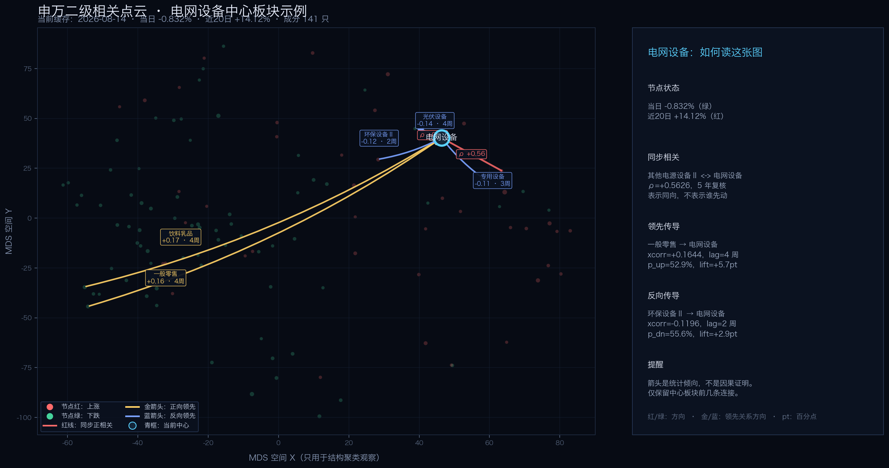

# 30 · 板块相关点云视觉说明

入口：`http://127.0.0.1:8765/sector_corr_cloud.html`

点云展示的是申万二级板块在剔除大盘影响后的关系结构。它用于复盘“哪些板块同步、哪些板块可能存在领先传导”，不是因果证明，也不是买卖信号。

## 颜色与图形含义

| 视觉元素 | 含义 | 如何理解 |
| --- | --- | --- |
| 红色节点 | 当前收益为正 | 板块上涨。颜色越亮、节点越醒目，表示当前收益越明显。 |
| 绿色节点 | 当前收益为负 | 板块下跌。颜色越亮、节点越醒目，表示当前跌幅越明显。 |
| 灰蓝色节点 | 没有可用收益 | 当前窗口没有足够的行情数据，不参与涨跌判断。 |
| 节点大小 | 收益幅度的视觉放大 | 不是成交量，也不是资金规模；只用于帮助快速找到涨跌幅较大的板块。 |
| 红色同步连线 | 正相关 | 两个板块在同一观察窗口内倾向同涨同跌。 |
| 绿色同步连线 | 负相关 | 两个板块在同一观察窗口内倾向一涨一跌。 |
| 金色领先箭头 | 正向领先传导 | 箭头 `A → B` 表示 A 的变化与 B 后续变化呈正向关系，A 先动时 B 更可能同方向跟随。 |
| 蓝色领先箭头 | 负向领先传导 | 箭头 `A → B` 表示 A 先动时，B 后续更可能反方向变化。 |
| 虚线与流动光点 | 关系的动态强调 | 同步模式中只表示关系持续存在，不代表方向；领先模式中光流沿箭头方向流动，帮助辨认 A → B。 |
| 线条亮度、粗细 | 关系强弱 | 越亮、越粗表示相关系数或交叉相关强度越高；不能直接理解为收益大小。 |
| 青色高亮标签 | 当前查询的中心板块 | 通过板块搜索、标的跳转或点击节点聚焦后的中心对象。 |
| 变暗的节点 | 当前焦点之外的对象 | 仍在全局空间中，但暂时弱化，避免抢占中心板块的注意力。 |

项目沿用 A 股界面约定：红色表示上涨，绿色表示下跌。这里的红/绿只表达方向，不表达“好/坏”或“买/卖”。

## 术语小词典

### 相关与领先

| 术语 | 含义 | 在本页面中的口径 |
| --- | --- | --- |
| `ρ` / `corr` | 相关系数 | 两个板块残差收益的 Pearson 相关系数，范围为 -1～+1。正数表示同向，负数表示反向；`|ρ|` 越大，关系越强。同步相关默认要求 `|ρ| ≥ 0.42`，并通过多年方向复核。 |
| `abs` | 绝对强度 | `abs(corr)` 或 `abs(xcorr)`，只保留强弱、不保留方向，用于筛选和排序；方向仍需看原始的 `corr`、`xcorr` 或箭头颜色。 |
| `xcorr` | 交叉相关（cross-correlation） | 用来比较“领先板块 A”与“未来滞后板块 B”的相关性。本项目按周汇总残差收益，计算 `corr(A_t, B_{t+lag})`。正值表示同向传导，负值表示反向传导。 |
| `lag` | 滞后期 | 领先板块与后续板块之间相隔的周数。`lag=2` 表示 A 的变化与 B 约相隔 2 周；不表示精确到某一天。当前搜索 1～4 周。 |
| `sync` | 同步相关参考值 | 领先边记录的同周期残差相关，帮助判断这条领先关系是否也有同步共振；它不是箭头方向，箭头方向由 `source → target` 决定。 |
| `sign` | 关系方向 | `+1` 表示正向，`-1` 表示反向。同步模式映射为红/绿连线，领先模式映射为金/蓝箭头。 |

### 概率与 `pt`

| 术语 | 含义 | 如何阅读 |
| --- | --- | --- |
| `p_up` | 条件跟涨概率 | 当领先板块处于自身历史较强状态（约位于 80% 分位以上）时，后续板块在观察窗口内累计上涨的比例。 |
| `p_dn` | 条件跟跌概率 | 当领先板块处于自身历史较弱状态（约位于 20% 分位以下）时，后续板块在观察窗口内累计下跌的比例。 |
| `base_up` | 基准上涨概率 | 不看领先板块状态时，后续板块在同一观察窗口内累计上涨的总体比例。 |
| `base_dn` | 基准下跌概率 | 不看领先板块状态时，后续板块在同一观察窗口内累计下跌的总体比例。 |
| `lift_up` | 跟涨概率提升 | `p_up - base_up`，表示触发领先条件后，跟涨概率比平时提高了多少。 |
| `lift_dn` | 跟跌概率提升 | `p_dn - base_dn`，表示触发领先条件后，跟跌概率比平时提高了多少。 |
| `pt` | percentage point，百分点 | 页面把 `lift` 乘以 100 后显示为 `pt`。例如 `p_up=58%`、`base_up=45%`，则 `lift_up=+13pt`，意思是提高 **13 个百分点**，不是相对提高 13%。 |
| `n_up` / `n_dn` | 条件样本数 | 计算 `p_up` / `p_dn` 时实际可用的历史事件数量。样本越少，概率越不稳定；概率相同也要结合样本数判断可信度。 |
| `horizon` | 观察窗口 | 领先事件发生后，统计后续板块累计方向的交易日数。当前为 5 个交易日。 |

页面里的 `p_up`、`p_dn` 是概率字段，不是统计学里的“p-value（显著性检验 p 值）”。这里没有把它们当作显著性证明。

一个完整例子：

```text
A → B，lag=2 周，xcorr=0.18，p_up=58%，base_up=45%，lift_up=+13pt
```

应读作：A 的周频残差变化与 B 约两周后的变化呈中等强度正向关系；当 A 处于较强状态时，B 在未来 5 个交易日累计上涨的历史比例为 58%，比无条件基准高 13 个百分点。它是统计倾向，不是“买入后两周必涨”的承诺。

### 残差、beta 与空间位置

| 术语 | 含义 |
| --- | --- |
| `beta` | 板块对大盘收益的敏感度。先估计板块相对市场的共同波动，再剔除这部分影响，减少“所有板块一起涨跌”造成的假相关。 |
| 残差收益 | 板块实际收益减去大盘 beta 能解释的部分，更接近板块自身相对强弱。点云的同步和领先计算都基于残差，而不是直接使用指数涨跌。 |
| MDS | 多维尺度分析（Multidimensional Scaling）。把板块之间的相关距离压缩到三维空间；空间距离用于辅助观察聚类，不等于收益远近，也不代表因果方向。 |
| `n` | 该申万二级板块参与聚合的成分股数量。它影响板块收益的稳定性，但不是估值或资金规模。 |

## 两种连线模式

### 同步相关

同步相关是无方向关系。红线表示正相关，绿线表示负相关；连线两端没有先后顺序。

相关边基于剔除市场 beta 后的板块残差收益计算，并要求达到相关阈值、且在多个年份方向保持一致。它更适合回答：

- 哪些板块经常一起动？
- 哪些板块可能存在对冲关系？
- 当前上涨或下跌是否扩散到同一产业链或风格群？

### 领先传导

领先传导是有方向关系。箭头尖端指向后续板块：

- “它领先谁”表示从当前中心板块发出的箭头；
- “谁领先它”表示指向当前中心板块的箭头；
- 滞后时间以周为单位，当前计算范围为 1～4 周；
- 面板中的“跟涨/跟跌”是事件条件概率，括号中的提升值是相对于基准概率的差值。
- 当前计算先要求 `|xcorr| ≥ 0.08`，领先方向比反向至少强 `0.015`，并且 `lift_up` 或 `lift_dn` 至少达到 `0.025`，即至少提升 2.5 个百分点，才进入候选领先边。

为了保持可读性，领先传导不会显示全市场所有边：

- 未聚焦中心板块时不绘制领先传导线；
- 聚焦一个中心板块时，每个方向只保留最强的前 3 条；
- 多个中心板块同时聚焦时，最多显示 12 条中心相关连接；
- 右侧详情面板与图上的连接采用同一组筛选结果。

因此，图上没有出现某条传导线，不等于数据中不存在关系，而是它没有进入当前中心板块的可视化优先级。

## 收益窗口

- **当日**：节点颜色和大小使用最新可用交易日的板块涨跌。
- **近 20 日**：节点颜色和大小使用近 20 个交易日的累计变化。

切换收益窗口只改变节点的市场状态展示，不会重新计算同步相关或领先传导边。

## 正确的阅读顺序

1. 先用“板块”或“标的”查询，确定一个中心板块。
2. 先看中心节点的当日/近 20 日状态，再切换到“同步相关”观察同涨同跌或对冲关系。
3. 再切换到“领先传导”，只阅读中心板块周围的少量高强度箭头。
4. 结合右侧的滞后周数、交叉相关和跟涨/跟跌概率，记录为研究假设。
5. 回到标的上下文、选股日记或回测页面验证，不要把点云关系直接当作下单依据。

## 实例：电网设备中心板块

下面这张说明截图使用当前本地缓存的点云坐标和连接数据重绘，颜色、箭头和筛选口径与页面一致。数据缓存生成于 `2026-09-18`，行情截止 `2026-08-14`。



### 1. 先读中心节点

当前“电网设备”属于申万一级“电力设备”，共有 141 只成分股：

- 当日涨跌：`-0.832%`，所以切换到“当日”时节点呈绿色；
- 近 20 日涨跌：`+14.12%`，所以切换到“近20日”时节点呈红色。

这表示电网设备当天回调，但阶段趋势仍然上涨。节点颜色取决于当前收益窗口，不能把当日绿色理解成长期走弱。

### 2. 再看同步相关

图中红色同步关系包括：

| 关系 | 数值 | 解读 |
| --- | ---: | --- |
| 其他电源设备Ⅱ ↔ 电网设备 | `ρ=+0.5626`，5 年复核 | 两个板块历史上较容易同涨同跌；这是无方向关系，不能说谁领先谁。 |
| 电网设备 ↔ 风电设备 | `ρ=+0.4710`，3 年复核 | 存在中等强度的同向变化倾向，但强度弱于上一条。 |

### 3. 最后看领先传导

聚焦“电网设备”后，页面只保留中心板块相关的少量箭头。

#### 谁领先电网设备

| 连接 | 颜色 | 滞后 | `xcorr` | 条件概率示例 |
| --- | --- | ---: | ---: | --- |
| 一般零售 → 电网设备 | 金色 | 4 周 | `+0.1644` | `p_up=52.9%`，`lift_up=+5.7pt` |
| 饮料乳品 → 电网设备 | 金色 | 4 周 | `+0.1674` | `p_up=51.1%`，`lift_up=+3.9pt` |
| 环保设备Ⅱ → 电网设备 | 蓝色 | 2 周 | `-0.1196` | `p_dn=55.6%`，`lift_dn=+2.9pt` |

例如“一般零售 → 电网设备”表示：一般零售先出现较强变化后，电网设备约 4 周后倾向同向变化。其后续 5 个交易日上涨概率为 `52.9%`，而无条件基准为 `47.3%`，因此提升约 `5.7 个百分点`，页面显示为 `+5.7pt`。

#### 电网设备领先谁

| 连接 | 颜色 | 滞后 | `xcorr` | 条件概率示例 |
| --- | --- | ---: | ---: | --- |
| 电网设备 → 光伏设备 | 蓝色 | 4 周 | `-0.1393` | `p_up=50.7%`，`lift_up=+4.0pt` |
| 电网设备 → 专用设备 | 蓝色 | 3 周 | `-0.1058` | `p_dn=57.0%`，`lift_dn=+4.2pt` |

这里的蓝色表示负向传导，不是“蓝色就应该卖出”。它表示电网设备先动时，目标板块在周频线性关系上更偏向反方向变化。

### 4. 为什么 `xcorr` 和概率提升可能不一致？

以“电网设备 → 光伏设备”为例：

```text
xcorr = -0.1393
p_up = 50.7%
base_up = 46.7%
lift_up = +4.0pt
```

`xcorr` 衡量的是整个样本期的周频线性关系；`p_up` 和 `lift_up` 衡量的是“领先板块处于较强状态”这一特定事件之后，目标板块未来 5 个交易日的方向概率。两者观察角度不同，所以可能出现负向交叉相关、但特定事件下跟涨概率提高的情况。

这类结果应记录为“待验证研究假设”，而不是直接转换成交易规则。尤其要同时查看样本数量、滞后期、同步相关和不同市场阶段的稳定性。

## 数据口径与限制

- 板块粒度：申万二级行业。
- 关系计算：先剔除市场 beta，再计算同步残差相关；领先传导使用周频残差交叉相关。
- 当前领先传导还要求方向不对称，并且跟涨或跟跌事件概率相对基准有提升，目的是过滤纯噪声边。
- 点云是当前缓存数据的结构观察；通过每日精选或标的上下文进入时，仍然是当前结构参考，不会自动还原历史某一天的点云状态。
- 关系是统计关联，不代表因果关系；行业成分、市场环境、涨跌停和流动性变化都可能造成失效。
- 颜色、大小、亮度和箭头方向都不能单独构成买卖条件。

## 维护位置

- 计算与页面生成：`scripts/reports/gen_sector_corr_cloud.py`
- 数据缓存：`cache/sector_corr_cloud.json`
- 生成页面：`output/sector_corr_cloud.html`
- 标的上下文入口：`scripts/services/static/classification.js`、`scripts/services/static/symbol-page.js`

重渲染页面：

```bash
python -m scripts.reports.gen_sector_corr_cloud --from-cache --no-nav
```
